+++
draft = true
title = 'Lexique'
author = "Turbo Tartine"
date = '2025-03-09T06:26:08+01:00'
disableComments = false
+++

---
---
---
---
---
---
---
---

## Anti-Aliasing
🔗 {[fxaa](/pages/glossary/#fxaa) - [msaa](/pages/glossary/#msaa) - [smaa](/pages/glossary/#smaa) - [taa](/pages/glossary/#taa)}

---

L'aliasing (ou crénelage) est un artefact visuel indésirable qui se manifeste par un effet d’escalier sur les contours des objets rendus. Il apparaît lors de la [rasterisation](/pages/glossary/#rasterisation), une étape spécifique du [pipeline graphique](/pages/glossary/#pipeline-graphique).

Pour le réduire, différentes techniques d’anti-aliasing existent, chacune ayant leurs forces et leurs faiblesses.

---
---
---
---
---
---
---
---

## Bloom
🔗 {[post-process](/pages/glossary/#post-process)}

---

Le bloom est un effet de [post-process](/pages/glossary/#post-process) qui renforce la luminosité des objets brillants en créant un halo diffus autour d’eux. Il simule la manière dont les caméras et l’œil humain perçoivent les fortes sources de lumière.

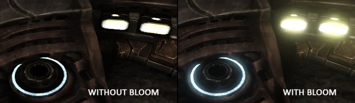

---
---
---
---
---
---
---
---

## Cel Shading
🔗 {[post-process](/pages/glossary/#post-process)}

---

Le cel shading (ou toon shading) est un effet de [post-process](/pages/glossary/#post-process) qui donne à l’image une apparence de dessin animé, avec des contours marqués et des aplats de couleurs uniformes.

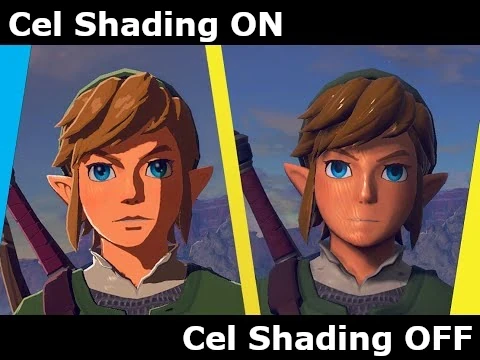 

---
---
---
---
---
---
---
---

## CPU
📜 [Dis donc Jamy : Comment ça marche un shader ?](/posts/ddj_shaders)

---

Acronyme de Central Processing Unit, le CPU est l’unité de calcul principale d’un ordinateur. Il s’agit tout simplement de votre processeur.

---
---
---
---
---
---
---
---

## Deferred Lighting
🔗 {[vertex lighting](/pages/glossary/#vertex-lighting) - [pixel lighting](/pages/glossary/#pixel-lighting)}

---

Le deferred lighting est une technique qui consiste à calculer l'éclairage dans une seconde passe de rendu, plutôt qu'à chaque [draw call](/pages/glossary/#draw-call). En ce sens, je l'assimile souvent à un calcule de lumière en [post-process](/pages/glossary/#post-process) (même si cette appellation n’est pas tout à fait rigoureuse).

L’avantage par rapport au [vertex lighting](/pages/glossary/#vertex-lighting) et au [pixel lighting](/pages/glossary/#pixel-lighting), c’est que l’éclairage n’est plus calculé à chaque draw call, mais une seule fois à la fin. Cela permet d'éviter les calculs inutils en cas d’overdraw (lorsque des draw calls écrasent des pixels calculés précédement).

En résumé, on conserve la précision du pixel lighting, mais à un coût bien plus faible. Le problème, avec cette technique, c'est qu'elle ne permet pas un rendu correcte de la transparence. C’est pourquoi les moteurs utilisant le deferred lighting doivent combiner cela à d'autres solutions pour gérer la transparence.

---
---
---
---
---
---
---
---

## Depth of Field
🔗 {[post-process](/pages/glossary/#post-process)}

---
Le Depth of Field (ou profondeur de champ) est un effet de [post-process](/pages/glossary/#post-process) qui simule l'effet de mise au point d'une caméra. Il floute les objets situés en dehors d'une plage de distance définie, créant ainsi une impression de profondeur.

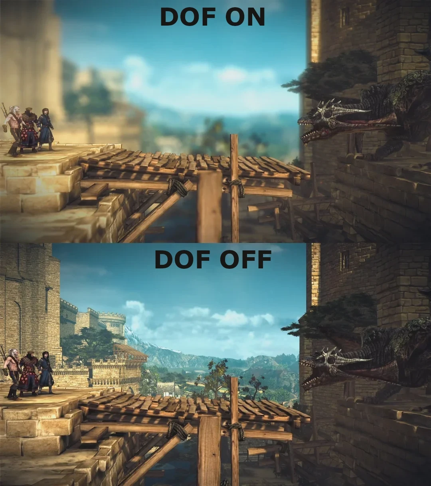

---
---
---
---
---
---
---
---

## Draw Call
🔗 {[pipeline graphique](/pages/glossary/#pipeline-graphique) - [render target](/pages/glossary/#render-target)}

---

Un draw call est une instruction envoyée au [GPU](/pages/glossary/#gpu) pour lui demander de traiter et d'afficher un ensemble de primitives géométriques (généralement des triangles) à l'écran, ou dans une [render target](/pages/glossary/#render-target).

---
---
---
---
---
---
---
---

## Edge
🔗 {[mesh](/pages/glossary/#mesh) - [vertex](/pages/glossary/#vertex) - [face](/pages/glossary/#face)}

---

Une edge (ou arête) est un des élements qui constituent un [mesh](/pages/glossary/#mesh) (ou maillage). Chacune relie deux [vertex](/pages/glossary/#vertex) appartenant a ce dernier.

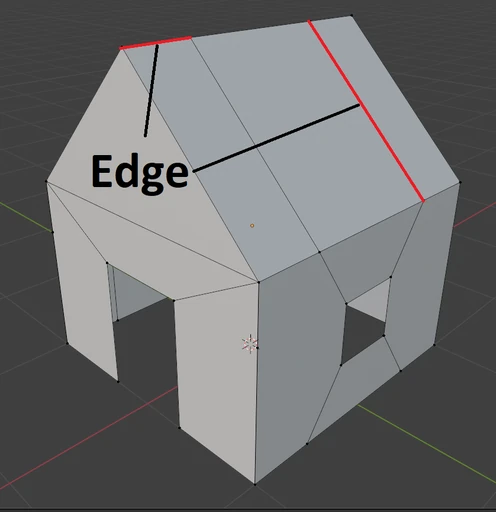 

Les edges ne sont explicitement représentées que dans les logiciels de modélisation 3D. Dans le moteur, elles ne sont présentes que de manière implicite, à travers la définition des triangles.

---
---
---
---
---
---
---
---

## Face
🔗 {[mesh](/pages/glossary/#mesh) - [vertex](/pages/glossary/#vertex) - [edge](/pages/glossary/#edge)} {[quad](/pages/glossary/#quad) - [n-gone](/pages/glossary/#n-gone)}

---

Une face est un des élements qui constituent un [mesh](/pages/glossary/#mesh) (ou maillage). Elle est définie par un cycle d'[edges](/pages/glossary/#edge) fermé appartenant au mesh et représente la plus petite unité de surface visible de ce dernier. En effet, un mesh sans face est invisible.

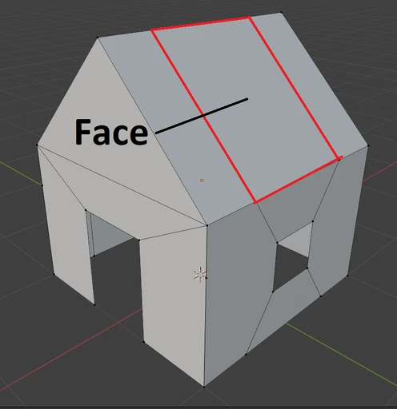 

On distingue trois types de faces :
- Les triangles : C'est le seul type pris en charge par les moteurs de jeu (une carte graphique ne sait pas afficher autre chose).
- Les [quads](/pages/glossary/#quad) : Faces composées de quatre [vertex](/pages/glossary/#vertex). Très utilisés en modélisation, car ils sont faciles à subdiviser et permettent d'ajouter des loops facilement.
- Les [n-gones](/pages/glossary/#n-gone) : Composés de plus de quatre vertex. Généralement à proscrire, car leurs propriétés géométriques les rendent difficiles à manipuler.

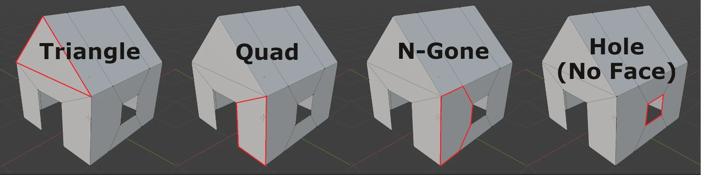

Note : Les faces sont orientées. Sauf configuration particulière, elles ne sont visibles que si on les regarde du bon côté. Le côté visible est déterminé par l'ordre des vertex.

---
---
---
---
---
---
---
---

## Fixed Function
🔗 {[pipeline graphique](/pages/glossary/#pipeline-graphique) - [rasterisation](/pages/glossary/#rasterisation)}

---

Autrefois, les [GPU](/pages/glossary/#gpu) n'étaient pas programmables. L'ensemble du [pipeline graphique](/pages/glossary/#pipeline-graphique) était "gravé en dur" directement dans la carte, ce qui signifie que chaque étape qui le compose reposait sur des circuits dédiés :
- transformation des vertex
- [rasterisation](/pages/glossary/#rasterisation)
- éclairage
- texturing
- ...

Le programmeur ne pouvait donc pas modifier ces étapes, seulement les activer, les désactiver ou ajuster certains paramètres via des fonctions prédéfinies : les fameuses fixed functions.

Ce modèle offrait d'excellentes performances pour l'époque, mais manquait de flexibilité. Pour ajouter de nouvelles fonctionnalités visuelles dans les jeux (éclairage PBR, [cel shading](/pages/glossary/#cel-shading)...), il aurait fallut que les fabricants de cartes eux même les implémentent directement dans le matériel, ce qui freinait l'innovation.

Les GPU ont donc évolué vers des architectures de plus en plus programmables, intégrant des [shader stages](/pages/glossary/#shader) au pipeline graphique. D'abord avec les [vertex shaders](/pages/glossary/#vertex-shader) et [fragment shaders](/pages/glossary/#fragment-shader), puis arrivèrent des geometry shaders, tessellation shaders, compute shaders, etc.

Aujourd'hui, les fixed function stages n'ont pas disparu. Ils restent utilisés pour les étapes où la flexibilité n'est pas nécessaire et/ou quand les performances sont critiques (rasterisation, depth test, etc.).

---
---
---
---
---
---
---
---

## Fragment Shader
🔗 {[shader](/pages/glossary/#shader) - [pipeline graphique](/pages/glossary/#pipeline-graphique) - [vertex shader](/pages/glossary/#vertex-shader) - [rasterisation](/pages/glossary/#rasterisation)}
<br>📜 [Dis donc Jamy : Comment ça marche un shader ?](/posts/ddj_shaders)

---

Le fragment shader (aussi appelé pixel shader) est la dernière étape programmable du [pipeline graphique](/pages/glossary/#pipeline-graphique). Il détermine la couleur finale des fragments (ou pixels) générés lors de la [rasterisation](/pages/glossary/#rasterisation), qui est l'étape précédente du pipeline.

---
---
---
---
---
---
---
---

## Frame
Une frame est une image de la scène générée à un instant donné par le moteur graphique (ou renderer). La rapidité avec laquelle ces images sont rendues définit le frame rate, exprimé en fps (frames per second).

---
---
---
---
---
---
---
---

## FXAA
🔗 {[anti-aliasing](/pages/glossary/#anti-aliasing)} {[post-process](/pages/glossary/#post-process)}

---

Le FXAA (Fast Approximate Anti-Aliasing) est une technique d'[anti-aliasing](/pages/glossary/#anti-aliasing) appliquée en [post-process](/pages/glossary/#post-process). Elle détecte les contours dans l'image issue de la passe de rendu principale, puis applique un léger flou à ces endroits pour atténuer l'aliasing.

Avantages  :
- Faible impact sur les performances
- Compatible avec un deferred renderer (moteur graphique utilisant une architcture particulière permettant le [deferred lighting](/pages/glossary/#deferred-lighting))

Inconvénients  :
- Moins efficace que d'autres techniques d'anti-aliasing
- Peut entraîner un léger flou de l'image

---
---
---
---
---
---
---
---

## GPU
📜 [Dis donc Jamy : Comment ça marche un shader ?](/posts/ddj_shaders)

---

Acronyme de Graphics Processing Unit, le GPU est l'unité de calcul dédiée aux traitements graphiques d'un ordinateur. Il s'agit tout simplement de la carte graphique.

---
---
---
---
---
---
---
---

## Mesh
🔗 {[vertex](/pages/glossary/#vertex) - [edge](/pages/glossary/#edge) - [face](/pages/glossary/#face)} {[quad](/pages/glossary/#quad) - [n-gone](/pages/glossary/#n-gone)}

---

Les objets 3D qui composent une scène sont constitués d'un ou plusieurs meshes (ou maillages en français). Un mesh est un ensemble de [vertex](/pages/glossary/#vertex) (sommets) reliés entre eux par des [edges](/pages/glossary/#edge) (arêtes). Bien que cela ressemble à la définition d'un graphe, il y a deux différences majeures :
- Les vertex d'un mesh ont une coordonnée en 3D (ou 2D), ce qui les localisent en des points spécifiques de l'espace (ou du plan).
- Les cycles fermés d'arêtes peuvent (ou non) former des [faces](/pages/glossary/#face), donnant ainsi au mesh une surface.

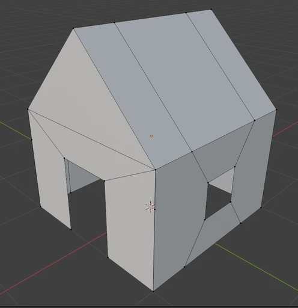 

Les meshes utilisés dans les moteurs de jeu ont une spécificité supplémentaire : leurs faces doivent impérativement être des triangles, car les cartes graphiques ne gèrent que cette forme. Il est donc nécessaire de trianguler les [quads](/pages/glossary/#quad) et [n-gons](/pages/glossary/#n-gone) avant de les intégrer dans une scène. Cette opération peut être effectuée :
- Lors de l'exportation depuis le logiciel de modélisation,
- Ou à l'importation dans le moteur de jeu.

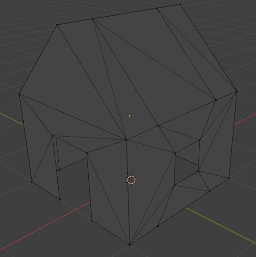 

---
---
---
---
---
---
---
---

## Morph Target
🔗 {[skeletal animation](/pages/glossary/#skeletal-animation)}

---

L’animation par morph target (ou blend shape) est une technique qui consiste à créer plusieurs versions d’un même [mesh](/pages/glossary/#mesh). Chaque version, conserve la même topologie que le mesh d’origine (c’est-à-dire le nombre de [vertex](/pages/glossary/#vertex) et la façon dont ils sont connectés entre eux par les [edges](/pages/glossary/#edge)), seules les positions des vertex sont modifiées.

Lors de l’exécution, des poids sont attribués à chaque version du mesh. En ajustant ces poids progressivement, on fait passer le mesh d'une version à l'autre de manière fluide. Il est également possible de mélanger plusieurs version si nécessaire.

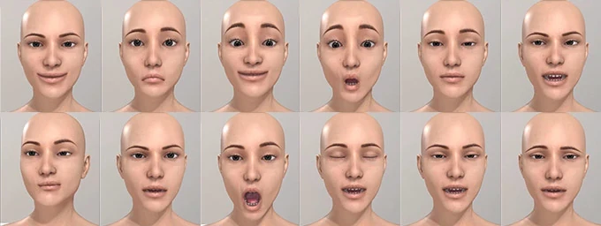

Cette technique est principalement utilisée pour des déformations relativement simples et de petite envergure, comme :
 - l’animation faciale,
 - le gonflement ou la rétraction des muscles,
 - des pustules qui palpitent sur le dos d’un monstre,
 - l’ajustement de la corpulence d’un personnage dans un écran de personnalisation d’avatar.

---
---
---
---
---
---
---
---

## Motion Blur
🔗 {[post-process](/pages/glossary/#post-process)}

---

Le motion blur (ou flou de mouvement) est un effet de [post-process](/pages/glossary/#post-process) qui accentue la sensation de vitesse en floutant les objets proportionnellement à leur vitesse relative par rapport à la caméra.

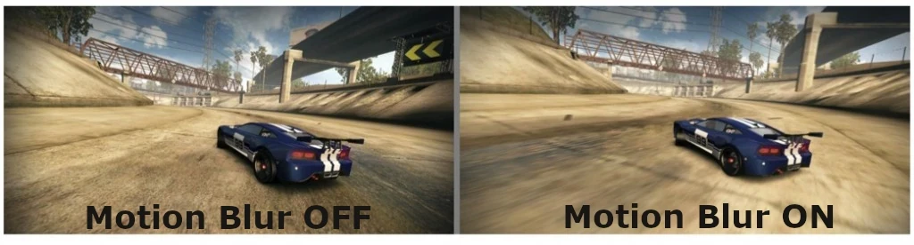

---
---
---
---
---
---
---
---

## MSAA
🔗 {[anti-aliasing](/pages/glossary/#anti-aliasing)}

---

Le MSAA (Multi Sampling Anti-Aliasing) est une technique d'[anti-aliasing](/pages/glossary/#anti-aliasing) gravée en dur dans les circuits du [GPU](/pages/glossary/#gpu). Elle agit à la source du problème : l’étape de [rasterisation](/pages/glossary/#rasterisation).

Lorsqu’un pixel est partiellement couvert par un triangle, plutôt que de l’ignorer, le rasterizer affine son échantillonnage et génère un fragment dont les attributs (couleur, normale, UV, etc.) sont une moyenne des valeurs de chaque échantillon. Lorsque l’on parle de MSAA 2x, 4x, 8x, etc., le chiffre désigne le nombre d’échantillons supplémentaires utilisés pour générer ce fragment. Plus le nombre est élevé, plus le résultat est précis (mais plus la rasterisation est coûteuse).

[mettre une image]

Avantages :
- Implémentée directement dans le hardware, ce qui la rend assez performante.
- Applique le suréchantillonnage uniquement aux contours, plutôt qu’à toute l’image, ce qui limite son coût.

Inconvénients :
- Ne lisse que les contours.
- Incompatible avec un deferred renderer (moteur graphique utilisant une architcture particulière permettant le [deferred lighting](/pages/glossary/#deferred-lighting))

---
---
---
---
---
---
---
---

## N-Gone
🔗 {[face](/pages/glossary/#face)}

---

Dans un logiciel de modélisation 3D, un n-gone désigne une [face](/pages/glossary/#face) composée de plus de 4 [vertex](/pages/glossary/#vertex). Il est généralement déconseillé de les utiliser, surtout si le modèle est destiné à être importé dans un moteur de jeu. Voici quelques raisons pour lesquelles les n-gones posent problème :
- La triangulation automatique devient plus complexe et les résultats sont difficiles à prévoir.
- Si le modèle est animé, les déformations des n-gones peuvent être incorrectes.
- Ils présentent des propriétés géométriques qui rendent leur manipulation difficile (par exemple, ils est compliqué de les subdiviser ou d'y insérer des loops).

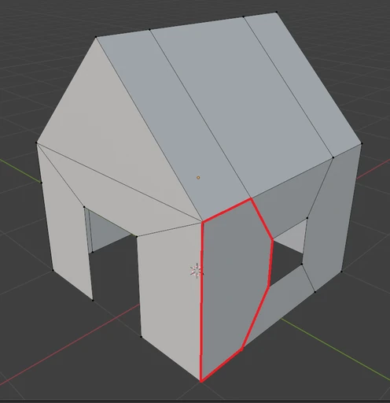 

Note : Techniquement, un n-gone désigne un polygone à "n" côtés. Par conséquent, les triangles et les quadrilatères sont aussi des N-Gones au sens mathématique du terme. Toutefois, dans le contexte de la modélisation 3D, on considère un polygone comme un n-gone à partir de 5 côtés, car c'est à partir de ce nombre que la géométrie est problématique.

---
---
---
---
---
---
---
---

## Niveau d'Abstraction
Le niveau d'abstraction d'un langage informatique désigne sa proximité avec la logique humaine. Plus un langage est de haut niveau, plus il est lisible et compréhensible "facilement". À l'inverse, plus un langage est de bas niveau, plus il les briques qui le compose sont primitives, ce qui rend les programmes longs et complexes, même pour des tâches simples.

Le langage le plus bas niveau que l'on puisse trouver est le langage machine :
```c
10110000 01100001
00000001 00000010
10000111 01101000
00000001 01100010
10000111 01101000
00011001 01111010
10000111 01101000
10110000 01100001
00000001 00000010
...
```

Cet exemple n'est pas un vrai programme. C'est juste une suites aléatoires de 1 et de 0 que j'ai inventée, mais cela ne change rien à l’essentiel : personne n'écrit de code directement sous cette forme. Le langage machine est le produit de la compilation, qui traduit automatiquement un code source écrit dans un langage de plus haut niveau.

Un niveau d'abstraction plus élevé, qui permet une utilisation humaine, est l'assembleur :
```asm
SECTION .data
    extern printf
    global main
fmt:
    db "%d", 10, 0
SECTION .text
main:
    mov     eax, 14
    mov     ebx, 10
    add     eax, ebx
    push    eax
    push    fmt
    call    printf
    mov     eax, 1
    int     0x80
```

C'est encore trop difficile à comprendre pour moi. J'ai récupéré ce code sur Internet, et apparemment, il permet d'additionner les entiers 14 et 10, puis d'afficher le résultat dans la console.

Au-dessus de l'assembleur, on trouve les langages de programmation traditionnels (comme C, C++, Python, Java, JavaScript…). Ces langages sont beaucoup plus accessibles. Par exemple, en C, le code assembleur ci-dessus se traduirait ainsi :
```c
#include <stdio.h>
#include <stdlib.h>

int main()
{
    printf(14 + 10);
    return EXIT_SUCCESS;
}
```

Il est important de noter que tous les langages traditionnels ne se situent pas exactement au même niveau d'abstraction. Par exemple, le C est un langage plus bas niveau que le Java. Cependant, les différences sont plus subtiles que dans les exemples précédents.

---
---
---
---
---
---
---
---

## Normal Attribute
🔗 {[vertex](/pages/glossary/#vertex)} {[rasterisation](/pages/glossary/#rasterisation)} {[vertex color attribute](/pages/glossary/#vertex-color-attribute) - [uv attribute](/pages/glossary/#uv-attribute)}

---

C'est un type d'attribut couramment associé aux [vertex](/pages/glossary/#vertex). Il décrit l'orientation de la surface du [mesh](/pages/glossary/#mesh) à la position du vertex. C'est une moyenne pondérée des normales des triangles qui lui sont adjacents. Différents types de pondération peuvent être utilisés :
- Pondération par l'aire des triangles
- Pondération par l'angle au vertex
- Pondération en fonction du matériau
- Mélange de ces méthodes

Les normales sont principalement utilisées dans le calcul de l'éclairage. Le fait que ces normales soient partagées par les triangles adjacents donne un aspect lisse à la surface lorsqu'elle est éclairée.

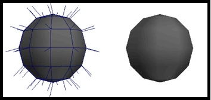 

Cependant, dans certains cas, on souhaite que certaines [edges](/pages/glossary/#edge) (arêtes) soient saillantes. Pour cela, il suffit de dupliquer les vertex de l'edge et d'attribuer à chaque copie la normale d'une des [faces](/pages/glossary/#face) adjacentes.

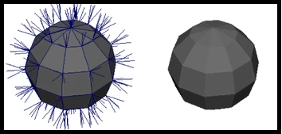 


Cet attribut est généralement calculé automatiquement par le logiciel de modélisation 3D, selon l'agencement des vertex, edges et faces du mesh. Les edges saillantes peuvent être détectées automatiquement en fonction de l'angle entre deux faces adjacentes, ou être définies manuellement par l'artiste en marquant des edges comme soft ou sharp, ou en créant des smoothing groups.

---
---
---
---
---
---
---
---

## Pipeline Graphique
🔗 {[draw call](/pages/glossary/#draw-call)} {[fixed function stages](/pages/glossary/#fixed-function) - [shader stages](/pages/glossary/#shader)}
<br>📜 [Dis donc Jamy : Comment ça marche un shader ?](/posts/ddj_shaders)

---

Le pipeline graphique est une séquence d'étapes exécutées par le [GPU](/pages/glossary/#gpu) lors d'un [draw call](/pages/glossary/#draw-call). Son rôle est de transformer les vertices 3D en pixels affichés à l'écran.

Certaines de ces étapes sont directement gravées dans les circuits du GPU (les [fixed function stages](/pages/glossary/#fixed-function)), tandis que d'autres sont programmables ([shader stages](/pages/glossary/#shader)).

---
---
---
---
---
---
---
---

## Pixel Lighting
🔗 {[vertex lighting](/pages/glossary/#vertex-lighting) - [deferred lighting](/pages/glossary/#deferred-lighting)}

---

C'est une technique qui consiste à calculer l'éclairage au niveau du [fragment shader](/pages/glossary/#fragment-shader) pour chaque [draw call ](/pages/glossary/#draw-call) de la passe principale.

Grâce à cette méthode, l'éclairage ne dépendant plus de la densité de [vertex](/pages/glossary/#vertex) de la surface éclairée, car l'illumination est calculée directement au niveau du pixel. Cependant, cette technique est plus coûteuse, car le calcul est effectué pour chaque pixel, et non pour chaque vertex (et en principe il y en a beaucoup plus)

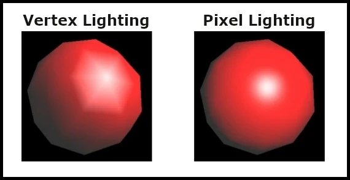 

---
---
---
---
---
---
---
---

## Post-Process
🔗 {[render target](/pages/glossary/#render-target)} {[bloom](/pages/glossary/#bloom) - [cel shading](/pages/glossary/#cel-shading) - [Depth of field](/pages/glossary/#depth-of-field) - [motion blur](/pages/glossary/#motion-blur) - [fxaa](/pages/glossary/#fxaa) - [smaa](/pages/glossary/#smaa) - [taa](/pages/glossary/#taa) - [ssao](/pages/glossary/#ssao)}
<br>📜 [Dis donc Jamy : Comment ça marche un shader ?](/posts/ddj_shaders)

---

Un post-process est une passe de rendu durant laquelle un traitement est appliqués à un rendu intermédiaire de la scène. Ce rendu est stocké dans une [render target](/pages/glossary/#render-target), qui a été générée lors d'une passe précédente.

De nombreux effets visuels sont réalisés de cette manière ([Depth of field](/pages/glossary/#depth-of-field), Color Grading, Film Grain, Vignetting etc.)

---
---
---
---
---
---
---
---

## Quad
🔗 {[face](/pages/glossary/#face)}

---

Un quad est une [face](/pages/glossary/#face) d'un [mesh](/pages/glossary/#mesh) (maillage) composée de quatre [edges](/pages/glossary/#edge) (arêtes) et de quatre [vertex](/pages/glossary/#vertex) (sommets). Contrairement à un triangle, un quad n'est pas nécessairement planaire (c'est-à-dire qu'il peut ne pas être contenu dans un seul plan).

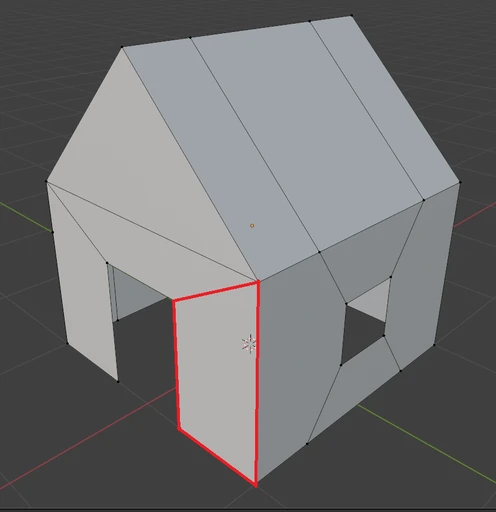 

Dans un moteur de jeu qui ne comprend que des triangles, le quad est une primitive géométrique prédéfinie qui est décomposée en deux triangles, partageant deux de leurs vertex (pour un total de quatre vertex). Dans ce cas, le quad est toujours planaire, et il forme un carré ou un rectangle.

---
---
---
---
---
---
---
---

## Rasterisation
🔗 {[pipeline graphique](/pages/glossary/#pipeline-graphique) - [fixed function stage](/pages/glossary/#fixed-function)} {[normal attribute](/pages/glossary/#normal-attribute), [vertex color attribute](/pages/glossary/#vertex-color-attribute), [uv attribute](/pages/glossary/#uv-attribute)}
<br>📜 [Dis donc Jamy : Comment ça marche un shader ?](/posts/ddj_shaders)

---

La rasterisation est le processus de transformation d'une image vectorielle (définie par des primitives géométriques) en une image matricielle, (composée de pixels).

Dans le cadre du [pipeline graphique](/pages/glossary/#pipeline-graphique), il s'agit du [fixed function stage](/pages/glossary/#fixed-function) située entre le [vertex shader](/pages/glossary/#vertex-shader) et le [fragment shader](/pages/glossary/#fragment-shader). Cette étape rasterise des triangles, définis par les [vertex](/pages/glossary/#vertex) en espace écran issus du vertex shader. Les pixels générés, aussi appelés fragments, sont ensuite envoyés en entrée du fragment shader.

Les attributs associés aux vertex ([normal](/pages/glossary/#normal-attribute), [couleur](/pages/glossary/#vertex-color-attribute), [uv](/pages/glossary/#uv-attribute)) sont également interpolés et affectés aux fragments correspondants.

Note : Le terme "rasterisation" est parfois utilisé pour désigner l'ensemble du processus de rendu temps réel classique. Dans ce cas, il fait référence à la méthode de rendu dans son intégralité, par opposition à la méthode de rendu par ray tracing.

---
---
---
---
---
---
---
---

## Render Target
🔗 {[pipeline graphique](/pages/glossary/#pipeline-graphique) - [draw call](/pages/glossary/#draw-call)} {[post-process](/pages/glossary/#post-process)}

---

Une render target est une toile sur laquelle le [pipeline graphique](/pages/glossary/#pipeline-graphique) va peindre une séquence de [draw calls](/pages/glossary/#draw-call). À la fin de cette séquence (appelée "passe de rendu"), cette toile peut soit :
- 1. être affichée à l'écran,
- 2. être stockée comme résultat intermédiaire et utilisée lors de la passe de rendu suivante.

Le second cas permet d'implémenter des effets avancés tels que les ombres dynamiques, les réflexions planaires, et de nombreux effets de [post-process](/pages/glossary/#post-process) ([bloom](/pages/glossary/#bloom), [cel shading](/pages/glossary/#cel-shading), [SSAO](/pages/glossary/#ssao), etc.).

Note : Dans le contexte d'un moteur de jeu, le terme désigne généralement le second cas.

---
---
---
---
---
---
---
---

## Shader
🔗 {[pipeline graphique](/pages/glossary/#pipeline-graphique) - [vertex shader](/pages/glossary/#vertex-shader) - [fragment shader](/pages/glossary/#fragment-shader)}
<br>📜 [Dis donc Jamy : Comment ça marche un shader ?](/posts/ddj_shaders)

---

Un shader est un programme qui s'exécute sur le [GPU](/pages/glossary/#gpu). Le terme fait l'objet d'une légère ambiguité. Selon le contexte, il designe :
- un shader stage : un programme indépendant et spécialisé qui collabore avec d'autres dans au sein du [pipeline graphique](/pages/glossary/#pipeline-graphique) pour générer des images (par exemple, le [vertex shader](/pages/glossary/#vertex-shader), geometry shader, [fragment shader](/pages/glossary/#fragment-shader), tessellation shader, etc.)
- un shader program : un ensemble cohérent de shader stages destinés à être exécutés ensemble. Il s'agit, en quelque sorte, d'une instance du pipeline graphique.

Dans les moteurs de jeux et les logiciels de modélisation, le terme apparaît généralement à travers le concept de material. Dans ce cas, il est souvent employé au sens de shader program. Un material étant vu comme un preset de paramètres pour un shader program donné.

Dans des contextes plus techniques, il est plutôt utilisé au sens shader stage.

---
---
---
---
---
---
---
---

## Skeletal Animation
🔗 {[morph target](/pages/glossary/#morph-target)}

---

L'animation squeletale est une technique d'animation qui consiste à associer un squelette à un [mesh](/pages/glossary/#mesh) afin de le déformer. Chaque [vertex](/pages/glossary/#vertex) du mesh est associé à des poids qui déterminent l'influence des os proches sur celui-ci (ce processus est appelé skinning).

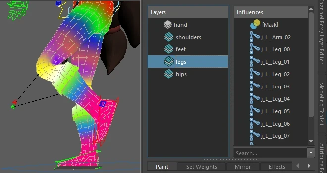

Lorsque l'on anime le squelette, chaque os entraîne avec lui les vertex du mesh qu'il influence, provoquant ainsi sa déformation.

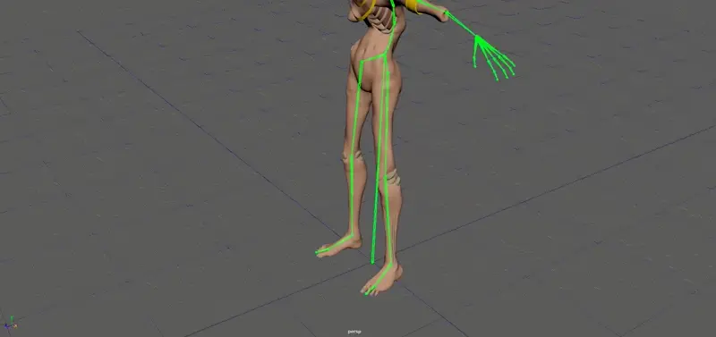

Cette technique est couramment utilisée pour des animations complexes et de grande envergure, comme marcher, sauter ou effectuer des mouvements divers. Elle peut être implémentée soit côté [CPU](/pages/glossary/#cpu), soit côté [GPU](/pages/glossary/#gpu), selon les besoins. 

Par exemple, si le gameplay nécessite une détection précise des collisions sur la géométrie du mesh, il est nécessaire de le déformer côté CPU. En revanche, si une détection de collision approximative suffit, on peut se contanter d'associer des colliders simplifiés (spheres, capsules etc.) aux os du squelette et appliquer la déformation du mesh côté GPU.

---
---
---
---
---
---
---
---

## SMAA
🔗 {[anti-aliasing](/pages/glossary/#anti-aliasing)} {[post-process](/pages/glossary/#post-process)}

---

Le SMAA (Subpixel Morphological Anti-Aliasing) est une technique d'[anti-aliasing](/pages/glossary/#anti-aliasing) appliquée en [post-process](/pages/glossary/#post-process). Comme le [FXAA](/pages/glossary/#fxaa), elle analyse l'image issue de la passe de rendu principale pour détecter les contours et appliquer un flou pour adoucir les bords.

Cependant, la détection des contours du SMAA est basée sur des algorithmes plus sophistiqués qui reconnaissent des motifs prédéfinis, offrant ainsi une meilleure précision que le FXAA. Cela permet de réduire les faux positifs et de produire une image moins floue.

Avantages :
- Une image plus nette qu'avec le FXAA
- Compatible avec un deferred renderer (moteur graphique utilisant une architcture particulière permettant le [deferred lighting](/pages/glossary/#deferred-lighting))

Inconvénients :
- Plus lourd que le FXAA

---
---
---
---
---
---
---
---

## SSAO
🔗 {[post-process](/pages/glossary/#post-process)}

---

L'occlusion ambiante est un phénomène physique selon lequel la lumière se diffuse moins dans les espaces confinés. Par exemple, dans les coins de murs, à la base d'une touffe d'herbe ou dans les interstices entre des briques, on observe une lumière moins intense que dans les zones plus dégagées (même sans ombre directe).

Le SSAO (Screen Space Ambient Occlusion) est un effet de [post-process](/pages/glossary/#post-process) qui simule ce phénomène.

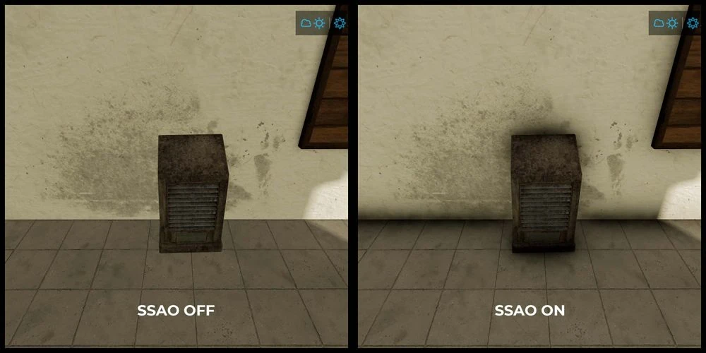

---
---
---
---
---
---
---
---

## TAA
🔗 {[anti-aliasing](/pages/glossary/#anti-aliasing)} {[post-process](/pages/glossary/#post-process)}

---

Le TAA (Temporal Anti-Aliasing) est une technique d'[anti-aliasing](/pages/glossary/#anti-aliasing) appliquée en [post-process](/pages/glossary/#post-process). Elle consiste à exploiter les [frames](/pages/glossary/#frame) précédentes pour lisser l'image.

Avantages  :
- Rendu très précis : les contours sont bien lissés et le reste de l'image reste net.
- Compatible avec un deferred renderer (moteur graphique utilisant une architcture particulière permettant le [deferred lighting](/pages/glossary/#deferred-lighting))

Inconvénients :
- Sujet au ghosting (effet de traînées floues sur les objets en mouvement).
- Peut être plus coûteux en ressources par rapport à d'autres techniques.

---
---
---
---
---
---
---
---

## UV Attribute
🔗 {[vertex](/pages/glossary/#vertex)} {[rasterisation](/pages/glossary/#rasterisation)} {[normal attribute](/pages/glossary/#normal-attribute) - [vertex color attribute](/pages/glossary/#vertex-color-attribute)}

---

C'est un type d'attribut couramment associé aux [vertex](/pages/glossary/#vertex). Il représente une coordonnée 2D, correspondant à une position dans une texture. C'est grâce à cet attribut que l'on peut appliquer une texture sur un [mesh](/pages/glossary/#mesh), un processus appelé "texture mapping".

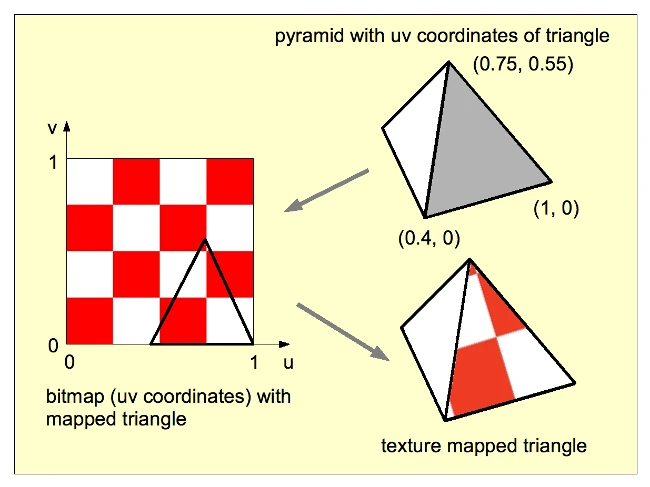

En résumé, par la magie de l'interpolation (réalisée lors de la [rasterisation](/pages/glossary/#rasterisation)), les coordonnées UV sont associées à chaque fragment. Le [fragment shader](/pages/glossary/#fragment-shader), ayant accès à ces coordonnées UV interpolées, peut alors échantillonner (ou "sampler") la texture au point indiqué, afin de déterminer la couleur du pixel à afficher à l'écran.

Note : Les vertex peuvent porter plusieurs UV différents, car il est possible d'appliquer plusieurs textures à un même mesh. Par exemple, une texture pour la lumière statique pré-calculée, stockée dans une texture appelée une lightmap.

---
---
---
---
---
---
---
---

## Vertex
🔗 {[mesh](/pages/glossary/#mesh) - [edge](/pages/glossary/#edge) - [face](/pages/glossary/#face)} {[normal attribute](/pages/glossary/#normal-attribute) - [uv attribute](/pages/glossary/#uv-attribute) - [vertex color attribute](/pages/glossary/#vertex-color-attribute)}

---

Un vertex (ou sommet) est un des élements qui constituent un [mesh](/pages/glossary/#mesh) (ou maillage). Il représente un point dans l'espace ou dans le plan. 

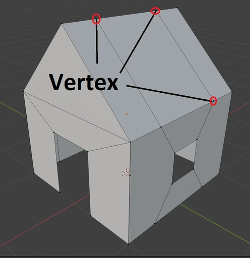

Un vertex peut posséder plusieurs attributs, dont les plus courants sont :
- Une [couleur](/pages/glossary/#vertex-color-attribute)
- Une [normale](/pages/glossary/#normal-attribute)
- Des coordonnées [UV](/pages/glossary/#uv-attribute)

Il existe également d'autres attributs moins fréquents, comme les poids de skinning utilisées pour l'animation. En résumé, un vertex est une coordonnée de l'espace ou du plan qui porte de l'information.

Note : Le pluriel de "vertex" est "vertices", ne soyez pas surpris de le voir écrit sous cette forme. Mais dans le langage courant (du moins en France) on dit prèsque toujours vertex. Je l'utilise donc prèsque toujours sous cette forme y compris à l'écrit, autant par habitude que parce que je trouve ça moins confus (désolé pour vos oreilles et vos yeux si vous n'êtes pas de cet avis).

---
---
---
---
---
---
---
---

## Vertex Color Attribute
🔗 {[vertex](/pages/glossary/#vertex)} {[rasterisation](/pages/glossary/#rasterisation)} {[normal attribute](/pages/glossary/#normal-attribute) - [uv attribute](/pages/glossary/#uv-attribute)}

---

C'est un type d'attribut couramment associé aux [vertex](/pages/glossary/#vertex). Il représente (comme son nom l'indique) une couleur. Cette couleur est interpolée lors de la [rasterisation](/pages/glossary/#rasterisation), créant ainsi un dégradé dont chaque couleur est associée au fragment correspondant.

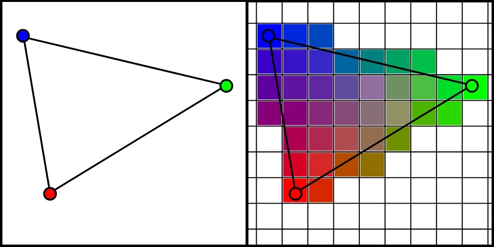 

Bien que cet attribut soit peu utilisé de manière directe dans les jeux modernes, il est souvent détourné pour encoder des informations nécessaires à certaines techniques ou effets. L'exemple le plus courant est le vertex painting, qui consiste à peindre les sommets d'un objet pour appliquer un effet localisé (comme des salissures, du sang ou de la mousse sur une roche).

---
---
---
---
---
---
---
---

## Vertex Lighting
🔗 {[pixel lighting](/pages/glossary/#pixel-lighting) - [deferred lighting](/pages/glossary/#deferred-lighting)}

---

C'est une technique qui consiste à calculer l'éclairage au niveau du [vertex shader](/pages/glossary/#vertex-shader) pour chaque [draw call](/pages/glossary/#draw-call) de la passe principale. La valeur d'illumination obtenue est ensuite interpolée par le [rasterizer](/pages/glossary/#rasterisation) et appliquée à chaque fragment. Le [fragment shader](/pages/glossary/#fragment-shader) peut alors utiliser cette valeur interpolée pour ajuster la couleur du pixel et déterminer sa couleur finale.

L'avantage de cette technique est son faible coût en termes de performances. Cependant, la qualité du rendu dépend de la densité des [vertex](/pages/glossary/#vertex) de la surface éclairée.

 

---
---
---
---
---
---
---
---

## Vertex Shader
🔗 {[shader](/pages/glossary/#shader) - [pipeline graphique](/pages/glossary/#pipeline-graphique) - [rasterisation](/pages/glossary/#rasterisation) - [fragment shader](/pages/glossary/#fragment-shader)}
<br>📜 [Dis donc Jamy : Comment ça marche un shader ?](/posts/ddj_shaders)

---

Le vertex shader est la première étape programmable du [pipeline graphique](/pages/glossary/#pipeline-graphique). Traditionnellement, sa fonction principale est de réaliser une série de transformations géométriques sur les [vertex](/pages/glossary/#vertex) qu'il traite, afin de les convertir de leurs coordonnée locale 3D vers l'espace 2D de l'écran.

Après cette étape, on peut considérer que les vertex forment une sorte d'image vectorielle prête à être [rasterisée](/pages/glossary/#rasterisation). Cela dit, certaines étapes optionnelles du pipeline, comme le geometry shader et la tessellation, peuvent être appliquées avant la rasterisation.

---
---
---
---
---
---
---
---