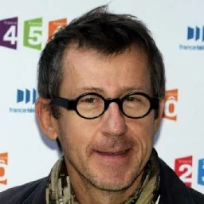

+++
author = 'Turbo Tartine'
date = '2026-01-31T09:06:29+01:00'
draft = true
title = "Du photon au pixel : Real Life Engine"
description = "Part II de la serie d'article de vulgarisation sur le PBR"
hidden = false
+++

## I. Introduction
Contrairement à ce que l’on pourrait croire, la lumière ne se laisse pas facilement appréhender. Pendant longtemps, les physiciens eux-mêmes ont débattu de sa nature. Tantôt onde, tantôt particule, l’humanité a dû jongler entre ces deux modèles, choisissant le plus adapté selon le phénomène observé.

Aujourd’hui, la physique moderne propose un cadre unifié qui réconcilie ces deux visions. Mais l’optique quantique reste une discipline complexe et abstraite, ce qui en fait un très mauvais candidat pour ce que nous cherchons à faire ici : proposer un modèle pédagogique intuitif de ce qu’est la lumière dans la vrai vie.

Cet article n’est donc pas un cours de physique. Prenez-le pour ce qu’il est : le schéma mental approximatif et imparfait d’un passionné qui fait de la programmation graphique sur son temps libre. (Parce que oui, je suis bien programmeur dans un studio de jeu vidéo, mais au travail, je ne fais pas du tout ça.)

Ma seule ambition ici est de partager, gratuitement et en l’état, mon framework mental personnel. Il n’est sûrement pas parfait, mais il m’a aidé à comprendre les techniques de rendu un cran au-dessus du simple copié-collé de tutoriels. J’espère qu’il vous aidera aussi. Utilisez-le, forkez-le, améliorez-le ! Et si vous trouvez un bug, n’hésitez pas à me faire une PR sous la forme d’un commentaire.

## II. Préambule
Dans la vraie vie, l’existence des photons est intimement liée à la matière. C’est elle qui les crée, c’est elle qui les détruit, et c’est encore elle qui influence leur trajectoire. Elle détermine même leur couleur, ainsi que la vitesse à laquelle ils se propagent.

Ce que je veux dire par là, c’est qu’il n’y a pas d’un côté la matière et de l’autre la lumière. À un niveau fondamental, la matière n’est rien d’autre que de l’énergie organisée, qui change continuellement de forme dans un système fermé que l’on appelle l’univers.

La lumière n’est finalement qu’une de ces formes : c’est de l’énergie en transit, matérialisée par des photons.

Pour décrire son comportement, nous allons partir de l’infiniment petit, en étudiant ce que j’appelle les phénomènes de bas niveau, avant de remonter vers les phénomènes lumineux visibles à notre échelle.

## III. Phénomenes bas niveau
Les phénomènes bas niveaux sont donc les phénomènes liés à lumière qui se jouent à l'échelle microscopique. A cette échelle, la matière est constituée d’atomes autour desquels gravitent des électrons et ces atomes sont organisés selon des paternes specifiques qu'on appelle des molécules. 

Cette soupe de molécule n'est pas statique. Elle est brassées en permanance et ce mouvement est une façon pour la matière de stoquer l'énergie. Selon ce qui bouge et comment ça bouge, on va appelé ça : la température, le courrant électrique, la vibration moléculaire etc...

### 1. Emission
Lorsque un électron reçois de cette énergie, il entre dans un état qu'on appèle exité. Mais il s'agit là d'un état instable dans lequel il ne peut pas rester bien longtemps. Il va alors devoir se décharger de cet excédent d'énergie pour retrouver un état stable.

Pour cela il peut soit :
- rendre l'énergie à la matière
- utiliser l'énergie pour émetre un photon qui se propage alors dans une direction aléatoire

[Schema double red blue background]

Note : Tous les materiaux émetent des photons dès lors que leur température dépasse 0 kelvin (le zero absolu). Mais si le monde n'est pas une gigantesque empoule, c'est parce que la plupart emetent en infrarouges.

### 2. Absorbtion et Diffusion Volumique
Lors de son voyage à travers la matière, le photon peut entrer en intéraction avec les électrons qu'il croise. Durant cette intéraction, son énergie est transmise à l'électron provoquant l'exitation de ce dernier. Le photon n'existe alors plus en tant que tel, mais son destin n'est pas encore scellé pour autant. Il est en quelques sorte en surcis.

Ce qui va déterminer son sort, c'est la manière dont l'électron va décider de se décharger de son énergie :
- si il la rend à la matière, le photon est définitivement détruit : c'est l'absorbtion.
- si il réemet le photon, il est en quelques sortes résucité et redirigé dans une diréction aléatoire : c'est la diffusion volumique.

[Schema double red blue background]

### 3. Comportements à la frontière
Jusqu'ici nous avons décris les phénomenes qui interviennent à l'interieur du milieu. Mais si on considère la surface de contacte entre deux milieux différents, on observe de nouveaux comportements.

En effet, lorsque les photons se présente à l'interface de deux materiaux, il peut se passer 2 choses :
- Le photon rebondis et retourne dans son milieu d'origine : c'est la reflection speculaire
- Le photon pénètre dans le nouveau milieu et y continu sa route : c'est la transmission

[Schéma rayon]

Pour édudier ces phénomènes, le modèle à base de particules montre ses limites. Mais si on considère la lumière comme une onde, cela devient assez intuitif.

#### 3.1. Reflection Spéculaire
La trajectoire de la partie reflechie est plutôt previsible. L'onde vient s'écraser sur la discontinuité et rebondis suivant un angle égale à l'angle d'incidance.

[Schéma rayon]

Le phénomène est similaire à ce qu'on peut observer en jetant une balle dans une piscine. Les ondes se propage à la surface de l'eau et rebondissent en atteignant les bords.

[illustration onde]

#### 3.2. Transmition
Pour la transmision c'est un peu plus déroutant. L'onde ne traverse pas la frontière en ligne droite (enfn pas toujours). Elle est déviée selon un angle, dit de réfraction.

L'explication tient au fait que l'onde se propage moins vite dans le verre que dans l'aire. Si le faiseau frappe la surface avec un angle de 0°, tout les points du front d'onde sont ralentis au même instant et le rayon n'est pas dévié.

[Schéma rayon]

En revanche si on donne de l'angle, la traversée du front d'onde est maintenant progressive. Les points situés sur le bord droit (dans le sens du rayon) seront donc ralentis légerement avant ceux du bord gauche. Ce qui a pour effet de faire pivoter le front d'onde un peu à la manière d'un tank qui fait varier la vitesse de ses chenilles.

#### 3.3. Indice de réfraction
La vitesse de propagation est rarement manipulée directement en physique. On utilise plutot l'IOR de l'anglais "indice of refraction" qui se défini comme `IOR = c / v` avec :
- c : la vitesse maximale de la lumière aussi appelée célerité. Elle est de 300 000 km/s et correspond à la propagation dans le vide.
- v : la vitesse effective de propagation dans le milieu considéré (apriori inferieure à c)

Dans la suite j'utiliserai l'IOR. Mais ne soyez pas destabilisé, c'est une quantité equivalante à la vitesse de propagation. On la rencontre souvent dans les algorithmes et les logiciels de rendu.

### 4. Fresnel
On vient de voire qu'une discontinuité de milieux séparait la lumière en deux directions. Maintenant on va s'interesser au phénomène qui détermine de quel côté le photon va être dirigé lorsqu'il arrive à la frontière : le Fresnel

La première chose à savoir sur le Fresnel, c'est que le 's' ne se prononce pas (oui c'est important). Ensuite, et comme toujours à l'échelle microscopique, c'est une question de probabilité. Le photon fait un jet de Fresnel, si il le réussi, il peut entrer dans le nouveau milieu. Sinon, ils est renvoyé d'où il vient.

Le seuil de réussite de ce jet va dépendre de 2 choses :
- L'angle d'incidance
- La différence d'IOR entre les deux milieux

[Schema Ondes]

Plus ces valeurs sont grandes, plus le test de transmission est difficile à passer. Ainsi, la reflection spéculaire est beaucoup plus importante lorsque la lumière est rasante. Et au contraire la transmission domine si les milieux ont des IOR proches.

## IV. Caractère spectrale
En lisant ce titre, vous vous rappelez vaguement que les couleurs correspondent aux longueurs d’onde du spectre visible, qui s’étend de 400 nm à 700 nm. Je vais peut-être vous choquer en affirmant que c’est faux. Ce qu’on appelle la couleur, ce n’est pas une longueur d’onde. Mais on dissipera ce mensonge une autre fois. Pour l’instant, il est suffisant.

Nous sommes donc ici réunis pour parler de la couleur de la lumière. Mais au risque de vous choquer une seconde fois : nous n’avons fait que ça jusqu’ici. En effet, pour un photon, l’énergie, la fréquence et la longueur d’onde c'est plus ou moins la même chose.

Maintenant que votre monde est détruit et que vous nagez dans un abîme de perplexité, prenons un instant pour parler de notre seigneur Max Planck et de la relation qui porte son nom.

[portrait Max Plank]

### 1. Relation de Planck
La relation de Planck s'écrit : 

E = h * f

avec :
- E l'énergie du photon
- f la frequence du photon
- h la constante de Planck (décidément)

Cette relation montre que l’énergie d’un photon est directement proportionnelle à sa fréquence. Et comme la frequence est à son tour directement liée à la longueur d'onde, on a bien une correspondance directe entre la couleur d’un photon et son niveau énergie.

### 2. Selection spectrale
L’excitation des électrons n’est pas binaire comme on l’a suggéré jusqu’ici. En réalité, il existe une infinité de niveaux possibles au dessus de l'état stable. Chacun de ces niveau correspond à une valeur d'énergie bien précise qui varie d'un atome à l'autre. 

Par exemple, l'échelle de niveau d'énergie autorisés par un atome d'oxygène ne correpondra pas à celle d'un atome de carbone. Chacun à sa propre signature energetique. 

[Schéma]

Pour qu'un électron puisse transitionner entre 2 niveaux, il doit acquérir (ou libérer) exactement la quantité d’énergie correspondante. Toutes les transitions ne sont donc pas possibles. Cela va conditionner la possibilité d'émetre, absorber ou diffuser telle ou telle couleur. C'est ce qu'on appele : la sélection spectrale.

### 3. Dispersion spectrale
Lorsque on a parlé de la transmission, on a vu que l’angle de réfraction dépend du rapport des IOR des deux matériaux. Mais ce que nous n’avons pas précisé, c’est que la vitess de propagation, et donc l'IOR lui même dépendent de la longueur d’onde.

[Schéma]

En conséquence, l’angle de réfraction varie selon la couleur, ce qui a pour effet de décomposer un rayon lumineux lorsqu’il rencontre une discontinuité de milieu. C’est ce phénomène qui donne naissance aux arcs-en-ciel et aux aberrations chromatiques.

## V Phénomenes de haut-niveau :
La vie d'un photon unique est donc soumise aux phénomènes de bas-niveau. On a vu que ces derniers sont probabilistes. Mais si on change d'échelle et qu'on considère non plus un mais des milliards de photons, la magie des grands nombres va en quelques sortes "stabiliser" la nature aléatoire de la lumière. 

### 1 Transparence
La transparence, c'est quand un materiau transmet beaucoup, mais diffuse et absorbe peu. Les photons le traversent de part en part tout en conservant une certaine cohérence directionnelle. Ce qui fait que l'on distingue assez netement l'image qui se trouve derrière.

[schema]

Ce qui permet à notre oeuil de deceler un materiau totalement transparent, c'est la réfraction qui distord l'image et la reflection spéculaire plus prononcée sur les angles rasants.

[Image réèle distordue]

### 2 Transulucidité
Un materiau translucide possède lui aussi une transmission consequente et une faible absorbtion permetant aux photons de le traverser. Mais contrairement à un materiau transparent, la diffusion y est très forte, induisant un très grand cahos directionnel.

[schema]

En somme la lumière passe, mais elle est completement homogéneisée par la diffusion, ce qui ne permet pas distinguer les formes qui se trouvent derrière l'object.

[Image réèle]

### 3 Opacité
L'opacité, c'est quand les photons ne parvienent pas à traverser le materiau. La lumière rentre mais est rapidement absorbée et ne parvient pas à pénetrer en profondeur (encore moins traverser). 

[schema double]

Si la diffusion est faible, cela va donner des materiaux completement noir comme la charbon. Mais la plupart du temps, elle est suffisament élevée pour qu'une partie des photons arrivent à ressortir du côté où ils sont entrés par diffusions successives. C’est ce qu’on appelle la reflection diffuse.

### 4 Continium diélectrique
Je ne vous apprends surement pas l'existance de ces 3 phénomènes mais on à tendance à les considérer comme des classes hermétiques. En réalité, on peut ranger les materiaux sur un graphe qui aurait pour abssyce l'absorbtion et pour ordonnée la diffusion.

[schema]

Mieux encore, à cause de la sélection spéctrale, un materiau se comporte différament selon la longueur d'onde des photons qui le traverse. On a en quelques sortes un 3eme axe qui représente la longueur d'onde, et la matière pourrait être décrite comme une ligne qui traverse cet espace.

[shema 3 axes]

## VI Cas concrets :
Pour bien visualiser ce que cela veux dire, on va maintenant explorer quelques cas concrets.

### 1 La menthe à l'eau
Si vous prenez par exemple de la menthe à l'eau, on peut dire que c'est un materiau qui est peu diffusant sur la totalité du spectre visible. En revanche, il est peu absorbant pour les longueurs d'onde autour du vert, mais très absorbant pour les autres. 

[Image]

D'une certaine manière, on peut dire que la menthe à l'eau est tranparente pour le vert mais opaque pour le reste.

### 2 Le pastis
Pour le pastis on observe le même phénomène d'absorbtion selective mais pour un matriau qui cette fois diffuse beaucoup sur tout le spectre. Les photons qui ne contribuent pas au jaune sont très vite absorbées tantis que les autres survivent mais voient leur cohérence directionnelle est détruite par la diffusion.

[Image]

On peut dire que le pastice est tranlucide pour le jaune, et opaque pour le reste.

### 3 Le ciel
Pour l'atmosphère cette fois on est dans un cas différent. Ce n'est plus l'absorbtion qui est selective, mais la diffusion. Les longueur d'onde bleu de la lumière du soleil sont détournées dans toutes les directions tandis que le reste continue sa route en ligne droite. 

Une partie de la composante bleu qui devrait nous passer au dessus de la tête nous parvient donc par diffusion. C'est pour ça que ciel est de cette couleur.

[Image]

L'atmosphère est donc translucide pour le bleu et transparente pour le reste.

### 4 La brique
La brique est suffisament absorbante pour qu'aucun photon ne parvienne à traverser. Mais l'absorbtion est légèrement moins forte pour le rouge que pour les autres couleurs. Couplé à une diffusion forte et homogène sur le spectre, la matière donne plus de chances aux photons rouges de resortir.

[Image]

## VII Cas pathologique : le métal
Les materiaux qu'on à décrits jusqu'ici sont les materiaux diélectriques. Mais les metaux sont des conducteurs et ils ne fonctionne pas du tout selon ce modèle. L'explication tiendrait à la façon dont les particules sont agencées au sein de la matière. Notament le fait que dans un conducteur, les électrons sont libres. 

La vérité c'est que je ne comprends pas vraiment le lien entre la liberté des électrons et ce que je m'apperte à décrire. Mais si vous avez des resources à me recommender, ça m'interesse.

### 1 Desolation photonique
Contrairement aux diélectriques, le métal ne laisse entrer aucun photon : la lumière qui se présente à l'interface est directement redirigée dans la reflection spéculaire. Il n'y a pas de transmission.

[Schema]

Il n'y a donc pas de vie photonique à l'interieur de la matière. En conséquence, les métaux ne présentent pas de réflection diffuse contrairement la plupart des diélectriques. Si on ignore la reflection spéculaire, ils sont totalement noir.

### 2 Objection de la teinte
  
 

 
Mais qu’est-ce que tu racontes Jamy ? Les métaux, ils sont pas noirs ! L’or est jaune, le cuivre est orange, l’acier gris...
 C’est bien des couleurs tout ça, je ne suis pas fou !

 
    

 Tu as raison, Fred. La réflexion spéculaire du métal fait elle aussi l’objet d’une sélection spectrale. En absorbant certaines longueurs d’onde et en en réfléchissant d’autres, ces derniers acquièrent des teintes caractéristiques : jaune pour l’or, orange pour le cuivre... <i>et cetera</i>...

 
  
 

 C'est encore une histoire d'absorbtion ? 
  Mais alors, quelle différence avec la peinture rouge ?
  Et on vient pas de dire que la lumière ne pénétrait pas dans le métal ?

 
  
 

 Les photons ne pénètrent effectivement pas le métal. Mais ce n’est pas incompatible avec l’absorption. En effet, celle-ci peut avoir lieu directement à la surface. Ainsi, ce n’est plus la réflexion diffuse qui est colorée, mais bien la réflexion spéculaire. Autrement dit : "le reflet".

 
  

[Schema]

Dans le sens courant, quand on parle de la couleur d’un objet, on fait référence à sa réflexion diffuse. De ce point de vue, les métaux sont donc complètement noirs : rien ne peut en ressortir puisque rien n’y entre. La seule chose que l’on perçoit, c’est une forte réflexion spéculaire, qui peut présenter une certaine teinte grâce à une sélection spectrale de surface. En résumé, les métaux ne sont rien d’autre que des miroirs colorés.

## VIII Conclusion
<TODO>

## Refs
https://phet.colorado.edu/