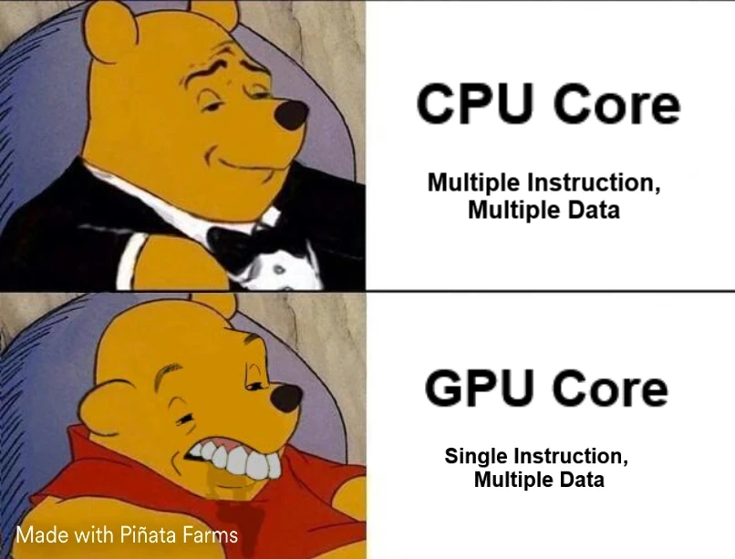
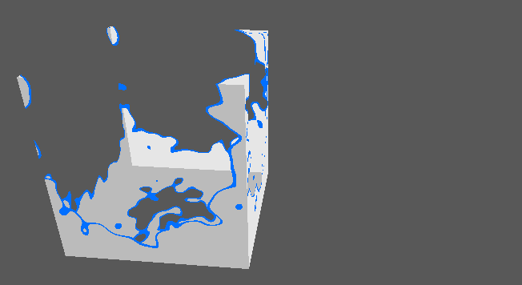
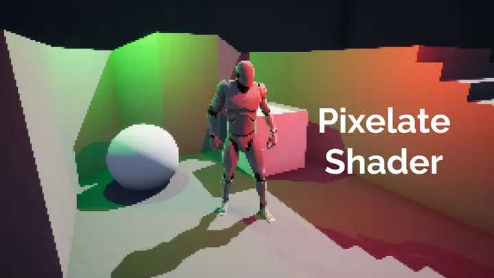

+++
date = '2025-03-12T10:20:34+01:00'
draft = true
title = 'Dis donc Jamy : Comment ça marche un shader ?'
description = "Article de vulgarisation expliquant ce qu'est un shader"
+++
## Introduction
Programmer un shader n'est pas plus difficile que de programmer n'importe quoi d'autre. Mais il est vrai que le formalisme peut être un peu déroutant la première fois qu'on s'y frotte. Dans ce blog je cherche à m'adresser à un publique assez large. Pas uniquement à des programmeurs professionnels, et encore moins à des programmeurs graphiques spécifiquement. J'aimerai donc demistifier un peu le concepte pour ça ne devienne pas un point de bloquage.

Aujourd'hui nous allons donc nous intereser à ce que sont les shaders, pourquoi ils sont si bizare et à quoi ils servent exactement. Ca ne fera pas de vous des Gourous du shading (je suis d'ailleurs loin d'en être un), mais j'espère que ça contribura à rendre mes articles plus accessibles.

## I. Qu'est ce qu'un shader ?
Un shader c'est tout simplement un programme. Il existe plusieurs langages haut-niveau pour les écrire. Les principaux sont glsl et hlsl (mais on peut trouver des choses plus exotiques). Une fois compilé, le shader peut être exécuté par une unité de calcule. Sauf que dans notre cas, cette unité de calcule, ce n'est pas un CPU, mais un GPU.

Jusqu'ici on est pas trop dépaysé. Mais ça va bientôt changer. Immaginez un programme CPU dont la mission serait de traiter les éléments d'un tableau. On aurait quelque chose qui ressemble à ça :
```c
// Point d'entrée du programme
void main(array[]) {
	foreach (elt in array) {
		// Traitement de elt
	}
}
```

Pour un shader, ce serait plutôt ça :
```c
///// CODE INACCESSIBLE AU DEVELOPPEUR ! (car en amont du point d'entrée)
for (i = 0; i < array.lenght; i++) {
	main(elt, i);
}
///// ENDOF CODE INACCESSIBLE AU DEVELOPPEUR

// Point d'entrée du shader
void main(elt, i) {
	// Traitement de elt
}
```

En effet, quand on écrit un shader, on n'a pas access au tableau lui même. On doit raisonner sur chaque élement pris indivisuellement, en isolation de tous les autres. Tout ce qu'on connait c'est l'élement courrant, et eventuellement sa position dans le tableau si on a de la chance.

Croyez le ou non, la couleur de chaque pixel de votre écran est calculée selon ce paradigme. C'est une gymnastique un peu particulière, mais on s'y fait assez vite. Maintenant, pourquoi est ce qu'on a eu besoin d'inventer un truc aussi tordu ?

## II. CPU vs GPU
Pour répondre à cette question, on va devoir se pencher sur les différences architecturelles entre ces 2 types d'unités de calcule.

Un CPU contient relativement peu de coeurs (entre 4 et 16 la plupart du temps). Mais ce sont des coeurs extrèmement puissant et surtout très agiles car indépendants les un des autres. Chacun est capable de dérouler sa propre séquence d'instructions dans son coin. C'est le modèle MIMD (Multiple Instrtuction, Multiple Data). Un CPU est donc très bon pour effectuer plusieurs tâches complexe et différentes en même temps.


*Même illustrant de manière humoristique les difference entre les coeurs CPU et GPU*

En comparaison, un coeur de GPU est con comme une pelle. Non seulement il est beaucoup moin puissant, mais surtout il fonctionne sur le model SIMD (Single Instrcuction, Multiple Data). Ca veut dire que les coeurs d'un GPU ne sont pas capable d'executer simultanement des instructions différentes. A chaque tick d'horloge, tout le monde tape dans la même.


<p>
Mais dit donc Jamy ! Si tous les coeurs executent les même instruction, ils vont tous fournir le même résultat ! Ca n'a aucun sens !
</p>
<br>

<p>
Et bien, pas tout à fait ! Les coeurs executent bien tous la même instruction, mais ils le font sur des données différentes (les élements du tableau vous vous rappelez ?). Ils peuvent donc quand même avoir des sorties différentes.
</p>
<br>

<p>
D'accord ! Mais comment ça marche pour les branchement conditiannel ? les coeurs qui passent dans le if ne peuvent pas pointer sur la meme instruction que ceux qui passent dans le else. Ca marche pas ton truc !
</p>
<br>

<p>
Tu as raison Fred, mais il y a une astuce ! En réalité les 2 cotés sont évalués sequenciellement par tous les coeurs. Et les coeurs non concernés par l'instruction courante ? Et bien c'est simple... ils ne font rien... ils attandent...
</p>
<br>

Voilà pourquoi on dit qu'il faut à tout prix éviter les branches dans le code d'un shader. A chaque fois qu'on en fait une, on met des coeurs au chômage. Cette architecture est donc assez contrainante, mais elle permet à un GPU de gérer non pas 8 ou 16 coeurs, mais plusieurs milliers.

En résumé, là où le CPU est bon pour gérer un petit nombre de tâches complexes et différentes, le GPU lui excelle dans l'art d'executer en parallele un très grand nombre de petites opérations similaires. Et il se trouve que c'est exactement ce dont on a besoin pour traiter des images.

## III. Le pipeline graphique
En pratique, il existe plusieurs types de shaders. Chacun intervenant à une étape précise de ce qu'on appelle le pipeline graphique. A chaque drawcall, c'est à dire (plus ou moins) pour chaque mesh visible dans une frame, ce pipeline va être traversé. La géométrie est injectée en entrée sous forme de triplets de vertex (des triangles donc). Ces dernier vont ensuite être traités étape par étape jusqu'à devenir des pixels affichés à l'écran.


*Diagramme du pipline graphique*

Dans ce pipeline, il y a 2 types d'étapes :
- Les fixed function en jaune pâle : cablées en dur dans le GPU (et donc **très** efficaces)
- Les étapes programmables en vert : les fameux shaders

Ca fait beaucoup, et encore, dites vous qu'il en manque. Mais dans l'infini majorité des cas on utilisera que le Vertex Shader et le Fragment Shader (notés respectivement Vertex Program et Fragment Program sur le schéma mais c'est la même chose)

### 1. Vertex Shader
Les élements traités par le vertex shader sont les vertex du mesh qui traverse le pipeline. Ils sont exprimés dans le référentiel local du mesh. L'utilité première du vertex shader c'est d'appliquer des  changements d'espace au vertex pour qu'il se retrouve tour à tour dans :
- 1. le referentiel du monde
- 2. le reférentiel de la caméra 
- 3. l'espace écran.

Imaginez que la caméra, c'est la navette de futurama. Ce n'est pas elle qui bouge, mais le vertex shader qui s'arange pour déplacer le monde autour d'elle et l'aligner dans le bon axe. Une fois que c'est fait, le monde est "applati" dans le plan de l'écran.

Je ne vais pas détailler les mathématiques engagés dans la maneuvre parce que c'est un article de vulgarisation (ouai c'est ça... dit plutôt que t'as peur de te planter et de passer pour un imbécile !). Mais retenez que ce sont des multiplications de matrice : une grosse opération qui peut être découpée en une multitude de petites opérations identiques. Et comme on l'a vu dans la partie précédente, le GPU et son model SIMD sont taillés pour en avaler des caisses entière sans soursiller.

Notez qu'au dela de ces changements d'espace, le Vertex Shader est l'endroit parfait pour appliquer des déformations au mesh. Il intervient donc logiquement dans l'implémentation de techniques comme le morph target ou le skeletal animation.

<video width="50%" controls muted loop playsinline autoplay>
    <source src="videos/morph_skeletal.mp4" type="video/mp4">
    Your browser does not support the video tag.  
</video>

*Animation d'un viseage à base de morph targets et d'animation squeletale dans JMonkeyEngine*

A une époque la lumière aussi était calculé dans le Vertex Shader pour des questions de performences. On appel ça le Vertex Lighting. Aujourd'hui les GPU sont largement assez puissant pour calculer la lumière au niveau du pixel. Mais le Vertex Lighting est toujours utilisé en tant que parti pris artistique (ou si on fait un portage grille-pain).


*Screen de Sillent Hill 2 illustrant la difference visuelle entre le Vertex Lighting (PS2) et le Pixel Lighting (XBox)*

### 2. La rasterisation
La rasterisation est une étape non programable du pipeline. Mais il est quand même important de comprendre ce que c'est car elle se place entre le Vertex Shader et le Fragment Shader.

Il s'agit d'un procédé qui consiste à discrétiser une image vectoriel. Dit autrement, on va prendre nos joli triangle tout lisses, dont les vertex viennent d'être projetés dans l'espace écran (par le Vertex Shader), et on va en faire un amas de pixels qu'on appelle des fragments. Ces fragments sont ensuite injectés en entrée du Fragment Shader (vous commencez à comprendre le pattern de nomage).

 
*Rasterisation avec interpolation de l'attribut vertex color*

Je ne l'ai pas mentionné jusqu'ici, mais en réalité les vertex portent des attributs en plus de leur coordonnée. Il est important de noter que lors de la rasterisation, une interpolation de ces attributs est effectuée pour chaque frament généré. L'image ci-dessus illustre cela avec l'attribut vertex color.

### 3. Fragment Shader
Le fragment shader c'est la dernière étape avant que le pixel soit imprimé à l'écran. Son job est de déterminer la couleur finale de ce pixel à partir des attributs des vertex interpolés lors de la rasterisation :

- coordonée : l'endroit où se trouve le pixel sur l'écran
- normal : l'orientation de la face associées au vertex
- vertex color : je pense que cet attribut est le relicat d'une aire ou la puissance ne permetait pas de sampler des textures pour chaque pixels. Aujourd'hui, c'est un attribut qu'on utilise ne manière détournée pour encoder d'autres informations dans les models 3D.
- uv : c'est une coordonée 2D utilisée la plupart du temps pour sampler une texture. On en a généralement plusieurs (l'uv0, l'uv1, l'uv2...). Comme le vertex color, ils peuvent être utilisés de manière détournée parfois. 

C'est notament dans ce shader que l'on va pouvoir :
- rendre la lumière (Per Pixel Lighting)
- appliquer les textures
- implémenter divers effets de surface (disolve etc...)

 
*Effet de dissolve*

### 4. Post-Process
Techniquement, ce sont des fragement shader. Mais je ne voulais pas les traiter dans la partie précédente pour éviter la confusion, car c'est un cas assez spécifique : les post process sont une forme de rendu multipass.

En effet, nous n'allons pas rendre la scène directement à l'écran mais dans une render target. Il s'agit d'une texture classique, mis à par qu'elle n'est pas issue d'une image sur votre disque. Elle est générée à la volée lors de l'execution. Dans notre cas, cette render target contient donc un rendu off-screen de la scene : c'est notre première pass.

Ensuite, nous allons rendre un quad devant la caméra en nous arrangeant pour que ses coins cohincident parfaitement avec ceux de l'écran. C'est à ce quad que sera assigné notre fragment shader de post process. Lors de cette deuxieme pass, le post process va pouvoir récupérer chaque pixel de la pass précédente (dans la render target) et lui appliquer le traitement qu'il souhaite avant de l'afficher à l'écran.

Enormement d'effets que vous connaissez sont implémentés par des post process. Pour n'en citer que quelques uns, on retrouve :
- Le bloom
- Le fog
- Le SSAO
- Tous les anti aliasing sauf le MSAA
- Le motion blur
- Divers effets de flou (depth of field, motion blur...)
- Des effets stylistiques (Cel Shading, Pixelisation...)
- L'abération chromatique
- ...


*Divers effets de style en post process*

## Conclusion
Dans cet article je fais pas mal de racourcis et d'approximations. L'objectif n'étant pas de vous apprendre à écrire des shaders, mais de vous donner une vision global de ce qu'ils sont et à quoi ils servent.

Si vous souhaitez approfondir le sujet, je vous conseille [Learn OpenGL](https://learnopengl.com/). C'est très complet et bien expliqué. Quand je cherche une information, c'est le premier endroit où je regarde. Et très souvent je n'ai pas besoin d'aller ailleurs. 

Vous pouvez aussi apprendre directement dans un moteur de jeu. Ainsi vous pourrez vous concentrer sur vos shaders sans avoir à vous occuper de la partie CPU du *renderer* (qui sera déjà implémentée par le moteur). Je n'ai pas de ressource à vous pointer car je n'ai pas appris comme ça, mais je suis sur qu'elles existent. Et c'est souvent plus simple de découper un sujet pour se confronter aux problèmes les uns après les autres.

Sur ce, j'éspère que vous aurez trouvé ces explications utiles et qu'elles vous aideront à aborder plus facilement certains passages de mes futurs articles. A bientôt.