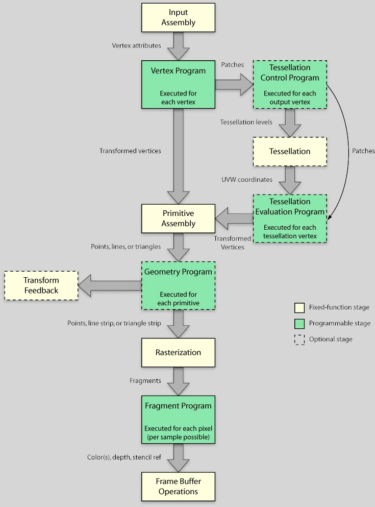

+++
date = '2025-03-12T10:20:34+01:00'
draft = true
title = 'Dis donc Jamy : Comment ça marche un shader ?'
description = "Article de vulgarisation expliquant ce qu'est un shader"
+++
## Introduction
Dans ce lightning article je vais essayer de demistifier un peu le concepte de Shader. En effet, j'ai quelques amis qui ont l'extrème gentillesse de crash-tester mes brouillons pour me faire des retours avant que je ne les publient (Salut à vous ! Et merci pour ce que vous faites, ça m'aide beaucoup !). La plupart sont d'exellents programmeurs. Pourtant, quand je mets un bout de code en `glsl` dans un article, bien souvent ça coince.

En réalité , programmer un shader n'est pas plus difficile que de programmer n'importe quoi d'autre. C'est juste : "bizare quand on a pas l'habitude". Dans ce blog je cherche à m'adresser à un publique assez large. Pas uniquement à des programmeurs, et encore moins à des programmeurs graphiques spécifiquement. J'aimerais donc que cet asspect ne soit plus un freint.

Pour cela, je vais tanter de vous donner quelques armes pour que vous soyez pas déroutés par le concepte. Ca ne fera pas de vous un Gourou du shading (je n'en suis d'ailleurs pas un moi même), mais j'espère que ça contribura à rendre mes articles plus accessibles.

## I. Qu'est ce qu'un shader ?
Un shader c'est tout simplement un programme. Il existe plusieurs langages haut-niveau pour les écrire. Les principaux sont glsl et hlsl (mais on peut trouver des choses plus exotiques). Une fois compilé, le shader peut être exécuté par une unité de calcule. Sauf que cette fois, cette unité de calcule, ce n'est pas un CPU, mais un GPU.

Jusqu'ici on est pas trop dépaysé. Mais enfillez vos gants et allumez votre frontale, c'est maintenant qu'on descents au fond du gouffre. Immaginez un programme CPU dont la mission est de traiter les éléments d'un tableau. On aurait quelque chose qui ressemble à ça :
```c
// Point d'entrée du programme
void main(array[]) {
	foreach (elt in array) {
		// Traitement de elt
	}
}
```

Pour un shader, ce serait plutôt ça :
```c
///// CODE INACCESSIBLE AU DEVELOPPEUR ! (car en amont du point d'entrée)
for (i = 0; i < array.lengt; i++) {
	main(elt, i);
}
///// ENDOF CODE INACCESSIBLE AU DEVELOPPEUR

// Point d'entrée du shader
void main(elt, i) {
	// Traitement de elt
}
```

En effet, quand on implémente un shader, on n'a pas access au tableau lui même. On doit raisonner sur chaque élement pris indivisuellement, en isolation de tous les autres. Tout ce qu'on connait en plus de l'élement lui même, c'est sa position dans le tableau (J'avais bien dit que c'était bizare !).

Croyez le ou non, la couleur de chaque pixel de votre écran est calculée de cette manière. C'est une gymnastique un peu particulière, mais on s'y fait assez vite. Maintent, pourquoi est ce qu'on a besoin de faire un truc aussi tordu ? On va voire ça dans la section suivante.

## II. CPU vs GPU, pourquoi tant de haine ?


<explication de comment le GPU fonctionnent>

## III.Le pipeline graphique
En pratique, il existe plusieurs types de shaders. Chacun intervenant à une étape précise de ce qu'on appelle le pipeline graphique. A chaque drawcall, c'est à dire (plus ou moins) pour chaque mesh visible dans une frame, ce pipeline va être traversé. La géométrie est injectée en entrée sous forme de triplets de vertex (des triangles donc), qui vont être traités étape par étape jusqu'à devenir des pixels affichés à l'écran.



Dans ce pipeline, il y a 2 types d'étapes :
- Les fixed function en jaune pâle : cablées en dur dans le GPU (et donc **très** efficaces)
- Les étapes programmables : les fameux shaders

Ca fait beaucoup, et encore, dites vous qu'il en manque. Mais dans l'infini majorité des cas on utilisera que le Vertex Shader et le Fragment Shader (notés respectivement Vertex Program et Fragment Program sur le schéma mais c'est la même chose)

### 1. Vertex Shader
Les élements traités par le vertex shader sont les vertex du mesh qui traverse le pipeline. Ils sont exprimés dans le référentiel local du mesh. L'utilité première du vertex shader c'est d'appliquer des  changements d'espace au vertex pour qu'il se retrouve tour à tour dans :
- le referentiel du monde
- le reférentiel de la caméra 
- l'espace écran.


Imaginez que la caméra, c'est la navette de futurama. Ce n'est pas elle qui bouge, mais le vertex shader qui s'arange pour déplacer le monde autour d'elle et l'aligner dans le bon axe. Une fois que c'est fait, le monde est "applati" dans le plan de l'écran.

Je ne vais pas détailler les mathématiques engagés dans la maneuvre parce que c'est un article de vulgarisation (ouai c'est ça... dit plutôt que t'as peur de te planter et de passer pour un glandu !). Mais retenez que ce sont des multiplications de matrice et qu'il s'agit d'une opération hautement paralellisable. Un GPU peut en avaler des caisses entière sans soursiller.

Notez qu'au dela de ces changements d'espace, le Vertex Shader est l'endroit parfait pour implémenter des effets du type :
- inflation/retractation
- morphing
- distortion
- vertex animation


A une époque la lumière aussi était calculé dans le Vertex Shader pour des questions de performences. On appel ça le Vertex Lighting. Aujourd'hui les GPU sont largement assez puissant pour calculer la lumière au niveau du pixel. Mais le Vertex Lighting est toujours utilisé en tant que parti pris artistique (ou si on fait un portage grille-pain).


### 2. La rasterisation
La rasterisation est une étape non programable du pipeline. Mais il est quand même important de comprendre ce que c'est car elle se place entre le Vertex Shader et le Fragment Shader. Il s'agit d'un procédé qui consiste à discrétiser une image vectoriel. Dit autrement, on va prendre nos joli triangle tout lisses, dont les vertex viennent d'être projetés dans l'espace écran (par le Vertex Shader), et on va en faire un amas de pixels qu'on appelle des fragments. 


Ces fragments sont ensuite injectés au Fragment Shader (vous commencez à comprendre le pattern de nomage). Mais ce n'est pas tout. Il y a un petit détail que j'ai omis de mentionner dans la partie précédente. Les vertex protent des attributs en plus de leur coordonnée : une couleur et ce qu'on appele des uv (qu'on utilise notament pour appliquer les textures mais c'est completement hors scope pour cet article).

Il est important de noter que lors de la rasterisation, une interpolation de ces attributs est affectée aux framents générés.


### 3. Fragment Shader


## IV. Blue Screen of Welcome


<Hello world>

## Conclusion