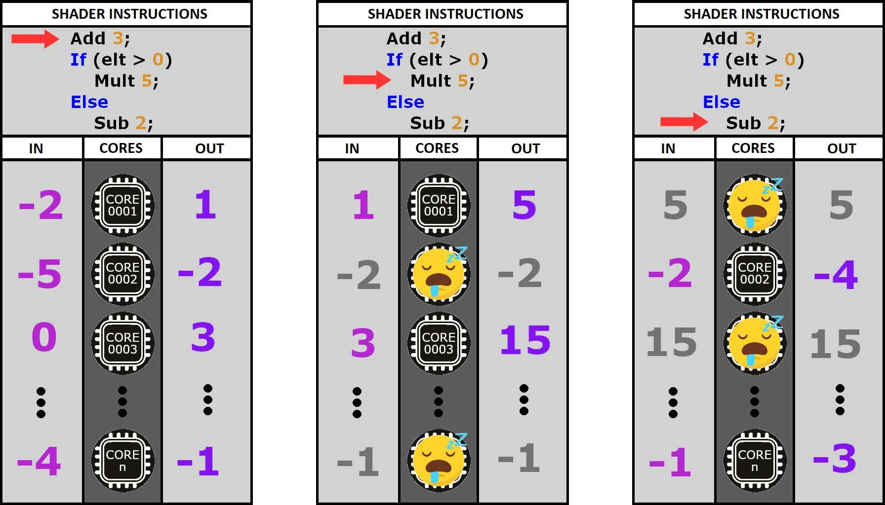
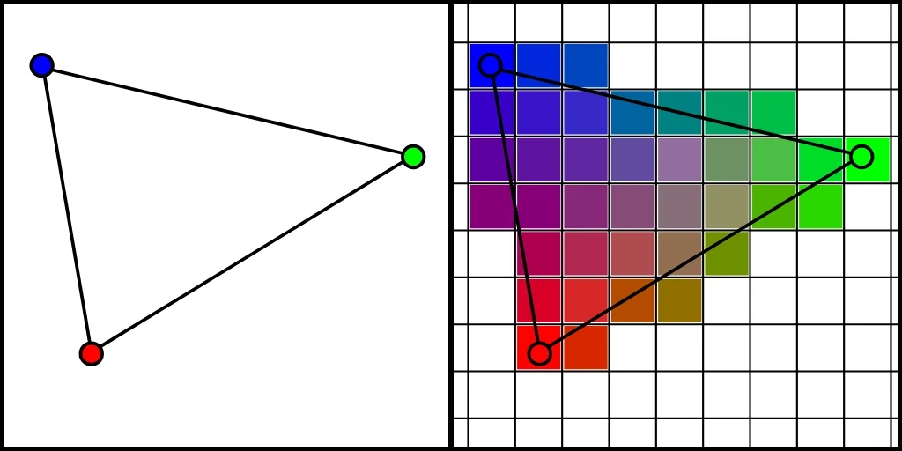

+++
date = '2025-03-12T10:20:34+01:00'
draft = true
title = 'Dis donc Jamy : Comment ça marche un shader ?'
description = "Article de vulgarisation expliquant ce qu'est un shader"
+++
## Introduction
**Programmer un *shader*** n'est pas plus difficile que de programmer n'importe quoi d'autre. Mais il est vrai que le formalisme peut être un peu **déroutant la première fois** qu'on s'y frotte. Dans ce blog, je cherche à m'adresser à un public assez large. Pas uniquement à des programmeurs professionnels, et encore moins à des programmeurs graphiques spécifiquement. J'aimerais donc **démystifier un peu le concept** pour que cela ne devienne pas un point de blocage.

Aujourd'hui, nous allons donc nous intéresser à ce que sont les [*shaders*](/misc/glossary/#shader), pourquoi ils sont si bizarres et à quoi ils servent exactement. Ça ne fera pas de vous des gourous du *shading* (je suis d'ailleurs loin d'en être un), mais j'espère que cela contribuera à **rendre mes articles plus accessibles**.

## I. Qu'est ce qu'un shader ?
Un *shader*, c'est tout simplement **un programme**. Il existe plusieurs [langages haut niveau](/misc/glossary/#niveau-dabstraction) pour les écrire. Les principaux sont *GLSL* et *HLSL* (mais on peut trouver des choses plus exotiques). Une fois compilé, le *shader* peut être **exécuté** par une unité de calcul. Sauf que dans notre cas, cette unité de calcul, ce n'est pas un *CPU*, mais un ***GPU***.

Jusqu'ici, on n'est pas trop dépaysé mais ça va bientôt changer. Imaginez un programme *CPU* dont la mission serait de traiter les éléments d'un tableau. On aurait quelque chose qui ressemble à ça :
```c
// Point d'entrée du programme
void main(array[]) {
	for (i = 0; i < array.lenght; i++) {
		var elt = array[i];
		// Traitement de elt
	}
}
```

Pour un *shader*, ce serait plutôt ça :
```c
///// CODE INACCESSIBLE AU DEVELOPPEUR ! 
///// (car en amont du point d'entrée)
var array[];
for (i = 0; i < array.lenght; i++) {
	main(elt, i);
}
///// ENDOF CODE INACCESSIBLE AU DEVELOPPEUR

// Point d'entrée du shader
void main(elt, i) {
	// Traitement de elt
}
```

En effet, quand on écrit un *shader*, on n'a **pas accès au tableau** lui-même. On doit raisonner sur chaque **élément pris individuellement**, en isolation de tous les autres. Tout ce qu'on connaît, c'est l'élément courant, et éventuellement sa position dans le tableau si on a de la chance.

Croyez-le ou non, la couleur de chaque pixel de votre écran est calculée selon ce paradigme. C'est une gymnastique un peu particulière, mais on s'y fait assez vite. Maintenant, pourquoi a-t-on eu besoin d'inventer un truc aussi tordu ?

## II. CPU vs GPU
Pour répondre à cette question, on va devoir se pencher sur les **différences architecturales** entre ces deux types d'unités de calcul.

Un ***CPU*** contient relativement peu de cœurs (entre 4 et 16 la plupart du temps). Mais ce sont des cœurs extrêmement puissants et surtout très agiles, car indépendants les uns des autres. Chacun est capable de dérouler sa propre séquence d'instructions dans son coin. C'est le modèle ***MIMD* (Multiple Instruction, Multiple Data)**. Un *CPU* est donc très bon pour effectuer plusieurs tâches complexes et différentes en même temps.

En comparaison, un cœur de ***GPU*** est con comme une pelle. Non seulement il est beaucoup moins puissant, mais surtout il fonctionne sur le modèle ***SIMD* (Single Instruction, Multiple Data)**. Ça veut dire que les cœurs d'un *GPU* ne sont pas capables d'exécuter simultanément des instructions différentes. À chaque tick d'horloge, tout le monde tape dans la même.


*Même illustrant de manière humoristique les differences entre les coeurs CPU et GPU*

<br> 
 
<p align = right> 
Mais dis donc, Jamy ! Si tous les cœurs exécutent la même instruction, ils vont tous fournir le même résultat ! 
<br>Ça n'a aucun sens ! 
</p> 
<br> <br> 

<p align = left> Eh bien, pas tout à fait ! Les cœurs exécutent bien tous la même instruction, mais ils le font sur <strong>des données différentes</strong> (les éléments du tableau, vous vous rappelez ?). Ils peuvent donc quand même avoir des sorties différentes. 
</p> 
<br> 
 
<p align = right> D'accord ! Mais comment ça marche pour les <strong><i>branchements conditionnels</i> ?</strong> Les cœurs qui passent dans le <i>if</i> ne peuvent pas pointer sur la même instruction que ceux qui passent dans le <i>else</i>. 
<br><strong>Ça ne marche pas, ton truc !</strong>
</p> 
<br> 
 
<p align = left> Tu as raison, Fred, mais il y a une astuce ! En réalité, les deux côtés sont évalués séquentiellement par tous les cœurs. Et les cœurs non concernés par l'instruction courante ? Eh bien, c'est simple... ils ne font rien... <strong>ils attendent...</strong> 
</p> 
<br> 


*Illustration du modèle SIMD*

Voilà pourquoi on dit qu'il faut à tout prix **éviter les *branches*** dans le code d'un *shader*. À chaque fois qu'on en fait une, on met des cœurs au chômage. Cette architecture est donc assez contraignante, mais elle permet à un *GPU* de gérer non pas 8 ou 16, mais plusieurs **milliers de cœurs.**

En résumé, là où le *CPU* est bon pour gérer un petit nombre de tâches complexes et différentes, le GPU, lui, excelle dans l'art d'exécuter en parallèle un très grand nombre de petites opérations similaires. Et il se trouve que c'est exactement ce dont on a besoin pour traiter des images.

## III. Le pipeline graphique
En pratique, il existe **plusieurs types de *shaders***, chacun intervenant à une étape précise de ce qu'on appelle le [*pipeline graphique*](/misc/glossary/#pipeline-graphique). À chaque [*draw call*](/misc/glossary/#draw-call), c'est-à-dire (plus ou moins) pour chaque [*mesh*](/misc/glossary/#mesh) visible dans une [*frame*](/misc/glossary/#frame), ce *pipeline* va être traversé. La géométrie du *mesh* est injectée en entrée sous la forme de triplets de [*vertex*](/misc/glossary/#vertex) (des triangles, donc). Ces derniers vont ensuite être traités étape par étape jusqu'à devenir des pixels affichés à l'écran.


*Diagramme du pipeline graphique*

Dans ce *pipeline*, il y a 2 types d'étapes :
- Les [*fixed function*](/misc/glossary/#fixed-function) en jaune pâle : cablées en dur dans le *GPU* (et donc très efficaces)
- Les étapes programmables en vert : les fameux *shaders*

Ça fait beaucoup, et encore, dites-vous qu'il en manque. Mais dans l'immense majorité des cas, on n'utilisera **que le** [*Vertex Shader*](/misc/glossary/#vertex-shader) **et le** [*Fragment Shader*](/misc/glossary/#fragment-shader) (notés respectivement *Vertex Program* et *Fragment Program* sur le schéma, mais c'est la même chose).

### 1. Vertex Shader
Les éléments traités par le *vertex shader* sont les *vertex* du *mesh* qui traverse le *pipeline*. Ils sont exprimés dans le référentiel local du *mesh*. L'utilité première du *vertex shader*, c'est d'appliquer des **changements d'espace** au *vertex* pour qu'il se retrouve tour à tour dans :
- 1. le référentiel  du monde
- 2. le référentiel  de la caméra
- 3. l'espace écran.

Imaginez que la caméra, c'est la navette de Futurama. Ce n'est pas elle qui bouge, mais le *vertex shader* qui s'arrange pour déplacer le monde autour d'elle et l'aligner dans le bon axe. Une fois que c'est fait, le monde est "aplati" dans le plan de l'écran.

Je ne vais pas détailler les mathématiques engagées dans la manœuvre parce que c'est un article de vulgarisation (ouais c'est ça... dis plutôt que t'as peur de te planter et de passer pour un imbécile !). Mais retenez que ce sont des **multiplications de matrices** : une grosse opération qui peut être découpée en une multitude de petites opérations identiques. Et comme on l'a vu dans la partie précédente, le *GPU* et son modèle *SIMD* sont taillés pour en avaler des caisses entières sans sourciller.

Notez qu'au-delà de ces changements d'espace, le *vertex shader* est l'endroit parfait pour appliquer des **déformations au *mesh***. Il intervient donc logiquement dans l'implémentation de techniques comme le [*morph target*](/misc/glossary/#morph-target) ou le [*skeletal animation*](/misc/glossary/#skeletal-animation).

<div style="text-align: center;">
	<video width="50%" controls muted loop playsinline autoplay>
		<source src="videos/morph_skeletal.mp4" type="video/mp4">
		Your browser does not support the video tag.  
	</video>
</div>

*Animation d'un visage à base de morph targets et d'animation squelettale dans JMonkeyEngine.*

À une époque, la lumière était aussi calculée dans le *vertex shader* pour des questions de performances. On appelle ça le [*vertex lighting*](/misc/glossary/#vertex-lighting). Aujourd'hui, les *GPU* sont largement assez puissants pour calculer la lumière au niveau du pixel. Mais le *vertex lighting* est toujours utilisé en tant que parti pris artistique (ou si on fait un portage grille-pain).


*Screenshots de Silent Hill 2 illustrant la différence visuelle entre le Vertex Lighting (PS2) et le Pixel Lighting (Xbox).*

### 2. La rasterisation
La [*rasterisation*](/misc/glossary/#rasterisation) est une étape non programmable du *pipeline*. Mais il est quand même important de comprendre ce que c'est, car elle se place entre le *vertex shader* et le *fragment shader*.

Il s'agit d'un procédé qui consiste à **discrétiser une image vectorielle**. Dit autrement, on va prendre nos jolis triangles tout lisses, dont les *vertex* viennent d'être projetés dans l'espace écran (par le *vertex shader*), et on va en faire un amas de pixels qu'on appelle des *fragments*. Ces *fragments* sont ensuite injectés en entrée du *fragment shader* (vous commencez à comprendre le pattern de nommage ?).

 
*Rasterisation avec interpolation de l'attribut vertex color.*

Je ne l'ai pas mentionné jusqu'ici, mais en réalité, les *vertex* portent des attributs en plus de leurs coordonnées. Il est important de noter que lors de la *rasterisation*, une ***interpolation* de ces attributs** est effectuée pour chaque *fragment* généré. L'image ci-dessus illustre cela avec l'attribut [vertex color](/misc/glossary/#vertex-color).

### 3. Fragment Shader
Le *fragment shader*, c'est la dernière étape avant que le pixel soit imprimé à l'écran. Son job est de déterminer la **couleur finale de ce pixel** à partir des attributs des *vertex interpolés* lors de la *rasterisation* :
- Coordonnées : l'endroit où se trouve le pixel sur l'écran.
- *Normal* : l'orientation de la face associée au *vertex*.
- *Vertex Color* : je pense que cet attribut est le reliquat d'une ère où la puissance ne permettait pas de *sampler* des textures pour chaque pixel. Aujourd'hui, c'est un attribut qu'on utilise de manière détournée pour encoder d'autres informations dans les modèles 3D.
- [*UV*](/misc/glossary/#uv) : c'est une coordonnée 2D utilisée la plupart du temps pour *sampler* une texture. On en a généralement plusieurs (*uv0, uv1, uv2*…). Comme le *vertex color*, ils peuvent être utilisés de manière détournée parfois.

C'est notamment dans ce *shader* que l'on va pouvoir :
- Rendre la lumière ([*Per Pixel Lighting*](/misc/glossary/#pixel-lighting)).
- Appliquer les textures.
- Implémenter divers effets de surface (*dissolve*, etc.).

 
*Effet de dissolve*

### 4. Post-Process
Techniquement, **ce sont des *fragment shaders***. Mais je ne voulais pas les traiter dans la partie précédente pour éviter la confusion, car c'est un cas assez spécifique : les [*post-process*](/misc/glossary/#post-process) sont une forme de *rendu multipass*.

En effet, nous n'allons pas rendre la scène directement à l'écran, mais dans une [*render target*](/misc/glossary/#render-target). Il s'agit d'une texture classique, mis à part qu'elle n'est pas issue d'une image stoquée sur le disque. Elle est générée à la volée lors de l'exécution. On peut donc y dessiner un peu ce qu'on veut de manière dynamique et s'en servir comme resultat intermédiaire dans toute sortes d'algorithmes. Dans le cas d'un post-process, cette *render target* va contenir un *rendu off-screen* de la scène : c'est notre **première *pass***.

Ensuite, nous allons rendre un [*quad*](/misc/glossary/#quad) devant la caméra en nous arrangeant pour que les coins coïncident parfaitement avec ceux de l'écran. C'est ce *quad* qui va être traité par notre *fragment shader* de *post-process* en traversant le *pipeline*. Lors de cette **seconde pass**, on va pouvoir récupérer chaque pixel de la pass précédente (dans la *render target*) et lui appliquer le traitement qu'on souhaite avant qu'il ne soit imprimé sur le *quad* (que vous ne pouvez pas dicerner de l'écran puisqu'il est parfaitement superposé à ce dernier).

Énormément d'effets que vous connaissez sont implémentés via des post-process. Pour n'en citer que quelques-uns, on retrouve :
- Le [bloom](/misc/glossary/#bloom)
- Le fog
- Le [*SSAO*](/misc/glossary/#ssao)
- Tous les [*anti-aliasing*](/misc/glossary/#anti-aliasing) sauf le [*MSAA*](/misc/glossary/#anti-aliasing).
- Divers effets de flou ([*depth of field*](/misc/glossary/#depth-of-field), [*motion blur*](/misc/glossary/#motion-blur)…).
- Des effets stylistiques ([*Cel Shading*](/misc/glossary/#cel-shading), pixelisation…).
- L'aberration chromatique.
- ...


*Divers effets de style en post-process.*

## Conclusion
Dans cet article, je fais pas mal de raccourcis et d'approximations. L'objectif n'est pas de vous apprendre à écrire des *shaders*, mais de vous **donner une vision globale** de ce qu'ils sont et à quoi ils servent.

Si vous souhaitez approfondir le sujet, je vous conseille [Learn OpenGL](https://learnopengl.com/). C'est très complet et bien expliqué. Quand je cherche une information, c'est le premier endroit où je regarde. Et très souvent, je n'ai pas besoin d'aller ailleurs.

Vous pouvez aussi **apprendre directement dans un moteur** de jeu. Ainsi, vous pourrez vous concentrer sur vos *shaders* sans avoir à vous occuper de la partie *CPU* du *renderer* (qui sera déjà implémentée par le moteur). Je n'ai pas de ressource à vous pointer, car je n'ai pas appris comme ça, mais je suis sûr qu'elles existent. Et c'est souvent plus simple de découper un sujet pour se confronter aux problèmes les uns après les autres.

Sur ce, j'espère que vous aurez trouvé ces explications utiles et qu'elles vous aideront à aborder plus facilement certains passages de mes futurs articles. À bientôt.