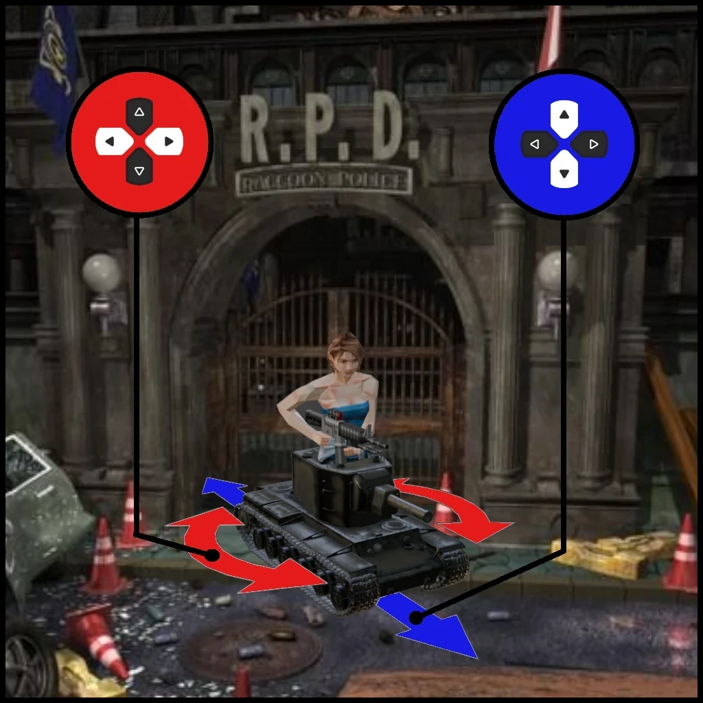

+++
author = 'Turbo Tartine'
date = '2024-11-15T06:26:08+01:00'
draft = false
title = 'Ode à la caméra fixe et aux contrôles du tank'
description = 'Article dans lequel je parle de caméras fixes'
+++

## Préembule
Je travaille actuellement sur **OpenRE (Open Retro Engine)** : une technologie permettant de créer des jeux vidéo en caméra fixe avec des arrière-plans précalculés. Si vous êtes déjà curieux, vous trouverez plus d'information sur [cette page](/projects/open_re). Vous pourrez également suivre son avancement à travers les devlogs que je publie régulièrement.

Mais il est plus probable que vous vous demandiez : *"Pourquoi investir du temps et de l'énergie dans cette technique du passé ?"*, *"Qu'a-t-on à y gagner ?"*, *"Est-ce que le monde en a vraiment besoin ?"*. Ou peut-être, que vous n’êtes pas familier avec ce genre vidéoludique un peu oublié et que vous souhaitez découvrir son potentiel.

Si vous vous retrouvez dans une de ces questions, ou si vous êtes simplement curieux de découvrir ce que j'ai à dire sur le sujet, cet article pourrait bien vous intéresser.

## Introduction : Sweet sweet 90's
Depuis toujours, j'éprouve une fascination certaine pour les jeux en **caméra fixe**. C'est avec des titres comme *Alone in the Dark*, *Final Fantasy* et bien sûr *Resident Evil* que j'ai grandi. Dire que ces licences ont **marqué mon enfance** serait un euphémisme. C'est une véritable passion qui m'a pris dans les années 90 et qui ne m'a plus quitté. Pour tout vous dire, j'ai même réinstallé *Resident Evil Rebirth* pas plus tard que la semaine dernière, alors que le remake de *Silent Hill 2* vient tout juste de sortir et que celui de *Dead Space* traîne dans ma "*To-Play list*" depuis près d'un an. Parfois, je culpabilise un peu de la manière dont je consacre le peu de temps de jeu dont je dispose maintenant que je suis un adulte responsable (Oui, bon... ça va... j'ai un chat, ça compte ?). Mes collègues ne manquent pas de me taquiner avec ça. Ils me traitent de "boomer" et me reprochent d'être un peu trop tourné vers le passé.

Peut-être qu'ils n'ont pas complètement tort, mais je pense que la réalité est un peu plus complexe. Si je suis **devenu un retro-gamer**, ce n'est pas parce que "le jeu vidéo c'était mieux avant !". C'est un médium extraordinaire, qui n’a rien à envier à d'autres formes d’art, qui ne cesse d'évoluer, se réinvente en permanence, et c'est une chose dont je me réjouis. Pourtant, ces "vieilleries" parviennent encore à capturer mon attention, devançant même des monuments acclamés par la critique que j’attendais depuis des mois. Si ces chefs-d'œuvre ont un tel pouvoir sur moi, c'est parce qu'ils ont **quelque chose d'unique**. Quelque chose qui me parle et que je n'arrive pas à retrouver dans les productions actuelles, si qualitatives soient-elles.

Il faut dire que cette famille de jeux n'a plus beaucoup d'héritiers aujourd'hui. À ma connaissance, le dernier représentant de sa lignée est *Resident Evil Zero*, sorti en 2002 sur GameCube. Et depuis, plus rien ou presque. C’est un peu comme si l’équivalent vidéoludique, d’un **point de vue narratif**, avait **cessé d’exister** comme ça, d’un coup. Hier, on avait des livres écrits à la première personne, et du jour au lendemain, pouf… on n’a plus que des narrateurs omniscients. En tant qu'amateur de ce style de jeux, je ne peux m'empêcher d'y voir une certaine **injustice**. Mais ça ne fait pas non plus de moi un "arriériste". Au contraire, ce que je regrette, en vérité, c'est que cette branche du médium, si prometteuse, n’ait **pas eu l’occasion d’évoluer** pleinement et de réaliser son potentiel.

Si vous avez tenu bon jusqu'ici, merci pour votre patience et votre curiosité. Et si vous êtes prêt à poursuivre, je vous propose d'explorer ensemble comment les caméras fixes sont apparues, pourquoi selon moi elles ont disparu, et pourquoi, à mon avis, on devrait continuer de faire des jeux avec.

## Part I : Casser des murs à grand coups de design !
Personne ne peut prétendre connaître tous les jeux vidéo sortis depuis la naissance du médium. Mais je vais quand même prendre le risque d’affirmer que la caméra fixe est **née en 1992** sur PC avec Alone in the Dark (et c’est un vrai risque, car si j’ai tort, ça fout en l’air la conclusion de cette partie). Ce qui est certain, en revanche, c’est qu’elle a connu son **âge d’or** sur la cinquième génération de consoles **(PS1/N64/Saturn)**, entre la fin des années 90 et le début des années 2000.

*Une authentique PS1 dans son habitat naturel*

Nous étions alors au début de l’ère de la 3D. Les machines, impressionnantes pour l’époque, se rapprocheraient d’un **grille-pain** connecté bas de gamme si on les jugeait avec nos standards actuels. Les GPU n’étaient pas programmables, la mémoire disponible ridicule… bref, les développeurs de cette époque étaient de véritables héros. Pour créer des jeux dignes de ce nom, ils devaient composer avec des **limitations matérielles** drastiques et adopter des stratégies d’optimisation parfois extrêmes.

#### Ce qui ne bouge pas, te rend plus fort
De nombreuses techniques d’optimisation dans le jeu vidéo reposent sur un postulat simple : la **majorité de la géométrie** à afficher est **statique**. Certes, il y a les personnages, les véhicules, et les effets de particules qui eux sont dynamiques. Mais la quantité de géométrie que cela représente est relativement faible face à ce qui est nécessaire pour modéliser l’environnement. Et cet environnement, lui, ne bouge pas.

Cette observation reste vraie aujourd’hui. De nombreuses **technologies modernes exploitent toujours ce principe**. On peut citer l'éclairage statique, les "distance fields" ou encore les reflection captures. Ces techniques consistent à *"baker"* (calculer à l’avance) ce qui ne bouge pas, afin de pouvoir réutiliser ces données plus tard, en temps réel et à moindre coût.

Cette philosophie d'optimisation a donc influencé de nombreuses approches, mais comme nous allons le voir, la **caméra fixe élève ça à un autre niveau**.

#### Plus haut ! plus fort ! plus fixe !
**Renoncer à la mobilité** du point de vue dans un jeu est un choix de design radical qui vient avec son lot de forces et de contraintes. On y reviendra. Cela dit, d’un point de vue purement technique, ce choix place les développeurs dans un cas particulier intéressant : les **pixels** de l’écran eux-mêmes **deviennent une donnée statique**.

Dans ces conditions, le **décor** peut être **rendu à l’avance** en CGI ("baké") sous forme d’une image 2D. Lors de l’exécution du jeu, il suffit d’afficher cette image en trompe-l’œil, sur laquelle viennent se superposer les éléments dynamiques rendus en temps réel. Résultat : l’environnement, qui monopolise habituellement la majeure partie des ressources, ne coûte plus que deux triangles et une texture. Le **gain en performance** est tout simplement stratosphérique.

*(1) environnement statique (rendu à l'avance avec Blender)*\
*(2) éléments dynamiques (rendu en temps réèl dans Godot)*\
*(3) Rendu finale (composé en temps réèl dans Godot avec [OpenRE](/projects/open_re))*

#### La cuillère n'existe pas !
Cet exemple illustre parfaitement comment une problématique technique en apparence insoluble peut être surmontée grâce à un **choix de design audacieux**. La logique finit toujours par atteindre ses limites, car elle est bâtie sur des normes (c'est pas moi qui le dit, c'est Morpheus dans Matrix. Donc c'est vrai !). La créativité, elle, n'est pas bornée, ce qui lui permet parfois de réussir quand le "gros cerveau" échoue.

Là où je veux en venir, c’est qu’une petite dose d’ouverture d’esprit et de pensée hors du cadre a permis de créer des mondes et de raconter des histoires d’une richesse et d’une sophistication inimaginables pour une PS1. Et on ne le doit pas à un programmeur de génie, mais à la **créativité d’un designer**. Même si, en l'occurrence, Frédérick Raynal, créateur de Alone in the Dark et de cette technique, est sans conteste les deux à la fois.

## Part II : Le Colosse aux chenilles d'argile
Si vous avez déjà eu entre les mains un jeu en caméra fixe, vous savez certainement ce que sont les tank-controls. Dans le cas contraire, une petite explication s’impose. Il s’agit d’une modalité d’inputs où vous **contrôlez l’avatar dans son référentiel** plutôt que dans le vôtre. L'axe vertical le déplace d'avant en arrière tandis que l'axe horizontal permet de le faire pivoter sur lui-même.

Ce schéma de contrôle est **impopulaire** car il nécessite un petit temps d’adaptation. Il est fortement lié à la caméra fixe, car c’est le seul à ce jour qui permet de s’abstraire complètement des problématiques liées aux changements de référentiels soudains et répétés, inhérents au genre. Vous avez peut-être déjà une intuition de pourquoi, mais essayons de décortiquer un peu mieux le problème.

#### Le problème sous tous les angles
Si les **caméras regardent dans le même sens**, le problème est moindre. Dans ce cas, les changements de référentiels sont des translations, et la translation **conserve les directions**. L’orientation de l’avatar reste stable d’un écran à l’autre. Cela permet d’implémenter un schéma de contrôles " naïf ", où les mouvements de l’avatar suivent directement ceux du joystick.

*Conservation de l'orientation dans le cas de caméras alignées (Environnement : DGU de FF8, Personnage incrusté : Jill de RE3)*

Mais en pratique, il sera difficile de respecter cette contrainte. La spécialité des caméras fixes est de permettre des environnements très détaillés. Si l’agencement de l’espace ne reflète pas ce niveau de détail, on **intègre vite une dissonance** : " Il est bizarre ton manoir ! Pourquoi les pièces sont toutes les unes à la suite des autres ? "

Et même si l’on acceptait cette dissonance, on se priverait de toute la puissance artistique des caméras fixes (que de teasing ! On en reparlera aussi).

On va donc devoir faire **varier les angles**, et c’est là que ça se complique. Si on fait ça, les directions ne sont plus conservées. **L’orientation de l’avatar diffère** d’un écran à l’autre.

*Décalage de l'orientation dans le cas de caméras non alignées (Environnement : BGU de FF8, Personnage incrusté : Jill de RE3)*

Si on ne fait rien, le joueur devra adapter sa trajectoire à chaque transition de caméra. À moins d’être un ninja, cela se traduira par une **imprécision** significative dans ses déplacements. Pas pratique quand le gameplay exige d’esquiver des zombies dans des couloirs ! De plus, les changements de caméra étant fréquents, même avec de bons réflexes, ajuster sa direction toutes les cinq secondes peut **briser l’immersion**.

Les tank-controls s’imposent alors comme une solution nécessaire. Passée une petite phase d’apprentissage, ils remplissent parfaitement leur rôle. Mais cet investissement imposé au joueur n’était déjà pas du goût de tout le monde à l’époque. Et aujourd’hui, c’est encore pire.

#### Y a-t-il un designer pour sauver la caméra fixe ?
Nous vivons une époque où **les bibliothèques débordent**. Aujourd'hui, pour un jeu, être installé est déjà un exploit. Et une fois lancé, il dispose d’une quinzaine de minutes pour nous convaincre qu’il ne mérite pas une expulsion sommaire de notre disque dur. Les plus salés d’entre nous agrémenteront même cette sentence d’un *refund* et d’une *bad review* pour faire bonne mesure. Dans ce contexte, **demander au joueur de s’investir** dans quelque chose d’habituellement aussi gratuit que le schéma de contrôle, c’est **rédhibitoire**.

Pour mitiger cela, certains titres plus récents proposent des contrôles dits "modernes". Ils ont le mérite d'exister. Une **option de jouabilité alternative** est toujours la bienvenue. Et si cela suffisait à ramener la caméra fixe sur le devant de la scène, j'applaudirais même des deux mains. Mais ce n’est pas le cas, et pour cause : il s'agit en réalité du schéma de **contrôle "naïf" décrit plus haut** et qui consiste à laisser le joueur se battre avec les changements de plans (... avec un petit sourire en coin parce qu’on est un game designer sadique).

Si vous découvrez le genre aujourd’hui, ces contrôles "naïfs" sembleront séduisants. Mais donnez quand même une chance aux **tank-controls**. Après une demi-heure, vous réaliserez que **c’est comme le vélo** : pas si difficile, et une fois appris, ça ne s’oublie pas. Malheureusement, la plupart des gens n'iront plus jusque-là. Non pas parce que les nouvelles générations sont un ramassis de fainéants (comme aiment le croire les vieux réacs), mais parce que la compétition pour notre attention et notre temps libre, aujourd'hui, est bien plus féroce que par le passé. Et **malheureusement**, il n'y a pas grand-chose à y faire. Si le public trouve que ça ne vaut plus son temps, **ça ne vaut plus son temps**.

La tragédie, c’est que les années 90 ne reviendront pas. Et **sans solution** de contrôle viable pour s’adapter aux attentes modernes, les **caméras fixes ne reviendront pas** non plus. Tout cela à cause d’un détail, minuscule en apparence, mais essentiel dans la pratique. Après avoir passé des heures à tourner le problème dans tous les sens, je dois admettre que je ne suis pas capable de trouver cette solution.

Si cette problématique vous intrigue, **n’hésitez pas à explorer ce sujet** et à partager vos idées. Qui sait, peut-être que votre créativité permettra d'offrir au genre le second souffle qu'il mérite ?

## Part III : Un joyaux oublié
Les caméras fixes, souvent perçues comme un vestige du passé, offriraient pourtant des **avantages techniques et artistiques** incomparables, même aujourd'hui. Elles transcendent les limitations matérielles et constituent une manière unique de raconter des histoires dans un jeu vidéo.

#### La puissance à l'état brut
Le premier avantage est technique, et on l’a déjà évoqué : les caméras fixes permettent de s’affranchir des limitations matérielles pour tout ce qui est statique. En utilisant des arrière-plans précalculés, les level artists disposent d’un **budget illimité en triangles, lumières et textures** pour créer des environnements d'un niveau de détail exceptionnel.

Dans le même temps, ce procédé permet de libérer des ressources pour tout ce qui est dynamique : personnages, effets visuels ou animations en temps réel. En conséquence, les jeux en caméra fixe offrent souvent des **visuels bien en avance sur leur époque**. Prenons un instant pour illustrer ce point.

En **2001**, le jeu vidéo, c'était ça :

*De gauche à droite et de haut en bas : Max Payne, Jak and Daxter, GTA3, Grand Turismo 3, Halo: Combat Evolved et Final Fantasy X*

La **même année**, *Resident Evil Rebirth* sortait sur GameCube. Et ça ressemblait à ça :

Ce jeu, vieux de 23 ans, tournait sur une console bien moins puissante que le smartphone sur lequel vous lisez peut-être cet article. Et pourtant, il **reste crédible aujourd’hui**, surpassant même visuellement une grande partie des innombrables jeux publiés chaque jour sur Steam. Maintenant, imaginez ce qu'un AAA moderne pourrait accomplir avec cette technique sur du hardware actuel. Les **perspectives sont vertigineuses !**

Mais, aussi impressionnant que cela puisse être, ce n’est pas la plus grande force des caméras fixes. Leur véritable atout réside dans le contrôle artistique qu’elles offrent aux créateurs.

#### Tailler des experiences uniques
En retirant au joueur la possibilité de manipuler la caméra, on transfère directement ce pouvoir au créateur. Chaque plan devient alors une véritable composition artistique, pensée avec la précision d'un réalisateur de films. La **grammaire cinématographique peut être exploitée** pour guider l’attention, susciter des émotions, ou installer une ambiance. Ce contrôle permet de décider ce que le joueur voit (ou ne voit pas), comment il le voit, et dans quel ordre. Le tout **sans confisquer l'interactivité**.

Les jeux vidéo se sont toujours inspirés du cinéma, et ce, depuis avant même que l'on fasse de la 3D. On pense naturellement aux cinématiques de ***Metal Gear***, aux QTE de ***Resident Evil 4***, ou plus récemment  au *reboot* de ***God of War***.  Pourtant, aucun de ces jeux ne réalise ce qu'une simple caméra fixe permet : fusionner gameplay et mise en scène dans une expérience homogène et continue. Ces chefs-d'œuvre ont marqué le médium et sont excellents dans ce qu'ils font. Mais ils **ne font qu'alterner entre gameplay et cinématiques**. Les transitions sont parfois subtiles, mais il s’agit toujours d’un ballet entre ces deux formes d’expression. Et même le plan-séquence magistral qu'est *God of War* ne fait que flouter (admirablement bien) la limite. Mais on a bien des séquences de gameplay classiques, et des cinématiques/QTE++ spectaculaires dans lesquelles on peut se battre à main nue contre un dragon en plein ciel.

À l’inverse, la **caméra fixe** établit un contrat tacite qui vaut pour chaque seconde de l'expérience. "Toi, joueur, tu contrôles ton personnage. Moi, réalisateur, je garde les pleins pouvoirs sur la mise en scène et l’ambiance." Cette approche unique **crée une synergie incomparable**, qui me manque énormément et qui, selon moi, pourrait encore offrir au médium des **expériences de qualité** et d'une **grande profondeur**.

## Conclusion : Mon caillou à l'édifice 
La **caméra fixe** est donc une approche unique, capable de fusionner narration et interactivité pour créer des expériences tout aussi uniques, et d'un qualité visuelle impressionnante. Faute d'un schéma de contrôle satisfaisant, elle n'est **presque plus utilisée** au sein des grosses productions. Elle continue malgré tout de vivre sur la scène indépendante, à travers des titres comme *Alisa* ou *Tormented Souls*. J'ai de l'admiration et de la reconnaissance envers les gens qui ont réalisé ces jeux. Ce sont des projets qui m’inspirent et me donnent **envie de contribuer** à mon tour.

Je ne suis pas sûr d'être capable de réaliser un jeu de cette trempe un jour, mais je compte bien essayer. Pour l'instant cela dit, je préfère me focaliser sur la technique et créer des outils pour permettre à d'autres de réaliser leur vision. C’est la raison d'être d'**OpenRE** : simplifier le développement de jeux en caméra fixe et explorer ce que cette technique peut offrir aujourd'hui. 

À ce stade, OpenRE n'en est qu'à ses balbutiements. Mais le moment venu, le projet sera distribué dans un format **libre et open-source** pour que chacun puisse l'utiliser, perpétuer cet art, et peut-être même réinventer le genre. Je n'ai évidemment pas la prétention de révolutionner le jeu vidéo avec ce projet. Je souhaite simplement contribuer à **faire vivre ce genre vidéoludique** que j'aime tant, et à lui rendre hommage. Si cette technologie inspire des gens et leur donne envie de créer des jeux, le projet aura dépassé ses objectifs. Dans le cas contraire, je me serais quand même bien amusé à le développer.

