+++
author = 'Turbo Tartine'
date = '2024-11-18T06:28:42+01:00'
draft = false
title = 'OpenRE (Open Retro Engine)'
description = 'Page de presentation du projet OpenRE'
+++
## Introduction
Lorsque j'ai cherché à développer mon propre jeu en caméra fixe, j’ai rapidement réalisé une chose : les outils et ressources disponibles sur le sujet sont rares. Certes, on trouve quelques tutoriels pour gérer les caméras ou implémenter les déplacements du joueur. Mais je n'ai pas trouvé de réponse à la question qui m'intéresse réellement : *"Comment intégrer des éléments interactifs dans des décors précalculés ?"*

J'ai donc commencé à bricoler de mon côté pour trouver une solution à ce problème et je pense avoir un début de réponse :


Bon, je sais, cette scène n'a aucun sens. Mais soyez indulgents, j'ai dit que c'était un début. Et puis, je trouve ces T-poses magnifiques (pas vous ?). Plus sérieusement, ce qui est important dans cette vidéo, c'est que les seuls modèles 3D rendus en temps réel sont les personnages. Tout le reste — plancher, murs, plafond, mobilier, props en tout genre — est en réalité une image précalculée.

Si j'écris cet article aujourd'hui, c'est parce que je trouve ces résultats plutôt encourageants. J'ai donc naturellement envie de les partager et d'expliquer un peu comment ça fonctionne. Mais, partant du constat que rien de semblable n'a l'air d'exister, j'ai décidé d'aller un peu plus loin. Plutôt que d'utiliser cette technologie directement dans mon jeu, je compte la développer à part et la rendre accessible sous licence open-source. Elle a donc besoin d'un nom, et ce nom sera OpenRE pour *Open Retro Engine*.

Nous ne sommes qu'au tout début du projet. Il y a encore beaucoup de zones d'ombre, et beaucoup de choses sont susceptibles de changer d'ici la première version utilisable. Ne prenez donc pas ce qui suit comme des promesses, mais plutôt comme le point de départ d'une idée qui va progressivement se définir et se stabiliser. Je posterai régulièrement des devlogs pour partager mes avancées, mes échecs (parce qu’il y en aura !), et les éventuels changements de direction. Si vous aimez suivre les projets en coulisses, j’espère que cette aventure vous passionnera autant que moi !

## Part I : Environnement technique
OpenRE repose sur deux outils que vous connaissez sûrement :
- **Blender** : pour créer les arrière-plans précalculés.
- **Godot** : pour gérer les éléments interactifs et assembler le tout.

La maturité et la popularité de ces deux logiciels en font des choix solides. Ils sont aussi open-source, ce qui s'aligne parfaitement avec la philosophie d'OpenRE : promouvoir une technologie accessible et ouverte à tous. L’open-source offre également une certaine sécurité qu'il est impossible d'avoir avec des solutions propriétaires. En effet, comme le rappellent certains événements récents, placer son capital technologique entre les mains d'une entreprise à but lucratif n'est pas sans risques.

Sur le plan pratique, Blender et Godot se complètent très bien. Godot prend en charge nativement les scènes créées dans Blender, ce qui simplifie la synchronisation entre les deux environnements. Cette compatibilité devrait nous aider à limiter les manipulations fastidieuses et sources d'erreur.

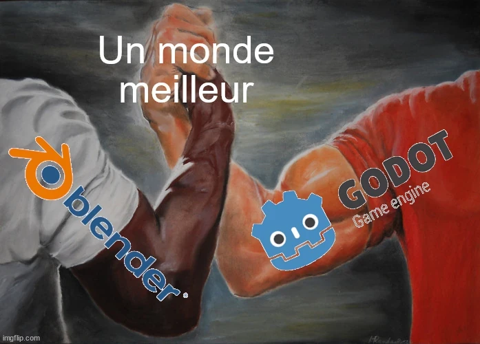

Côté scripting, j’ai choisi de bousculer mes habitudes en optant pour GDScript plutôt que C#. Pourquoi ce choix ? Tout simplement parce que GDScript est supporté par toutes les versions de Godot, contrairement à C#, qui nécessite la version .NET. Cette flexibilité permettra à OpenRE de rester accessible au plus grand nombre. Et ce sera l’occasion pour moi d'apprendre un nouveau langage.

Si, comme moi, vous préférez le C#, soyez rassurés ! Vous n'aurez besoin de GDScript que si vous souhaitez modifier le plugin OpenRE lui-même. Pour développer votre jeu, vous pourrez utiliser le langage de votre choix.

## Part II : Principe général
OpenRE repose sur une séparation du monde en deux parties bien distinctes. Et par "bien distinctes", j’entends que chacune d'elles nécessitera un logiciel dédié.

#### Le monde déterministe (Blender) :
Le monde *déterministe* est créé dans Blender. C'est de lui que seront tirés les arrière-plans précalculés. On pourrait, de manière un peu réductrice, dire qu’il représente la partie *statique* de la scène. Je préfère éviter ce terme, car il est déjà utilisé par les moteurs de jeu, ce qui prête à confusion. De plus, il n'est pas tout à fait exact en l'occurrence.

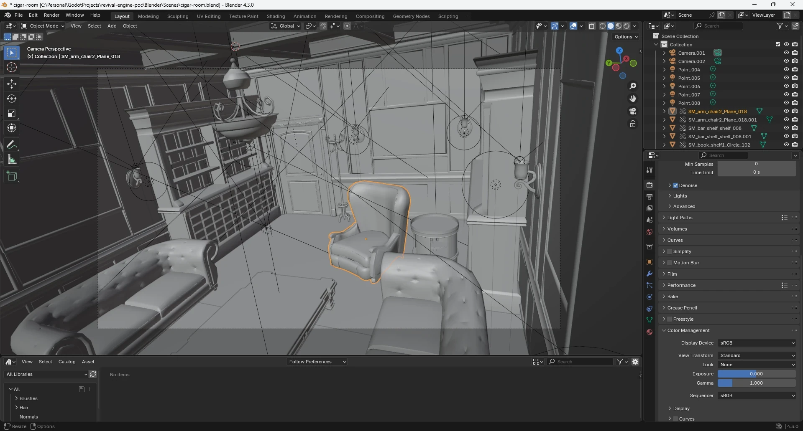

En effet, c'est totalement hors scope pour une V1. Mais il se pourrait qu'un jour, OpenRE supporte des arrière-plans animés. On pourrait alors imaginer des petites boucles dans lesquelles le vent agite des rideaux ou de la végétation. Ou encore des voitures qui circulent dans les rues la nuit, illuminant les alentours à chaque passage. Parler d'éléments "statiques" dans ce contexte serait tout simplement incorrect.

Pour l'heure, le terme *déterministe* désigne effectivement ce que l'on qualifie de "statique" dans un moteur de jeu (architectures, meubles, objets inanimés, etc.). Mais cela pourrait englober bien plus dans le futur. La seule limite réellement infranchissable, c'est que ce monde ne pourra jamais dépendre des actions du joueur ou d'éléments de gameplay aléatoires. Car, bien entendu, au moment de générer les arrière-plans, ces événements ne sont pas encore connus.

#### Le monde interactif (Godot) :
De son côté, le monde interactif est implémenté dans Godot. Il comprend tout ce qui relève du gameplay : personnages, véhicules contrôlables, objets manipulables, etc. Là encore, j’évite de le qualifier de *dynamique* pour éviter la confusion avec la terminologie des moteurs de jeu.

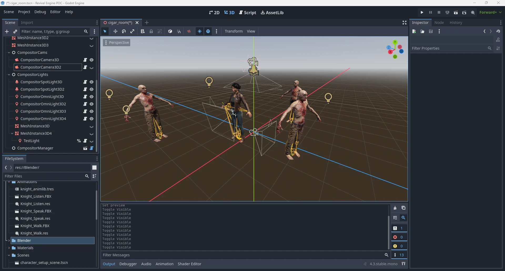

En pratique, ce monde sera relativement vide comparé au monde déterministe. En effet, dans la plupart des jeux, les éléments interactifs représentent une quantité de géométrie beaucoup moins importante que les environnements. Cela signifie que, dans le cas général, les ressources graphiques sont majoritairement consommées par le monde déterministe.

OpenRE s'abstrait en grande partie de cette charge de calcul en précalculant la partie déterministe dans Blender (c'est là tout le principe). Cela devrait libérer pas mal de ressources pour la partie interactive. Théoriquement, nous pourrons donc être plus généreux en détails, lumières et effets visuels.

#### La fusion des mondes :
Nous avons donc un monde déterministe et un monde interactif qui vivent dans leur environnement respectif. Il est temps de les faire cohabiter. Pour cela, chaque point de vue du jeu est matérialisé par un duo de caméras :
- une caméra déterministe, dans Blender
- une caméra interactive dans Godot

Ces deux caméras doivent évidemment être parfaitement alignées pour que l'illusion fonctionne. On prendra donc soin de synchroniser leurs positions, orientations, FOV, résolutions, etc.

Pour chacun de ces couples, il faudra ensuite :
1. Effectuer un rendu depuis la caméra déterministe pour produire l'arrière-plan dans Blender.
2. Exporter l'arrière-plan sous forme d'images.
3. Importer l'arrière-plan dans Godot et l'associer à la caméra interactive correspondante.

Notez que le « s » à "images" n'est pas une faute de frappe. Nous n'exporterons pas directement le rendu final en un seul bloc. En effet, ce dernier sera décomposé en une série d'images représentant chacune des données spécifiques : profondeur, normales, couleur, etc. Sous cette forme, il sera possible de composer l'arrière-plan avec ce que la caméra filme en temps réel. Sans intervention supplémentaire de la part de l'utilisateur, les deux mondes seront alors fusionnés de manière quasi-indiscernable : ils s'occulteront l'un l'autre naturellement et leur éclairage sera uniforme et cohérent.

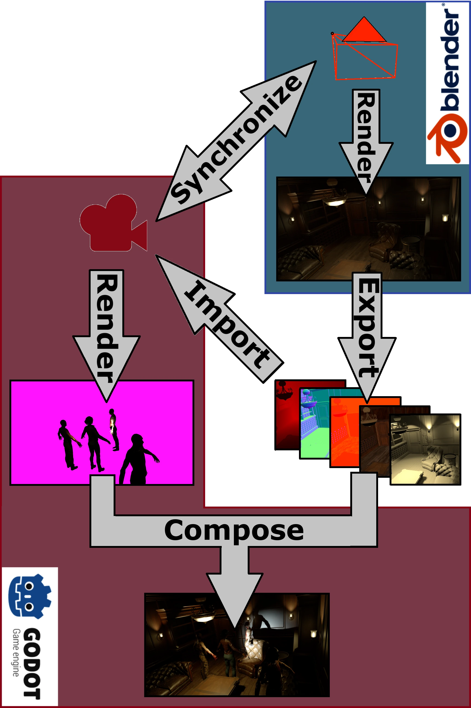

Évidemment, il serait trop fastidieux d'effectuer toutes ces étapes à la main pour tout point de vue à chaque fois qu'on bouge un fauteil ou qu'on change la couleur du tapis. Pour que la technologie soit exploitable, OpenRE devra être capable d'automatiser tout cela.

#### Limitations :
L'implémentation actuelle présente malheureusement des limitations assez lourdes. En effet, je bypass presque complètement le système de rendu de Godot en m'appuyant sur un post-process custom pour incorporer l'arrière-plan et rendre les lumières. Cela signifie qu'en l'état, les fonctionnalités graphiques natives ne sont pas utilisables. Tout doit être réimplémenté dans le shader du post-process. En conséquence, le monde interactif ne bénéficie pour l'instant que de :
- 8 points lights basiques (couleur, intensité)
- 8 spot lights basiques (couleur, intensité, angle)
- 4 ombres dynamiques (appliquables sur les spot lights uniquement)
- 1 unique material PBR opaque

C'est bien entendu trop peu pour faire un jeu complet. Mais le combat continue ! J'ai notamment l'intention d'ajouter :
- 1 directional light basique (couleur, intensité)
- La compatibilité des ombres dynamiques avec tous les types de lumière
- Un support des particules natives de Godot (je ne sais pas exactement comment je vais m'y prendre, mais je vois mal comment on pourrait s'en passer)
- Une solution pour implémenter des reflets et de la transparence (encore plus flou à l'heure actuelle, mais ce serait bien d'avoir un support au moins partiel de ces effets)

## Part III : Détails Techniques
Maintenant, nous allons mettre les mains dans le cambouis ! Si vous aimez les détails techniques, cette partie est faite pour vous. Mais sachez qu'elle est optionnelle. Elle s'adresse à ceux qui souhaitent comprendre un peu mieux ce qui se passe sous le capot. Si vous abordez OpenRE d'un point de vue utilisateur, ce n'est peut-être pas votre cas. J'ai essayé de la rendre la plus abordable possible, mais n'hésitez pas à passer directement à la partie IV si vous ne trouvez pas ça intéressant.

#### Un Deferred (presque) comme les autres
Pour fusionner les mondes, OpenRE reprend le principe du deferred rendering. Cette technique consiste à séparer le rendu en deux passes :
- **1. Geometry pass :** cette première étape vise à produire une collection de textures qu'on appelle le G-Buffer (Geometry Buffer). Ces textures encodent dans leurs canaux RGB des données décrivant les propriétés géométriques de la scène en *screen space* (position, normal, couleur, etc.).
- **2. Deferred shading pass :** pour obtenir l'image finale, il suffit alors d'accumuler les contributions lumineuses de la scène sur chaque pixel. Ce qui n'est pas très compliqué puisque le G-Buffer nous fournit toutes les données nécessaires au calcul en chaque point de l'écran.

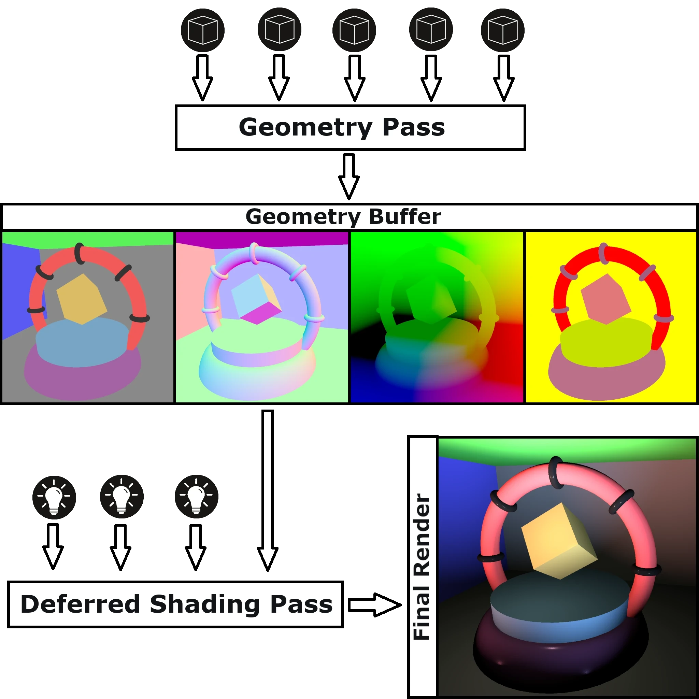

Comme évoqué dans la partie précédente, OpenRE sépare la scène en deux parties distinctes. Pour rendre une frame, on aura donc besoin d'un G-Buffer pour chacune de ces parties :
- Le G-Buffer interactif sera construit à la volée dans Godot.
- Le G-Buffer déterministe aura été précalculé par Blender (la série d'images exportées, vous vous rappelez ?).

Les deux seront ensuite fournis au fameux post-process custom qui les composera et leur appliquera une passe de deferred shading classique (ou presque …) pour rendre les lumières.

#### DG-Buffer : le G-Buffer du monde déterministe
Blender dispose de deux moteurs de rendu :
- **Eevee** : basé sur la rasterization. Permet un rendu quasi temps réel mais moins réaliste.
- **Cycles** : basé sur le path-tracing. Il produit des images photoréalistes, mais le rendu prend un certain temps.

Pour OpenRE, nous utiliserons bien sûr Cycles, afin de garantir une qualité visuelle maximale. Grâce au compositeur de Blender, le rendu pourra être décomposé en plusieurs textures qui constitueront notre DG-Buffer :

| Map | Description                                                                                                                                                   | Image |
|:--------------------------------:|:--------------------------------------------------------------------------------------------------------------------------------------------------------------|:-----------------------------------:|
| **Depth**                      | Encode la profondeur de chaque pixel. Permet d'assurer une occlusion correcte entre les mondes. La position du pixel dans le monde pourra être déduite de cette donnée et de la position de la caméra. On en aura besoin pour calculer la lumière temps réel. | 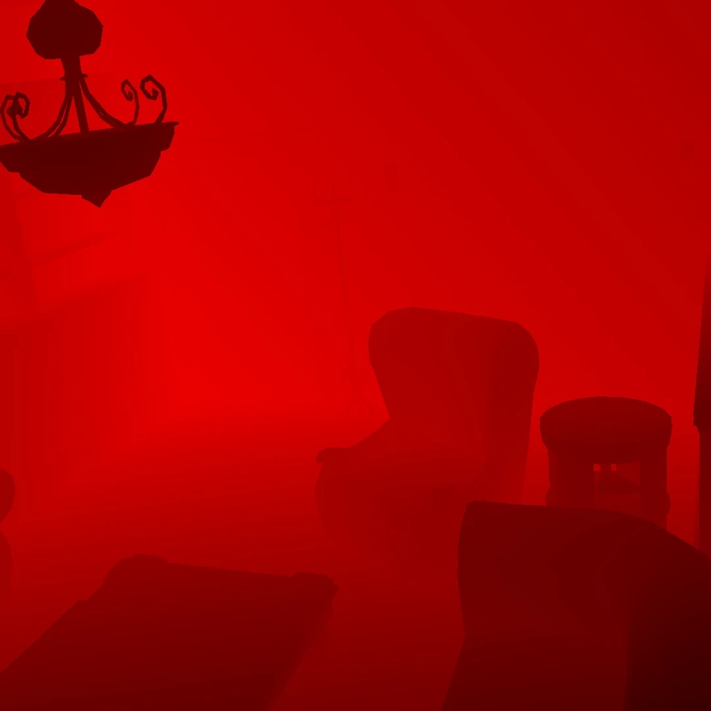 |
| **Normal**                     | Décrit l'orientation des surfaces. Cette donnée interviendra également dans le calcul de l'éclairage temps réel.                                             | 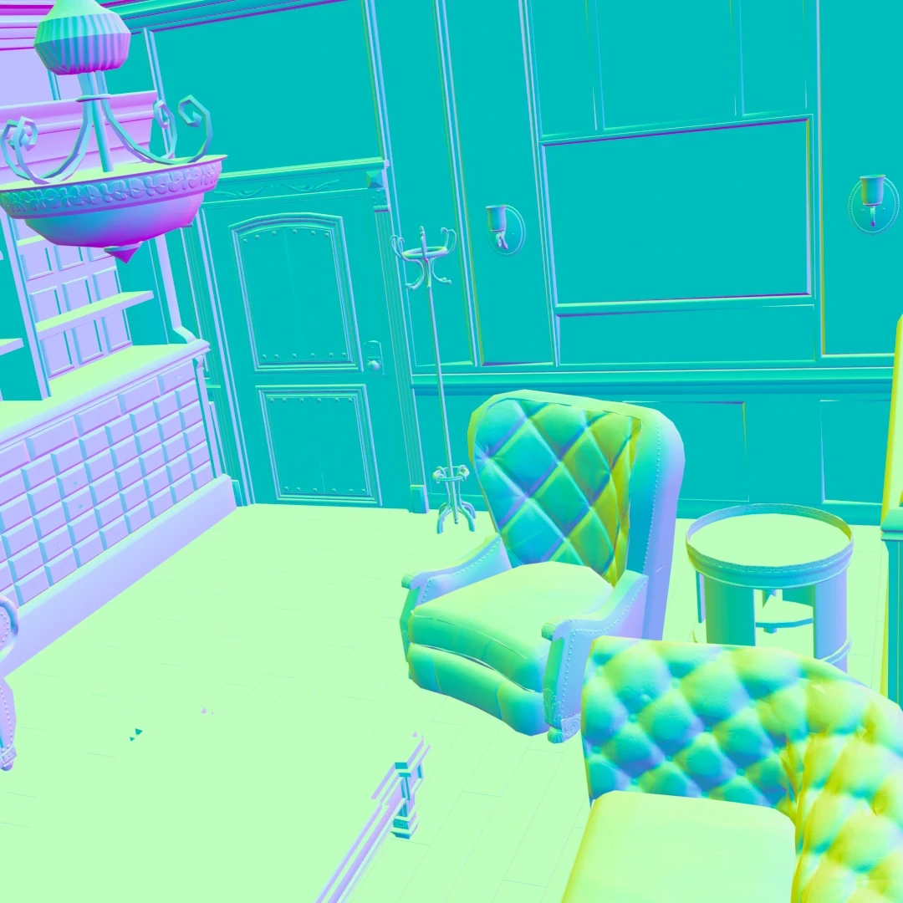 |
| **ORM**                        | Regroupe des données additionnelles nécessaires au rendu PBR (Ambient Occlusion, Roughness, Metalness).                                                         | 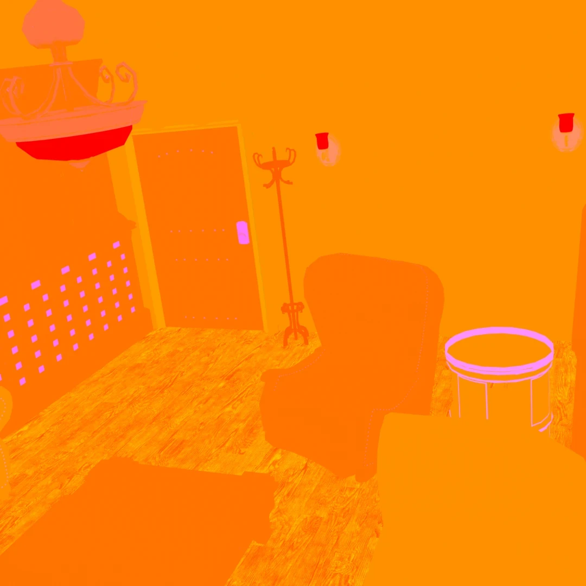 |
| **Diverses maps d'illumination** | Informations relatives à la lumière précalculée.                                                                                                              | 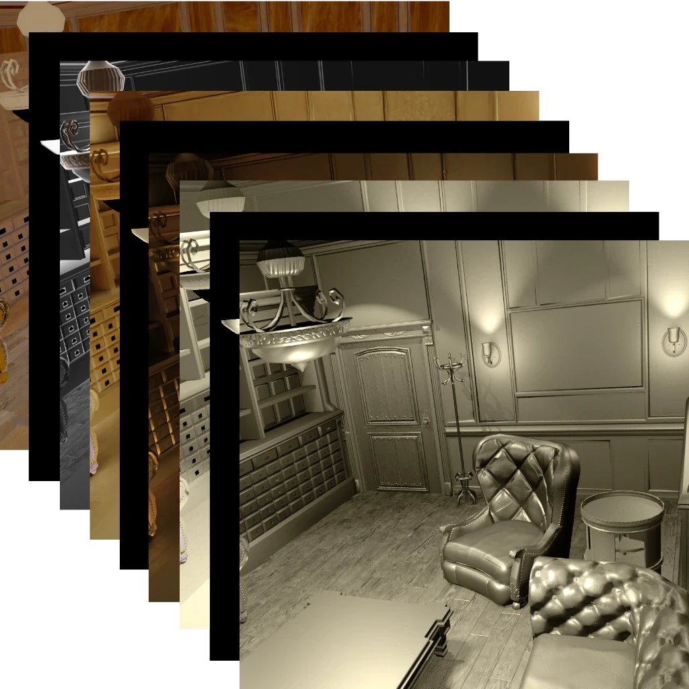 |

Si vous mangez du G-Buffer tous les matins au p'tit dej', vous vous demandez peut-être où est passée la map d'albedo ? Ou à quoi correspondent ces fameuses *diverses maps d'illumination* ? Il faut savoir que le modèle de Cycles est plus complexe que ce à quoi le temps réel nous a habitués. La lumière précalculée par path-tracing se compose de neuf maps d'illumination différentes. En réalité, l’une de ces maps correspond à l’albedo (un mot compliqué pour dire "la couleur d'une surface"). Mais pour recomposer l’image finale, nous aurons besoin des neuf.

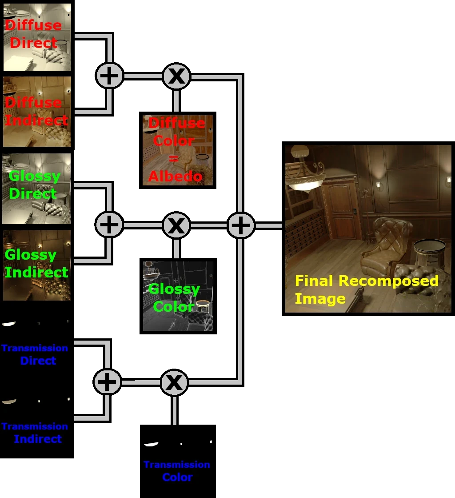

On pourrait se contenter de n'intégrer que l'albedo au DG-Buffer. Mais il faudrait alors recalculer tout l'éclairage en temps réel côté Godot, ce qui n'est pas toujours nécessaire. Les neuf maps sont donc exportées pour permettre une recomposition directe de certaines parties de l'image. De cette manière, on conserve la qualité visuelle de Cycles sur ces zones, et on économise (beaucoup) de temps de calcul.

#### IG-Buffer : le G-Buffer du monde interactif
Si Godot implémentait un deferred renderer, on pourrait piocher les maps qui nous intéressent directement dans son G-Buffer. Mais malheureusement pour nous, le renderer officiel de Godot est un forward. Il n'y a donc pas de G-Buffer.

Il va falloir bricoler le nôtre et, pour cela, on va utiliser des render targets. Si vous n'êtes pas familier avec le terme, c'est un système qui permet d'effectuer un rendu de la scène depuis une caméra, mais dans une texture plutôt qu'à l'écran directement. L'avantage, c'est qu'on va pouvoir appliquer du post-process à cette texture et ainsi prendre la main sur la façon dont elle est rendue.

Pour construire notre IG-Buffer, on va donc créer une render target pour chacune des textures qui le composent. Et pour chacune de ces render targets, on écrira un post-process dédié qui sera chargé de rendre spécifiquement la donnée qui nous intéresse.

Cela peut paraître un peu fastidieux, mais finalement pas tant que ça. En effet, je suis un peu malhonnête quand j'affirme que Godot n'a pas de G-Buffer dans lequel récupérer les informations. En réalité, le moteur expose nativement à ses shaders des textures contenant des données très proches de ce qu'on veut. La plupart du temps, le post-process tiendra en une ligne et se contentera de sampler l'une de ces textures.

| Map | Description                                                                                                                                                                                                                                 | Image |
|:--------------------------------:|:----------------------------------------------------------------------------------------------------------------------------------------------------------------------------------------------------------------------------------------------|:-----------------------------------:|
| **Depth**                      | On utilise la *depth_texture* fournie par Godot. Elle n'est pas rouge comme dans le DG-Buffer, car la valeur est dupliquée dans les 3 canaux. Par contre, elle n'a pas l'air encodée de la même façon : le clair est proche et le sombre éloigné. Là, c'est déjà plus gênant, et on verra dans un devlog dédié que c'est en réalité encore pire. | 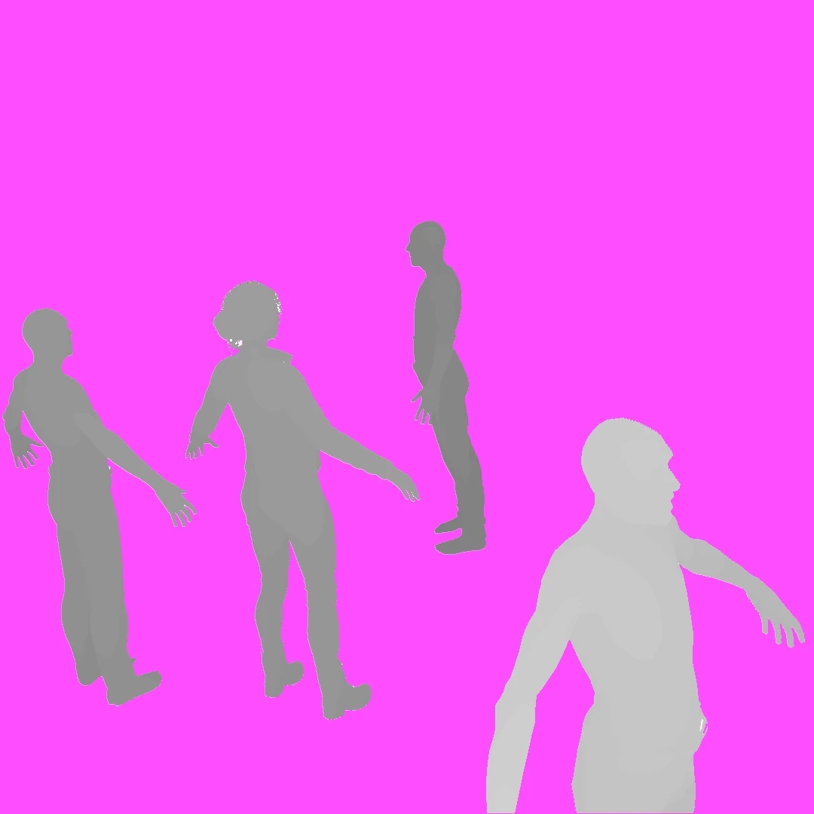 |
| **Normal**                     | Ici, c'est la *normal_roughness_texture* qu'on utilise (en ignorant simplement la roughness). Là encore, l'encodage est différent. On y reviendra aussi dans un devlog, mais c'est moins complexe que pour la depth.                                                         | 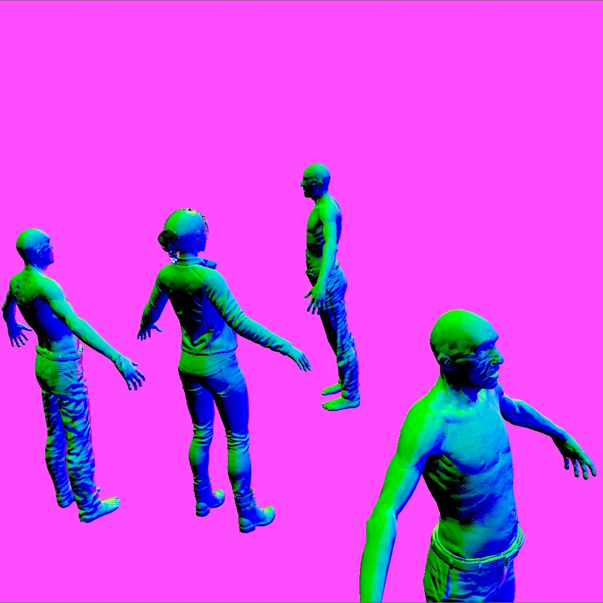 |
| **ORM**                        | Pour celle-ci, Godot ne nous fournit pas ce qu'il faut. Un focus sur le bricolage associé aura lui aussi son devlog.                                                                                                                        | 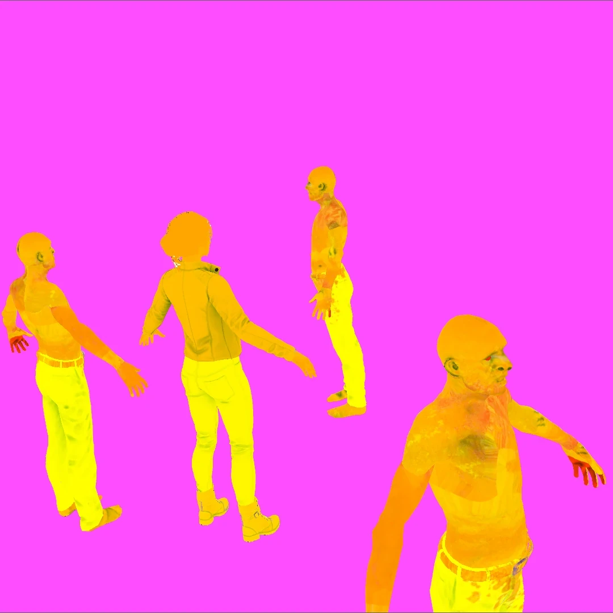 |
| **Albedo**                     | Celle-là, c'est la plus facile. On affiche directement la *screen_texture* de Godot.                                                                                                                                                         | 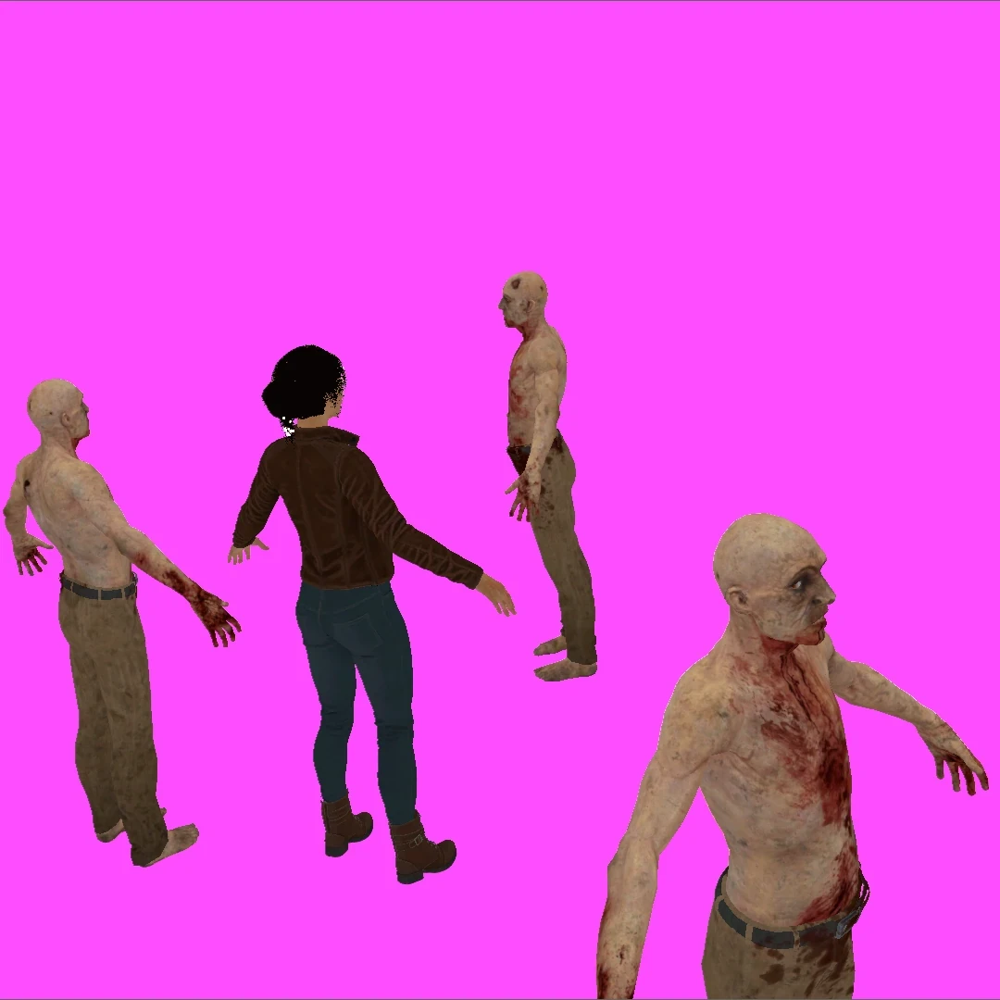 |

#### Calcul de l'éclairage
Maintenant que nous disposons de nos G-Buffers, il n'y a plus qu'à calculer la lumière en post-process grâce à une passe de deferred shading. Mais la dualité du monde introduit quelques complications.

##### 1. Choix du G-Buffer :
Une première question évidente se pose : "Dans quel G-Buffer récupérer les données ?" C'est en réalité assez simple. La comparaison des Depth Maps nous permet de savoir quel monde occlude l'autre pour chaque pixel de l'écran. Il suffit donc de choisir le G-Buffer du monde qui est visible à la coordonnée du pixel considéré.

 

<video width="100%" controls muted loop playsinline autoplay>
    <source src="videos/cigar_room_loop_worlds_occlusion_debug_with_ref.mp4" type="video/mp4">
    Your browser does not support the video tag.  
</video>



***IG_Buffer.depth > DG_Buffer.depth ⇒ Pixel Déterministe***  
***IG_Buffer.depth < DG_Buffer.depth ⇒ Pixel Interactif***

##### 2. Différents modes de calcul de la lumière :
Le second point est un peu plus subtil. Je ne l'ai pas précisé jusqu'ici, mais les sources de lumière aussi peuvent être déterministes (lampadaires, feux de cheminée, soleil…) ou interactives (lampe torche, flash d'un tir, phares de voiture). Cela a deux conséquences :
- **1.** Les lumières déterministes présentes dans Blender devront être répliquées dans Godot. Sans cela, elles ne pourront pas éclairer les éléments interactifs.
- **2.** Le calcul de la contribution d'une lumière donnée sur un pixel varie selon le monde auquel chacun appartient. Voici un tableau récapitulatif des différentes combinaisons :

|                         | Pixel Déterministe                                                                                     | Pixel Interactif                                  |
|-------------------------|:------------------------------------------------------------------------------------------------------:|:-------------------------------------------------:|
| **Lumière Déterministe** | Recomposition des maps de Cycles (Précalculée)                      | Deferred Shading (Temps Réel) |
| **Lumière Interactive**  | Recomposition des maps de Cycles (Précalculée)   + Deferred Shading (Temps Réel) | Deferred Shading (Temps Réel) |

 

<video width="100%" controls muted loop playsinline autoplay>
    <source src="videos/cigar_room_loop_light_modes_debug_with_ref.mp4" type="video/mp4">
    Your browser does not support the video tag.  
</video>



*Ces vidéos décrivent le mode de calcul utilisé sur chaque pixel. Celle du haut correspond à la lumière émise par le lustre au-dessus de la table (source déterministe). Celle du bas correspond à la "lampe torche" de la femme au centre (source interactive). Les couleurs correspondent aux combinaisons décrites dans le tableau ci-dessus.*

## Part IV : Phases de développement

#### Proof of Concept (POC)
Le but de cette première étape est de débroussailler le terrain pour me faire une première idée du potentiel d'OpenRE. J'ai déjà pas mal avancé là-dessus : les images de la scène d'exemple que vous pouvez voir dans cet article sont issues de ce POC. Mon objectif ici n'est pas l'optimisation ou l'élégance du code. Je cherche simplement à identifier les verrous techniques et à m'assurer qu'il est possible de les faire sauter (à grand coup de débrouille et d'improvisation, la plupart du temps).

Lorsque j'aurai une vision suffisamment claire du projet et que j'aurai levé les doutes quant à sa faisabilité, ce code sera mis au placard et je repartirai d'une feuille blanche. Ce n’est qu’à ce moment-là que je me préoccuperai de la qualité, de la performance et de l’ergonomie.

Le dépôt de ce POC n'est malheureusement pas public. De toute façon, la codebase est affreuse. Je vous assure, vous n'avez pas envie de mettre le nez dedans. Mais ce n'est pas la raison principale. En réalité, pour juger les capacités de rendu d'OpenRE, j'ai besoin d'assets de qualité et cohérents entre eux. Trouver de tels assets libres de droits et dans un délai raisonnable serait un vrai casse-tête. J'utilise donc des ressources déjà en ma possession (achetées ou gratuites) et je ne peux pas les redistribuer.

##### Devlogs :
*Cette phase est en cours. Les devlogs seront publiés dès qu’ils seront disponibles.*

#### Le SDK
C'est ici que les choses sérieuses commenceront. L'enjeu est de faire passer OpenRE d'un prototype un peu bancal à quelque chose de réellement utilisable. Si tout se passe comme prévu, à l'issue de cette phase nous aurons un SDK fonctionnel et suffisamment documenté pour être utilisé dans de vrais projets.

Le POC n'étant pas tout à fait terminé, je ne suis pas encore certain de ce que le SDK inclura. Mais on se dirige a priori vers :
- un addon Blender
- un addon Godot
- des scripts & utilitaires complémentaires

Contrairement au POC, le SDK sera open-source et disponible sur un dépôt public. Rien ne me ferait plus plaisir que de savoir qu’OpenRE est utilisé dans vos créations. Si vous décidez de l’adopter, n'hésitez pas à me faire savoir sur quoi vous travaillez. Cela m'intéresse au plus haut point !

Dans un premier temps, je n'accepterai probablement pas de contributions spontanées, mais vos retours, suggestions et rapports de bugs seront toujours les bienvenus. N'hésitez pas à les partager sur le [GitHub du projet](). 

##### Devlogs :
*Cette phase n'a pas encore commencé.*

#### Une Démo Jouable
Pour montrer ce qu’OpenRE permet de réaliser, je compte créer une petite démo jouable. Ce projet servira de cas pratique pour éprouver l'ergonomie et la fiabilité du SDK, tout en illustrant ses capacités en situation réelle.

Si vous avez lu [cet article](/posts/i_love_fixed_cams), vous savez que, pour moi, la caméra fixe dépasse largement le cadre du survival-horror. J’aimerais beaucoup qu’OpenRE soit utilisé dans d’autres types de jeux, voire même dans des propositions vidéoludiques nouvelles. Mais je ne suis pas game designer, il est donc plus raisonnable pour moi de m’appuyer sur des codes bien établis que je connais déjà un peu. Je vais donc jouer la sécurité et rester sur un survival-horror classique.

Idéalement, cette démo sera elle aussi open-source et fera office de projet d’exemple. Mais là encore, des contraintes liées aux droits d’utilisation des assets pourraient compliquer les choses. Je ne peux donc rien promettre, mais quoi qu’il arrive, une version sera mise à disposition gratuitement sur [ma page itch.io](https://jponzo.itch.io/).

##### Devlogs :
*Cette phase n'a pas encore commencé.*

## Conclusion
Je suis conscient que, dans la formule actuelle, OpenRE ne conviendra pas à tous les projets. Le workflow reposant sur deux logiciels distincts est atypique, et la perte de compatibilité avec les fonctionnalités graphiques natives de Godot peut faire un peu peur. Mais il faut bien commencer quelque part et, pour maximiser mes chances d'aller au bout de l'aventure, je choisis d’avancer de manière pragmatique.

Pour l’instant, cette technologie vise à répondre à mes propres besoins et ambitions créatives. Cela dit, j’espère sincèrement qu'OpenRE – et peut-être les jeux que je créerai avec – pourra inspirer d’autres créateurs. J'aimerais montrer que cette technique souvent délaissée peut encore aujourd’hui produire des expériences mémorables et mérite d’être revisitée.

Si le projet suscite de l’intérêt et rassemble une communauté, je serais ravi de l'enrichir, de l’adapter à d’autres usages, et à d'autres façons de travailler plus conventionnelles. Mais pour avancer dans cette direction, vos retours sont indispensables. Qu’est-ce qui vous attire dans OpenRE ? Quelles limitations freinent votre envie de l’utiliser ? Y a-t-il des fonctionnalités spécifiques qui vous manqueraient en l'état ? Ou, au contraire, pensez-vous déjà pouvoir faire quelque chose avec quand le SDK sera disponible ? N’hésitez pas à partager vos impressions dans les commentaires.

En conclusion, je dirais que ce projet est pour moi une façon de rendre hommage à un genre vidéoludique qui m’a profondément marqué en tant que joueur et qui me manque beaucoup aujourd'hui. Si OpenRE ne trouve qu’une petite audience ou même si je reste son unique utilisateur, je serai tout de même fier d’avoir contribué, à ma façon, à faire vivre cet art sous-estimé qu’est la caméra fixe. Et si ce que je partage sur ce blog ou ailleurs peut encourager d’autres personnes à explorer cette voie, cette aventure sera pour moi un réel succès.
