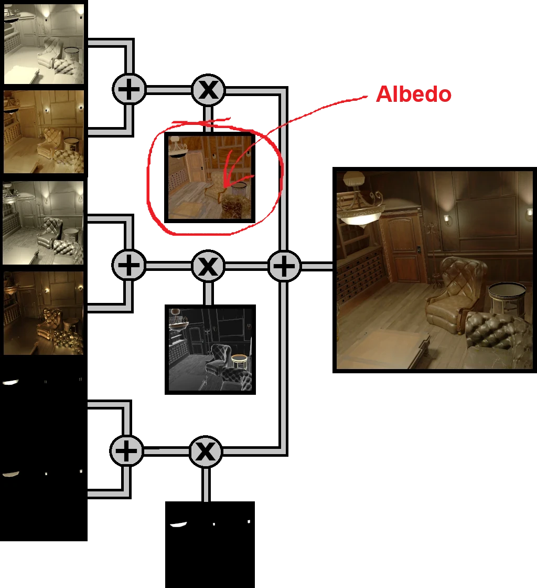

+++
author = 'Turbo Tartine'
date = '2024-11-18T06:28:42+01:00'
draft = true
title = 'OpenRE (Open Retro Engine)'
description = 'Page de presentation du projet OpenRE'
+++
## Introduction
Lorsque j'ai cherché à développer mon propre jeu en caméra fixe, j’ai rapidement réalisé une chose : les outils et ressources disponnibles sur le sujet sont rares. Certes, on trouve quelques tutoriels pour gérer les caméras ou implémenter les déplacements du joueur. Mais je n'ai pas trouvé de réponse à la question qui m'intéresse réèlement : *"Comment intégrer des éléments interactifs dans des décor précalculés ?"*

J'ai donc commencé à bricoler de mon côté pour trouver une solution à ce problème et je pense avoir un début de réponse :


Bon, je sais, cette scène n'a aucun sens. Mais soyez indulgent, j'ai dis que c'était un début. Et puis je trouve ces T-Poses magnifiques (pas vous ?). Plus serieusement, ce qui est important dans cette vidéo, c'est que les seuls models 3D rendus en temps réèl sont les personnages. Tout le reste - planché, murs, plafond, mobilier, props en tout genre - est en réalité une image précalculée.

Si j'écris cet article aujourd'hui, c'est parce que je trouve ces résultat plutôt encourageant. J'ai donc naturellement envie de les partager et d'expliquer un peu comment ça fonctionne. Mais partant du constat que rien de semblable n'a l'aire d'éxiter, j'ai décider d'aller un peu plus loin. Plutôt que d'utiliser cette technologie directement dans mon jeu, je compte la développer à part et la rendre accessible sous licence open-source. Elle a donc besoin d'un nom, et ce nom sera OpenRE pour *Open Retro Engine*.

Nous ne somme qu'au tout début du projet. Il y a encore beaucoup de zones d'ombre, et beaucoup de choses sont suceptible de changer d'ici la première version utilisable. Ne prenez donc pas ce qui suit comme des promesses, mais plutôt comme le point de départ d'une idée qui va progressivement se définir et se stabiliser. Je posterai régulièrement des devlogs pour partager mes avancées, mes échecs (parce qu’il y en aura !), et les éventuels changements de direction. Si vous aimez suivre les projets en coulisses, j’espère que cette aventure vous passionnera autant que moi !

## Part I : Environnement technique :
OpenRE repose sur deux outils que vous connaissez sûrement :
- Blender : pour créer les arrière-plans précalculés.
- Godot : pour gérer les éléments interactifs et assembler le tout.

La maturité et la popularité de ces deux logiciels en font des choix solides. Ils sont aussi open-source, ce qui s'aligne parfaitement avec la philosophie d'OpenRE : promouvoir une technologie accessible et ouverte à tous. L’open-source offre également une certaine sécurité qu'il est impossible d'avoir avec des solutions propriétaires. En effet, comme le rappellent certains evenements récents, placer son capital technologique entre les mains d'une entreprise à but lucratif n'est pas sans risques.

Sur le plan pratique, Blender et Godot se complètent très bien. Godot prend en charge nativement les scènes créées dans Blender, ce qui simplifie la synchronisation entre les deux environnements. Cette compatibilité devrait nous aider à limiter les manipulations fastidieuses et sources d'erreur.

Côté scripting, j’ai choisi de bousculer mes habitudes en optant pour GDScript plutôt que C#. Pourquoi ce choix ? Tout simplement parce que GDScript est supporté par toutes les versions de Godot, contrairement à C#, qui nécessite la version .NET. Cette flexibilité permettra à OpenRE de rester accessible au plus grand nombre. Et ce sera l’occasion pour moi d'apprendre un nouveau langage.

Si comme moi vous préférez le C#, soyer rassurés ! Vous n'aurez besoin de GDScript que si vous souhaitez modifier le plugin OpenRE lui même. Pour développer votre jeu, vous pourrez utiliser le langage de votre choix.

## Part II : Principe général
OpenRE repose sur une séparation du monde en deux parties bien distinctes. Et par "bien distinctes", j’entends que chacune d'elles nécessitera un logiciel dédié.

#### Le monde déterministe (Blender) :
Le monde *déterministe* est créé dans Blender. C'est de lui que seront tirés les arrière plans précalculés. On pourrait, de manière un peu reductrice, dire qu’il représente la partie *statique* de la scène. Je préfère éviter ce terme car il est déjà utilisé par les moteurs de jeu ce qui prète à confusion. De plus il n'est pas tout a fait exacte en l'occurence.

En effet, c'est totalement hors scope pour une V1. Mais il se pourrait qu'un jour, OpenRE supporte des arrière plans animés. On pourrait alors imaginer des petites boucle dans lesquelles le vent agite des rideaux ou de la vegétation. Ou encore des voitures qui circulent dans les rues la nuit, illuminant les allentours à chaque passage. Parler d'éléments "statiques" dans ce context serait tout simplement incorrect.

Pour l'heure, le terme *déterministe* désigne effectivement ce que l'on qualifie de "statique" dans un moteur de jeu (architectures, meubles, objets inanimés, etc.). Mais cela pourrait englober bien plus dans le futur. La seule limite réèlement infranchissable, c'est que ce monde ne pourra jamais dépendre des actions du joueur ou d'éléments de gameplay aléatoirs. Car bien entandu, au moment de génèrer les arrière plans, ces évenements ne sont pas encore connus.

#### Le monde intéractif (Godot) :
De son côté, le monde interactif est implémenté dans Godot. Il comprend tout ce qui relève du gameplay : personnages, véhicules contrôlables, objets manipulables, etc. Là encore, j’évite de le qualifier de *dynamique* pour éviter la confusion avec la terminologie des moteurs de jeu.

En pratique, ce monde sera relativement vide comparé au monde déterministe. En effet, dans la plupart des jeux, les éléments interactifs représentent une quantité de géométrie beaucoup moins importante que les environnements. Cela signifie que dans le cas général, les ressources graphiques sont majoritairement consommées par le monde déterministe. 

OpenRE s'abstrait en grande partie de cette charge de calcul en précalculant la partie déterministe dans Blender (c'est là tout le principe). Cela devrait libérer pas mal de ressources pour la partie interactive. Théoriquement, nous pourront donc être plus généreux en détails, lumières et effets visuels.

#### La fusion des mondes :
Nous avont donc un monde déterministe et un monde intéractif qui vivent dans leur environnement respectif. Il est temps de les faire cohabiter. Pour cela, chaque point de vue du jeu est materialisé par un duo de caméras :
- une caméra déterministe, dans Blender
- une caméra intéractive dans Godot 

Ces deux caméras doivent evidement être parfaitement alignées pour que l'illusion fonctionne. On prendra donc soin de synchroniser leurs position, orientation, FOV, résolution etc.

Pour chacun de ces couples, il faudra ensuite :
- 1. Effectuer un rendu depuis la caméra déterministe pour produire l'arrière plan dans Blender
- 2. Exporter l'arrière plan sous forme d'images
- 3. Importer l'arrière plan dans Godot et l'associer à la caméra interactive correspondante.

Notez que le 's' à "images" n'est pas une faute de frappe. Nous n'exporteront pas directement le rendu final en un seul bloc. En effet, ce dernier sera décomposé en une serie d'images représentant chacune des données spécifiques : profondeur, normales, couleur etc. Sous cette forme, ils sera possible de composer l'arrière plan avec ce que la caméra filme en temps réèl. Sans intervention supplémentaire de la part de l'utilisateur, les deux monde seront alors fusionnés de manière quasi-indicernable : ils s'occluderont l'un l'autre naturellement et leur éclairage sera uniforme et cohérent.

Evidement, il serait trop fastidieux d'effectuer toutes ces étapes à la main, pour chauque point de vu, à chaque fois que quelque chose change dans la scène. Pour que la technologie soit exploitable, OpenRE devra être capable d'automatiser tout cela.

#### Limitations :
L'implémentation actuelle présente malheureusement des limitations assez lourdes. En effet, je bypass presque completement le système de rendu de Godot en m'appuyant sur un post-process custom pour incorporer l'arrière plan et rendre les lumières. Cela signifie qu'en l'état, les features graphiques natives ne sont pas utilisable. Tout doit être réimplémenté dans le shader du post-process. En conséquences, le monde intéractif ne peut pour l'instant beneficier que de :
- 8 points lights basiques (couleur, intensité)
- 8 spot lights basiques (couleur, intensité, angle)
- 4 ombres dynamiques (appliquable sur les spot lights uniquement)
- 1 unique material PBR opaque

C'est bien entandu trop peu pour faire un jeu complet. Mais le combat continue ! J'ai notament l'intention d'ajouter :
- 1 directionnal light basique (couleur, intensité)
- la compatibilité des ombres dynamiques avec tout les types de lumière
- un support des particules natives de Godot (je ne sais pas exactement comment je vais m'y perendre, mais je vois mal comment on pourrait s'en passer)
- une solution pour implémenter des reflets et de la transparence (encore plus flou à l'heure actuelle, mais ce serait bien d'avoir un support au moins partiel de ces effets)

## Part III : Détails Techniques :
Maintenant nous allons mettre les mains dans le cambouis ! Si vous aimez les détails techniques, cette partie est faite pour vous. Mais sachez qu'elle est optionnelle. Elle s'adresse à ceux qui souhaite comprendre un peu mieux ce qui se passe sous le capot. Si vous aborder OpenRE d'un point de vu utilisateur ce n'est peut-être pas votre cas. J'ai essayé de la rendre le plus abordable possible, mais n'hésitez pas à passer directement à la partie IV si vous ne trouvez pas ça interessant.

#### Un Deferred (presque) comme les autres
Pour fusionner les mondes, OpenRE reprend le principe du deffered rendering. Cette technique consiste à séparer le rendu en deux passes :
- **1. geometry pass :** cette première étape vise à produire une collection de textures qu'on appel le G-Buffer (Geometry Buffer). Ces textures encodent dans leur chanels RGB des donnée décrivant les propriétés géométriques de la scène en *screen space* (position, normal, couleur etc...).
- **2. deffered shading pass :** pour obtenir l'image final, il suffit alors d'accumuler les contributions lumineuse de la scène sur chaque pixel. Ce qui n'est pas très compliqué puisque le G-Buffer nous fourni toutes les données nécessaires au calcul en chaque point de l'écran.

Comme évoqué dans la partie précendente, OpenRE sépare la scène en deux parties distinctes. Pour rendre une frame, on aura donc besoin d'un G-Buffer pour chacune de ces parties :
- le G-Buffer intéractif sera construit à la volée dans Godot 
- le G-Buffer déterministe aura été précalculé par Blender (la série d'images exportées vous vous rappellez ?). 

Les deux seront ensuite fournis au fameux post-process custom qui appliquera une passe de *deferred shading* classique (ou presque...) pour rendre les lumières.

#### DG-Buffer : le G-Buffer du monde déterministe
Blender dispose de deux moteurs de rendu :
- **Eevee** : Basé sur la *rasterization*. Permet un rendu quasi-temps réèl mais moins réaliste.
- **Cycles** : Basé sur du *path-tracing*. Il produit des images photoréaliste mais le rendu prend un certain temps.

Pour OpenRE, nous utiliserons bien sûr Cycles, afin de garantir une qualité visuelle maximale. Grâce au compositeur de Blender, le rendu pourra être décomposé en plusieurs textures qui constituront notre DG-Buffer :
|
Map
| Description          									|
Image
|
|:------------------------:|:-------------------------------------------------------------|:-------------------:|
| **Depth** 	| Encode la profondeur de chaque pixel. Permetra aux mondes de s'occluder correctement. La position du pixel dans le monde pourra être déduite de cette donnée et de la position de la caméra. On en aura besoin pour calculer la lumière temps réèl |   |
| **Normal** 	| Décrit l'orientation des surfaces. Cette donnée interviendra également dans la calcul de l'éclairage temps réèl.	|   |
| **ORM** 	| Regroupe des données additionnelles nécessaire au rendu PBR (Ambiant Occlusion, Roughtness, Metalness)	|   |
| **diverses maps d'illumination** 	| Information relative à la lumière pré-calculée	|   |

Si vous mangez du G-Buffer tous les matins au p'tit dej', vous vous demandez peut être où est passée la map d'albedo ? Ou à quoi correspondent ces fameuses *diverses maps d'illumination* ? Il faut savoir que le modèle de Cycles est plus complexe que ce à quoi le temps réèl nous a habitué. La lumière pré-calculée par path-tracing se compose de neuf maps d'illumination différentes. En réalité, l’une de ces map correspond à l’albedo (un mot compliqué pour dire "la couleur d'une surface"). Mais pour recomposer l’image finale, nous auront besoin des neuf.

On pourrait se contanter de n'intégrer que l'albedo au DG-Buffer. Mais il faudrait alors recalculer tout l'éclairage en temps réèl côté Godot, ce qui n'est pas toujours nécessaires. Les neuf maps sont donc exportées pour permettre une recomposition directe de certaines parties de l'image. De cette manière, on concerve la qualité visuelle de Cycle sur ces zone, et on économise (beaucoup) de temps de calcul.

#### IG-Buffer : le G-Buffer du monde interactif
Si Godot implémentait un deferred renderer, on pourrait piocher les maps qui nous intéressent directement dans son G-Buffer. Mais malheureusement pour nous, le renderer officiel de Godot est un forward. Il n'y a donc pas de G-Buffer. 

Il va falloir bricoler le nôtre et pour cela on va utiliser des render targets. Si vous n'êtes pas familier avec le terme, c'est un système qui permet d'effecteur un rendu de la scène depuis une caméra, mais dans une texture plutôt qu'à l'écran directement. L'avantage c'est qu'on va pouvoir appliquer du post-process à cette texture et ainsi prendre la main sur la façon dont elle est rendu. 

Pour construire notre IG-Buffer, on va donc créer une render target pour chacune des textures qui le compose. Et pour chacune de ces render targets, on écrira un post-process dédié qui sera chargé de rendre spécifiquement la donnée qui nous intéresse. 

Cela peut parraitre un peu fastidieux mais ça ne l'est finalement pas tant que ça. Car en effet, je suis un peu malhonnète quand j'affirme que Godot n'a pas de G-Buffer dans lequel récupérer les informations. En réalité, le moteur expose nativement à ses shaders des textures contenant des données très proches de ce qu'on veut. La plupart du temps, le post-process tiendra en une ligne et se contantera de sampler l'une de ces textures.
| 			 
Map
			| Description          									| 
 Image  
|
| :------------------------: |:-------------------------------------------------------------| :-------------------:|
| **Depth** 	| On utilise la *depth_texture* fournie par Godot. Elle n'est pas rouge comme dans le DG-Buffer car la valeur est dupliqué dans les 3 cannaux. Par contre elle n'a pas l'aire encodée de la même façon : le claire est proche et le sombre éloigné. Là c'est déjà plus gênant et on verra dans un devlog dédié que c'est en réalité encore pire. |   |
| **Normal** 	| Ici, c'est la *normal_roughness_texture* qu'on utilise (en ignorant simplement la roughness). Là encore l'encodage est différent. On y reviendra aussi dans un devlog, mais c'est moin complèxe que pour la depht. |   |
| **ORM** 	| Pour celle ci, Godot ne nous fourni pas ce qu'il faut. Un focus sur le bricolage associé aura lui aussi son devlog	|   |
| **Albedo** 	| Celle là, c'est la plus facile. On affiche directement la *screen_texture* de Godot.	|   |
 
#### Calcul de l'éclairage
Maintenant que nous disposons de nos G-Buffer, il n'y a plus qu'a calculer la lumière en post-process grâce à une passe de deferred shading. Mais la dualité du monde introduit quelques complications.

##### 1. Choix du G-Buffer :
Une première question évidente se pose : "dans quel G-Buffer récupérer les données ?" C'est en réalité assez simple. La comparaison des Depth Maps nous permet de savoir quel monde occlude l'autre pour chaque pixel de l'écran. Il suffit donc de choisir le G-Buffer du monde qui est visible à la coordonnée du pixel considéré.
 

<video width=100% controls muted loop playsinline autoplay>
    <source src="videos/cigar_room_loop_worlds_occlusion_debug_with_ref.mp4" type="video/mp4">
    Your browser does not support the video tag.  
</video>


*** IG_Buffer.depth > DG_Buffer.depth => Pixel Déterministe *** 
*** IG_Buffer.depth < DG_Buffer.depth => Pixel Interactif ***

##### 2. Différents modes de calcul de la lumière :
Le second point est un peu plus subtile. Je ne l'ai pas précisé jusqu'ici, mais les sources de lumière aussi peuvent être déterministes (lampadaires, feux de cheminée, soleil...) ou interactives (lampe torche, flash d'un tir, phares de voiture). Cela a deux conséquences :
- 1. Les lumières déterministes présentes dans Blender devront être répliquées dans Godot. Sans cela, elle ne pourront pas éclairer les éléments interactifs.
- 2. Le calcul de la contribution d'une lumière données sur un pixel donné varie selon le monde auquel l'un et l'autre appartiennent. Voici un tableau récapitulatif des différentes combinaisons :

| 			 				| Pixel Déterministe          									| Pixel Interactif     |
| :------------------------ |:-------------------------------------------------------------:| :-------------------:|
| **Lumière Déterministe** 	| Recomposition des maps de Cycles (Précal.)  							|  Deferred Shading (Temps Réèl) |
| **Lumière Interactive** 	| Recomposition des maps de Cycles (Précal.)   + Deferred Shading (Temps Réèl)	|  Deferred Shading (Temps Réèl) |

 

<video width=100% controls muted loop playsinline autoplay>
    <source src="videos/cigar_room_loop_light_modes_debug_with_ref.mp4" type="video/mp4">
    Your browser does not support the video tag.  
</video>


*Ces vidéos décrivent le mode de calcul utilisé sur chaque pixels. Celle du haut correspond à la lumière émise par le lustre au dessus de la table (source déterministe). Celle du bas correspond à la "lampe torche" de la femme au centre (source interactive). Les couleurs corespondent aux combinaisons décrites dans le tableau ci-dessus*

## Part IV : Phases de développement

#### Proof of Concept (POC)
Le but de cette première étape est de débrousailler le terrain pour me faire une première idée du potentiel d'OpenRE. J'ai déjà pas mal avancé là dessus, les images de la scène d'exemple que vous pouvez voire dans cet article sont issues de ce POC. Mon objectif ici n'est pas l'optimisation ou l'élegance du code. Je cherche simplement à identifier les verroux techniques et à m'assurer qu'il est possible de les faire sauter (à grand coup de débrouille et d'improvisation la plupart du temps).

Lorsque j'aurais une vision suffisament claire du projet et que j'aurai levé les doutes quant à sa faisabilité, ce code sera mis au placard et je repartirai d'une feuille blanche. Ce n’est qu’à ce moment-là que je me préocuperai de la qualité, de la performance et de l’ergonomie.

Le dépôt de ce POC n'est malheureusement pas public. De toutes façons, la codebase est affreuse. Je vous assure, vous n'avez pas envie de mettre le nez dedans. Mais ce n'est pas la raison principale. En réalité, pour juger les capacités de rendu d'OpenRE, j'ai besoin d'assets de qualité et cohérents entre eux.  Trouver de tels assets libres de droits et dans un délai raisonnable serait un vrai casse tête. J'utilise donc des ressources déjà en ma possession (achetées ou gratuites) et je ne peux pas les redistribuer.

##### Devlogs :
*Cette phase est en cours. Les devlogs seront publiés dès qu’ils seront disponibles.*

#### Le SDK
C'est ici que les choses serieuses commenceront. L'enjeu étant de faire passer OpenRE d'un prototype un peu bancale à quelque chose de réèlement utilisable. Si tout se passe comme prévue, à l'issue de cette phase nous auront un SDK fonctionnel et suffisement documenté pour être utilisé dans de vrai projets.

Le POC n'étant pas tout à fait terminé je ne suis pas encore certain de ce que le SDK incluera. Mais on se dirige apriorie vers :
- un addon Blender
- un addon Godot
- des scripts & utilitaires complémentaires

Contrairement au POC, le SDK sera open-source et disponible sur un dépôt public. Rien ne me ferait plus plaisir que de savoir qu’OpenRE est utilisé dans vos créations. Si vous décidez de l’adopter, n'hésitez pas à me faire savoir sur quoi vous travaillez. Cela m'interesse au plus haut point ! 

Dans un premier temps, je n'accepterai probablement pas de contributions spontanées, mais vos retours, suggestions et rapports de bugs seront toujours les bienvenus. N'hésitez pas à les partager sur le [GitHub du projet](). 

##### Devlogs :
*Cette phase n'a pas encore commencé*

#### Une Démo Jouable
Pour montrer ce qu’OpenRE permet de réaliser, je compte créer une petite démo jouable. Ce projet servira de cas pratique pour éprouver l'ergonomie et la fiabilité du SDK, tout en illustrant ses capacités en situation réelle.

Si vous avez lu [cet article](/posts/i_love_fixed_cams), vous savez que pour moi la caméra fixe dépasse largement le cadre du survival-horror. J’aimerais beaucoup qu’OpenRE soit utilisé dans d’autres types de jeux, voir même dans des propositions vidéoludiques nouvelles. Mais je ne suis pas game designer, il est donc plus raisonnable pour moi de m’appuyer sur des codes bien établis que je connais déjà un peu. Je vais donc jouer la sécurité et rester sur un survival-horror classic.

Idéalement, cette démo sera elle aussi open-source et fera office de projet d’exemple. Mais là encore, des contraintes liées aux droits d’utilisation des assets pourraient compliquer les choses. Je ne peux donc rien promettre mais quoi qu’il arrive, une version sera mise à disposition gratuitement sur [ma page itch.io](https://jponzo.itch.io/)

##### Devlogs :
*Cette phase n'a pas encore commencé*

## Conclusion :
Je suis conscient que dans la formule actuelle, OpenRE ne conviendra pas à tout les projets. Le workflow reposant sur deux logiciels distincts est atypique, et la perte de compatibilité avec les fonctionnalités graphiques natives de Godot peut faire un peu peur. Mais il faut bien commencer quelque part et pour maximiser mes chances d'aller au bout de l'aventure, je choisi d’avancer de manière pragmatique.

Pour l’instant, cette technologie vise à répondre à mes propres besoins et ambitions créatives. Cela dit, j’espère sincèrement qu'OpenRE – et peut-être les jeux que je créerai avec – pourra inspirer d’autres créateurs. J'aimerais montrer que cette technique souvent délaissée, peut encore aujourd’hui produire des expériences mémorables et mérite d’être revisitée.

Si le projet suscite de l’intérêt et rassemble une communauté, je serais ravi de l'enrichir, de l’adapter à d’autres usages, et à d'autre façons de travailler plus conventionnelles. Mais pour avancer dans cette direction, vos retours sont indispensables. Qu’est-ce qui vous attire dans OpenRE ? Quelles limitations freinent votre envie de l’utiliser ? Y a-t-il des fonctionnalités spécifiques qui vous manqueraient en l'état ? Ou au contraire, peut être pensez vous déjà pouvoir faire quelque chose avec quand le SDK sera disponnible ? N’hésitez pas à partager vos impressions dans les commentaires.

En conclusion, je dirais que ce projet est pour moi une façon de rendre hommage à un genre vidéoludique qui m’a profondément marqué en tant que joueur et qui me manque beaucoup aujourd'hui. Si OpenRE ne trouve qu’une petite audience ou même si je reste son unique utilisateur, je serai tout de même fier d’avoir contribué, à ma façon, à faire vivre cet art sous-estimé qu’est la caméra fixe. Et si ce que je partage sur ce blog ou ailleurs peut encourager d’autres personnes à explorer cette voie, cette aventure sera pour moi un réèl succès.