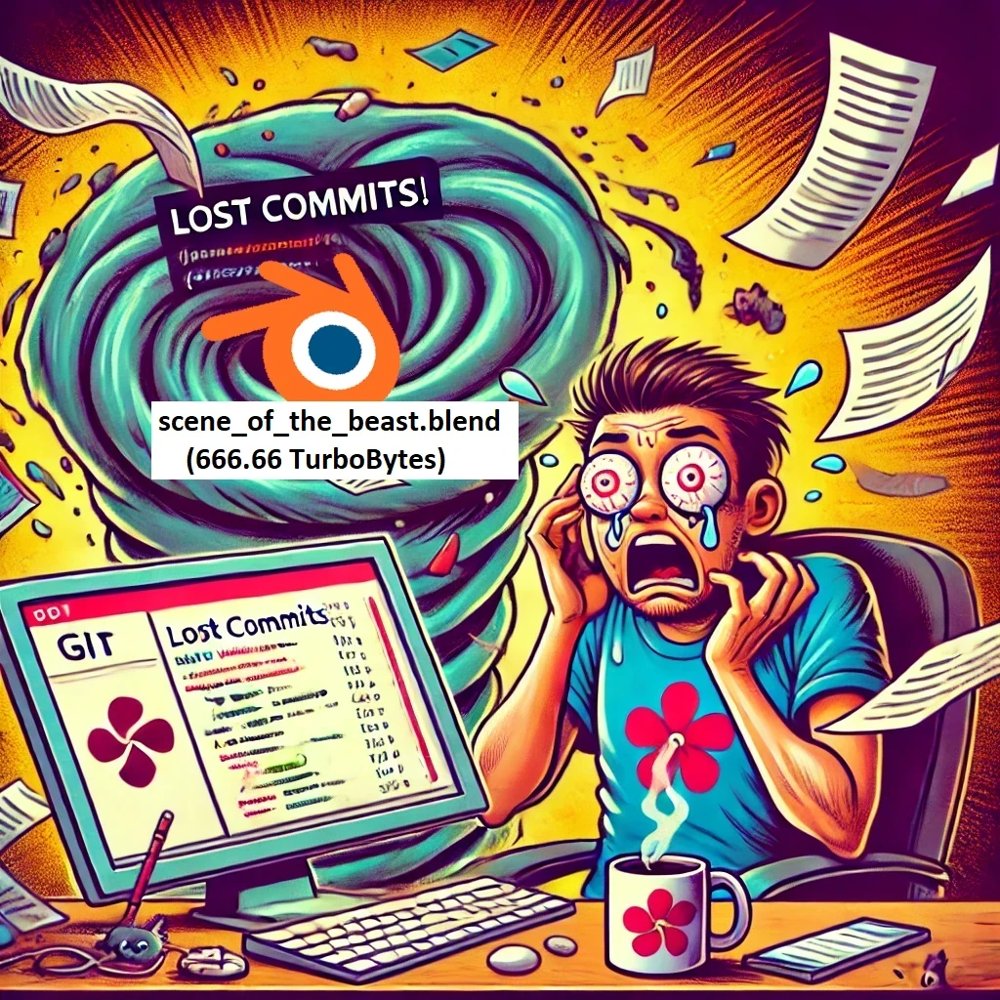
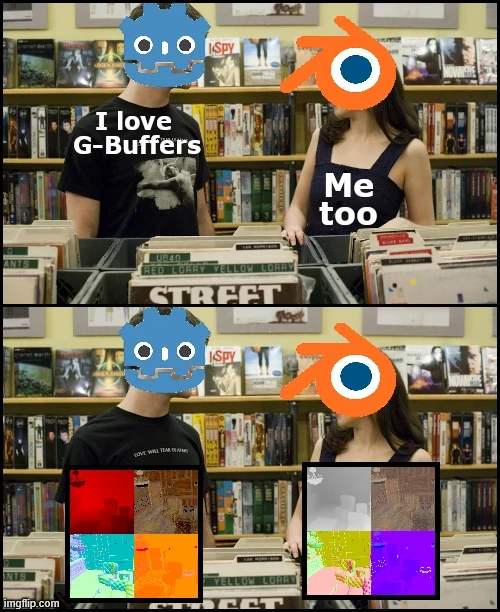
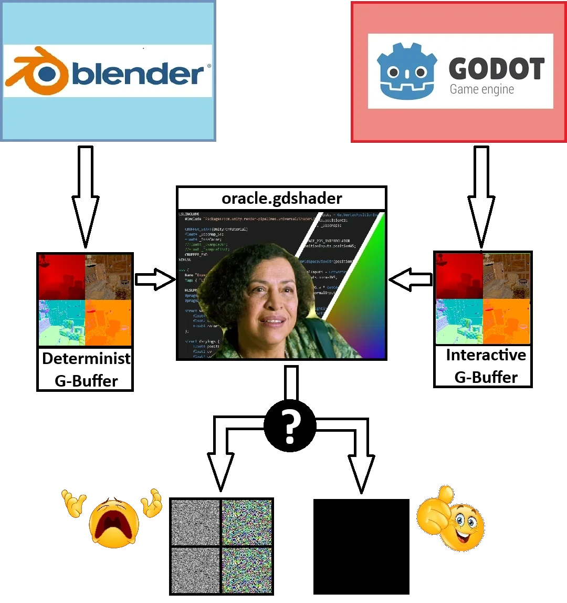
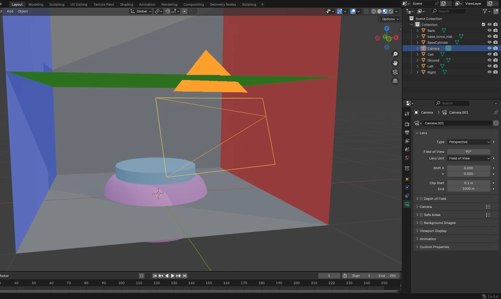
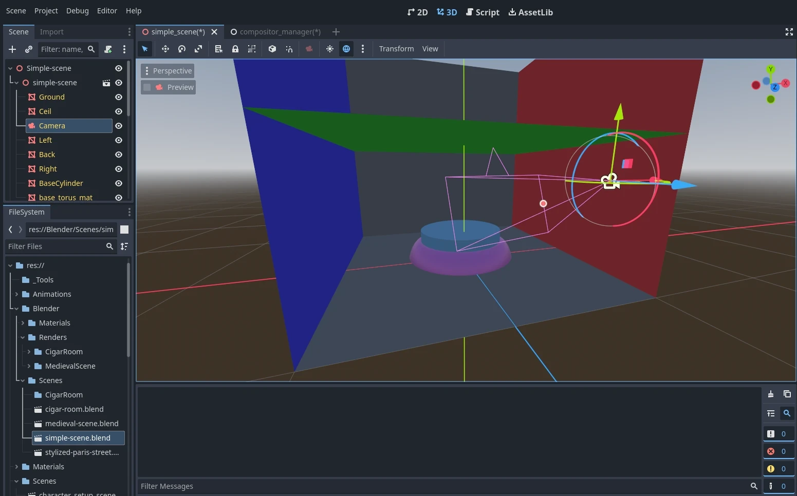
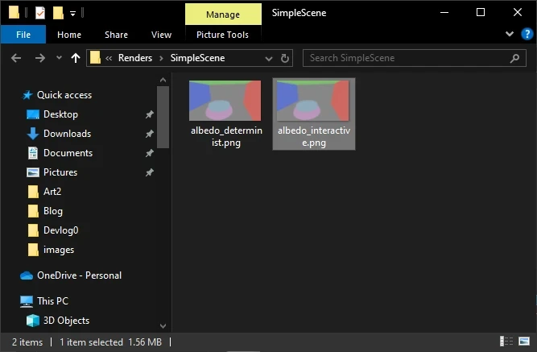
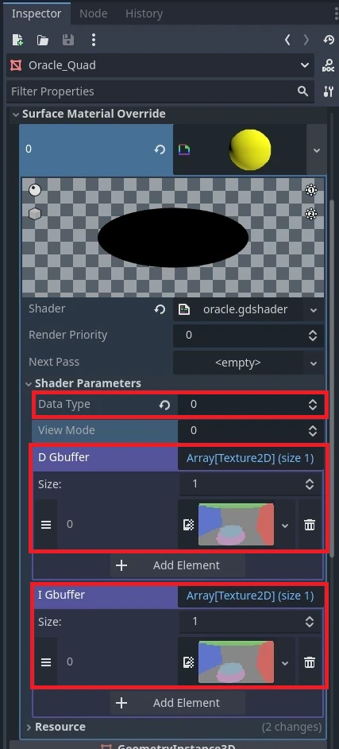

+++
author = 'Turbo Tartine'
date = '2025-02-21T12:51:02+01:00'
draft = true
title = "OpenRE devlog 0 : Oracle Driven Development"
description = 'devlog 0 du projet OpenRE'
+++
## Introduction
Bienvenue dans ce tout premier devlog d'OpenRE : le devlog Zéro ! Cette série a pour but de documenter la phase de POC (proof of concept) du projet.

Si ce n'est pas déjà fait, je vous recommande de jeter un œil à la [présentation générale du projet](/projects/open_re). J'y introduis notamment quelques notions et un peu de terminologie. Il est préférable de l'avoir parcourue pour mieux contextualiser ce dont je parle dans les devlogs.

Avant d'entrer dans le vif du sujet, laissez-moi introduire un peu de contexte.

### 1. Format de la série
Tout au long du développement, je prendrai des notes dès que je tomberai sur un sujet intéressant. Chaque mois (si j’arrive à m’y tenir), je sélectionnerai les plus pertinents pour les présenter dans un ou plusieurs nouveaux numéros, si j'estime que la séparation a du sens.

Étant donné qu’OpenRE est un projet personnel que je développe sur mon temps libre, le rythme de publication risque d’être irrégulier. Certains mois seront plus légers que d’autres, mais ce n’est pas bien grave. Au contraire, ce sera intéressant de voir comment la cadence évolue au fil du temps.

### 2. Shit happens
Petite particularité concernant les premiers articles de la série : il s'agira de "rétro-devlogs". En effet, j’ai commencé OpenRE il y a plusieurs mois, sans trop savoir où j’allais. Je n'étais pas sûr que mes expérimentations mèneraient quelque part et, de toute façon, l'idée même de tenir un blog ne m'avait pas encore traversé l'esprit.

Durant cette période, il se trouve que le dépôt Git a pris feu (suite à une sombre histoire de fichiers Blender beaucoup trop volumineux). Je sais qu'il existe des méthodes douces pour régler ce genre de problème, mais j'avoue que sur le moment, je ne voyais pas trop l'intérêt. J'ai donc bêtement supprimé le dépôt pour en recréer un avec ma copie locale (après avoir fait le nécessaire pour mieux gérer mes scènes).


*Image générée par IA d'un dépôt Git sinistré par un fichier Blender trop gros*

Résultat : j’ai perdu l’historique du projet. Je ne peux donc plus restaurer les premières versions pour analyser ce que j'avais fait. Réaliser des captures d'écran de mes résultats originaux est également impossible. Ces premiers numéros seront donc des reconstitutions.

## Part I : Problématique de l'harmonisation des données
Si vous avez lu l'article mentionné dans l'introduction, vous savez qu'OpenRE permet de fusionner le rendu de deux scènes :
- **La scène déterministe** : précalculée dans Blender
- **La scène interactive** : rendue en temps réel dans Godot

Pour cela, la technologie s'appuie sur une structure de données particulière appelée un G-Buffer. Pour rappel, il s'agit d'une collection de textures encodant diverses données géométriques relatives à un point de vue d'une scène (profondeur, albédo, normales, etc.).

Pour fusionner les scènes, OpenRE va donc composer les G-Buffers issus des scènes déterministe et interactive (respectivement générées par Blender et Godot). Mais il n'est pas évident que des données produites par deux logiciels différents soient directement compatibles. C'est même loin d'être gagné.



En effet, tous les logiciels graphiques suivent des conventions qui leur sont propres (unités, espaces colorimétriques, axes du repère, etc.). Tant qu'on reste à l'intérieur d'un système, la cohérence de l'ensemble est plus ou moins garantie. Mais dès lors que deux systèmes doivent s'échanger des données pour collaborer, c'est le début des problèmes.

Avant toute chose, il va donc falloir s'arranger pour que Blender et Godot parlent la même langue. Et comme on le verra dans les prochains devlogs, cela va demander un certain nombre d'ajustements.

## Part II : La méthode de l'oracle
Pour identifier ces ajustements, on va utiliser une technique que j’aime bien et que j’appelle le *Oracle Driven Development*. C’est un peu comme du *Test Driven Development*, sauf qu’au lieu d’avoir un jeu de tests automatisés, propre et exhaustif, on va bricoler une petite moulinette qu’il faudra lancer en partie à la main.

À la manière d'un oracle, cette moulinette va formuler des prophéties parfois cryptiques en réponse aux questions qu'on lui pose. Mais, interprétés correctement, ces présages nous aideront à avancer dans notre périple.

### 1. Comment ça marche ?
Si Godot et Blender sont bien sur la même longueur d'onde, les G-Buffers qu'ils produisent à partir d'une même scène devraient être identiques. C'est ce que nous allons chercher à vérifier avec l'aide de l'oracle. Son rôle sera de comparer les G-Buffers et de nous délivrer son jugement sous la forme d'une image. Il nous faudra alors lire notre réponse dans cette image.



Mais trêve de métaphores. Concrètement, cet oracle est un *post-process* du nom de `oracle.gdshader`. Il prend en entrée :
- les textures des deux G-Buffers
- le type de texture à comparer

Son job est de calculer, deux à deux, les différences entre les textures déterministe et interactive de chaque type et d'afficher à l'écran celle qui correspond au type sélectionné. Le degré de différence sera représenté en niveau de gris :
- Noir → les pixels des textures sources sont identiques
- Blanc → la différence entre les pixels des textures sources est maximale

Si l'oracle affiche une image noire pour tous les types de textures possibles, alors les G-Buffers sont identiques.

### 2. Mise en place d’une scène de test
Pour commencer, j’ai créé une petite scène dans Blender, composée de quelques primitives basiques et d’une caméra. Ensuite, je l’ai reproduite à l’identique dans Godot. L’opération est triviale, étant donné que Godot prend en charge le format de scène Blender. Il suffit d’importer le fichier `.blend` et de l’ajouter à une scène vide.

  


Comme vous pouvez le voir sur les captures, la scène est une Cornell box basique avec un petit podium au centre, sur lequel nous pourrons mettre en scène ce dont nous aurons besoin le moment venu. Dans ce devlog, nous allons nous contenter de mettre en place l'environnement. Il n'y a donc rien sur le podium pour l'instant.

### 3. Implémentation de l’Oracle
Voyons maintenant de quoi est fait notre oracle. Sans plus de cérémonie, voici son code source. C'est un petit pavé, mais ne vous inquiétez pas, nous allons le décortiquer ensemble.

```glsl
shader_type spatial;
render_mode unshaded, fog_disabled;

void vertex() {
	POSITION = vec4(VERTEX.xy, 1.0, 1.0);
}

// Type de donnée à comparer
uniform int data_type = -1;

// Determinist & Interactive G-Buffer
const int NB_GMAPS = 1;
uniform sampler2D[NB_GMAPS] d_gbuffer : filter_nearest;
uniform sampler2D[NB_GMAPS] i_gbuffer : filter_nearest;

// Choix du mode d'affichage
#define I_D_DIFFERENCE 0
#define D_TEXTURE_ONLY 1
#define I_TEXTURE_ONLY 2
uniform int view_mode = 0;

const vec3 ERROR_COLOR = vec3(1.0, 0.0, 1.0);

// Calcule la différence entre 2 pixels 
vec3 compute_difference(vec3 d_frag, vec3 i_frag) {
	return ERROR_COLOR;
}


// Point d'entrée du post-process
void fragment() {
	vec3 out_color = ERROR_COLOR;
	
	if (data_type >= 0 && data_type < NB_GMAPS
		&& view_mode >= 0 && view_mode < 3) {
		// Récupération des pixels déterministe et interactif
		vec3 d_frag = texture(d_gbuffer[data_type], SCREEN_UV).rgb;
		vec3 i_frag = texture(i_gbuffer[data_type], SCREEN_UV).rgb;
		
		// Selection de l'affichage
		switch (view_mode) {
			case I_D_DIFFERENCE:
				// Cas nominal : LA PROPHECIE !!!
				out_color = compute_difference(d_frag, i_frag);
				break;
			case D_TEXTURE_ONLY:
				// Affichage du pixel deterministe brut
				out_color = d_frag;
				break;
			case I_TEXTURE_ONLY:
				// Affichage du pixel interactif brut
				out_color = i_frag;
				break;
		}
	}
	
	ALBEDO = out_color;
}
```

En l'état, il ne fait pas grand-chose. Voyez ça comme un squelette de base que nous allons habiller petit à petit au fil des devlogs.

Sans transition, commençons le tour du propriétaire.

#### 2.1. Code minimal d'un post-process
D'abord, quelques lignes de base qu'on ne détaillera pas. C'est la façon usuelle de créer un post-process dans Godot.
 ```glsl
shader_type spatial;
render_mode unshaded, fog_disabled;

void vertex() {
	POSITION = vec4(VERTEX.xy, 1.0, 1.0);
}
```

#### 2.2. Les uniforms ou paramètres d'entrée
Les uniforms sont les paramètres d'entrée du shader. C'est à travers eux que le CPU peut envoyer des données au GPU. Une fois initialisés, ils peuvent être référencés comme des variables globales dans le code du shader.

Les uniforms `data_type`, `d_gbuffer` et `i_gbuffer` correspondent aux deux G-Buffers ainsi qu'au type de données sélectionné pour la comparaison (évoqués précédemment).
```glsl
// Type de donnée à comparer
uniform int data_type = -1;

// Determinist & Interactive G-Buffer
const int NB_GMAPS = 1;
uniform sampler2D[NB_GMAPS] d_gbuffer : filter_nearest;
uniform sampler2D[NB_GMAPS] i_gbuffer : filter_nearest;

// Choix du mode d'affichage
#define I_D_DIFFERENCE 0
#define D_TEXTURE_ONLY 1
#define I_TEXTURE_ONLY 2
uniform int view_mode = 0;
```

Le paramètre `view_mode`, lui, est nouveau. On n'en a pas encore parlé. C'est un paramètre de debug qui nous permettra d'afficher facilement des images intermédiaires pour nous aider à interpréter les prophéties de l'oracle.

Dans un premier temps, on pourra seulement visualiser les textures interactives et déterministes correspondant au type de données sélectionné. Mais on pourra ajouter de nouveaux modes d'affichage quand ce sera nécessaire.

#### 2.3. Calcul de différence
C'est ici qu'on implémentera le calcul de la différence. Ou devrais-je dire **des** différences, car comme nous le verrons plus tard, nous serons amenés à traiter les données différemment selon leur type.
```glsl
const vec3 ERROR_COLOR = vec3(1.0, 0.0, 1.0);

// Calcule la différence entre 2 pixels 
vec3 compute_difference(vec3 d_frag, vec3 i_frag) {
	return ERROR_COLOR;
}
```
Pour l'instant, la fonction renvoie simplement `ERROR_COLOR`, une couleur magenta bien dégueu qui attirera immédiatement l'attention si on la voit à l'écran.

C'est quelque chose que je fais assez souvent et qui correspondrait à un `throw new Exception();` ou un `return -1;` en code CPU.

Dans un GPU, nous sommes assez limités en termes de gestion d'erreurs, il faut donc parfois être un peu créatif. N’hésitez pas à partager vos petites techniques personnelles dans les commentaires si vous en avez !

#### 2.4. Le point d'entrée du post-process
Et enfin, voici la fonction `void fragment()`, le point d'entrée principal du post-process.
```glsl
// Point d'entrée du post-process
void fragment() {
	vec3 out_color = ERROR_COLOR;
	
	if (data_type >= 0 && data_type < NB_GMAPS
		&& view_mode >= 0 && view_mode < 3) {
		// Récupération des pixels déterministe et interactif
		vec3 d_frag = texture(d_gbuffer[data_type], SCREEN_UV).rgb;
		vec3 i_frag = texture(i_gbuffer[data_type], SCREEN_UV).rgb;
		
		// Selection de l'affichage
		switch (view_mode) {
			case I_D_DIFFERENCE:
				// Cas nominal : LA PROPHECIE !!!
				out_color = compute_difference(d_frag, i_frag);
				break;
			case D_TEXTURE_ONLY:
				// Affichage du pixel deterministe brut
				out_color = d_frag;
				break;
			case I_TEXTURE_ONLY:
				// Affichage du pixel interactif brut
				out_color = i_frag;
				break;
		}
	}
	
	ALBEDO = out_color;
}
```
La première chose à noter, c'est que je réutilise ma technique du ERROR_COLOR d'une manière un peu différente. Ici, je vérifie les valeurs des uniforms data_type et view_mode pour m'assurer qu'elles sont valides.

Si un des paramètres est à la rue → BOOM ! Écran magenta !

```glsl
// Point d'entrée du post-process
void fragment() {
	vec3 out_color = ERROR_COLOR;
	
	if (data_type >= 0 && data_type < NB_GMAPS
		&& view_mode >= 0 && view_mode < 3) {
		// code protégé du fragment()
		...
	}
	
	ALBEDO = out_color;
}
```

**IL NE FAUT JAMAIS FAIRE ÇA DANS UN SHADER DE PRODUCTION !**

J'expliquerai peut-être pourquoi dans un article un jour. Mais retenez que, pour des raisons de performances, les branchements conditionnels sont à éviter au maximum dans le code GPU.

Ici, on s’en fout, car on est sur un POC et que l'oracle n'est qu'un outil de développement. La performance n'est pas critique, donc on se permet quelques libertés pour se faciliter la vie. 

```glsl
// Point d'entrée du post-process
void fragment() {
	...
	
	// Récupération des pixels déterministe et interactif
	vec3 d_frag = texture(d_gbuffer[data_type], SCREEN_UV).rgb;
	vec3 i_frag = texture(i_gbuffer[data_type], SCREEN_UV).rgb;
	
	// Selection de l'affichage
	switch (view_mode) {
		case I_D_DIFFERENCE:
			// Cas nominal : LA PROPHECIE !!!
			out_color = compute_difference(d_frag, i_frag);
			break;
		case D_TEXTURE_ONLY:
			// Affichage du pixel deterministe brut
			out_color = d_frag;
			break;
		case I_TEXTURE_ONLY:
			// Affichage du pixel interactif brut
			out_color = i_frag;
			break;
	}
	
	...
}
```

Le reste du code est assez trivial. D'abord on sample les textures pour obtenir les pixels que l'on souhaite comparer. Ensuite, dans le cas nominal (`view_mode == I_D_DIFFERENCE`) on invoque `compute_difference(...)` sur ces pixels pour déterminer la nuance de gris à afficher. 

Si un mode d'affichage de debug est actif, on execute les traitements appropriés à la place. Ici, pour les valuers `D_TEXTURE_ONLY` et `I_TEXTURE_ONLY` on affiche simplement le pixel brut de la texture correspondante.

## Part III : Notre première prophétie
Dans ce numéro, nous n'allons pas dérouler le processus d'harmonisation des données en intégralité. Ce serait beaucoup trop long. Le sujet va nous occuper pendant encore plusieurs devlogs.

D'un autre côté, nous venons de mettre en place un super environnement d'ODD, et il serait terriblement frustrant de ne pas le tester. (Allez ! Juste une fois! C'est dans longtemps la sortie du prochain épisode..).

On va donc faire ce qu'il faut pour recueillir notre première prophétie. Pour garder les choses simples, on ne va considérer que la texture d'Albedo (on oublie les autres pour l'instant).

### 1. Préparation de l'Oracle
On va devoir enrichir un peu le code de l'Oracle pour implémenter la comparaison de l'Albedo. Le changement concerne la fonction de calcul de la différence.

Avant :
```glsl
// Implémentation par defaut qui retournait ERROR_COLOR quoi qu'il arrive
const vec3 ERROR_COLOR = vec3(1.0, 0.0, 1.0);

vec3 compute_difference(vec3 d_frag, vec3 i_frag) {
	return ERROR_COLOR;
}
```

Après :
```glsl
// Nouvelle implémentation qui prend en compte l'albedo
#define ALBEDO_TYPE 0
const vec3 ERROR_COLOR = vec3(1.0, 0.0, 1.0);

vec3 compute_albedo_difference(vec3 d_frag, vec3 i_frag) {
	float dist = distance(d_frag, i_frag);
	return vec3(dist, dist, dist);
}

vec3 compute_difference(vec3 d_frag, vec3 i_frag) {
	if (data_type == ALBEDO_TYPE)
		return compute_albedo_difference(d_frag, i_frag);
	return ERROR_COLOR;
}
```

La fonction `compute_difference(...)` ne renvoie plus systématiquement `ERROR_COLOR`. Lorsque le type de données à comparer est réglé sur `ALBEDO_TYPE`, la fonction `compute_albedo_difference(...)` est invoquée à la place. Elle effectue une simple distance euclidienne entre les deux couleurs.

### 2. Assignation des textures
La génération des textures d'Albedo déterministe et interactive est malheureusement hors scope pour aujourd'hui. On va simplement considérer qu'on les a déjà et qu'elles ont été obtenues à partir d'un Godot et d'un Blender dans leur paramétrage d'usine, sans toucher à plus que le strict nécessaire pour les générer. Les voici :



À partir de là, il ne reste plus qu'à les assigner aux uniforms correspondants de `oracle.gdshader` et à régler `data_type` sur 0 (qui correspond à `ALBEDO_TYPE`).



### 3. C'est maintenant ! C'est maintenant !
Le type de données à comparer est bien réglé sur Albedo. Nos textures sont en place, correctement générées (faites-moi confiance…) et associées aux uniforms du shader. Elles proviennent de deux scènes rigoureusement identiques issues du même fichier. Si l’importeur de Godot a bien fait son travail en traduisant les données de Blender, on devrait obtenir une prophétie rassurante… c'est-à-dire un bel écran noir.

Qu’est-ce qui pourrait mal se passer ?


Oh nooo !!!

Quelle surprise ! L'image n'est pas noire (qui aurait pu s'en douter ?!). Rassurez-vous, l'importeur fonctionne très bien, le problème vient d'ailleurs. Il va falloir trouver ce qui cloche et le corriger. Mais ce sera pour une autre fois, car on arrive à la fin de ce devlog. (Oui... je dois garder un peu de temps pour dev, sinon il n'y aura plus rien à raconter.)

## Conclusion :
Nous venons de poser les bases d'un environnement capable de comparer facilement les données produites par Blender et Godot. Jusqu'ici, il ne nous a appris qu'une chose : ces données ne sont **pas** compatibles par défaut (en ce qui concerne l'Albedo au moins).

C'est à partir de là que le vrai travail va commencer. Par le biais de différents réglages et pré-traitements, d'un côté comme de l'autre, nous allons harmoniser les deux logiciels. Mais nous ne ferons pas ça à l'aveugle. Grâce à l'Oracle, nous aurons un moyen efficace de visualiser l'impact de nos ajustements. Itération après itération, nous pourrons garder ce qui améliore les résultats et jeter le reste. Et ce, jusqu'à obtenir des données totalement identiques (du moins, c'est ce qu'on espère).

Cependant, notre unique scène de test reste très simpliste. Même lorsque nous aurons des écrans totalement noirs pour toutes les valeurs de `data_type`, ce ne sera pas forcément suffisant. Pour être vraiment sûrs que Godot et Blender sont bien en phase, il faudra plus de données, et surtout des données plus complexes.

Pas de panique, c'est prévu ! Godot comprend les `.blend` et nous avons désormais un Oracle dans l'équipe. Il sera donc relativement facile de mettre à l'épreuve de nouvelles scènes au fur et à mesure de l'avancement du projet. Et chaque fois que de nouvelles dissonances apparaîtront, on rouvrira le dossier.

## Le mot de la fin
Je terminerai en disant que ce devlog a été assez compliqué à écrire. J'ai perdu beaucoup de temps à me remémorer les choses et à les reconstituer. Malheureusement, ce sera comme ça tant que je n'aurai pas fini de recoller les wagons (prenez soin de votre Git, les amis...).

Mais reconnaissons quand même un avantage à la situation : le TurboTartine du futur, malgré ses problèmes de mémoire, sait à peu près ce qu'il a fait ensuite, ce qui aide à structurer tout ça.

D'ailleurs, je peux déjà annoncer le sujet du prochain numéro ! Dans le prochain devlog, nous allons utiliser l'oracle pour harmoniser les textures d'albédo de nos G-Buffers (qui l'eu cru hein ?).

D’ici là, prenez soin de vous, et j'espère que ce premier devlog vous aura plu. N’hésitez pas à me faire vos retours !


