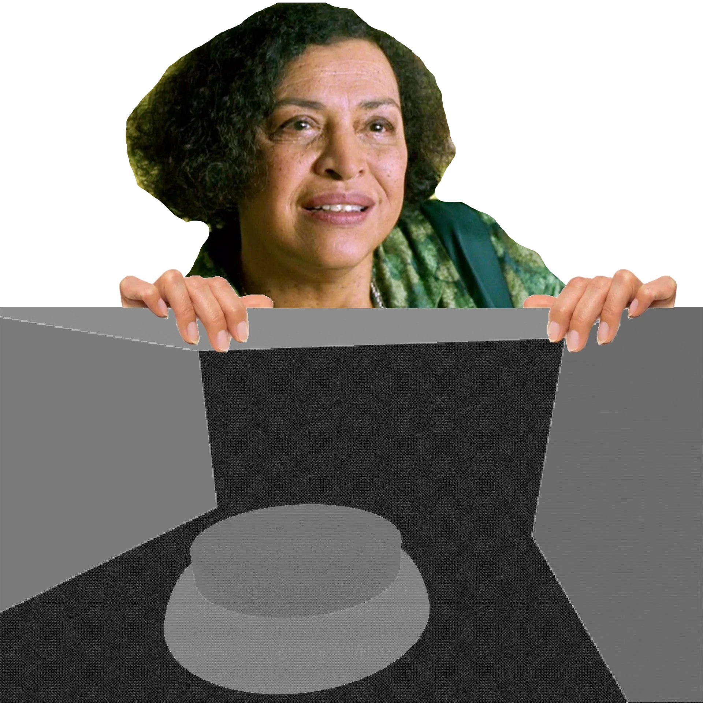

+++
author = 'Turbo Tartine'
date = '2025-02-21T12:51:02+01:00'
draft = true
title = "OpenRE devlog 0 : L'Oracle"
description = 'devlog 0 du projet OpenRE'
+++
## Introduction
Bienvenu dans ce tout premier devlog d'OpenRE : le develog Zéro ! Cette série a pour but de documenter la phase de POC (proof of concept) du projet. Le format sera assez simple. Tout au long du développement, je prendrai des notes dès que je tomberai sur un sujet intéressant. Chaque mois (si j’arrive à m’y tenir), je sélectionnerai les plus pertinents pour les présenter dans un nouveau numéro.

Étant donné qu’OpenRE est un projet personnel que je développe sur mon temps libre, le rythme de publication risque d’être irrégulier. Certains numéros seront plus légers que d’autres, mais ce n’est pas bien grave. Au contraire, ce sera intéressant de voir comment la cadence évolue au fil du temps.

Avant de démarer, je vous recommande de jeter un oeil à la [présentation générale du projet](/projects/open_re). J'y introduit notament quelques notions et un peu de terminologie. Il est préférable de l'avoir parcouru pour contextualiser un peu ce dont je parle dans les devlogs.

Sur ce, c'est parti !

## Shit happens
Petite particularité concernant les première articles de la série : il s'agira de "retro-devlogs". En effet j’ai commencé OpenRE il y a plusieurs mois, sans trop savoir où j’allais. Je n'étais pas sûr que mes expérimentations mèneraient quelque part et de toutes façons, l'idée même de tenir un blog ne m'avais pas encore traversé l'esprit.

Durant cette période, il se trouve que le dépôt git a pris feu (suite à une sombre histoire fichiers blender beaucoup trop volumineux). Je sais qu'il existe des methodes douce pour régler ce genre de problème. Mais j'avoue que sur le moment je ne voyais pas trop l'intérais. J'ai donc bêtement supprimé le dépôt pour en recréer un avec ma copie locale (après avoir fait le nécessaire pour gérer un peu mieux mes scenes).

Résultat : j’ai perdu l’historique du projet. Je ne peux donc  plus réstaurer les premières versions pour analyser ce que j'avais fait. Réaliser des capture d'écran de mes résultats originaux est également impossible. Ces premiers numéros seront donc des reconstitutions.

## Oracle Driven Development
Le premier vrai défi de ce POC est de s'assurer que Blender et Godot peuvent produire des données compatibles. En effet, tous les logiciels graphiques ont leurs propres conventions. La plupart du temps, les divergences concernent des choses comme :  

- Les unités  
- Les espaces colorimétriques  
- Le sens des matrices  
- L'ordre des rotations  
- Les axes du repère  
- …  

Mais en réalité, ça peut être absolument n’importe quoi. Chaque logiciel est truffé de petits partis pris techniques cohérents entre eux. Tant qu'on reste à l'intérieur d'un seul, tout se passe bien. Mais dès qu'ils doivent collaborer et s'échanger des données, ça devient vite l'enfer. Pourtant, si on veut qu'OpenRE fonctionne, il va bien falloir que Blender et Godot arrivent à parler la même langue.  

Pour identifier les ajustements à effectuer, je vais utiliser une technique que j’aime bien et que j’appelle le *Oracle Driven Development*. C’est un peu comme du *Test Driven Development*, sauf qu’au lieu d’avoir un jeu de tests automatisés, propre et exhaustif, je vais bricoler une petite moulinette un peu crado qu'il faudra lancer à moitié à la main. Comme le ferait un oracle, cette moulinette va formuler des prophéties parfois cryptiques à partir de données d'entrée. Interprétées correctement, ces présages nous aideront à avancer dans notre périple.  

## Anatomie de l'Oracle

Dans cette section, on va voir comment fonctionne notre Oracle. Si vous avez lu l'article mentionné dans l'introduction, vous savez qu’OpenRE compose les scènes déterministe (les arrière-plans précalculés) et interactive (les éléments rendus en temps réel) en s’appuyant sur une représentation particulière de ces scenes : les **G-Buffers**. 

Pour verifier que Blender et Godot sont bien sur la même longueure d’onde, on va leur donner des données d'entée identiques (une scène de test). Si il produisent des données de sorties elles aussi identiques (les G-Buffers) alors c’est gagné !

### Mise en place d’une scène test  
Pour commencer, j’ai créé la scène dans Blender. Elle est composée de quelques primitives basiques et d’une caméra. Ensuite, je l’ai reproduite à l’identique dans Godot. L’opération est triviale, puisque Godot prend en charge le format de scène Blender : il suffit d’importer le fichier `.blend` et de l’ajouter dans une scène vide.

  
  

### Comparaison des G-Buffers    
Pour mesurer la compatibilité entre les G-Buffers générés par Blender et Godot, on va implémenter un Oracle, chargé de comparer ces données. Concrètement, cet Oracle est un shader de post-process. Il prend en entrée les textures des deux G-Buffers et le type de texture à comparer. 

Lorsqu'il sera executé, ce shader affichera à l'écran la différence entre les deux textures du type choisi (la déterministe et l'interactive). Cette différence aura une implémentation spécifique pour chaque type de donnée. Mais l'echelle de couleur du fragment de sortie sera toujours la même. Elle ira du noir (données idéntiques) au blanc (données très différentes). 

Ainsi, si toutes les textures sont bindées et que l'oracle affiche un écran noir pour chaque type, ça veut dire que les G-Buffer sont bien identiques. Sinon… eh bien, il va falloir enquêter. L'Oracle ne le fera pas à notre place, mais ils nous donnera de précieux indices.


À terme, les G-Buffers d’OpenRE devront contenir les textures suivantes :  

- **Albedo** (couleur diffuse)  
- **Depth** (profondeur)  
- **Normal** (orientation des surfaces)  
- **ORM** (Occlusion, Roughness, Metallic)  

Mais pour commencer, on va se concentrer sur l’Albedo. Croyez-moi, c’est bien suffisant pour aujourd’hui ! On traitera les autres types de données dans des devlogs dédiés.

### Le shader de l’Oracle  

Voici le code source de l'oracle :  

```glsl
shader_type spatial;
render_mode unshaded, fog_disabled;

void vertex() {
	POSITION = vec4(VERTEX.xy, 1.0, 1.0);
}

// Type de données à comparer
uniform int data_type = 0;

// G-Buffer interactif
uniform sampler2D igbuffer_albedo : filter_nearest;
uniform sampler2D igbuffer_depth : hint_depth_texture, filter_nearest;
uniform sampler2D igbuffer_normal : filter_nearest;
uniform sampler2D igbuffer_orm : filter_nearest;

// G-Buffer déterministe
uniform sampler2D dgbuffer_albedo : filter_nearest;
uniform sampler2D dgbuffer_depth : filter_nearest;
uniform sampler2D dgbuffer_normal : filter_nearest;
uniform sampler2D dgbuffer_orm : filter_nearest;

// Récupère un pixel du G-Buffer déterministe selon le type spécifié
vec3 get_determinist_frag(int tex_type, vec2 coord) {
	if (tex_type == 0) return texture(dgbuffer_albedo, coord).rgb;
	else if (tex_type == 1) return texture(dgbuffer_depth, coord).rgb;
	else if (tex_type == 2) return texture(dgbuffer_normal, coord).rgb;
	else if (tex_type == 3) return texture(dgbuffer_orm, coord).rgb;
	else return vec3(1.0, 1.0, 1.0);
}

// Récupère un pixel du G-Buffer interactif selon le type spécifié
vec3 get_interactive_frag(int tex_type, vec2 coord) {
	if (tex_type == 0) return texture(igbuffer_albedo, coord).rgb;
	else if (tex_type == 1) return texture(igbuffer_depth, coord).rgb;
	else if (tex_type == 2) return texture(igbuffer_normal, coord).rgb;
	else if (tex_type == 3) return texture(igbuffer_orm, coord).rgb;
	else return vec3(0.0, 0.0, 0.0);
}

vec3 albedo_difference(vec3 determinist_frag, vec3 interactive_frag) {
	return abs(determinist_frag - interactive_frag);
}

// Placeholder pour les autres types de différences
vec3 depth_difference(vec3 determinist_frag, vec3 interactive_frag) { 
	return vec3(1.0, 1.0, 1.0); 
}

vec3 normal_difference(vec3 determinist_frag, vec3 interactive_frag) { 
	return vec3(1.0, 1.0, 1.0); 
}

vec3 orm_difference(vec3 determinist_frag, vec3 interactive_frag) { 
	return vec3(1.0, 1.0, 1.0); 
}

// Le main du post process
void fragment() {
	vec3 determinist_frag = get_determinist_frag(data_type, SCREEN_UV);
	vec3 interactive_frag = get_interactive_frag(data_type, SCREEN_UV);
	
	vec3 final_color = vec3(1.0);
	if (data_type == 0) final_color = albedo_difference(determinist_frag, interactive_frag);
	else if (data_type == 1) final_color = depth_difference(determinist_frag, interactive_frag);
	else if (data_type == 2) final_color = normal_difference(determinist_frag, interactive_frag);
	else if (data_type == 3) final_color = orm_difference(determinist_frag, interactive_frag);

	ALBEDO = final_color;
}
```

C'est un petit pavé mais ne vous inquiétez on va le décortiquer ensemble. D'abord on a quelques lignes sur lesquelles on ne s'attardera pas. C'est le code usuel pour créer un post-process dans Godot.
 ```glsl
shader_type spatial;
render_mode unshaded, fog_disabled;

void vertex() {
	POSITION = vec4(VERTEX.xy, 1.0, 1.0);
}
```

Ensuite on a les uniforms qui sont les paramettres d'entrée d'un shader. C'est à travers un uniform que le code CPU peut envoyer de la donné au GPU. Une fois valués, ils peuveut être référencés dans le code du shader un peu comme une variable globale. Comme évoqué précédement ces uniform correspondent aux textures des deux G-Buffers (de la forme ```sampler2D [i|d]gbuffer_<type>```) et au type selectionné pour la comparaison (```int data_type```)
```glsl
// Type de données à comparer
uniform int data_type = 0;

// G-Buffer interactif
uniform sampler2D igbuffer_albedo : filter_nearest;
uniform sampler2D igbuffer_depth : hint_depth_texture, filter_nearest;
uniform sampler2D igbuffer_normal : filter_nearest;
uniform sampler2D igbuffer_orm : filter_nearest;

// G-Buffer déterministe
uniform sampler2D dgbuffer_albedo : filter_nearest;
uniform sampler2D dgbuffer_depth : filter_nearest;
uniform sampler2D dgbuffer_normal : filter_nearest;
uniform sampler2D dgbuffer_orm : filter_nearest;
```

Les 2 blocs suivants sont des helpers qui permettent de sampler la texture demandé dans les G-Buffers :
```glsl
// Récupère un pixel du G-Buffer déterministe selon le type spécifié
vec3 get_determinist_frag(int tex_type, vec2 coord) {
	if (tex_type == 0) return texture(dgbuffer_albedo, coord).rgb;
	else if (tex_type == 1) return texture(dgbuffer_depth, coord).rgb;
	else if (tex_type == 2) return texture(dgbuffer_normal, coord).rgb;
	else if (tex_type == 3) return texture(dgbuffer_orm, coord).rgb;
	else return vec3(1.0, 1.0, 1.0);
}

// Récupère un pixel du G-Buffer interactif selon le type spécifié
vec3 get_interactive_frag(int tex_type, vec2 coord) {
	if (tex_type == 0) return texture(igbuffer_albedo, coord).rgb;
	else if (tex_type == 1) return texture(igbuffer_depth, coord).rgb;
	else if (tex_type == 2) return texture(igbuffer_normal, coord).rgb;
	else if (tex_type == 3) return texture(igbuffer_orm, coord).rgb;
	else return vec3(0.0, 0.0, 0.0);
}
```

S'en suivent les implémentations de la différence pour chaque type de donnée. Vous remarquerez qu'à part ```vec3 albedo_difference(...)```, tout le monde renvois la couleur blanche. Voyez ça comme le ```return null;``` ou le ```throw Exception();``` qu'on met par defaut quand on prévois d’implémenter une fonction plus tard.
```glsl
// Calcul de la différence entre les textures d'albedo
vec3 albedo_difference(vec3 determinist_frag, vec3 interactive_frag) {
	return abs(determinist_frag - interactive_frag);
}

// Placeholder pour les autres types de différences
vec3 depth_difference(vec3 determinist_frag, vec3 interactive_frag) { 
	return vec3(1.0, 1.0, 1.0); 
}

vec3 normal_difference(vec3 determinist_frag, vec3 interactive_frag) { 
	return vec3(1.0, 1.0, 1.0); 
}

vec3 orm_difference(vec3 determinist_frag, vec3 interactive_frag) { 
	return vec3(1.0, 1.0, 1.0); 
}
```

Et enfin il y a la fonction `void fragment()` qui est l'équivalent du `main()` pour un post process. On vois qu'elle utilise les helpers pour récupérer les pixels deterministes et interactifs en fonction du type de donnée selectionné. Puis elle calcule et affiche la difference entre ces deux pixels (selon l'implementation elle aussi designée par le type). 
```glsl
// Le main du post process
void fragment() {
	vec3 determinist_frag = get_determinist_frag(data_type, SCREEN_UV);
	vec3 interactive_frag = get_interactive_frag(data_type, SCREEN_UV);
	
	vec3 final_color = vec3(1.0);
	if (data_type == 0) final_color = albedo_difference(determinist_frag, interactive_frag);
	else if (data_type == 1) final_color = depth_difference(determinist_frag, interactive_frag);
	else if (data_type == 2) final_color = normal_difference(determinist_frag, interactive_frag);
	else if (data_type == 3) final_color = orm_difference(determinist_frag, interactive_frag);

	ALBEDO = final_color;
}
```

## La prophétie originelle
La question qui nous interesse ici est : "est ce que les textures d'Abledo produites par Blender et Godot sont bien harmonisées". Pour poser cette question à notre oracle, il va falloir binder ces textures aux uniforms correspondants du post-process. Ensuite on s'assurera que le paramètre ```data_type``` est bien réglé sur 0 (qui correspond à l'Albedo). On sera alors prêt à recevoir notre prophécie en appuyant sur play. Mais un petit problème subsiste : comment on obtien ces textures d'albedo au juste ?

#### Albedo du G-Buffer déterministe :
Coté Blender on va activer la ```diffCol pass``` de Cycles (qui correspon à l'Albedo) puis on va effectuer un rendu. Grâce au compositor et au noeud ```File Output```, l'image correspondant à cette passe sera automatiquement exportée à l'emplacement spécifié à la fin du rendu. Il n'y aura plus qu'à importer cette image dans Godot et à la binder au ```uniform dgbuffer_albedo```

[Compo => image => import => bind]

#### Albedo du G-Buffer interactif :
Pour la version interactive c'est un peu plus complexe. Le shading language de Godot permet d'injecter cetraines textures dans un uniform que l'on peut ensuite utiliser à souhait dans notre shader. La syntaxe est la suivante :
``` glsl
uniform sampler2D texture : hint_<insert_texture_name>_texture;
```

La texture qui nous interesse ici est ```hint_screen_texture```. Mais malheureusement il ne s'agit pas directement de l'albedo. C'est un rendu classic depuis la caméra prenant en compte la lumière. On va donc tricher un peu en utilisant une render target (un ```SubViewport en terminologie Godot```) dont on va régler le parametre ```Debug Draw``` sur ```Unshaded```. Il suffit ensuite de binder cette render target au ```uniform igbuffer_albedo```

#### C'est maintenant ! C'est maintenant !
Nous avons correctement créé et bindé nos textures d'albedo. Ces données en été obtenues à partir de 2 scenes rigoureusement identiques puisqu'elles viennent du même fichier. Donc si l'importer de Godot est bien capable de traduire les données de Blender pour les conformer à ses propres conventions, nous devrions obtenir un prophécie encourageante (un écran noir). Qu'est-ce qui pourait mal se passer ?



Oh nooooo !

## Décryptage de la professie
Rassurez vous l'importer de Godot fonctionne très bien, le problème n'est pas là. Comme c'est très souvent le cas, la plupart des problème ont été indroduit par la seule étape manuelle de la moulinette : l'export/import de la texture déterministe.

#### Espaces colorimétriques :
Si on observe les textures d'albedo que l'oracle à comparé, le première problème qui saute aux yeux c'est que la texture déterministe apparait une peu "délavée" par rapport à l'autre.


Il s'agit d'un problème d'export. J'avais bien en tête qu'il s'agissait surement d'une histoire d'espace de couleur. Mais Blender porpose un (très, très, très) vaste panel d'options d'export. Trop pour qu'un individu lambda comme moi puisse tout comprendre. J'ai donc expérimenté beaucoup de choses un peu à l'instinct jusqu'à trouver le parametre qui m'interesse.

Il fallait régler champs ```view``` de l'export png sur ```Standard``` :


On peut ensuitre relancer un rendu et donner notre nouvelles texture à l'oracle pour un revision de la prophetie. Et on obtien ça (ce qui est déjà beaucoup mieux.) :


#### Compression de texture en VRAM
Beaucoup mieux certes, pais pas encore gagné. Continuons ! Si on zoom sur l'image de la prophecie révisée, on peu voire apparetre des petits motifs caracteristiques.


Il s'agit d'artefacts de compression. En effet pour économiser la mémoire vidéo et optimiser les echange de données entre le CPU et le GPU, les textures utilisée dans un jeu sont prèsque toujours compréssée. Il est donc normal que le parametre d'import de Godot soient réglés sur ```Compress Mode = VRAM Compressed```. 

Le problème c'est que les algorythmes de compression utilisés par les moteurs ne sont pas vraiment fait pour notre cas d'useage. En effet, la vocation d'une textures la plupart du temps est d'habiller les meshes qui composent la scène, pas de représenter un scène compète affichée en plein écran comme on le fait ici.

Si on compare l'image source à sa version compressée on voit clairement la perte de qualité.


Pour régler ça il suffit de desactiver la compression dans les paramettres d'import de la texture :


Et voici nouvelle réponse de l'oracle quand la texture n'est pas compressée (les plaisenteries les plus courtes étant les meilleures, je vous fais grâce de mon petit montage à partir d'ici).


#### Qualité du png exporté
On a déjà pas mal gagné mais l'image est toujours un peu bruitée. Le lecteur attentif aura surement remarqué le champs ```compression = 15%``` de l'export png quand nous avons régler l'espace de couleur au début. J'ai effetivement essayé de le mettre à 0, mais ça n'a rien changé. J'ai donc essayé d'augmenter la qualité du png en montant la ```Color Depth``` à 16 bit. Et là : Victoire ! La compression à totalement disparue. Mais maintenant on peut voire qu'il y a de gros problèmes de banding. Ce qui est pire...


En effet la documentaion de Godot nous informe que l'import png est limité à 8 bits. Je présume que la couleur de notre image 16 bits est clampée à l'import, ce qui produit les bandes. C'est l'impasse, il va falloir trouver autre chose.

#### Le format EXR à la rescouse
A patire de là, j'ai éteint mon cerveau et j'ai commencé à "brute force" les paramètre d'export de blender à la recherche du meilleur alignement de planète. C'était pas vraiment l'autoroute du fun. Je dramatise peut-être un peu, mais dans mon souvenir ça a pris des jours. Des jours à itérer sur les paramêtres, faire des rendu, donner les texture à manger à l'oracle et scruter les retours essayant de déterminer en quoi c'était mieux ou pire que telle ou telle autre réglage. Le meilleur compromis auquel j'ai pu arriver est le suivant :


Je ne connaissais pas le formats .exr. Pour la petite histoire, il aurait été créé par *Industrial Light & Magic* : la société d'effets spéciaux de *George Lucas*. Les valeurs ```float (half)``` et ```float (full)``` du champs ```Color Depth``` donnent des resultats légèrement différent, mais je n'ai pas été capable de determiner lequel était mieux. En revanche la texture en ```float (full)``` pèse 7.13 MB alors que l'autre atteint à peine les 250 KB. J'ai donc choisi de réster en half (pour le moment).

Malheureusement le resultat n'est pas encore parfait, mais c'est le mieux que j'ai pu faire. Si vous avez une idée de comment l'améliorer : je prends ! Cela dit il faut aussi relativiser. Lorsque on compare les texture d'albedo deterministes et interactives actuelles, il est très difficile de trouver des différences. 


La seule chose que mon oeil arrive à percevoir, c'est un peu d'aliasing au niveau des contours (n'hesitez pas à me dire en commentaire si vous voyez autre chose). Depuis le début les coutours sont en effet très prohiminents. Cela vient du fait que la texture deterministe raytracée par cycle n'est pas aliasée, alors que la version interactive générée par rasterisation dans Godot l'est. On peut donc encore gagner un peu en activant l'aliasing sur la render target.


*Désolé. J'ai pas resisté... ^^*

S'il s'agissait d'un autre type de donnée je serais plus inquiet. Mais pour de l'albedo (qui est basiquement la couleur des surface), le "jugé à l'oeil" ne me parait pas bien dangeureux. Si plus tard dans le developpement on a des problèmes de rendu, ce sera le moment de se rappeller qu'on a une source d'erreur potentielle ici. Mais pour le POC, on va va dire que c'est "good enough".

## Conclusion :
- Dire qu'il faudra plus de scènes pour être sûr
- C'était tr-s long ! Ne perdez pas votre historique ! Vraiment !
