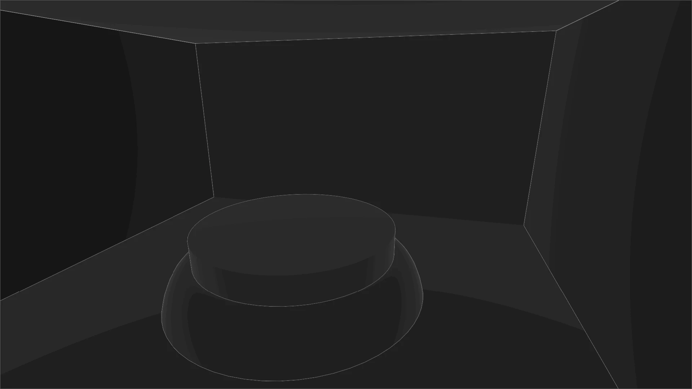
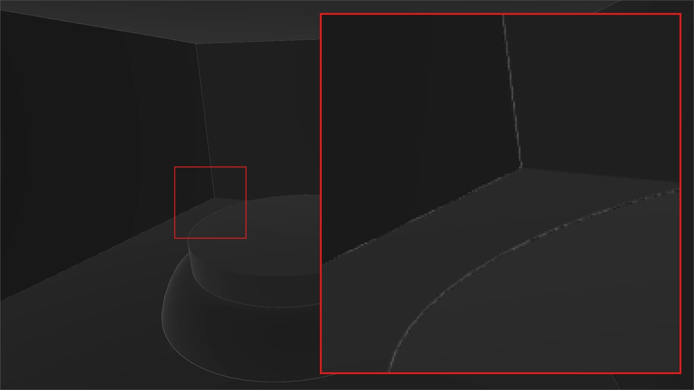

+++
author = 'Turbo Tartine'
date = '2025-04-30T13:45:59+01:00'
draft = false
title = "OpenRE devlog 1 : Harmonisation de l'Albedo"
description = 'devlog 1 du projet OpenRE'
+++

[⬅️ Vers Précédent : "OpenRE devlog 0 : Oracle Driven Development"](projects/open_re_poc_devlog_0)

## I. Avant-propos
Avant de démarrer, je voudrais préciser que, rétrospectivement, je ne suis pas totalement convaincu par le format du premier numéro de cette serie. Je le trouve un peu trop détaillé, peut-être un peu trop "*storytelling*" aussi.
Mon intention est toujours de proposer des articles personnels et authentiques, mais dans le cadre d'un *devlog*, il peut être intéressant de rester relativement concis pour ne pas perdre de vue l'objectif principal : documenter l'avancement du projet.

L'aspect retour d'expérience et le ton détendu me tiennent toujours à cœur. Je compte juste les doser un peu différemment, pour que la charge utile de chaque numéro reste correcte, et viser un temps de lecture compris entre 5 et 10 minutes.
Cela dit, si vous préférez l'ancien format, n'hésitez pas à me le faire savoir !

## II. Introduction
Dans le *devlog* 0, nous avons mis en place un outil permettant d'évaluer le degré d'uniformisation des données issues de Blender (le G-Buffer déterministe) et de Godot (le G-Buffer interactif).
J'appelle cet outil "l'Oracle", et les résultats qui en émergent des "prophéties" (parce que la métaphore est ma figure de style préférée ^^).

Avant de nous quitter, nous avions recueilli notre toute première "prophétie" : une comparaison pixel par pixel des textures d'albédo contenues dans ces G-Buffers.

[](images/initDistance.opti.webp)

Dans cette image en niveaux de gris, plus un pixel est clair, plus la différence entre les textures comparées est grande. Ce résultat n'est donc pas très bon.

Dans ce *devlog*, nous allons appliquer successivement divers réglages (dans Blender et Godot) pour harmoniser nos textures d'albédo déterministe et interactive.
Nous évaluerons l'impact (positif ou négatif) de chaque changement en sollicitant une mise à jour de la prophétie de l'Oracle.
Mais avant cela, intéressons nous à la génération de ces fameuses textures d'albédo.

## III. Génération des textures
Le mois dernier, pour alléger un peu le *devlog* 0, nous avions admis que nos textures d'albédo avaient été "obtenues à partir d’un Godot et d’un Blender dans leur paramétrage d’usine". Voyons d'un peu plus près ce que j'entends par là.

### 1. Albédo déterministe
Pour générer la texture d'albédo déterministe côté Blender, il faut d'abord activer la passe correspondante dans Cycles : la passe de *Diffuse Color*. Cela a pour effet d'ajouter un pin de sortie `diffCol` au nœud principal du *compositor* (`Render Layers`, dans la capture d'écran ci-après).

Ensuite, il n'y a plus qu'à brancher cette `diffCol` à un nœud `File Output`. Ce dernier exportera automatiquement les images connectées à ses pins d'entrée à chaque fin de rendu. Vous pouvez ajouter autant de pins `Input` que nécessaire dans le volet latéral `Node`, et pour chacun d'eux définir un chemin et des options d'export specifiques. Pour l'instant, on a besoin que d'un pin "albedo" avec les réglages par défaut.

[](images/export_albedo_texture.opti.webp)

Pour fludifier le processus de régeneration de l'albédo déterministe, on va faire pointer l'export directement vers un emplacement spécifique du projet Godot. Ainsi, à chaque rendu, la texture sera automatiquement importée dès que Godot reprend le focus. Il faudra bien sûr la "*binder*" une première fois au uniform `dgbuffer_albedo` de l'Oracle (exactement comme on l'a fait dans le *devlog* 0). Mais à partir de là, tout devient automatique.

Mettre à jour la texture d'albédo déterministe pour solliciter une nouvelle prophétie reviendra alors à appuyer sur `F12` pour redéclencher le rendu ! 

### 2. Albédo intéractif

Pour la version interactive, c’est un peu plus complexe. On ne va pas exporter, puis réimporter une image comme je vous l'avais laissé croire. Ça n’aurait pas beaucoup de sens, puisque le monde interactif évolue au *runtime*, et que Godot en fait un rendu à chaque [frame](/pages/glossary/#frame).
En réalité, le moteur est déjà en possession des informations dont on a besoin. Il faut "juste" trouver comment les récupérer et les mettre à disposition de l'Oracle.

Il se trouve que, depuis un [shader](/pages/glossary/#shader), il est possible d'accéder directement à certaines textures spéciales représentant divers aspects de la *frame* courrante (rendu final, profondeur, etc.). La syntaxe est la suivante :
``` glsl
uniform sampler2D texture : hint_<insert_texture_name>_texture;
```

La texture qui nous intéresse ici est hint_screen_texture. Malheureusement, ce n’est pas directement l’albédo : c’est un rendu classique prenant en compte l’éclairage. On ne peut donc pas l'utiliser tel quel dans le code de l'Oracle. Pour contourner ce problème, voici ce que nous allons faire :
- 1. Créer une [render target](/pages/glossary/#render-target) (un `SubViewport` en terminologie Godot).
<br><br>

<br>
- 2. Lui appliquer un [post-process](/pages/glossary/#post-process) très simple, qui affiche directement la `hint_screen_texture`
```glsl
shader_type spatial;
render_mode unshaded, fog_disabled;

uniform sampler2D screen_texture : hint_screen_texture, filter_nearest;

void vertex() {
	POSITION = vec4(VERTEX.xy, 1.0, 1.0);
}

void fragment() {
	ALBEDO = vec3(texture(screen_texture, SCREEN_UV.xy).rgb);
}
```
<br>

- 3. Régler le paramètre `Debug Draw` de la *render target* sur `Unshaded` (pour retirer l'éclairage)
<br><br>

<br>

- 4. Enfin, "*binder*" cette *render target* au `uniform igbuffer_albedo` de l'oracle. Un peu comme nous l'avions fait avec la fausse texture dans le devlog 0, à ceci près que cette fois, la texture n'est pas issue d'un fichier, mais d'un rendu *offscreen* dans une *render target*.

## IV. Réglages
Maintenant que nous savons précisément d'où viennent les textures à comparer, nous pouvons commencer à étalonner les logiciels. Pour réviser la prophecie à chaque modification, il suffira de :
- 1. Presser `F12` dans Blender (si le réglage concerne Blender)
- 2. Puis faire `Play` dans Godot une fois le rendu terminé

### 1. Espace colorimétrique
La première chose qui saute aux yeux lorsqu'on regarde nos textures d'albédo, c'est que la version déterministe paraît délavée.

[](images/init_input_alterance.webp)

Il s'agit d'un problème d'export. Par défaut, le champ `View` de l'*exporter* PNG de Blender est réglé sur l'espace de couleur `AgX`.

[](images/set_standar_view.gif)

Sélectionner `Standard` à la place donne tout dessuite un bien meilleur résultat :

[](images/1_std_Distance.opti.webp)

### 2. Compression de texture en VRAM
On a progressé, mais ce n’est pas encore gagné. En effet, quand on zoome sur la nouvelle prophétie, on remarque la présence de petits motifs caractéristiques.

[](images/1_std_dist_zoom.opti.webp)

Ce sont des artefacts de compression. En effet, dans un jeu, les textures sont presque toujours compressées. Cela permet d'économiser la mémoire vidéo (VRAM) et d'optimiser les échanges de données entre le [CPU](/pages/glossary/#cpu) et le [GPU](/pages/glossary/#gpu). La plupart des moteurs de jeu appliquent donc cette compression par défaut dès l'import.

Cependant, les algorithmes utilisés sont pensés pour des textures destinées à habiller des modèles 3D. Dans ce cas, les artefacts sont imperceptibles. Mais pour un affichage plein écran d'une scène complète présentant des variations abruptes au niveau des contours de chaque objet, la détérioration de l'image source est flagrante.

[](images/alternate_vram_compression.webp)

Pour régler ça, il suffit de désactiver la compression dans les paramètres d'import de la texture.

 

Nouvelle réponse de l’Oracle, cette fois-ci sans compression (et sans le super montage. Parce que les plaisanteries les plus courtes... tout ça, tout ça...).

[](images/2_lossless_detrminist_zoom.opti.webp)

On peut constater que les artefacts ont disparu. Mais l'image reste légèrement bruitée.

### 3. Qualité du PNG exporté
J'ai d'abord pensé qu'il s'agissait également d'artefacts de compression, introduits cette fois-ci à l'export. En effet, l'exporter PNG de Blender contient un champ `Compression` réglé à 15 % par défaut. Malheureusement, le mettre à 0 % n'a rien changé.

Cela pouvait aussi provenir d'une erreur d'arrondi liée à un manque de précision dans l'encodage des couleurs. J'ai donc passé la `Color Depth` à 16 bits, ce qui a supprimé le bruit mais introduit un nouveau problème encore pire que le précédent : du banding.

[](images/3_png_c0_Distance.opti.webp)

D’après la documentation de Godot, l’import PNG est limité à 8 bits. Mon interprétation est que le passage à 16 bits est bien la bonne solution pour corriger le bruit, mais elle n'est pas viable pour nous car l'importeur de Godot tronque les valeurs pour rester en 8 bits. Ce qui crée ces vilaines bandes.

C’est l’impasse. On ne va pas pouvoir s'en sortir avec le format PNG. Il faut trouver autre chose.

### 4. Le format EXR à la rescousse
C'est à ce moment-là que j'ai rangé mon cerveau et que j'ai commencé à *brutforce* les paramètres des exporteurs de chacun des formats de fichier supportés par Blender. C'était pas vraiment l'autoroute du fun. J'ai passé plusieurs jours à faire des rendus et à scruter les présages pour essayer de déterminer en quoi ils étaient mieux ou moins bien que tel ou tel autre.

Heureusement, j'ai fini par trouver un alignement de planètes acceptable avec le format EXR. 

[](images/set_exr_half.opti.webp)

J'ai testé les deux valeurs du champ `Color Depth` : `float (half`) et `float (full)`. Elles donnent des résultats légèrement différents, mais je n'ai pas réussi à décider lequel était réellement meilleur. Cependant, la texture en `float (full)` pèse 7,13 Mo, contre 250 Ko en `float (half)`. J'ai donc choisi de rester sur du *half* (au moins pour le moment).

### 5. L’aliasing
Le résultat n’est pas encore parfait, mais on est vraiment pas mal. Lorsqu'on compare les textures déterministes et interactives actuelles, il devient vraiment difficile de faire la différence.

[](images/gifalt_final_textures.webp)

La seule chose que mon œil arrive à percevoir, c'est un peu d'[aliasing](/pages/glossary/#anti-aliasing) sur les contours (n'hésitez pas à me dire en commentaire si vous voyez autre chose).

Depuis le début, les contours sont effectivement très marqués dans les présages de l'Oracle. Le phénomène est explicable : le *raytracing* de Cycles ne produit pas d'*aliasing*, alors que la [rastérisation](/pages/glossary/#rasterisation) de Godot, si. Ce qui concentre les différences au niveau des zones sujettes à l'*aliasing* : les contours.

On peut donc encore grappiller un peu en activant l'*anti-aliasing* sur la *render target* de la texture interactive.

[](images/5_AA.opti.webp)

## V. Conclusion
On pourrait être un peu déçus de ne pas avoir obtenu un présage complètement noir. Mais prenons un peu de recul sur ce résultat.

D'abord, il faut savoir que l'espace colorimétrique RGB n'est pas uniforme du point de vue de la perception humaine. Cela veut dire que des couleurs en apparence très proches dans cet espace peuvent nous paraître relativement différentes, alors que d'autres, pourtant objectivement plus éloignées, seront indissociables pour notre œil.

En principe, il faudrait donc convertir nos couleurs dans un espace perceptuellement uniforme avant de calculer la distance qui les sépare. Pour être honnête, j'ai tenté une traduction de RGB vers CIELAB, mais je n'ai pas obtenu les résultats que j'espérais. Cela dit, l'opération n'est pas triviale, et il est plus que probable que je me sois trompé en l'écrivant.

Quoi qu’il en soit, ce petit raccourci ne me paraît pas bien dangereux. S’il s’agissait d’un autre type de données, j’aurais été plus inquiet. Mais pour une texture d’albédo, le "jugé à l’œil" me semble suffisant. Si, plus tard dans le développement, on tombe sur des incohérences visuelles, on se souviendra qu’une source d’erreur potentielle existe ici. Mais pour le POC, on va dire que c’est good enough.


Le mois prochain, on fera la même chose pour les textures de profondeur. D'ici là portez vous bien et à bientôt.

<div style="text-align: right"><a href="../open_re_poc_devlog_2">Vers Suivant : "OpenRE devlog 2 : Harmonisation de la profondeur" ➡️</a></div>