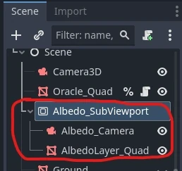
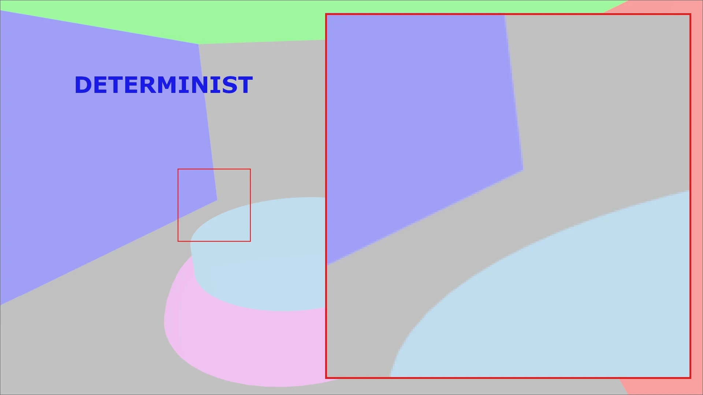

+++
author = 'Turbo Tartine'
date = '2025-03-08T13:45:59+01:00'
draft = true
title = "Harmonisation de l'Albedo"
description = 'devlog 1 du projet OpenRE'
+++
## I. Avant propos
Avant de démarer, je voudrais dire que rétrospectivement, je ne suis pas très convaincu par le format du premier numéro de cette série. Je le trouve un peu trop détaillé, peut être un peu trop "story telling" aussi. C'est toujours une volonté d'essayer de faire des articles un peu personels et authentiques. Mais dans le cadre d'un devlog, il peut être interessant de rester relativement concis pour ne pas perdre de vue l'objectif principal : documenter l'avencement du projet.

L'aspect retour d'experience et le ton détendu restent important pour moi. Je compte juste les doser un peu différement pour que la charge utile d'un numéro reste correcte et viser un temps de lecture entre 5 et 10 min. Cela dit, si vous préferiez l'ancien format, n'hésitez pas à me le faire savoir.

## II. Introduction
Dans le devlog 0, nous avons mis en place un outils permettant d'évaluer le degré d'uniformisation des données issues de Blender (le G-Buffer déterministe) et de Godot (le G-Buffer interactif). J'appel cet outils "l'Oracle" et les résultat qui en émergent des "prophecies" (parce que la métaphore est ma figure de style préférée ^^).

Avant de nous quitter, nous avions receuilli notre toute première "prophecie" : une comparaison pixel par pixel des textures d'albédo contenue dans ces G-Buffers.


Dans cette image en niveau de gris, plus un pixel est claire, plus la différence entre les textures comparées est grande. Ce résultat n'est donc pas très bon.

Dans ce devlog, nous allons appliquer successivement divers réglages (dans Blender et Godot) afin d'harmoniser nos texture d'albédo déterministe et interactive. Nous évalurons l'impacte (positif ou négatif) de chaque changement en solicitant une mise à jour de la prophecie de l'Oracle. Mais avant cela, interessons nous à la génération de ces textures d'albédo.

## III. Génération des textures
Le mois dernier, pour alléger un peu le devlog 0, nous avions admis que nos textures d'albédo avaient été “obtenues à partir d’un Godot et d’un Blender dans leur paramétrage d’usine”. Voyons d'un peu plus près ce que j'entands par là.

### 1. Albédo déterministe
Pour générer la texture d'albédo déterministe côté Blender, il faut d'abord activer la passe correspondante dans Cycles : la passe de *Diffuse Color*. Cela a pour effet d'ajouter la pin de sortie `diffCol` au noeud principal du compositor (`Render Layers` dans la capture d'écran ci après).

Ensuite il n'y a plus qu'à brancher cette `diffCol` à un noeud `File Output`. Ce dernier a pour effet d'exporter automatiquement les images branchées à ses pins d'entrée lorsqu'un rendu est effectué. Vous pouvez ajouter autant de pins `Input` que vous voulez dans le volet latéral `Node` et pour chacun d'eux vous pouvez définir le chemin et les options d'export du rendu.


Pour gagner du temps, on peut règler le chemin d'export directement vers un emplacement spécifique du projet Godot. Ainsi à chaque rendu, la texture sera automatiquement importée dès que la fenêtre Godot reprend le focus. Il faudra biensure "binder" une première fois la texture au `uniform dgbuffer_albedo` de l'Oracle (exactement comme on l'a fait dans le devlog 0), mais à partir de la, tout est automatique. 

Ainsi, mettre à jour la texture d'albédo détèrministe pour soliciter une nouvelle prophecie reviendra à appuyer sur `F12` pour redéclencher le rendu 

### 2. Albédo intéractif

Pour la version interactive, c’est un peu plus complexe. On ne va pas exporter, puis réimporter une image comme je vous l'ai laissé croire. Ca n'aurait pas beaucoup de sens étant donné que le monde intéractif évolue au runtime et que Godot en fait un rendu à chaque frame. En réalité, le moteur est déjà en pocession des informations dont on a besoin. On doit "juste" trouver comment les récupérer et les mettre à disposition de l'Oracle.

Il se trouve que depuis un shader, il est possible d'accéder directement à des textures spéciales représentant divers aspects de la frame actuelle (rendu final, profondeur etc...). La syntaxe est la suivante :
``` glsl
uniform sampler2D texture : hint_<insert_texture_name>_texture;
```

La texture qui nous intéresse ici est `hint_screen_texture`. Malheureusement, ce n’est pas directement l’albédo, mais un rendu classique prenant en compte la lumière. On ne peut donc pas l'utiliser telle quel dans le code de l'Oracle. Pour contourner ce problème, nous pouvons :
- 1. créer une Render Target (un `SubViewport` en terminologie Godot)


<br><br>
- 2. lui appliquer un post-process simple affichant simplement la `hint_screen_texture`
```glsl
shader_type spatial;
render_mode unshaded, fog_disabled;

uniform sampler2D screen_texture : hint_screen_texture, filter_nearest;

void vertex() {
	POSITION = vec4(VERTEX.xy, 1.0, 1.0);
}

void fragment() {
	ALBEDO = vec3(texture(screen_texture, SCREEN_UV.xy).rgb);
}
```
<br>

- 3. régler le paramètre `Debug Draw` de la Render Target sur `Unshaded` (pour ne plus avoir la lumière)

 
<br><br>

- 4. "binder" cette render target au `uniform igbuffer_albedo` de l'oracle. Un peu comme nous l'avions fait avec la fausse texture du devlog 0, à ceci près que cette fois la texture n'est pas issue d'un fichier sur le disque, mais d'un rendu offscreen dans une render target.

## IV. Réglages
Maintenant que nous savons précisément d'où viennent les textures à comparer, nous pouvons commencer à étalonner les logiciels. Pour réviser la prophecie à chaque modification, il suffira de :
- 1. Presser `F12` dans Blender (uniquement si le réglage concerne Blender)
- 2. Puis faire `Play` dans Godot une fois le rendu terminé

### 1. Espace colorimétrique
La première chose qui saute aux yeux lorsqu'on regarde nos textures d'albédo, c'est que la version déterministe parait délavée.


Il s'agit d'un problème d'export. Par défaut, le champs `View` de l'*exporter* PNG de Blender est réglé sur l'espace de couleur `AgX`. 


Sélectionner `Standard` à la place donne un bien meilleur résultat :


### 2. Compression de texture en VRAM
On a progressé, mais ce n’est pas encore gagné. En effet, quand on zoom sur la nouvelle prophécie, on remarque la présence de petits motif caracteristiques.


 Ce sont des artefacts de compression. En effet, dans un jeu les textures sont presque toujours compressée. Cela permet d'économiser la mémoire vidéo (VRAM) et d'optimiser les échanges de donnés entre le CPU et le GPU. La plupart des moteurs de jeu appliquent donc cette compression par défaut dès l'import.

Cependant les algorithmes utilisés sont pensés pour des textures destinées à habiller des models 3D. Dans le cas nominal, ces artefactes sont imperceptibles. Mais pour un affichage plein écran d'une scène complète présentant des variations abrutes au niveau des contours de chaque objet, la déterioration de l'image source est flagrante.


Pour régler ça, il suffit de desactiver la compression dans les paramètres d'import de la texture.


Nouvelle réponse de l’Oracle, cette fois ci sans compression. (Et sans le super montage. Parce que les plaisenteries les plus courtes... tout ça, tout ça...).


On peut constater que les artefact ont disparu. Mais l'image est toujours légèrement bruitée.

### 3. Qualité du png exporté
J'ai d'abord pensé qu'il s'agisait également d'artefacts de compression, introduit cette fois ci à l'export. En effet, l'exporter PNG de Blender contient un champs `Compression` réglé à 15% par defaut. Malheureusement le mettre à 0% n'a rien changé. 

Cela pouvait aussi provenir d'une erreur d'arrondi lié à un manque de précision dans l'encodage des couleurs. J'ai donc passé la `Color Depth` à 16 bits ce qui a supprimé le bruit mais introduit un nouveau problème encore pire que le précédent : du banding.


D’après la documentation de Godot, l’import PNG est limité à 8 bits. Mon interprétation est que le passage à 16 bits est bien la bonne solution pour corriger le bruit. Mais elle n'est pas viable pour nous, car l'importer de Godot tronque les valeurs pour rester en 8 bits, ce qui crée ces vilaines bandes.

C’est l’impasse. On ne va pas pouvoir s'en sortir avec le format PNG. Il faut trouver autre chose.

### 4. Le format EXR à la rescouse
C'est à ce moment là que j'ai rangé mon cerveau et que j'ai commencé à *brut force* les paramètres des *exporters* de chacuns des formats de fichier supportés par blender. C'était pas vraiment l'autoroute du fun. J'ai passé plusieurs jours à faire des rendu et à scruter les préseages pour essayer de déterminer en quoi ils étaient mieux ou moins bien que tel ou tel autre.

Heureusement j'ai fini par trouver un alignement de planète accepable avec le format EXR. 


J'ai testé les 2 valeurs du champs `Color Depth` : `float (half)` et `float (full)`. Elles donnent des résultats légèrement différentes, mais je n'ai pas réussi à décider lequel était réellement meilleur. Cependant, la texture en `float (full)` pèse 7,13 Mo, contre 250 Ko en `float (half)`. J'ai donc choisi de rester sur du half (au moins pour le moment).

### 5. L’Aliasing
Le résultat n’est pas encore parfait, mais on est vraiment pas mal. Lorsqu'on compare les textures déterministes et interactives actuelles, il devient vraiment difficile de faire la différence.



La seule chose que mon oeil arrive à percevoir, c'est un peu d'aliasing sur les contours (n'hesitez pas à me dire en commentaire si vous voyez autre chose).  

Depuis le début, les contours sont effectivement très marqués dans les présages de l'oracle. Le phénomène est expliquable : le raytracing de Cycles ne produit pas d'aliasing, alors que la rasterisation de Godot si. Ce qui concentre des différences au niveau des zones sujettes à l'aliasing : les contours.

On peut donc encore grapiller un peu en activant l'anti-aliasing sur la Render Target de la texture interactive.

## V. Conclusion
On pourrait être un peu deçus de ne pas avoir obtenu un présage completement noir. Mais prenons un peu de recul sur ce résultat. 

D'abord il faut savoir que l'espace colorimétrique RGB n'est pas uniforme du point de vue de la perception humaine. Cela veut dire que des couleurs en apprence très proches dans cet espace peuvent nous aparaitre relativement différentes, alors que d'autres, pourtant objectivement plus éloignées, seront indisociables pour notre oeil.

En principe, il faudrait donc convertir nos couleurs dans un espace perceptuellement uniforme avant de calculer la distance qui les sépare. Pour être honnête, j'ai tenté une traduction RGB vers CIELAB, mais je n'ai pas eu les résultat que j'espérais. Cela dit l'opération n'est pas trivial et il est plus que probable que je me sois trompé en l'écrivant.

Quoi qu'il en sois, ce petit racourcis ne me parait pas bien dangeureux. S’il s’agissait d’un autre type de données, j’aurais été plus inquiet. Mais pour une texture d’albédo, le "jugé à l’œil" me semble suffisant. Si plus tard dans le développement, on tombe sur des incohérences visuelles, on se souviendra qu’une source d’erreur potentielle existe ici. Mais pour le POC, on va dire que c’est good enough.

