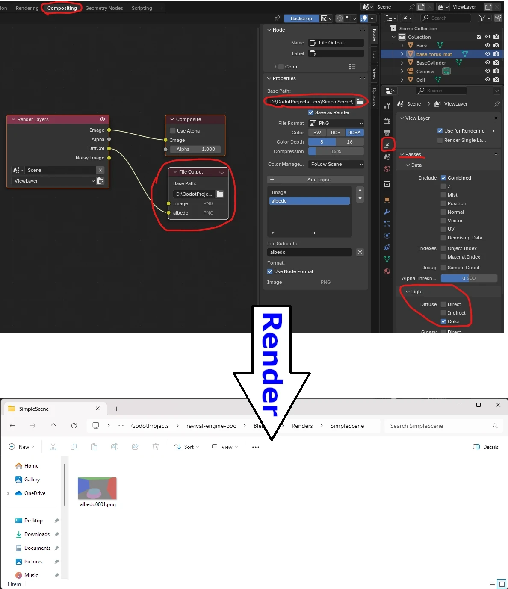
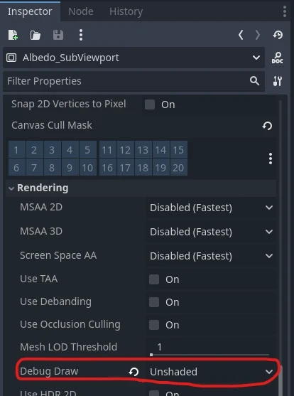

+++
author = 'Turbo Tartine'
date = '2025-03-08T13:45:59+01:00'
draft = true
title = 'Open_re_poc_devlog_1'
description = 'devlog 1 du projet OpenRE'
+++
## Introduction
Bienvenu dans ce tout premier devlog d'OpenRE : le develog Zéro ! Cette série a pour but de documenter la phase de POC (proof of concept) du projet. Le format sera assez simple. Tout au long du développement, je prendrai des notes dès que je tomberai sur un sujet intéressant. Chaque mois (si j’arrive à m’y tenir), je sélectionnerai les plus pertinents pour les présenter dans un nouveau numéro.

Étant donné qu’OpenRE est un projet personnel que je développe sur mon temps libre, le rythme de publication risque d’être irrégulier. Certains numéros seront plus légers que d’autres, mais ce n’est pas bien grave. Au contraire, ce sera intéressant de voir comment la cadence évolue au fil du temps.

Avant de démarer, je vous recommande de jeter un oeil à la [présentation générale du projet](/projects/open_re). J'y introduit notament quelques notions et un peu de terminologie. Il est préférable de l'avoir parcouru pour contextualiser un peu ce dont je parle dans les devlogs.

Sur ce, c'est parti !

## Shit happens
Petite particularité concernant les première articles de la série : il s'agira de "retro-devlogs". En effet j’ai commencé OpenRE il y a plusieurs mois, sans trop savoir où j’allais. Je n'étais pas sûr que mes expérimentations mèneraient quelque part et de toutes façons, l'idée même de tenir un blog ne m'avais pas encore traversé l'esprit.

Durant cette période, il se trouve que le dépôt git a pris feu (suite à une sombre histoire de fichiers blender beaucoup trop volumineux). Je sais qu'il existe des methodes douce pour régler ce genre de problème. Mais j'avoue que sur le moment je ne voyais pas trop l'intérais. J'ai donc bêtement supprimé le dépôt pour en recréer un avec ma copie locale (après avoir fait le nécessaire pour gérer un peu mieux mes scenes).

Résultat : j’ai perdu l’historique du projet. Je ne peux donc  plus réstaurer les premières versions pour analyser ce que j'avais fait. Réaliser des capture d'écran de mes résultats originaux est également impossible. Ces premiers numéros seront donc des reconstitutions.

## Problématique de l'harmonisation des données
Si vous avez lu l'article mentionné dans l'introduction, vous savez qu'OpenRE permet de fusionner le rendu de 2 scènes :
- La scène déterministe : précalculée dans Blender
- La scène intéractive : rendue en temps réèl dans Godot.

Pour cela, la technologie s'appuie sur une structure de donnée particulière appelée un G-Buffer. Pour rappel, il s'agit d'une collections de textures encodant diverse données géométriques relative à un point de vu sur une scène. OpenRE fusionne donc le G-Buffer déterministe précalculé par Blender et le G-Buffer interactif rendu à la volée dans Godot. Mais il n'est pas évident que des données produite par deux logiciels différents soitent directement compatibles. C'est même pas gagné du tout en réalité.

En effet, tous les logiciels graphiques suivent des conventions qui leurs sont propres (unités, espaces colorimétriques, axes du repère ...). Tant qu'on reste à l'interieur d'un système, la cohérence de l'ensemble est plus ou moins garantie. Mais dès lors que deux systèmes doivent s'échanger des données pour collaborer, c'est le début des problèmes.

Avant toute choses, il va donc falloir s'arranger pour que Blender et Godot parlent la même langue. Et comme on va le voir, cela va demander un certain nombre d'ajustements.

## La méthode de l'oracle
Pour identifier ces ajustements, je vais utiliser une technique que j’aime bien et que j’appelle le *Oracle Driven Development*. C’est un peu comme du *Test Driven Development*, sauf qu’au lieu d’avoir un jeu de tests automatisés, propre et exhaustif, je vais bricoler une petite moulinette qu’il faudra lancer à moitié à la main. 

A la manière d'un oracle, cette moulinette va formuler des prophéties parfois cryptiques en réponse aux questions qu'on lui pose. Mais interprétés correctement, ces présages nous aideront à avancer dans notre périple.

Si Godot et Blender sont bien sur la même longueure d'ondes, les G-Buffer qu'ils produisent à partir d'une même scène devraient être identiques. C'est ce que nous allons chercher à vérifier avec l'aide de l'oracle. Son rôle sera de comparer les G-Buffers, et de nous délivrer son jugement sous la forme d'une image. Il nous faudra alors lire norte réponse dans cette image.


Mais trève de métaphore. Concrètement, cet Oracle est un post-process du nom de oracle.gdshader. Il prend en entrée les textures des deux G-Buffers et le type de texture à comparer. Son job est de calculer la différence entre les deux textures du type choisi (la déterministe et l’interactive) et de l'afficher à l'écran. Selon le type de donné, les différences pourront avoir des implémentations spécifiques. Mais chacune de ces implémentaions renveront une nuance de gris à interpréter comme suit :
- noir -> les pixels sont identiques
- blanc -> la différence entre les pixels est maximale

#### Implementation de l’Oracle  

Voici le code source de l'oracle. C'est un petit pavé, mais ne vous inquiétez pas, on va le décortiquer ensemble. 

```glsl
shader_type spatial;
render_mode unshaded, fog_disabled;

void vertex() {
	POSITION = vec4(VERTEX.xy, 1.0, 1.0);
}

// Type de donnée à comparer
uniform int data_type = -1;

// Determinist & Interactive G-Buffer
const int NB_GMAPS = 1;
uniform sampler2D[NB_GMAPS] d_gbuffer : filter_nearest;
uniform sampler2D[NB_GMAPS] i_gbuffer : filter_nearest;

// Choix du mode d'affichage
#define I_D_DIFFERENCE 0
#define D_TEXTURE_ONLY 1
#define I_TEXTURE_ONLY 2
uniform int view_mode = 0;

const vec3 ERROR_COLOR = vec3(1.0, 0.0, 1.0);

// Calcule la différence entre 2 pixels 
vec3 compute_difference(vec3 d_frag, vec3 i_frag) {
	return ERROR_COLOR;
}


// Point d'entrée du post-process
void fragment() {
	vec3 out_color = ERROR_COLOR;
	
	if (data_type >= 0 && data_type < NB_GMAPS) {
		// Récupération des pixels déterministe et interactif
		vec3 d_frag = texture(d_gbuffer[data_type], SCREEN_UV).rgb;
		vec3 i_frag = texture(i_gbuffer[data_type], SCREEN_UV).rgb;
		
		// Selection de l'affichage
		switch (view_mode) {
			case I_D_DIFFERENCE:
				// Cas nominal : LA PROPHECIE !!!
				out_color = compute_difference(d_frag, i_frag);
				break;
			case D_TEXTURE_ONLY:
				// Affichage du pixel deterministe brut
				out_color = d_frag;
				break;
			case I_TEXTURE_ONLY:
				// Affichage du pixel interactif brut
				out_color = i_frag;
				break;
		}
	}
	
	ALBEDO = out_color;
}
```

#### 1. Code minimal d'un Post-Process 
D'abord, quelques lignes de base qu'on ne détaillera pas. C'est la façon usuelle de créer un post-process dans Godot.
 ```glsl
shader_type spatial;
render_mode unshaded, fog_disabled;

void vertex() {
	POSITION = vec4(VERTEX.xy, 1.0, 1.0);
}
```

#### 2. Les uniforms ou paramettres d'entrée
Les uniforms sont les paramètres d'entrée du shader. C'est à travers eux que le CPU peut envoyer des données au GPU. Une fois initialisés, ils peuvent être référencés comme des variables globales dans le code du shader.

Les uniforms `data_type`, `d_gbuffer` et `i_gbuffer` correspondent aux deux G-Buffers ainsi qu'au type de donnée sélectionné pour la comparaison (évoqués précédement).
```glsl
// Type de donnée à comparer
uniform int data_type = -1;

// Determinist & Interactive G-Buffer
const int NB_GMAPS = 1;
uniform sampler2D[NB_GMAPS] d_gbuffer : filter_nearest;
uniform sampler2D[NB_GMAPS] i_gbuffer : filter_nearest;

// Choix du mode d'affichage
#define I_D_DIFFERENCE 0
#define D_TEXTURE_ONLY 1
#define I_TEXTURE_ONLY 2
uniform int view_mode = 0;
```

Le paramètre `view_mode` lui est nouveau. On en a pas encore parlé. C'est un paramettre de debug qui nous permettra d'afficher facilement des images intermédiaires pour nous aider à intérpréter les prophéties de l'oracle. Pour l'instant on ne peut visualiser que les textures interactive et déterministe corespondant au type de donnée sélectionné. Mais au fur et à mesure qu'on avance, on pourra rajouté de nouveaux mode d'affichage.

#### 3. Calcul des différences
C'est ici qu'on implémentera le calcule de la différence. Ou devrais-je dire DES différences. Comme on le verra dans la suite, on sera amenés à traiter les données différement selon leur type.
```glsl
const vec3 ERROR_COLOR = vec3(1.0, 0.0, 1.0);

// Calcule la différence entre 2 pixels 
vec3 compute_difference(vec3 d_frag, vec3 i_frag) {
	return ERROR_COLOR;
}
```
Pour l'instant la fonction renvoit simplement la valeur `ERROR_COLOR` qui est un magenta bien dégueu qui nous interpellera si on le voit à l'écran. C'est quelque chose que je fais assez souvent et qui correspondrait à un `throw new Exception();` ou d'un `return -1;` en code CPU.

En effet, les GPU sont assez limités en terme de gestion d'erreur. Il faut donc parfois être un peu créatif. Si vous en avez, n'hésitez pas à paratger vos technique personnelles dans les commentaires.

#### 4. fragment() = post-process.main()
Et enfin il y a la fonction `void fragment()` qui est le point d'entrée principal du post process.

La première chose qu'on peut noter, c'est que je réutiliser ma stratégie du `ERROR_COLOR` dans une saveur un peu différente. Ici je verifie les valeurs des uniforms `data_type` et `view_mode` pour m'assurer qu'elles sont valides. **IL NE FAUT JAMAIS FAIRE CA DANS UN SHADER DE PRODUCTION !**

J'expliquerai peut être pourquoi dans un article un jour. Mais retenez que pour des raisons de performences, les branchements conditionnels sont à éviter au maximum dans le code GPU. Ici on s'en fout car on est sur un POC et que l'oracle n'est qu'un outil dont on se sert pour le développement. La performence n'est pas critiques, on se permet donc quelque libertées pour se faciliter vie.
```glsl
// Point d'entrée du post-process
void fragment() {
	vec3 out_color = ERROR_COLOR;
	
	if (data_type >= 0 && data_type < NB_GMAPS) {
		// Récupération des pixels déterministe et interactif
		vec3 d_frag = texture(d_gbuffer[data_type], SCREEN_UV).rgb;
		vec3 i_frag = texture(i_gbuffer[data_type], SCREEN_UV).rgb;
		
		// Selection de l'affichage
		switch (view_mode) {
			case I_D_DIFFERENCE:
				// Cas nominal : LA PROPHECIE !!!
				out_color = compute_difference(d_frag, i_frag);
				break;
			case D_TEXTURE_ONLY:
				// Affichage du pixel deterministe brut
				out_color = d_frag;
				break;
			case I_TEXTURE_ONLY:
				// Affichage du pixel interactif brut
				out_color = i_frag;
				break;
		}
	}
	
	ALBEDO = out_color;
}
```
Le reste du code est assez trivial. D'abord on sample les pixels que l'on souhaite comparer. Ensuite, dans le cas nominal (`view_mode == I_D_DIFFERENCE`) on invoque `compute_difference(...)` sur ces derniers pour déterminer la couleur à afficher. 

Si un mode d'affichage de debug est actif, on execute les traitements appropriés à la place (ici, on affiche le pixel brut de la texture correspondante).

## Préparation des données
Nous savons désormais comment fonctionne l’oracle, mais nous n’avons pas encore de données à lui soumettre. Il faut donc les construire.

#### Mise en place d’une scène de test 
Pour commencer, j’ai créé une petite scène dans Blender, composée de quelques primitives basiques et d’une caméra. Ensuite, je l’ai reproduite à l’identique dans Godot. L’opération est triviale car Godot prend en charge le format de scène Blender. il suffit d’importer le fichier .blend et de l’ajouter dans une scène vide.

  


Les G-Buffers déterministes et interactifs que nous présenteront à l’oracle seront issus de ces scènes. À terme - comme le code source vous l'a certainement spoilé - ils devront contenir les textures suivantes :
- **Albedo** (couleur diffuse)  
- **Depth** (profondeur)  
- **Normal** (orientation des surfaces)  
- **ORM** (Occlusion, Roughness, Metallic)  

Mais pour le moment, concentrons-nous sur l’Albedo. Croyez-moi, c’est déjà bien suffisant pour aujourd’hui ! Nous traiterons les autres types de données dans des devlogs dédiés.

#### Albedo du G-Buffer déterministe
Pour générer la texture d’Albedo déterministe dans Blender, nous allons commencer par activer la passe de *Diffuse Color* de Cycles (qui correspond à l’Albedo)

Ensuite il va falloir effectuer un rendu. Grâce au compositor et au nœud ```File Output```, l’image correspondant à cette passe sera automatiquement exportée à l’emplacement spécifié à la fin du rendu. 



Il ne restera plus qu’à importer cette image dans Godot et à la "binder" au ```uniform dgbuffer_albedo``` de l'oracle.


#### Albedo du G-Buffer interactif :
Pour la version interactive, c’est un peu plus complexe. Godot nous permet d’injecter certaines textures dans un uniform, que l’on peut ensuite utiliser dans le shader. La syntaxe est la suivante :
``` glsl
uniform sampler2D texture : hint_<insert_texture_name>_texture;
```

La texture qui nous intéresse ici est `hint_screen_texture`.Malheureusement, ce n’est pas directement l’Albedo, mais un rendu classique depuis la caméra, prenant en compte la lumière. Pour contourner ce problème, nous allons :
- 1. créer une Render Target (un `SubViewport` en terminologie Godot)


<br><br>
- 2. lui appliquer un post-process simple affichant simplement la `hint_screen_texture`
```glsl
shader_type spatial;
render_mode unshaded, fog_disabled;

uniform sampler2D screen_texture : hint_screen_texture, filter_nearest;

void vertex() {
	POSITION = vec4(VERTEX.xy, 1.0, 1.0);
}

void fragment() {
	ALBEDO = vec3(texture(screen_texture, SCREEN_UV.xy).rgb);
}
```
<br>

- 3. régler le paramètre `Debug Draw` de la Render Target sur `Unshaded` 

 
<br><br>

- 4. "binder" cette Render Target au `uniform igbuffer_albedo` de l'oracle


## Harmonisation de l'albédo :
Nos textures d’albédo sont en place, correctement créées et "bindées". Elles proviennent de deux scènes rigoureusement identiques issues du même fichier. Si "l’importer" de Godot à bien fait son travail en traduisant les données de Blender, on devrait obtenir une prophétie rassurante… c'est-à-dire un bel écran noir.

Qu’est-ce qui pourrait mal se passer ?


Oh nooo !!!

Pas de panique, Godot fait ce qu’il doit faire, le problème ne vient pas de lui. Comme souvent, ce sont les étapes manuelles de la moulinette qui introduisent les erreurs. A savoirs l’export et l'import de la texture déterministe.

#### Espaces colorimétriques :
En observant nos textures d'albedo, un détail saute immédiatement aux yeux : la version déterministe apparait assez délavée.


C'est un problème d’export. J’avais une intuition sur l’origine du souci : une histoire d’espace de couleur. Il s'avère qu'il fallait régler champs `View` de l'*exporter* .png sur `Standard` :


Un petit rendu plus tard, on peut soumettre cette nouvelle texture à l’Oracle… et cette fois, la prophétie est bien plus rassurante


#### Compression de texture en VRAM
On a progressé, mais ce n’est pas encore gagné. En zoomant sur l'image de l'oracle, on remarque de petits motif caracteristiques.


Ce sont des artefacts de compression. Pour économiser de la mémoire vidéo et optimiser les échanges entre le CPU et le GPU, les textures en jeu sont presque toujours compressées. Logique, donc, que Godot compresse par defaut les textures à l'import.

Le problème, c'est que les algorithmes de compression des moteurs de jeu ne sont pas conçus pour notre cas d'usage. Une texture classique est destinée à habiller un mesh. Un affichage plein écran d'une scene entière n'est pas vraiment usuel. Si on compare l’image source à sa version compressée, la perte de qualité est flagrante.


Pour régler ça, il suffit de desactiver la compression dans les paramètres d'import de la texture.


Nouvelle réponse de l’Oracle, cette fois sans compression. (Et sans le super montage. Parce que les plaisenteries les plus courtes... tout ça, tout ça...)


#### Qualité du png exporté
On a déjà pas mal gagné mais l'image est toujours un peu bruitée. 

Le lecteur attentif aura remarqué que l'*exporter* .png de Blender applique par defaut un 15% de compression un peu suspect.


 J’ai donc tenté de le régler sur 0%... mais ça n'a rien changé. J’ai alors tenté une autre approche : augmenter la Color Depth à 16 bits. Et là… victoire ! Plus aucune trace de compression.

… Bon, à la place on a maintenant un gros problème de banding. Ce qui est encore pire.


D’après la documentation de Godot, l’import PNG est limité à 8 bits. J’imagine que l’image 16 bits est tronquée à l’import, ce qui crée ces vilaines bandes.

C’est l’impasse. Il faut trouver une autre solution.

#### Le format EXR à la rescouse
A partir de là, je me suis mis à explorer les différents formats de fichier proposés par blender. J'ai rangé mon cerveau, et j'ai commencé à *brut force* les paramètres de chacuns des *exporters*. 

C'était pas vraiment l'autoroute du fun. Pendant plusieurs jours, j'ai fait des rendus, donné les textures à manger à l'oracle, et scruté ses préseages essayant de déterminer en quoi ils étaient mieux ou moins bien que tel ou tel autre. Mais j'ai fini par trouver un alignement de planètes acceptable.


Je ne connaissais pas le format `.exr`. Pour la petite histoire, il a été développé par *Industrial Light & Magic* : la société d'effets spéciaux de *George Lucas*. 

J'ai testé les 2 valeurs du champs `Color Depth` : `float (half)` et `float (full)`. Elles donnent des résultats légèrement différentes, mais je n'ai pas réussi à décider lequel était réellement meilleur. Cependant, la texture en `float (full)` pèse 7,13 Mo, contre 250 Ko en `float (half)`. J'ai donc choisi de rester sur du half (au moins pour le moment).

#### L'Aliasing
Le résultat n’est pas encore parfait, mais c’est le mieux que j’ai pu obtenir. Si vous avez une idée de comment l'améliorer : je prends !

Cela dit, lorsqu'on compare les textures déterministes et interactives actuelles, il devient vraiment difficile de trouver une différence.


La seule chose que mon oeil arrive à percevoir, c'est un peu d'aliasing sur les contours (n'hesitez pas à me dire en commentaire si vous voyez autre chose).  

Depuis le début, les contours sont effectivement très marqués dans les présages de l'oracle. Le phénomène est expliquable : le raytracing de Cycles ne produit pas d'aliasing, alors que la rasterisation de Godot si. Ce qui concentre des différences au niveau des zones sujettes à l'aliasing : les contours.

On peut donc encore grapiller un peu en activant l'anti-aliasing sur la Render Target de la texture interactive.

## Conclusion :
Prenons un peu de recul sur nos résultats. D'abord, il faut garder en tête que notre scène de test est très simpliste. Pour être vraiment sûr que Godot et Blender sont bien en phase, il faudra plus de données et surtout des données plus complexes. Ca viendra. Godot comprends les .blend et nous avons desormais un oracle dans l'équipe. Il sera donc relativement facile de mettre à l'épreuve de nouvelles scènes au fur et à mesure qu'on avance. Et si de nouvelles disonances apparaissent, l'enquête sera réouverte.

Ensuite, on pourrait être un peu deçus de ne pas avoir obtenu un présage completement noir. S’il s’agissait d’un autre type de données, j’aurais été plus inquiet. Mais pour une texture d’albédo (qui est basiquement la couleur des surfaces), le "jugé à l’œil" me semble suffisant. Encore une fois si plus tard dans le développement, on tombe sur des incohérences visuelles, on se souviendra qu’une source d’erreur potentielle existe ici. Mais pour le POC, on va dire que c’est good enough.


Je couclurai en disant que ce devlog à été assez compliqué à écrire. J'ai perdu beaucoup de temps à me remémorer les chose et à les reconstituer (prenez soin de votre git les amis). Mais je reconnais quand même deux avantages à cette situation :
- 1. Repasser sur mon travail m'a permis d'affiner certains points. En effet, dans ma version originale j'avais ajusté plus de choses. Mais je me suis appercus que certains de mes réglages se compensaient l'un l'autre et qu'ils étaient en réalité inutils. Le set d'ajustement que je presente ici est plus minimaliste, ce qui est une très bonne chose. 

- 2. Le TurboTartine du futur, malgré ses problèmes de mémoire, sait à peu près ce qu'il a fait ensuite. Ce qui je pense aide à la structuration. Mais surtout, ça me permets d'annoncer le sujet du prochain numéro : l'harmonisation des textures de profondeur.

