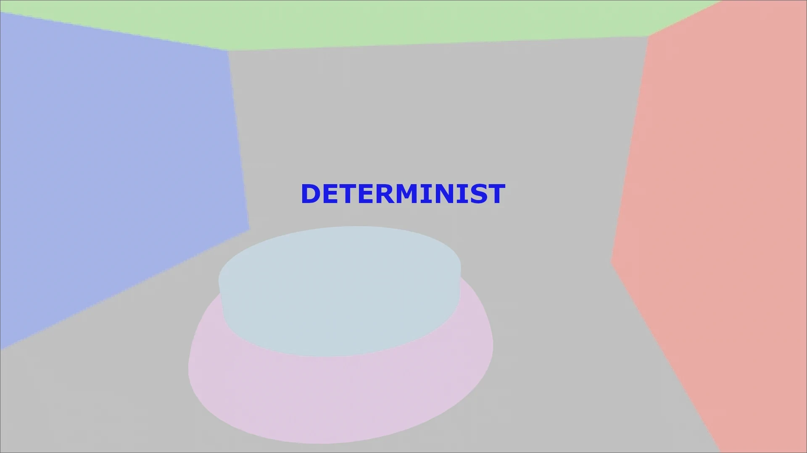
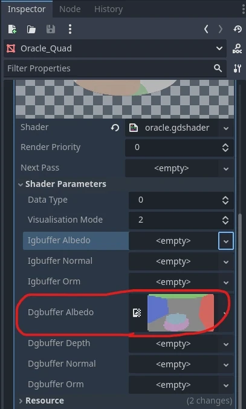
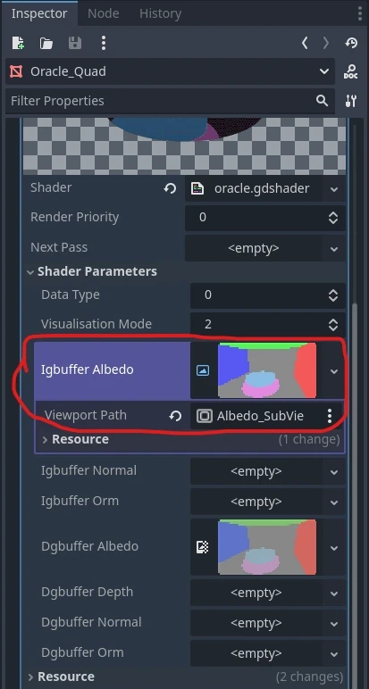

+++
author = 'Turbo Tartine'
date = '2025-03-08T13:45:59+01:00'
draft = true
title = "Harmonisation de l'Albedo"
description = 'devlog 1 du projet OpenRE'
+++
## I. Avant propos
Avant de démarer, je voudrais dire que rétrospectivement, je ne suis pas très convaincu par le format du premier numéro de cette série. Je le trouve un peu trop détaillé, peut être un peu trop "story telling" aussi. C'est toujours une volonté d'essayer de faire des articles un peu personels et authentiques. Mais dans le cadre d'un devlog, il peut être interessant de rester relativement concis pour ne pas nuire à l'objectif principal : documenter l'avencement du projet.

L'aspect retour d'experience et le ton détendu restent important pour moi. Je compte juste les doser un peu différement pour que la charge utile d'un numéro reste correcte et viser un temps de lecture entre 5 et 10 min. Cela dit, si vous préferiez l'ancien format, n'hésitez pas à me le faire savoir.

## II. Introduction
Dans le devlog 0, nous avons mis en place un outils permettant d'évaluer le degré d'uniformisation des données issues de Blender (le G-Buffer déterministe) et de Godot (le G-Buffer interactif). J'appel cet outils "l'Oracle" et les résultat qui en émergent des "prophecies" (parce que la métaphore est ma figure de style préférée ^^).

Avant de nous quitter, nous avions receuilli notre toute première "prophecie" : une comparaison pixel par pixel des textures d'albédo contenue dans ces G-Buffers.


Dans cette image en niveau de gris, plus un pixel est claire, plus la différence entre les textures comparées est grande. Ce résultat n'est donc pas très bon.

Dans ce devlog, nous allons appliquer successivement divers réglages (dans Blender et Godot) afin d'harmoniser nos texture d'albédo déterministe et interactive. Nous évalurons l'impacte (positif ou négatif) de chaque changement en solicitant une mise à jour de la prophecie de l'Oracle. Mais avant cela, interessons nous à la génération de ces textures d'albédo.

## III. Génération des textures
Le mois dernier, pour alléger un peu le devlog 0, nous avions admis que nos textures d'albédo avaient été “obtenues à partir d’un Godot et d’un Blender dans leur paramétrage d’usine”. Voyons de plus près ce que j'entands par là.

### 1. Albédo déterministe
Pour générer la texture d'albédo déterministe côté Blender, il faut d'abord activer la passe correspondante dans Cycles : la passe de *Diffuse Color*. Cela a pour effet d'ajouter une sortie `diffCol` au noeud principal du compositor (`Render Layers`).

Ensuite il n'y a plus qu'à brancher `diffCol` à un noeud `File Output` qui a pour effet d'exporter automatiquement les images branchées à ses pins d'entrée lorsqu'un rendu est effectué. Vous pouvez ajouter autant de pins `Input` que vous voulez dans le volet latéral `Node` et pour chacun d'eux vous pouvez définir le chemin et les options d'export du rendu.


Pour gagner du temps, on peut règler le chemin d'export directement vers un emplacement spécifique du projet Godot. Ainsi à chaque rendu, la texture sera automatiquement importée dès que la fenêtre Godot reprend le focus. Il faudra biensure la "binder" une première fois au `uniform dgbuffer_albedo` de l'Oracle (exactement comme on l'a fait dans le devlog 0), mais à partir de la, tout est automatique. 

Ainsi, mettre à jour la texture d'albédo détèrministe pour soliciter une nouvelle prophecie sera aussi simple que d'appuyer sur F12 pour déclencher le rendu 

### 2. Albédo intéractif

Pour la version interactive, c’est un peu plus complexe. On ne va pas exporter, puis réimporter une image comme je vous l'ai laissé croire. Ca n'aurait pas beaucoup de sens étant donné que le monde intéractif évolue au runtime et que Godot en fait un rendu à chaque frame. En réalité, le moteur est déjà en pocession des informations dont on a besoin. On doit "juste" trouver comment les récupérer.

Il se trouve que depuis un shader, il est possible d'accéder directement à des textures spéciales représentant divers aspects de la frame actuelle (rendu final, profondeur etc...). La syntaxe est la suivante :
``` glsl
uniform sampler2D texture : hint_<insert_texture_name>_texture;
```

La texture qui nous intéresse ici est `hint_screen_texture`. Malheureusement, ce n’est pas directement l’albédo, mais un rendu classique prenant en compte la lumière. On ne peut donc pas l'utiliser telle quel dans le code de l'Oracle. Pour contourner ce problème, nous allons :
- 1. créer une Render Target (un `SubViewport` en terminologie Godot)


<br><br>
- 2. lui appliquer un post-process simple affichant simplement la `hint_screen_texture`
```glsl
shader_type spatial;
render_mode unshaded, fog_disabled;

uniform sampler2D screen_texture : hint_screen_texture, filter_nearest;

void vertex() {
	POSITION = vec4(VERTEX.xy, 1.0, 1.0);
}

void fragment() {
	ALBEDO = vec3(texture(screen_texture, SCREEN_UV.xy).rgb);
}
```
<br>

- 3. régler le paramètre `Debug Draw` de la Render Target sur `Unshaded` (pour ne plus avoir la lumière)

 
<br><br>

- 4. "binder" cette Render Target au `uniform igbuffer_albedo` de l'oracle (là encore, comme nous l'avions fait avec la fausse texture du devlog 0).

## IV. Réglages
Maintenant que nous savons précisément d'où viennent les textures à comparer, nous pouvons commencer à étalonner les logiciels. Pour réviser la prophecie à chaque étape, il suffira de :
- 1. Presser `F12` dans Blender (uniquement si le réglage concerne Blender)
- 2. Puis faire `Play` dans Godot

### 1. Espace colorimétrique
La première chose qui saute aux yeux lorsqu'on regarde nos textures d'albédo, c'est que la version déterministe parait délavée.



Il s'agit d'un problème d'export. Par défaut, le champs `View` de l'*exporter* PNG de Blender est réglé sur l'espace de couleur `AgX`. 


Sélectionner `Standard` à la place donne un bien meilleur résultat :


### 2. Compression de texture en VRAM

### 3. Qualité du png exporté

### 4. Le format EXR à la rescouse

### 5. L’Aliasing

## V. Conclusion

## Introduction
Dans le devlog précédent, nous avons vu que les G-Buffers produits par Godot et Blender ne sont pas en phase par defaut et que nous allons devoir étalonner les données avant de chercher à les fusionner. Pour cela, nous avons posé les bases d'un outil nous permetant d'estimer facilement le degré de compatibilité des textures composant ces G-Buffers : l'Oracle.

Avec le recule, je ne suis pas complètement satisfait de ce premier devlog. Il aurait gagné à être plus concret et un peu moins détaillé. Aujourd'hui nous allons nous occuper de l'harmonisation des textures d'albédo et je vais essayer d'aller vers un format plus court et plus direct tout en essayant de conserver l'aspect "retour d'experience" qui est important pour moi. Comme d'habitude, n'hesitez pas à me faire savoir quel format vous préférez.

## Part I : Préparation des données
Le mois dernier nous avions utilisé "l'Oracle" une première fois mais nous avions un peu triché. En effet, nous avoins admis que les textures d'albédo en notre pocession avaient été "obtenues à partir d’un Godot et d’un Blender dans leur paramétrage d’usine". 

Mais ce n'est pas comme si il existait un bouton "Obtenir le G-Buffer de la scène" dans ces logiciels. Le procécus mérite donc une petite clarification.

### 1. Albedo déterministe (Blender)
Pour générer la texture d’Albedo déterministe dans Blender, nous allons commencer par activer la passe de *Diffuse Color* de Cycles (qui correspond à l’Albedo)

Ensuite il va falloir effectuer un rendu. Grâce au compositor et au nœud ```File Output```, l’image correspondant à cette passe sera automatiquement exportée à l’emplacement spécifié à la fin du rendu. 


Il ne reste alors plus qu’à importer cette image dans Godot et à la "binder" au ```uniform dgbuffer_albedo``` de l'oracle (exactement comme on l'a fait dans le devlog 0).



### 2. Albedo interactif (Godot) :
Pour la version interactive, c’est un peu plus complexe. On ne va pas exporter, puis réimporter une image comme je vous l'ai laissé croire. Ca n'aurait pas beaucoup de sens étant donné que le monde intéractif évolue au runtime et que Godot en fait un rendu à chaque frame.

Depuis un shader, il est possible d'accéder directement à des textures spéciales représentant divers aspects de la frame actuelle (rendu final, profondeur etc...). La syntaxe est la suivante :
``` glsl
uniform sampler2D texture : hint_<insert_texture_name>_texture;
```

La texture qui nous intéresse ici est `hint_screen_texture`. Malheureusement, ce n’est pas directement l’albédo, mais un rendu classique prenant en compte la lumière. On ne va donc pas pouvoir l'utiliser telle quel dans le code de l'Oracle. Pour contourner ce problème, nous allons :
- 1. créer une Render Target (un `SubViewport` en terminologie Godot)


<br><br>
- 2. lui appliquer un post-process simple affichant simplement la `hint_screen_texture`
```glsl
shader_type spatial;
render_mode unshaded, fog_disabled;

uniform sampler2D screen_texture : hint_screen_texture, filter_nearest;

void vertex() {
	POSITION = vec4(VERTEX.xy, 1.0, 1.0);
}

void fragment() {
	ALBEDO = vec3(texture(screen_texture, SCREEN_UV.xy).rgb);
}
```
<br>

- 3. régler le paramètre `Debug Draw` de la Render Target sur `Unshaded` 

 
<br><br>

- 4. "binder" cette Render Target au `uniform igbuffer_albedo` de l'oracle (comme on l'a fait avec la fausse texture du devlog 0).



## Part II : Harmonisation de l'albédo :
Pour rappel, l'image produite par l'Oracle décrit les différences entre les textures interactive et deterministe fournies en entrée. Cette différence est représentée en niveaux de gris. Le noir signifie que les images sont identiques tandis que le blanc indique une différence maximale. 

En comparant les textures de la partie 1, on obtenais ceci :


Un resultat assez mauvais donc ! Pour l'améliorer, nous allons appliquer successivement différents réglages côté Godot et côté Blender. Ce sera l'objet des sections suivantes.

### 1. Espaces colorimétriques :
En observant nos textures d'albedo, un détail saute immédiatement aux yeux : la version déterministe apparait assez délavée.


C'est un problème d’export. J’avais une intuition sur l’origine du souci : une histoire d’espace de couleur. Il s'avère qu'il fallait régler champs `View` de l'*exporter* .png sur `Standard` :


Un petit rendu plus tard, on peut soumettre cette nouvelle texture à l’Oracle… et cette fois, la prophétie est bien plus rassurante


### 2. Compression de texture en VRAM
On a progressé, mais ce n’est pas encore gagné. En zoomant sur l'image de l'oracle, on remarque de petits motif caracteristiques.


Ce sont des artefacts de compression. Pour économiser de la mémoire vidéo et optimiser les échanges entre le CPU et le GPU, les textures en jeu sont presque toujours compressées. Logique, donc, que Godot compresse par defaut les textures à l'import.

Le problème, c'est que les algorithmes de compression des moteurs de jeu ne sont pas conçus pour notre cas d'usage. Une texture classique est destinée à habiller un mesh. Un affichage plein écran d'une scene entière n'est pas vraiment usuel. Si on compare l’image source à sa version compressée, la perte de qualité est flagrante.


Pour régler ça, il suffit de desactiver la compression dans les paramètres d'import de la texture.


Nouvelle réponse de l’Oracle, cette fois sans compression. (Et sans le super montage. Parce que les plaisenteries les plus courtes... tout ça, tout ça...)


### 3. Qualité du png exporté
On a déjà pas mal gagné mais l'image est toujours un peu bruitée. 

Le lecteur attentif aura remarqué que l'*exporter* .png de Blender applique par defaut un 15% de compression un peu suspect.


 J’ai donc tenté de le régler sur 0%... mais ça n'a rien changé. J’ai alors tenté une autre approche : augmenter la Color Depth à 16 bits. Et là… victoire ! Plus aucune trace de compression.

… Bon, à la place on a maintenant un gros problème de banding. Ce qui est encore pire.


D’après la documentation de Godot, l’import PNG est limité à 8 bits. J’imagine que l’image 16 bits est tronquée à l’import, ce qui crée ces vilaines bandes.

C’est l’impasse. Il faut trouver une autre solution.

### 4. Le format EXR à la rescouse
A partir de là, je me suis mis à explorer les différents formats de fichier proposés par blender. J'ai rangé mon cerveau, et j'ai commencé à *brut force* les paramètres de chacuns des *exporters*. 

C'était pas vraiment l'autoroute du fun. Pendant plusieurs jours, j'ai fait des rendus, donné les textures à manger à l'oracle, et scruté ses préseages essayant de déterminer en quoi ils étaient mieux ou moins bien que tel ou tel autre. Mais j'ai fini par trouver un alignement de planètes acceptable.


Je ne connaissais pas le format `.exr`. Pour la petite histoire, il a été développé par *Industrial Light & Magic* : la société d'effets spéciaux de *George Lucas*. 

J'ai testé les 2 valeurs du champs `Color Depth` : `float (half)` et `float (full)`. Elles donnent des résultats légèrement différentes, mais je n'ai pas réussi à décider lequel était réellement meilleur. Cependant, la texture en `float (full)` pèse 7,13 Mo, contre 250 Ko en `float (half)`. J'ai donc choisi de rester sur du half (au moins pour le moment).

### 5. L'Aliasing
Le résultat n’est pas encore parfait, mais c’est le mieux que j’ai pu obtenir. Si vous avez une idée de comment l'améliorer : je prends !

Cela dit, lorsqu'on compare les textures déterministes et interactives actuelles, il devient vraiment difficile de trouver une différence.


La seule chose que mon oeil arrive à percevoir, c'est un peu d'aliasing sur les contours (n'hesitez pas à me dire en commentaire si vous voyez autre chose).  

Depuis le début, les contours sont effectivement très marqués dans les présages de l'oracle. Le phénomène est expliquable : le raytracing de Cycles ne produit pas d'aliasing, alors que la rasterisation de Godot si. Ce qui concentre des différences au niveau des zones sujettes à l'aliasing : les contours.

On peut donc encore grapiller un peu en activant l'anti-aliasing sur la Render Target de la texture interactive.

## Conclusion :
On pourrait être un peu deçus de ne pas avoir obtenu un présage completement noir. Mais prenons un peu de recul sur ce résultat. 

D'abord il faut savoir que l'espace colorimétrique RGB n'est pas uniforme du point de vue de la perception humaine. Cela veut dire que des couleurs en apprence très proches dans cet espace peuvent nous aparaitre relativement différentes, alors que d'autres, pourtant objectivement plus éloignées, seront indisociables pour notre oeil.

En principe, il faudrait donc convertir nos couleurs dans un espace perceptuellement uniforme avant de calculer la distance qui les sépare. Pour être honnête, j'ai tenté une traduction RGB vers CIELAB, mais je n'ai pas eu les résultat que j'espérais. Cela dit l'opération n'est pas trivial et il est plus que probable que je me sois trompé en l'écrivant.

Quoi qu'il en sois, ce petit racourcis ne me parait pas bien dangeureux. S’il s’agissait d’un autre type de données, j’aurais été plus inquiet. Mais pour une texture d’albédo, le "jugé à l’œil" me semble suffisant. Si plus tard dans le développement, on tombe sur des incohérences visuelles, on se souviendra qu’une source d’erreur potentielle existe ici. Mais pour le POC, on va dire que c’est good enough.


