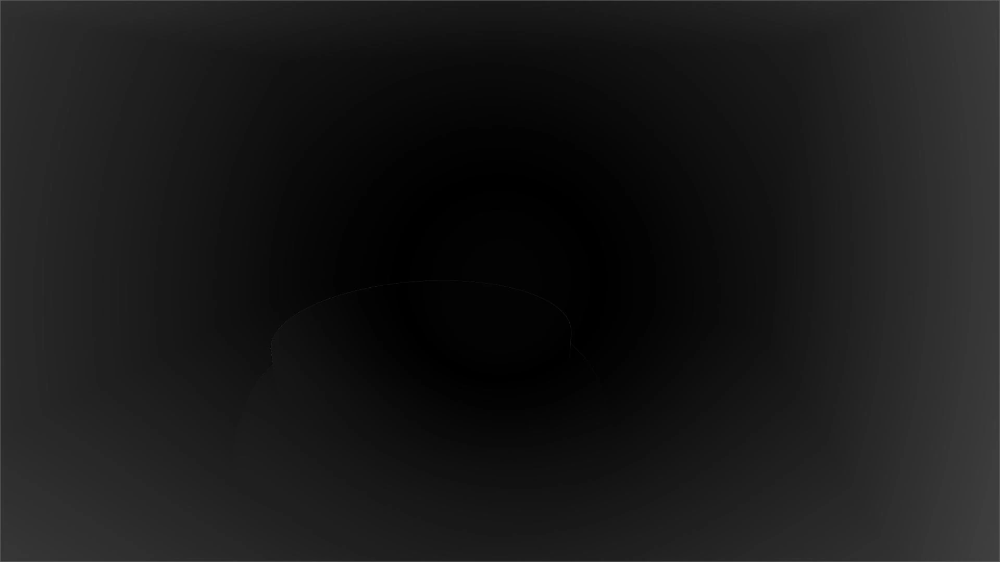

+++
author = 'Turbo Tartine'
date = '2025-05-28T09:01:41+02:00'
draft = true
title = "OpenRE devlog 2 : Harmonisation de la profondeur"
description = 'devlog 2 du projet OpenRE'
+++
## I. Introduction
Le mois dernier nous avions utilisé l'oracle pour harmoniser les textures d'albédo intéractive et déterminises. Aujourd'hui, on va faire la même chose avec la profondeur.

Travail similaire, structure similaire. Je vais commencer par expliquer d'où viennent nos textures, puis on commencera les réglages en surveillant les prophecies de l'oracle à chaque étape.

Je ne détaillerai pas autant que d'habitude les action effectuées dans Blender et Godot. D'abord pour rester raccord avec ma volonté de concision et de simplicité (qui semble avoir été apréciée d'après les retours que j'ai eu). Mais aussi parce que ces actions seront très similaires à ce qu'on a fait dans le numéro précédent. On s'économisera donc les description un peu lourdes.

Ce sera l'occasion de s'étandre un peu plus sur les peripeties sans pour autant déborder du format "moins de 10 min". Car comme vous allez le découvrir, cet épisode est assez riche en rebondisements.

## II. Génération des textures
Pour générer nos textures nous allons donc nous appuyer sur ce que nous avions fait avec l'albédo dans le numéro précédent :
- Render target avec un post-process specifique dans la scene Godot pour l'interactive
- Export de la passe blender correspondant à la depth pour la déterministe

Sauf indication contraire, on conservera les réglages déjà effectués (format EXR, pas de compression VRAM etc...)

### 1. Depth intéractive
Le post-process permettant d'afficher la profondeur est très similaire à celui de l'albédo. En réalité il faut simplement remplacer `hint_screen_texture` par `hint_depth_texture` dans les hints du `uniform sampler2D` (on changera aussi son nom parce qu'on est pas des bêtes)

```glsl
shader_type spatial;
render_mode unshaded, fog_disabled;

uniform sampler2D depth_texture : hint_depth_texture, repeat_disable, filter_nearest;

void vertex() {
	POSITION = vec4(VERTEX.xy, 1.0, 1.0);
}

void fragment() {
	ALBEDO = vec3(texture(depth_texture, SCREEN_UV.xy).rgb);
}
```

Il faudra également penser à **ne pas** régler le flag `Debug Draw` sur `Unshaded` cette fois ci. Nous avoins fait ça pour retirer l'éclérage de la `hint_screen_texture` afin de ne garder que l'albédo. Mais c'était un workaround spécifique. La `hint_depth_texture` est déjà l'information dont on a besoin. Il n'y a donc rien de plus à faire ici pour l'instant. 

### 2. Depth déterministe
Pour la profondeur déterministe par contre ce n'est pas aussi simple. A prèmière vue, deux passes pourraient correspondre à ce qu'on cherche : la `Z` et la `Mist`. La documentation de Blender ne m'ayant pas vraiment aidé à les départager j'ai décidé de les rendre toutes les 2 pour les comparer. Voici ce que j'ai obtenu :

[](images/z_mist_naive_export.opti.webp)

Ne comprenant pas vraiment ce que j'étais sensé voir avec la `Z` j'ai choisi la `Mist` par élimination. J'ai donc ajouté un pin `depth` au noeud `File Output` déjà présant et je l'ai relié au pin `Mist` apparu sur le noeud `Render Layer` après activation de la passe correspondante.

[](images/mist_compositor.opti.webp)

Les textures d'albédo et de profondeur sont désormais régénrées automatiquement à chaque rendu.

## III. Réglages
Pour supporter un deuxieme jeu de textures à comparer, il a fallu adapter un peu l'oracle. On fera l'impasse sur ces modifictions car elles sont plutôt triviales (et donc pas très interessantes). 

Notez simplement que j'ai ajouté une fonction `pre_processd_d_depth` qui nous permettra d'agir sur la texture de profondeur déterministe avant les étapes d'affichage et de différence. Pour l'instant cette fonction ne fait rien :

```glsl
vec3 pre_processd_d_depth(vec3 d_depth) {
	return d_depth;
}
```

Avant de commencer, nous allons également réduire à 5m le far plane de nos caméras (Blender et Godot). La raison est simple, actuellement ils est réglé sur 100m, mais la géométrie de notre scène est concentré dans les 2 ou 3 première mètres. Si on ne fait rien, nos valeurs de profondeur seront compressées dans un fragment minuscule de l'interval [near; far]. Ce qui rendrait les images illisible (et vous allez vois que même en faisant ça, il faudra parfois plisser un peu les yeux).

### 1. Channel packing
A ce stade nous n'avons pas vraiment besoin de l'oracle pour voir ce qui cloche avec nos textures :
- Blender duplique la valeur de depth dans tous les cannaux de l'image. Ce qui donne cet aspect blanchatre à la texture déterministe
- La hint_depth_texture dont est issue la texture intéractive n'utilise quant à elle que le canal rouge pour encoder la depth. De plus, la valeur semble inversée (le 0 est loin de l'écran, alors que le 1 est proche)

[](images/white_det_vs_red_int.opti.webp)

On va donc se servir de la fonction `pre_processd_d_depth` pour réorganiser tout ça :

```glsl
vec3 pre_processd_d_depth(vec3 d_depth) {
	return vec3(1.0 - d_depth.r, 0.0, 0.0);
}
```

Après ce petit ajustement, voici à quoi ressemple notre première prophecie :

[](images/1_chan_diff.opti.webp)

Ca part de loin ! Mais pas de panique on va arranger ça.

### 2. Délinéarisation
Comme l'indique la documentation de Godot, la `hint_depth_texture` n'est pas linéaire. C'est tout à fait normal. Les défauts de rendu liés à la précision (notamment le Z-Fighting) sont toujours moins disgratieux en arrière plan que sous notre nez. C'est pourquoi la matrice de projection déforme la dimention z des fragments de manière à "donner du gras" au valeurs proches.

La Mist que Blender, elle, est exportée par défaut est linéaire. Il existe un paramètre `Falloff` qui permet de changer ça :

 

Malheureusement, il y a une infinité de façons de ne pas être linéaire et aucune des valeurs proposées par Blender ne semblait correspondre à la déformation appliquée par la matrice de projection côté Godot. Je suis donc parti de la definition de cette matrice (trouvable facilement sur internet) et j'ai fait les calculs... Je vous fais grâçe de cette partie en intégrant directement le resultat dans la fonction `pre_processd_d_depth` (résultat que je n'ai pas trouvé du premier coup je vous rassure).

```glsl
const float n = 0.1;	// near plane
const float f = 5.0;	// far plane

vec3 pre_processd_d_depth(vec3 d_depth) {
	float z = d_depth.r * (f - n) + n;
	float unlinearized_depth = (z * f - n * f) / (f - n);
	unlinearized_depth /= z;
	return vec3(1.0 - unlinearized_depth, 0.0, 0.0);
}
```

Après nouvelle solicitation de l'oracle, on constate qu'on est légèrement mieux mais c'est pas encore ça.

[](images/2_chan_unlin_diff.opti.webp)

### 3. Use HDR 2D
Je suis resté ploqué un moment à cette étape. Jusqu'à ce que par hasard, je coche une case dans Godot qui allait résoudre tous mes problèmes. Cette case, c'est `Use HDR 2D` dans la section `Rendering` de notre render target.

 

A ce moment là je n'avais aucune idée de pourquoi c'était mieux. Mais l'oracle était claire... c'était mieux ! (et ce malgré la présence d'artefactes circulaires un peu étranges qu'on ne manquera pas de noter)

[](images/3_chan_unlin_hdr_diff.opti.webp)

Après lecture de la description du paramètre (et pas mal d'experimentations), je suis arrivé à la conclusion que les render target de Godot appliquent par defaut une correction gamma aux images qu'elles produisent. Autrement dit, par defaut ces textures ne sont pas en Linear Color mais en sRGB.

Dans un shader, les calculs sont fait en Linear Color. La correction gamma n'est appliquée qu'en bout de chaine juste avant d'afficher l'image à l'écran. C'est pourquoi la depth déterministe de Blender est dans cet espace de couleur. Mais si l'intéractive est en sRGB ça va pas du tout.

Il se trouve que la case `Use HDR 2D` permet entre autres d'avoir une image en Linear Color sans correction gamma.

### 4. Mist or not Mist   
 Le nouveau présage est bien meilleur que les précédents, mais on va devoir se débarasser de ces vilains artefacts. Si on est attentif, on peut remarquer que les cercles sont de plus en plus claire à mesure que l'on s'éloigne du centre. C'est cette observation qui m'a permis de comprendre la différence entre la `Mist` et la `Z`. 
 
 La documentation ne l'explique pas et je n'ai pas lu le code source de Blender. Je ne suis donc sûr de rien, mais je pense que la `Mist` est la distance entre la caméra et le fragment, alors que la Z est le projeté orthogonal de la position du fragment sur l’axe Z de la caméra.

[](images/mist_vs_Z.opti.webp)

Pour un fragment au centre de l'écran, c'est deux valeurs sont identiques. Mais plus on s'éloigne du centre, plus elles divergent, ce qui explique parfaitement nos artefacts. On a choisit la `Mist` au doigt mouillé parce qu'elle nous plaisait plus. Et ben perdu ! C'était la `Z`... 

Nous avons donc comis un petit délit de faciesse, mais en réalité, si la `Z` exportée était aussi moche, c’est parce que nous utilisons le format EXR. Dans ce format, les cannaux sont représentés par des floatants arbitraires (potentiellement même négatifs). Blender profite de cette propriété pour ecoder la profondeure exprimée directement en mètres. Par consequent tout ce qui est à plus d'1m de la caméra apparait completement blanc.

Il suffit de mapper la valeur de la depth entre le near plane (0.1m) et le far plane (5m) et le tour est joué. Notre `Z` retrouve son apparence originale. 

[](images/compositor_map_Z.opti.webp)

Un dernier passage chez l'oracle nous confirme que c'était bien cette passe qu'il fallait utiliser. Les artefacts ont disparu et l'image est prèsque totalement noir.

[](images/oracle_victory.opti.webp)

Seuls quelques minuscules point gris trahissent encore le contour du podium. Mais on peut s'arreter là, ce résultat est plus que satisfaisant.

## IV. Retour sur les espaces de couleur
Petite parenthese pour discuter un point que j'ai volontairement éludé et que vous avez peut être relevé. Pour que les texturent soient dans le même espace de couleur, nous avons du cocher la case `Use HDR 2D`. Mais alors pourquoi nous n'avons pas eu à faire ça pour l'albédo dans le numéro précédent ?

Je me suis égaleme posé cette question. Il s'avère que la réponse est toute simple. Nous avions fait une autre erreur qui se compensait avec celle ci (décidément il bourde sur bourde celui là...). Si vous regardez bien les captures précédentes vous verez que le champs `color space` du noeud `File Output` est réglé sur `sRGB`.

 

Comme évoqué précédament, les calculs doienvent être fait en Linear Color Space. Ce n'est donc pas la bon espace pour notre texture d'albédo déterministe. Mais comme la Render Target de la texture intéractive n'avait pas `Use HDR 2D` de cochée, elle était aussi en sRGB. Les 2 textures étaient dans le même mauvais espace de couleur et dans ce cas, même l'infini sagesse de l'oracle ne peut rien pour nous.

On va donc cocher la `Use HDR 2D` de la render target de l'albédo et dire à blender d'exporter des textures en Linéaire pour corriger ça. Sauf qu'on a le choix entre 6 espaces linéaires différents.

 

Après quelques essais, `Linear Rec.709` est visiblement l'espace qu'on cherche. Il donne un résultat aussi satisfaisant que le précédent (associé à la case magique bien entandu). On va donc partir là dessus jusqu'à nouvel ordre. Mais il reste une dernière question : si l'export Blender était réglé sur sRGB tout ce temps, comment se fait il, que la depth déterministe soit bien linéaire ?

Je pense que blender tiens compte du fait que les passes comme la `Mist` et la `Z` ne sont pas des images, mais des données mathématiques auquelles il n'y a auccune raison d'appliquer des changements d'espace. Sur ces passes le champs `color space` semble inopérant. J'ai tester d'export de la `Z` en `sRGB` et en `Linear Rec.709`, les 2 images sont rigoureusement identiques.

## V. Conclusion 
Comme vous le savez, les premier épisodes de cette serie sont écrit a-posteriori. Ce que je décris ici à en réalité été effectué il y a plusieurs mois. Repasser sur du travail déjà effectué est relativement fastidieux, mais je dois dire que cette seconde passe me permet d'affiner ma compréhention des choses, d'en découvrir de nouvelles voir même de corriger des erreures qui m'avaient échapées.

Par exemple, l'intégralité de l'arc sur les espaces de couleur est nouveau. Au premier passage, je n'avais pas vraiment questionné la case à coché magique. C'était un réglage parmis 1000 autres sur lequel je n'étais pas forcement revenu. Mais écrire ces article me force à trouver le sous-ensemble minimal de réglages qui donne le résultat attendu (parce que oui, je teste beaucoup plus de choses que ce que je présente). Et surtout, ça m'oblige à réèlement comprendre pourquoi ça marche. Ce qui à beaucoup de valeur pour moi.

Le mois prochain, on s'occupera de l'harmonisation des normales. C'est le dernier élement qui nous manque pour commencer à implémenter de la lumière. Après ça on va pouvoir faire des choses plus visuelles. J'espère que ce nouveau numéro vous aura plu et je vous dis à bientôt pour de nouvelles aventures !