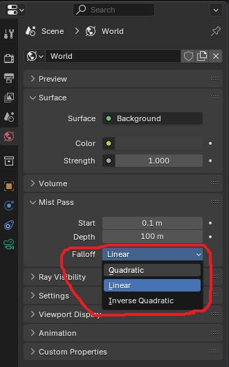

+++
author = 'Turbo Tartine'
date = '2025-05-28T09:01:41+02:00'
draft = false
title = "OpenRE devlog 2 : Harmonisation de la profondeur"
description = 'devlog 2 du projet OpenRE'
+++

[⬅️ Vers Précédent : "OpenRE devlog 1 : Harmonisation de l'Albedo"](projects/open_re_poc_devlog_1)

## I. Introduction
Le mois dernier nous avions utilisé l'oracle pour harmoniser les textures d'albédo interactive et déterministe. Aujourd'hui, on va faire la même chose avec la profondeur.

Travail similaire, structure similaire. Je vais commencer par expliquer d'où viennent nos textures, puis on se lancera dans les réglages en surveillant les prophéties de l'oracle à chaque étape.

Je ne détaillerai pas autant que d'habitude les actions effectuées dans Blender et Godot. D'abord pour rester raccord avec ma volonté de concision et de simplicité (qui semble avoir été appréciée d'après les retours que j'ai eus). Mais aussi parce que ces actions seront très similaires à ce qu'on a fait dans le numéro précédent. On s'économisera donc les descriptions un peu lourdes.

Ce sera l'occasion de s'étendre un peu plus sur les péripéties sans pour autant déborder du format "moins de 10 min". Car comme vous allez le découvrir, cet épisode est assez riche en rebondissements.

## II. Génération des textures
Pour générer nos textures nous allons nous appuyer sur ce que nous avions fait avec l'albédo dans le numéro précédent :
- [Render target](/pages/glossary/#render-target) avec un [post-process](/pages/glossary/#post-process) spécifique dans la scène Godot pour l'interactive
- Export de la passe Blender correspondant à la depth pour la déterministe

Sauf indication contraire, on conservera les réglages déjà effectués (format EXR, pas de compression VRAM etc...)

### 1. Depth intéractive
Le post-process permettant d'afficher la profondeur est très similaire à celui de l'albédo. En réalité il faut simplement remplacer `hint_screen_texture` par `hint_depth_texture` dans les hints du `uniform sampler2D` (on changera aussi son nom parce qu'on est pas des bêtes).

```glsl
shader_type spatial;
render_mode unshaded, fog_disabled;

uniform sampler2D depth_texture : hint_depth_texture, repeat_disable, filter_nearest;

void vertex() {
	POSITION = vec4(VERTEX.xy, 1.0, 1.0);
}

void fragment() {
	ALBEDO = vec3(texture(depth_texture, SCREEN_UV.xy).rgb);
}
```

Il faudra également penser à **ne pas** régler le flag `Debug Draw` sur `Unshaded` cette fois-ci. Nous avions fait ça pour retirer l'éclairage de la `hint_screen_texture` afin de ne garder que l'albédo. Mais c'était un workaround spécifique. La `hint_depth_texture` est déjà l'information dont on a besoin. Il n'y a donc rien de plus à faire ici pour l'instant.

### 2. Depth déterministe
Pour la profondeur déterministe par contre ce n'est pas aussi simple. À première vue, deux passes pourraient correspondre à ce qu'on cherche : la `Z` et la `Mist`. La documentation de Blender ne m'ayant pas vraiment aidé à les départager j'ai décidé de les rendre toutes les deux pour les comparer. Voici ce que j'ai obtenu :

[](images/z_mist_naive_export.opti.webp)
*Comparaison des passes Z et Mist de Blender exportées au format EXR*

Ne comprenant pas vraiment ce que j'étais sensé voir avec la `Z`, j'ai choisi la `Mist` par élimination (La Mist n'est pas très lisible non plus. On verra pourquoi, mais on reconnaît tout de même une map de profondeur). J'ai donc ajouté un pin `depth` au nœud `File Output` déjà présent et je l'ai relié au pin `Mist` apparu dans le nœud `Render Layer` après activation de la passe correspondante.

[](images/mist_compositor.opti.webp)

Les textures d'albédo et de profondeur sont désormais régénérées automatiquement à chaque rendu.

## III. Réglages
Pour supporter un deuxième jeu de textures à comparer, il a fallu adapter un peu l'oracle. On fera l'impasse sur ces modifications car elles sont plutôt triviales (et donc pas très intéressantes).

Notez simplement que j'ai ajouté une fonction `pre_process_d_depth` qui nous permettra d'agir sur la texture de profondeur déterministe avant les étapes d'affichage et de différence. Pour l'instant cette fonction ne fait rien :

```glsl
vec3 pre_process_d_depth(vec3 d_depth) {
	return d_depth;
}
```

Avant de commencer, nous allons également réduire à 5m le far plane de nos caméras (Blender et Godot). La raison est simple, actuellement il est réglé sur 100m, mais la géométrie de notre scène est concentrée dans les 2 ou 3 premiers mètres. Si on ne fait rien, nos valeurs de profondeur seront compressées dans un fragment minuscule de l'intervalle [near; far]. Ce qui rendrait les images aussi illisibles que la mist de la section précédente (et vous allez voir que même en faisant ça, il faudra parfois plisser un peu les yeux).

### 1. Channel packing
À ce stade nous n'avons pas vraiment besoin de l'oracle pour voir ce qui cloche avec nos textures :
- Blender duplique la valeur de depth dans tous les canaux de l'image. Ce qui donne cet aspect blanchâtre à la texture déterministe.
- La `hint_depth_texture` dont est issue la texture interactive n'utilise quant à elle que le canal rouge pour encoder la depth. De plus, la valeur semble inversée (le 0 est loin de l'écran, alors que le 1 est proche).

[](images/white_det_vs_red_int.opti.webp)
*A gauche la texture intéractive issue de Godot, à droite la déterministe issue de Blender*

On va se servir de la fonction `pre_process_d_depth` pour réorganiser tout ça :

```glsl
vec3 pre_process_d_depth(vec3 d_depth) {
	return vec3(1.0 - d_depth.r, 0.0, 0.0);
}
```

Après ce petit ajustement, voici à quoi ressemble notre première prophétie :

[](images/1_chan_diff.opti.webp)
*1ere Prophecie de l'oracle*

Pour rappel, un pixel blanc veut dire "différent" et un pixel noir "idendique". On part donc de loin ! Mais pas de panique, on va arranger ça.

### 2. Délinéarisation
Comme l'indique la documentation de Godot, la `hint_depth_texture` n'est pas linéaire. C'est tout à fait normal. Les défauts de rendu liés à la précision (notamment le Z-Fighting) sont toujours moins disgracieux en arrière-plan que sous notre nez. C'est pourquoi la matrice de projection déforme la dimension z des [fragments](/pages/glossary/#fragment-shader) de manière à "donner du gras" aux valeurs proches.

La Mist de Blender, elle, est exportée par défaut en linéaire. Il existe un paramètre `Falloff` qui permet de changer ça :

 

Malheureusement, il y a une infinité de façons de ne pas être linéaire et aucune des valeurs proposées par Blender ne semblait correspondre à la déformation appliquée par la matrice de projection côté Godot. Je suis donc parti de la définition de cette matrice (trouvable facilement sur internet) et j'ai fait les calculs... Je vous fais grâce de cette partie en intégrant directement le résultat dans la fonction `pre_process_d_depth` (résultat que je n'ai pas trouvé du premier coup, je vous rassure).

```glsl
const float n = 0.1;	// near plane
const float f = 5.0;	// far plane

vec3 pre_process_d_depth(vec3 d_depth) {
	float z = d_depth.r * (f - n) + n;
	float unlinearized_depth = (z * f - n * f) / (f - n);
	unlinearized_depth /= z;
	return vec3(1.0 - unlinearized_depth, 0.0, 0.0);
}
```

Après nouvelle sollicitation de l'oracle, on constate qu'on est légèrement mieux mais ce n'est pas encore ça.

[](images/2_chan_unlin_diff.opti.webp)
*2nd Prophecie de l'oracle. Obtenue après délinearisation de la depth déterministe*

### 3. Use HDR 2D
Je suis resté bloqué un moment à cette étape. Jusqu'à ce que par hasard, je coche une case dans Godot qui allait résoudre tous mes problèmes. Cette case, c'est `Use HDR 2D` dans la section `Rendering` de notre render target.

 

À ce moment-là je n'avais aucune idée de pourquoi c'était mieux. Mais l'oracle était clair... c'était mieux ! (et ce malgré la présence d'artefacts circulaires un peu étranges qu'on ne manquera pas de noter).

[](images/3_chan_unlin_hdr_diff.opti.webp)
*3eme prophecie de l'oracle mettant en évidance la présence d'artefacts cirulaires*

Après lecture de la description du paramètre (et pas mal d'expérimentations), je suis arrivé à la conclusion que les render targets de Godot appliquent par défaut une correction gamma aux images qu'elles produisent. Autrement dit, par défaut ces textures ne sont pas en Linear Color mais en sRGB.

Dans un [shader](/pages/glossary/#shader), les calculs sont faits en Linear Color. La correction gamma n'est appliquée qu'en bout de chaîne juste avant d'afficher l'image à l'écran. C'est pourquoi la depth déterministe de Blender est dans cet espace de couleur. Mais si l'interactive est en sRGB ça ne va pas du tout.

Il se trouve que la case `Use HDR 2D` permet entre autres d'avoir une image en Linear Color sans correction gamma. Raison pour laquelle elle améliore nos résultats.

### 4. Mist or not Mist   
Le nouveau présage est bien meilleur que les précédents, mais on va devoir se débarrasser de ces vilains artefacts. Si on est attentif, on peut remarquer que les cercles sont de plus en plus clairs à mesure que l'on s'éloigne du centre. C'est cette observation qui m'a permis de mieux comprendre la différence entre la `Mist` et la `Z`.

La documentation ne l'explique pas et je n'ai pas lu le code source de Blender. Je ne suis donc pas sûr de ce que j'avance. Mais je pense que la `Mist` est la distance entre la caméra et le fragment, alors que la `Z` est le projeté orthogonal de la position du fragment sur l’axe Z de la caméra.

[](images/mist_vs_Z.opti.webp)
*A gauche la Mist et à droite la Z. La valeur retenue est la longueur du segment rouge*

Pour un fragment au centre de l'écran, ces deux valeurs sont identiques. Mais plus on s'éloigne du centre, plus elles divergent, ce qui explique parfaitement la présence de nos artefacts. On a choisi la `Mist` au doigt mouillé parce qu'elle nous plaisait plus. Et ben perdu ! C'était la Z...

Nous avons commis un petit délit de faciès, mais en réalité, si la `Z` exportée était aussi moche, c’est parce que nous utilisons le format EXR. Dans ce format, les canaux sont représentés par des flottants arbitraires (potentiellement négatifs). Blender profite apparemment de cette propriété pour encoder la profondeur exprimée directement en mètres. Par conséquent tout ce qui est à plus d'1m de la caméra apparaît complètement blanc.

Dans le compositeur de Blender, il suffit de mapper la valeur de la depth entre le near plane (0.1m) et le far plane (5m) et le tour est joué. Notre `Z` retrouve l'apparence qu'elle aurait du avoir.

[](images/compositor_map_Z.opti.webp)

Un dernier passage chez l'oracle nous confirme que c'était bien cette passe qu'il fallait utiliser. Les artefacts ont disparu et l'image est presque totalement noire.

[](images/oracle_victory.opti.webp)
*Dernière prophecie de l'oracle. Victoire !*

Seuls quelques minuscules points gris trahissent encore le contour du podium (si vous zoomez comme des fous sur l'image). Mais on peut s'arrêter là, ce résultat est plus que satisfaisant.

## IV. Retour sur les espaces de couleur
Petite parenthèse pour discuter un point que j'ai volontairement éludé et que vous avez peut-être relevé. Pour que les textures de depth soient dans le même espace de couleur, nous avons dû cocher la case `Use HDR 2D`. Mais alors pourquoi nous n'avons pas eu à faire ça pour l'albédo dans le numéro précédent ?

Je me suis également posé cette question et après enquête, il s'avère que la réponse est toute simple : c'est une erreur... nous aurions dû la cocher... Mais là où c'est fourbe, c'est que cette erreur a été compensée par une autre erreur qu'on se traîne depuis le tout début (oui je sais, ça fait beaucoup d'erreurs, mais je vous avais prévenu et c'est comme ça qu'on apprend). Si vous regardez bien les captures précédentes vous verrez que le champ `color space` du nœud `File Output` est réglé sur `sRGB`.

 

Comme évoqué précédemment, les calculs doivent être faits en Linear Color. Ce n'est donc pas le bon espace pour notre texture d'albédo déterministe. Mais comme la Render Target de la texture interactive n'avait pas `Use HDR 2D` de cochée, elle était aussi en sRGB. Les 2 textures étaient donc dans le même **mauvais** espace de couleur. Et dans ce cas, même l'infinie sagesse de l'oracle ne peut rien pour nous.

On va donc cocher la `Use HDR 2D` de la render target de l'albédo et dire à Blender d'exporter des textures en Linéaire pour corriger cette double faute. Sauf qu'on a le choix entre 6 espaces linéaires différents.

 

Après quelques essais, `Linear Rec.709` est visiblement l'espace qu'on cherche. Il donne un résultat aussi satisfaisant que le précédent (lorsqu'on l'associe à la case magique bien entendu). On va donc partir là-dessus jusqu'à nouvel ordre. Mais il reste une dernière question : si l'export Blender était réglé sur sRGB tout ce temps, comment se fait-il que la depth déterministe soit bien linéaire ?

Je pense que Blender tient compte du fait que les passes comme la `Mist` et la `Z` ne sont pas des images, mais des données mathématiques auxquelles il n'y a aucune raison d'appliquer des changements d'espace. Sur ces passes, le champ `color space` semble inopérant. J'ai testé un export de la `Z` en `sRGB` et en `Linear Rec.709` et les 2 images sont rigoureusement identiques.

## V. Conclusion 
Comme vous le savez, les premiers épisodes de cette série sont écrits en différé. Ce que je décris ici a en réalité été effectué il y a plusieurs mois. Et je peux vous dire que jusqu'à présent, l'harmonisation de la depth aura été le plus gros challenge de ce POC. Je ne suis pas mécontent d'en être venu à bout.

Par ailleurs, repasser sur du travail déjà effectué est toujours aussi fastidieux, mais je dois dire que cette seconde passe me permet d'affiner ma compréhension des choses et de corriger des erreurs qui m'avaient échappé.

Par exemple, l'intégralité de l'arc sur les espaces de couleur est nouveau. Au premier passage, je n'avais pas vraiment questionné la case à cocher magique. C'était un réglage parmi 1000 autres sur lequel je n'étais pas forcément revenu. Mais écrire ces articles me force à trouver le sous-ensemble minimal de réglages qui donne le résultat attendu (parce que oui, je teste beaucoup plus de choses que ce que je présente). Et surtout, ça m'oblige à réellement comprendre pourquoi ça marche. Ce qui à mon sens est primordial.

Le mois prochain, on s'occupera de l'harmonisation des normales. C'est le dernier élément qui nous manque pour commencer à implémenter de la lumière. Après ça on va pouvoir faire des choses plus visuelles. J'espère que ce nouveau numéro vous aura plu et je vous dis à bientôt pour de nouvelles aventures !

<div style="text-align: right"><a href="../open_re_poc_devlog_3">Vers Suivant : "OpenRE devlog 3 : Harmonisation des normales" ➡️</a></div>