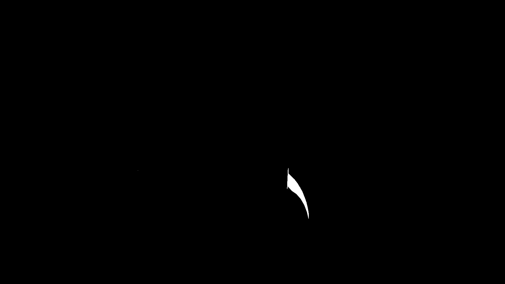
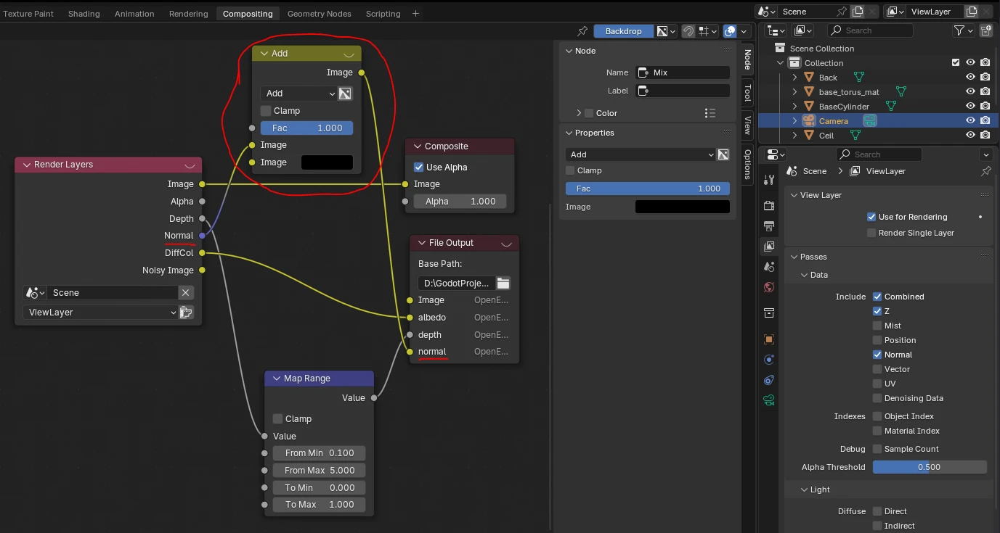
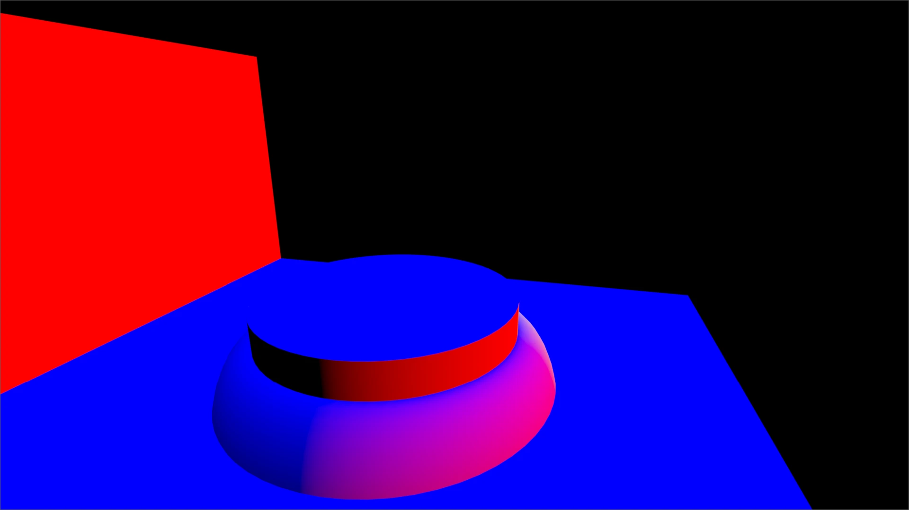
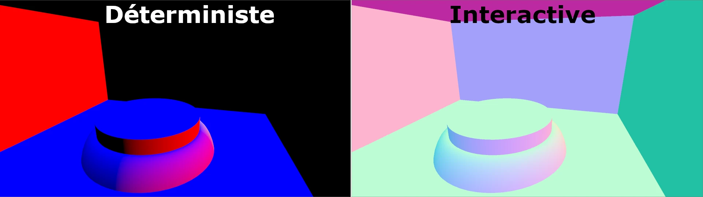
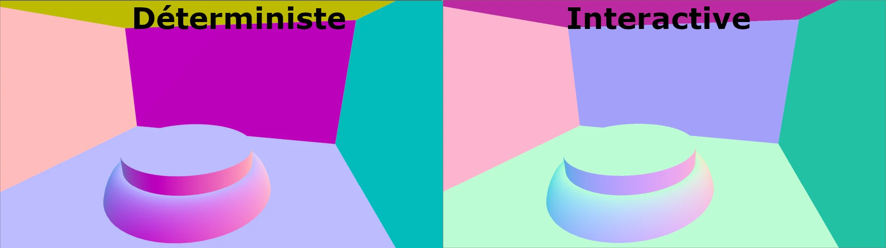
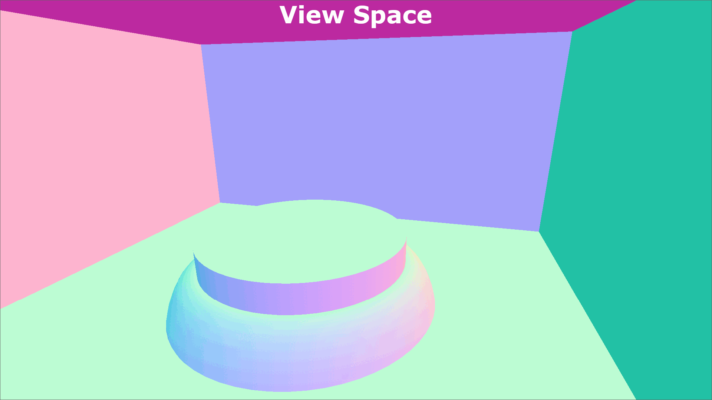
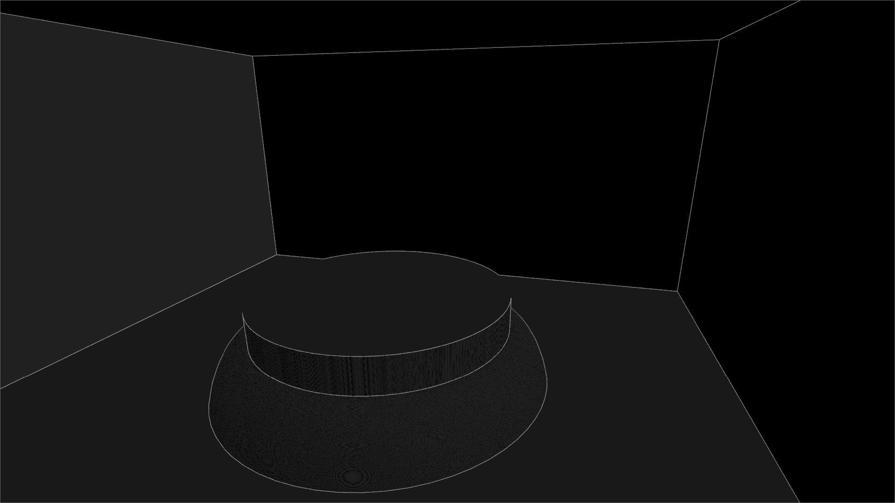
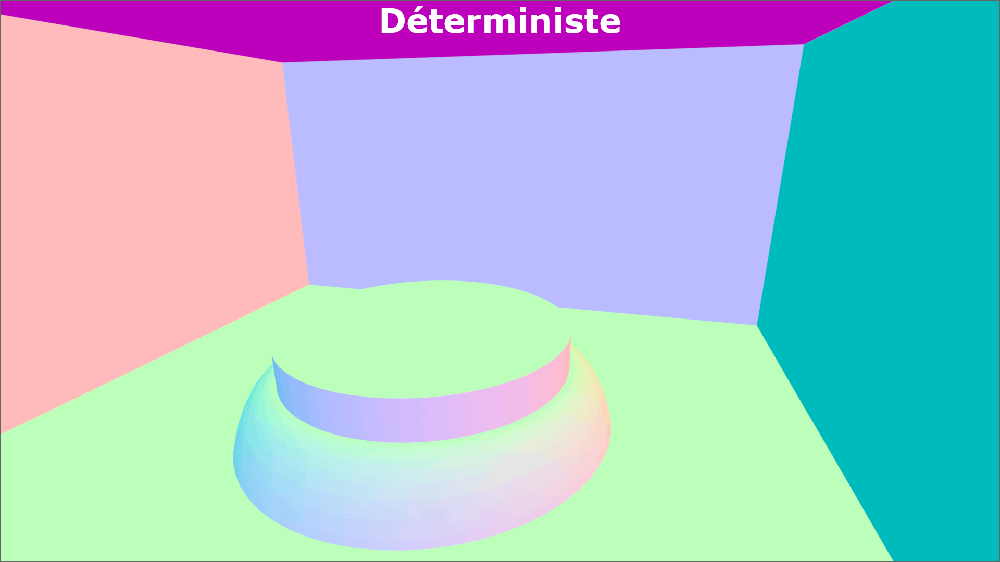
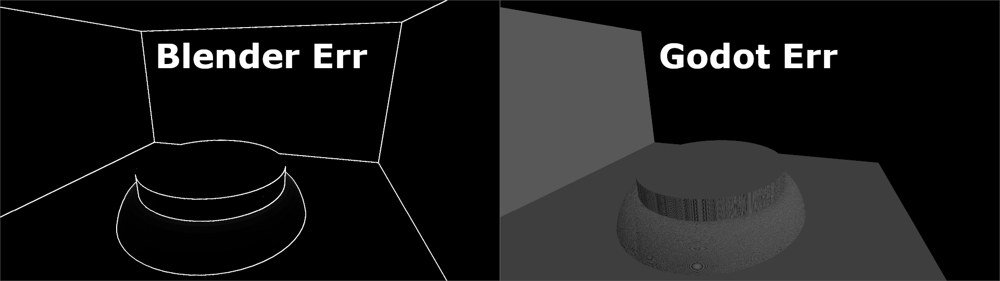
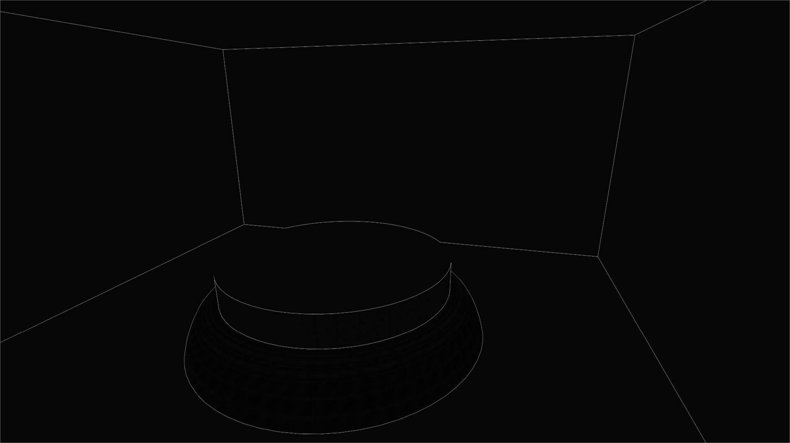

+++
author = 'Turbo Tartine'
date = '2025-07-15T09:38:25+02:00'
draft = true
title = "OpenRE devlog 3 : Harmonisation des normales"
description = 'devlog 3 du projet OpenRE'
+++
## I. Introduction
Si vous êtes un lecteur du future et que vous lisez ces develogs d'une traite, vous avez surement la structure des précédents numéros en tête. Mais si vous les découvrez au fur et à mesure (ou que vous aviez fait une petite pause), un petit rappel me parait approprié.

Depuis le début de cette serie nous avons entrepris d'harmoniser les différents jeux de textures issues de Blender et Godot qui composent nos G-Buffers déterministe et interactif. Jusqu'ici nous avons traité :
- l'albédo
- la profondeur

Pour nous aider dans cette tâche, nous avons mis au point un petit outil que nous appelons "l'Oracle" et qui nous permet de comparer les textures 2 à 2. Le resultat de la comparaison prend la forme d'une image (que nous appelons "prophecie") dans laquelle chaque pixel représente le degré de différence mesuré entre les 2 textures source. Il s'interprete comme ceci :
- pixel blanc : La différecne est maximale
- pixel noir : Les sources sont identiques

Aujourd'hui nous allons nous occuper des textures de normales. Et comme à chaque fois, il y aura :
- une première partie expliquant comment obtenir les textures avec les 2 logiciels
- une seconde partie présentant les ajustement effectués pour avoir des textures bien en phase 

## II. Génération des textures
Comme d'habitude, on va utiliser une passe Cycle dédiée côté déterministe, et une [Render target](/pages/glossary/#render-target) avec un [post-process](/pages/glossary/#post-process) côté interactif. 

### 1. Normal intéractive
Commençons tout dessuite avec le post-process. Cette fois, la texture qui nous intéresse est `hint_normal_roughness_texture`. Voici le code complet :

```glsl
shader_type spatial;
render_mode unshaded, fog_disabled;

uniform sampler2D depth_texture : hint_normal_roughness_texture, repeat_disable, filter_nearest;

void vertex() {
	POSITION = vec4(VERTEX.xy, 1.0, 1.0);
}

void fragment() {
	vec3 normal = texture(normal_roughness_texture, SCREEN_UV.xy).xyz;
	ALBEDO = normal;
}
```

Rien de particulier ici. On ignore simplement la roughness stoqué dans le composant `w` de la `hint_normal_roughness_texture` parce qu'on en a pas besoin.

### 2. Normal déterministe
La passe à activer est assez evidente cette fois ci. Elle s'appel sobrement : `Normal`. Comme à l'acoutumée :
- On active la passe `Normal` depuis le panneau latéral
- On ajoute un pin `normal` au noeud `File Output` du `Compositor`
- On relie les 2 et on appuie sur `F12` pour générer le rendu

[](images/active_normal_pass.opti.webp)

A ma grande surprise, l'image obtenue ressemble à ça :

[](images/normal0002_raw.opti.webp)

Ce n'est evidament pas ce qu'on veut. Je pense qu'il s'agit d'un bug de Blender car le contournement est pour le moins suspect : ajouter un noeud qui ne fait rien entre les 2 pins.

[](images/fix_blend_bug.opti.webp)

Le noeud `Add` ajoute à la normal la couleur noir (0, 0, 0, 1). Lorsqu'on fait ça, le rendu est correcte :

[](images/raw_d_normal.opti.webp)

## III. Réglages
Cette fois encore, il a fallu modifier l'oracle pour qu'il supporte la comparaison des textures de normales. Sans entrer dans les détails, j'ai ajouté une fonction de pré-traitement pour chacune des textures :

```glsl
vec3 pre_process_i_normal(vec3 i_normal) {
	return i_normal;
}

vec3 pre_process_d_normal(vec3 d_normal) {
	return d_normal;
}
```

Notez également que nous allons traiter des directions. On va donc changer notre critère de comparaison habituel (distance euclidiene) et utiliser quelque chose de plus pertinant dans ce contexte : l'angle entre les vecteur (que l'on projetera sur [0, 1] en le divisant par π).

```glsl
vec3 compute_normal_difference(vec3 d_frag, vec3 i_frag) {
	float angle = acos(dot(d_frag, i_frag)) / PI;
	return vec3(angle, angle, angle);
}
```
### 1. Normal Packing / Unpacking
Si on compare les textures en l'état, on remarque immédiatement que les couleurs sont très différentes, mais pas seulement. Si on observe la texture déterministe, on constate aussi que :
- certaines face sont noir
- les faces oposées à un face noir sont systématiquement colorées

[](images/first_compare_det_int.opti.webp)

Quand on y réfléchi c'est parfaitement normal car contrairement à une couleur, un vecteur peut avoir des composant négatifs. Lorsqu'on essai de les visualiser, ces derniers sont clampés à 0 et un vecteur n'ayant que des valeurs négatives apparait donc noir.

Non seulement ce n'est pas pratique pour la visualisation mais surtout la plupart des formats d'images ne permetent pas d'encoder des valeures négatives. Ici ce n'est pas le cas car on utilise EXR, mais avec un autre format, les valeurs seraient carrement clampée à l'export et la donnée serait tout simplement perdu.

La solution usuelle à ce probleme est de projeter les composants des normales de l'interval [-1, 1] à l'interval [0, 1] avant d'exporter ("normal packing"). Pour retrouver nos normales et faire nos calculs dans le shader après import de la texture ainsi packée, il suffit d'effectuer l'opération inverse ("normal unpacking").

```glsl
// ... Normal generation ...

vec3 packed_normal = (normal + 1.0) / 2.0;

// ... Export ...

// ... Import ...

vec3 unpacked_normal = packed_normal * 2.0 - 1.0;

// ... Shader computations ...

```

Nous avons donc une texture déterministe "unpacked" et une texture intéractive "packed". Ce qui nous arrangerait, c'est que les 2 soient "packed" pour la visualisation, et "unpacked" pour le calcule de différence. On va donc packer la déterministe dans `pre_process_d_normal` :

```glsl
vec3 pre_process_d_normal(vec3 d_normal) {
	return (d_normal + 1.0) / 2.0;	// Pack
}
```

Et dépacker les 2 avant le calcule de différence dans `compute_normal_difference` :

```glsl
vec3 compute_normal_difference(vec3 d_frag, vec3 i_frag) {
	d_frag = d_frag * 2.0 - 1.0;	// Unpack (previously packed in pre_process_d_normal())
	i_frag = i_frag * 2.0 - 1.0;	// Unpack
	
	float angle = acos(dot(d_frag, i_frag)) / PI;
	return vec3(angle, angle, angle);
}
```

Les couleurs sont toujours aux fraises, mais on a fait un premier pas. Et surtout, on peut maintenant visualiser correctement la texture déterministe sans avoir à deviner ce qu'il se passe dans les zones noires.

[](images/packed_compare_det_int.opti.webp)

### 2. View vs World
Une question qu'il faut toujours se poser quand on écrit un shader, c'est : "dans quel espace sont exprimées mes données". En effet il y a 2 écoles :
- faire les calcules en `VIEW_SPACE` (l'espace de la caméra)
- faire les calcules en `WORLD_SPACE` (l'espace de la scène)

Les 2 options sont parfaitement valides, mais évidement il faut choisir et s'assurer que toutes les données soient bien conforme à ce choix (et les changer d'espace si nécessaire). Il est donc primordial de savoir dans quel espace Blender et Godot expriment leurs normales.

J'ai été surpris de ne pas trouver l'info dans leurs documentations respectives. Mais heureusement ce n'est pas très difficile à déterminer. Il suffit de faire varier l'angle de la caméra et d'observer les couleurs qui représentent les normales :
- Si les couleurs varient avec l'angle => on est en `VIEW_SPACE`
- Si les couleurs ne bougent pas => on est en `WORLD_SPACE`

Il se trouve que Blender est en `WORLD_SPACE` et Godot en `VIEW_SPACE`. Je préfère travailler en `WORLD_SPACE`, on va donc utiliser `pre_process_d_normal` pour effectuer le changement d'espace côté Godot :

```glsl
vec3 pre_process_i_normal(vec3 i_normal, mat4 inv_view_matrix) {	
	i_normal = i_normal * 2.0 - 1.0;	// Unpack for space switch
	i_normal = (inv_view_matrix * vec4(i_normal, 0.0)).xyz;
	return (i_normal + 1.0) / 2.0;		// Repack for visualisation
}
```

Vous noterez qu'on effectue un "unpacking" avant le changement d'espace (ce qui est normal) mais qu'on "repack" juste derière pour pouvoir visualiser la texture correctement. Il faudra donc conserer le "redépackage" du calcul de comparaison ajouté à l'étape précédente.

Par ailleurs, si vous vous demandez comment on obtient le parametre `inv_view_matrix` qui nous permet de changer d'espace, c'est très simple. Godot expose à ses shaders la matrice `INV_VIEW_MATRIX`. Mais elle n'est accessible que depuis `void fragment()` (le main du fragment shader dans le langage de shading de Godot). Il faut donc la passer en parametre.

Obervons maintenant la différence entre les 2 espaces :

[](images/compare_view_world.gif)

Elle est visible mais pas très prononcée. Cela s'explique par le fait que notre caméra est presque alignée avec le repère. Dans ce cas `VIEW_SPACE` et `WORLD_SPACE` sont très proches vis à vis de la rotation. Cela aurait été beaucoup plus flagrant si la caméra regardait dans une autre direction. Cela illustre bien l'importance d'avoir plusieurs scènes de test. Certaines différences étant difficiles à détecter si on se place dans des cas particuliers.

### 3. Permutations du repère
Evidement Blender et Godot n'utilisent pas le même repère. Le "up vector" de Godot est l'axe Y alors que celui de Blender est l'axe Z. C'est la raisons pour laquelle les couleurs représentant les normales ne match pas : les cannaux sont en quelques sortes inversés. Il faut donc reorganiser tout ça dans `pre_process_d_normal`. En comparant les gizmos des 2 logiciels, je suis arrivé à la conclusion que la bonne permutation était la suivante :

 (x, z, -y) ?'" src="./images/blenderToGodot.opti.webp" style="display: block; margin-left: auto; margin-right: auto;" /> 

```glsl
vec3 pre_process_d_normal(vec3 d_normal) {
	d_normal = vec3(d_normal.x, d_normal.z, -d_normal.y);	// Permut
	return (d_normal + 1.0) / 2.0;							// Pack
}
```

Malheureusement, l'Oracle n'avait pas l'aire d'accord. En effet, sur la prophécie, on peut voir que le sol et le mur gauche de la cornel-box ne sont pas noir, indiquant que les vecteurs up et right ne sont pas en phase.

[](images/no_normalize.opti.webp)

Ma vie étant visiblement un mensonge, j'ai essayé d'autres permutations un peu au hasard. Vous savez ce moment où on ne comprend pas son erreur et où on commence à changer un signes par ci ... inverser des termes par là ... (je sens d'ici les regard desaprobateurs mais je sais que vous le faites aussi ;)). 

Comme souvent ça ne m'a pas mené bien loin. Mais ça ne veut pas dire que "le random programming" c'est mal en sois. Il faut juste le faire bien ! C'est à dire guider pas un raisonnement et pas par la flème.

Il n'y a que 48 permutations possibles. C'est pas la mer à boire. Si je suis capable de reconnaitre la bonne à coup sûr, j'ai juste besoin d'une moulinette pour itérer rapidement sur toutes les entrées. Cette moulinette la voici :

```glsl
// Applique une permutation parmis les 48 possible
vec3 _dbg_normal_permut(vec3 normal_src, int permut_idx) {
	switch(permut_idx) {
		case 0 : return vec3(normal_src.x, normal_src.y, normal_src.z);
		case 1: return vec3(normal_src.y, normal_src.z, normal_src.x);
		case 2: return vec3(normal_src.z, normal_src.x, normal_src.y);
		case 3: return vec3(normal_src.z, normal_src.y, normal_src.x);
		case 4: return vec3(normal_src.y, normal_src.x, normal_src.z);
		case 5: return vec3(normal_src.x, normal_src.z, normal_src.y);
		
		// ...
		
		case 42: return vec3(-normal_src.x, -normal_src.y, -normal_src.z);
		case 43: return vec3(-normal_src.y, -normal_src.z, -normal_src.x);
		case 44: return vec3(-normal_src.z, -normal_src.x, -normal_src.y);
		case 45: return vec3(-normal_src.z, -normal_src.y, -normal_src.x);
		case 46: return vec3(-normal_src.y, -normal_src.x, -normal_src.z);
		case 47: return vec3(-normal_src.x, -normal_src.z, -normal_src.y);
	}
}

// Uniform permetant de selectionner la permutation au runtime
uniform int dbg_permut_idx = 0;

vec3 pre_process_d_normal(vec3 d_normal) {
	// Application de la permutation selectionnée
	d_normal = _dbg_normal_permut(d_normal, dbg_permut_idx);
	return (d_normal + 1.0) / 2.0;		// Pack
}
```

A partir de là il suffit de faire play, de régler le `visualisation_mode` de l'oracle sur `D_TEXTURE_ONLY` et d'incrémenter `dbg_permut_idx` dans l'éditeur jusqu'à ce que l'image soit noir.

<gif total>

Bon d'accord l'image 11 n'est completement noir, mais elle sort quand même bien du lot :
- Elle est globalement plus sombre
- C'est la seule à n'avoir aucune face completement blanche
- Elle ressemble quand même beaucoup à la première permutation qu'on a essayé ... c'est quoi la formule ? ...

```glsl
// Applique une permutation parmis les 48 possible
vec3 _dbg_normal_permut(vec3 normal_src, int permut_idx) {
	switch(permut_idx) {
		// ...
		
		case 11: return vec3(normal_src.x, normal_src.z, -normal_src.y);

		// ...
	}
}
```

Ok... c'est exactement la même en faite... Maintenant qu'on a comparé l'entrée avec toutes les autres, ça parait evident : on était bon depuis le début. Le problème ne venait pas d'une erreur de permutation des axes. C'était autre chose.

### 4. Normalisation
J'ai mis un moment à résoudre l'énigme. J'ai même envisagé l'idée de resortir la carte "Good Enough". Après tout le présage n'est pas bien pire que celui qu'on avait accépté pour l'albédo et quand on compare les textures actuelles, elle sont quand même très proche.

[](images/no_normalize_comp.gif)

Mais dans le cas des normales on ne peut pas se contanter d'un jugé à l'oeuil. On les représente par des couleurs pour pouvoir le visualiser facilement mais il faut garder à l'esprit que ce sont en réalité des données mathématique qui interviennent dans des calculs complexes. Le risque d'accumuler de l'erreur au fils des opérations est trop grand. Il faut faire mieux !

Le soucis étaitait en fait tout bête. Pour calculer l'angle entre les vecteurs dans `compute_normal_difference` la formule devrait être : 
```glsl 
float angle = acos(dot(v1, v2)) / (length(v1) * length(v2));
```

Mais dans notre cas, les vecteurs sont des normales. Leur norme est donc en principe égale à 1. Le dénominteur peut donc être ignoré c'est pourquoi j'utilise la version simplifiée :
```glsl 
float angle = acos(dot(v1, v2));
```

J'igniore pourquoi, mais il s'avère que les normales fournies par Blender et Godot ne sont pas toujours égales à 1. Pour le mettre en évidence, j'ai temporairement modifié les fonctions `pre_process_i_normal` et `pre_process_d_normal` de manière à ce que l'on puisse visualiser l'erreur grossie 100 fois :

```glsl 
vec3 pre_process_i_normal(vec3 i_normal, mat4 inv_view_matrix) {
	i_normal = i_normal * 2.0 - 1.0;	// Unpack
	float norm_err = (1.0 - length(i_normal)) * 100.0;
	return vec3(norm_err, norm_err, norm_err);
}

vec3 pre_process_d_normal(vec3 d_normal) {	
	float norm_err = (1.0 - length(d_normal)) * 100.0;
	return vec3(norm_err, norm_err, norm_err);
}
```

Le résultat est sans appel. Dans un cas comme dans l'autre, les normales ne sont pas toujours des vecteurs unitaires :

[](images/err_comp.opti.webp)

Si on normalise les vecteurs avant le calcule de l'angle, on obtien un présage de bien meilleur qualité :

```glsl 
vec3 compute_normal_difference(vec3 d_frag, vec3 i_frag) {
	d_frag = d_frag * 2.0 - 1.0;	// Unpack
	i_frag = i_frag * 2.0 - 1.0;	// Unpack
	
	d_frag = normalize(d_frag);		// Fix norm err
	i_frag = normalize(i_frag);		// Fix norm err
	
	float angle = acos(dot(d_frag, i_frag)) / PI;
	return vec3(angle, angle, angle);
}
```

[](images/normalize.PNG)

On notera la présence de patèrnes sur les surface courbes. Les motifs semble suivrent les faces qui composent la géométrie. Je pense que ça vient de la façon dont les 2 logiciels calcule les normales aux sommets. C'est toujours plus ou moins une moyenne des normales des faces adjacentes, mais il existe plusieurs heuristique pour pondérer cette moyenne (prorata des surface, des angles, mix des 2 etc...). Il ont dû tout simplement en choisir des différentes mais ce ne sera pas un probleme pour nous. Si notre bottle-neck est l'heurisique choisie on peut s'arréter là. On est bien assez précis.

## IV. Conclusion 
