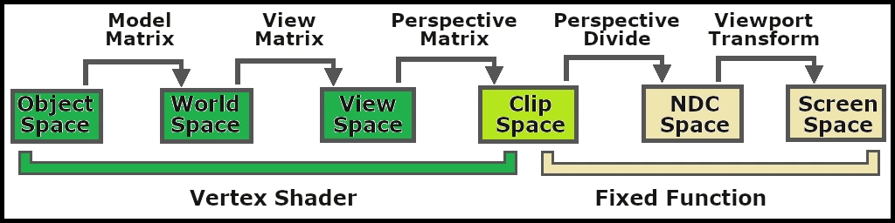

+++
author = 'Turbo Tartine'
date = '2025-08-28T08:43:37+02:00'
draft = false
title = "OpenRE devlog 4 : Fusion des mondes. Part I"
description = 'devlog 4 du projet OpenRE'
+++
[⬅️ Vers Précédent : "OpenRE devlog 3 : Harmonisation des normales"](projects/open_re_poc_devlog_3)

## I. Introduction
Grâce au travail effectué jusqu’ici, nous sommes en mesure de réaliser nos premiers rendus. Pour cela, nous allons partir de la scène actuelle, à laquelle nous ajouterons un peu de mouvement, mais surtout de la lumière.
Comme d’habitude, nous adopterons une approche itérative : nous commencerons par la version la plus rudimentaire possible, que nous complexifierons petit à petit jusqu’à atteindre notre objectif. À la fin, nous aurons un rendu en temps réel cohérent, comprenant :
- de la géométrie déterministe (pré-rendue dans Blender)
- de la géométrie interactive (rendue en temps réel par Godot)
- de la lumière déterministe (affectant aussi la géométrie interactive)
- de la lumière interactive (affectant aussi la géométrie déterministe)

Ou du moins, c’est ce que je prévoyais à l’origine. Mais je me suis rendu compte en cours de route que j’avais peut-être un peu sous-estimé le morceau. J'ai donc décider de le traiter en 2 fois. Dans cette première partie, nous n'aborderont pas la lumière déterministe, et seulement partiellement la lumière interactive. Mais ce n’est que partie remise, bien sûr.

## II. Préparation de la scène
Jusqu'ici, nous avons cherché à comparer des scènes identiques dans le but d'étaloner Godot et Blender afin qu'ils produisent des données bien harmonisées. Mais évidement dans un usage normal, le monde interactif diffère du déterministe. Dans Godot, nous allons donc masquer les éléments de la scène précédemment importée depuis Blender (qui sera notre scène déterministe).

 

On va ensuite ajouter de nouveaux meshes. Et comme ces meshes constituent le monde intéractif, on ne se privera pas de les animer.

[](images/int_geometry-anim.webp)

Enfin, nous allons desactiver l’oracle et créer un nouveau [post-process](/pages/glossary/#post-process) `ore_compositor` chargé de fusionner les deux scènes en temps réel. Comme l’oracle, il prendra en entrée les maps des G-Buffers déterministe et interactif, mais il aura également besoin de données supplémentaires relatives à la scène : les propriétés de la caméra active et, plus tard, celles des lumières.

 

On oubliera pas de désactiver le post-process [quad](/pages/glossary/#quad) de l’oracle et d’activer celui du compositor à la place.

 

Voyons à présent de quoi est fait ce post-process.

## III. Composition de la géométrie
Dans cette première itération, nous nous concentrons uniquement sur la géométrie, en laissant de côté la lumière. L’objectif est simple : obtenir un rendu [*unlit*](/pages/glossary/#unlit) où la scène interactive s’intègre naturellement à la scène déterministe, en respectant la profondeur.

Attention, pavé en approche ! Voici le code complet de cette première version du [shader](/pages/glossary/#shader) :

```glsl
// USUAL GODOT POST-PROCESS STUFF
shader_type spatial;
render_mode unshaded, fog_disabled;

void vertex() {
	POSITION = vec4(VERTEX.xy, 1.0, 1.0);
}

// HELPER FUNCTIONS FROM THE ORACLE
#include "pre_process_utils.gdshaderinc"

// SCENE UNIFORMS
uniform float cam_near;
uniform float cam_far;

// INTERACTIVE G-BUFFER
uniform sampler2D i_depth_map : filter_nearest;
uniform sampler2D i_albedo_map : filter_nearest;

// DETERMINIST G-BUFFER
uniform sampler2D d_depth_map : filter_nearest;
uniform sampler2D d_diffuse_color_map : filter_nearest;

void fragment() {
	// SAMPLE G-BUFFERs
	vec3 i_depth_frag = texture(i_depth_map, SCREEN_UV).rgb;
	vec3 i_albedo_frag = texture(i_albedo_map, SCREEN_UV).rgb;
	
	vec3 d_depth_frag = texture(d_depth_map, SCREEN_UV).rgb;
	vec3 d_diffuse_color_frag = texture(d_diffuse_color_map, SCREEN_UV).rgb;
	
	// DATA HARMONIZATION
	i_depth_frag = pre_process_i_depth(i_depth_frag);
	d_depth_frag = pre_process_d_depth(d_depth_frag, cam_near, cam_far);
	
	// DATA SELECTION (according to depth)
	float depth_frag;
	vec3 albedo_frag;
	bool is_frag_interactive = d_depth_frag.r < i_depth_frag.r;
	if(is_frag_interactive) {
		depth_frag = i_depth_frag.r;
		albedo_frag = i_albedo_frag;
	}
	else {
		depth_frag = d_depth_frag.r;
		albedo_frag = d_diffuse_color_frag;
	}
	
	// FINAL FRAGMENT COLOR
	ALBEDO = albedo_frag.rgb;
}
```
Ne vous inquiétez pas, nous allons le disséquer ensemble dans les sections suivantes.

### 1. Définition habituelle d’un post-process
Nous en avons déjà parlé : ces premières lignes sont identiques pour tous les post-process.


```glsl {#code-compact}
// USUAL GODOT POST-PROCESS STUFF
shader_type spatial;
render_mode unshaded, fog_disabled;

void vertex() {
	POSITION = vec4(VERTEX.xy, 1.0, 1.0);
}
```

```glsl {#code-full .hidden hl_lines=[1,2,3,4,5,6,7]}
// USUAL GODOT POST-PROCESS STUFF
shader_type spatial;
render_mode unshaded, fog_disabled;

void vertex() {
	POSITION = vec4(VERTEX.xy, 1.0, 1.0);
}

// HELPER FUNCTIONS FROM THE ORACLE
#include "pre_process_utils.gdshaderinc"

// SCENE UNIFORMS
uniform float cam_near;
uniform float cam_far;

// INTERACTIVE G-BUFFER
uniform sampler2D i_depth_map : filter_nearest;
uniform sampler2D i_albedo_map : filter_nearest;

// DETERMINIST G-BUFFER
uniform sampler2D d_depth_map : filter_nearest;
uniform sampler2D d_diffuse_color_map : filter_nearest;

void fragment() {
	// SAMPLE G-BUFFERs
	vec3 i_depth_frag = texture(i_depth_map, SCREEN_UV).rgb;
	vec3 i_albedo_frag = texture(i_albedo_map, SCREEN_UV).rgb;
	
	vec3 d_depth_frag = texture(d_depth_map, SCREEN_UV).rgb;
	vec3 d_diffuse_color_frag = texture(d_diffuse_color_map, SCREEN_UV).rgb;
	
	// DATA HARMONIZATION
	i_depth_frag = pre_process_i_depth(i_depth_frag);
	d_depth_frag = pre_process_d_depth(d_depth_frag, cam_near, cam_far);
	
	// DATA SELECTION (according to depth)
	float depth_frag;
	vec3 albedo_frag;
	bool is_frag_interactive = d_depth_frag.r < i_depth_frag.r;
	if(is_frag_interactive) {
		depth_frag = i_depth_frag.r;
		albedo_frag = i_albedo_frag;
	}
	else {
		depth_frag = d_depth_frag.r;
		albedo_frag = d_diffuse_color_frag;
	}
	
	// FINAL FRAGMENT COLOR
	ALBEDO = albedo_frag.rgb;
}
```


### 2. Inclusion des *helpers* de l’oracle


```glsl {#code-compact}
// HELPER FUNCTIONS FROM THE ORACLE
#include "pre_process_utils.gdshaderinc"
```

```glsl {#code-full .hidden hl_lines=[9,10]}
// USUAL GODOT POST-PROCESS STUFF
shader_type spatial;
render_mode unshaded, fog_disabled;

void vertex() {
	POSITION = vec4(VERTEX.xy, 1.0, 1.0);
}

// HELPER FUNCTIONS FROM THE ORACLE
#include "pre_process_utils.gdshaderinc"

// SCENE UNIFORMS
uniform float cam_near;
uniform float cam_far;

// INTERACTIVE G-BUFFER
uniform sampler2D i_depth_map : filter_nearest;
uniform sampler2D i_albedo_map : filter_nearest;

// DETERMINIST G-BUFFER
uniform sampler2D d_depth_map : filter_nearest;
uniform sampler2D d_diffuse_color_map : filter_nearest;

void fragment() {
	// SAMPLE G-BUFFERs
	vec3 i_depth_frag = texture(i_depth_map, SCREEN_UV).rgb;
	vec3 i_albedo_frag = texture(i_albedo_map, SCREEN_UV).rgb;
	
	vec3 d_depth_frag = texture(d_depth_map, SCREEN_UV).rgb;
	vec3 d_diffuse_color_frag = texture(d_diffuse_color_map, SCREEN_UV).rgb;
	
	// DATA HARMONIZATION
	i_depth_frag = pre_process_i_depth(i_depth_frag);
	d_depth_frag = pre_process_d_depth(d_depth_frag, cam_near, cam_far);
	
	// DATA SELECTION (according to depth)
	float depth_frag;
	vec3 albedo_frag;
	bool is_frag_interactive = d_depth_frag.r < i_depth_frag.r;
	if(is_frag_interactive) {
		depth_frag = i_depth_frag.r;
		albedo_frag = i_albedo_frag;
	}
	else {
		depth_frag = d_depth_frag.r;
		albedo_frag = d_diffuse_color_frag;
	}
	
	// FINAL FRAGMENT COLOR
	ALBEDO = albedo_frag.rgb;
}
```

Rappelez-vous : pour harmoniser les données, l’Oracle appliquait des prétraitements à certaines maps. J’ai extrait et regroupé ces fonctions dans le fichier `pre_process_utils.gdshaderinc`, que nous incluons ici. Ainsi, si nous modifions ces prétraitements, ils resteront valides pour les deux post-process. Voici son contenu :

```glsl
vec3 pre_process_i_depth(vec3 i_depth) {
	return i_depth;
}

vec3 pre_process_d_depth(vec3 d_depth, float near, float far) {
	float z = d_depth.r * (far - near) + near;
	float unlinearized_depth = (z * far - near * far) / (far - near);
	unlinearized_depth /= z;
	return vec3(1.0 - unlinearized_depth, 0.0, 0.0);
}

vec3 pre_process_i_normal(vec3 i_normal, mat4 inv_view_matrix) {
	i_normal = i_normal * 2.0 - 1.0;
	i_normal = (inv_view_matrix * vec4(i_normal, 0.0)).xyz;
	return i_normal;
}

vec3 pre_process_d_normal(vec3 d_normal) {
	d_normal = vec3(d_normal.x, d_normal.z, -d_normal.y);
	return d_normal;
}
```

### 3. Parmètres d'entrée
Comme évoqué précédemment, le post-process prend en entrée des uniforms correspondant aux deux G-Buffers, ainsi que quelques paramètres supplémentaires relatifs à la scène.


```glsl {#code-compact}
// SCENE UNIFORMS
uniform float cam_near;
uniform float cam_far;

// INTERACTIVE G-BUFFER
uniform sampler2D i_depth_map : filter_nearest;
uniform sampler2D i_albedo_map : filter_nearest;

// DETERMINIST G-BUFFER
uniform sampler2D d_depth_map : filter_nearest;
uniform sampler2D d_diffuse_color_map : filter_nearest;
```

```glsl {#code-full .hidden hl_lines=[12,13,14,15,16,17,18,19,20,21,22]}
// USUAL GODOT POST-PROCESS STUFF
shader_type spatial;
render_mode unshaded, fog_disabled;

void vertex() {
	POSITION = vec4(VERTEX.xy, 1.0, 1.0);
}

// HELPER FUNCTIONS FROM THE ORACLE
#include "pre_process_utils.gdshaderinc"

// SCENE UNIFORMS
uniform float cam_near;
uniform float cam_far;

// INTERACTIVE G-BUFFER
uniform sampler2D i_depth_map : filter_nearest;
uniform sampler2D i_albedo_map : filter_nearest;

// DETERMINIST G-BUFFER
uniform sampler2D d_depth_map : filter_nearest;
uniform sampler2D d_diffuse_color_map : filter_nearest;

void fragment() {
	// SAMPLE G-BUFFERs
	vec3 i_depth_frag = texture(i_depth_map, SCREEN_UV).rgb;
	vec3 i_albedo_frag = texture(i_albedo_map, SCREEN_UV).rgb;
	
	vec3 d_depth_frag = texture(d_depth_map, SCREEN_UV).rgb;
	vec3 d_diffuse_color_frag = texture(d_diffuse_color_map, SCREEN_UV).rgb;
	
	// DATA HARMONIZATION
	i_depth_frag = pre_process_i_depth(i_depth_frag);
	d_depth_frag = pre_process_d_depth(d_depth_frag, cam_near, cam_far);
	
	// DATA SELECTION (according to depth)
	float depth_frag;
	vec3 albedo_frag;
	bool is_frag_interactive = d_depth_frag.r < i_depth_frag.r;
	if(is_frag_interactive) {
		depth_frag = i_depth_frag.r;
		albedo_frag = i_albedo_frag;
	}
	else {
		depth_frag = d_depth_frag.r;
		albedo_frag = d_diffuse_color_frag;
	}
	
	// FINAL FRAGMENT COLOR
	ALBEDO = albedo_frag.rgb;
}
```

Pour l’instant, nous avons besoin :
- des paramètres *near* et *far* de la caméra active
- des textures de *depth* et d’*albedo* issues des G-Buffers interactif et déterministe.

L’albedo déterministe est ici nommé `d_diffuse_color_map`, car c’est son nom dans la terminologie Blender. Mais il s’agit bien de la même chose.

### 4. Echantillonage des G-Buffers
Chaque map est échantillonnée pour récupérer le fragment correspondant. Dans la foulée, nous appliquons les prétraitements.


```glsl {#code-compact}
void fragment() {
	// SAMPLE G-BUFFERs
	vec3 i_depth_frag = texture(i_depth_map, SCREEN_UV).rgb;
	vec3 i_albedo_frag = texture(i_albedo_map, SCREEN_UV).rgb;
	
	vec3 d_depth_frag = texture(d_depth_map, SCREEN_UV).rgb;
	vec3 d_diffuse_color_frag = texture(d_diffuse_color_map, SCREEN_UV).rgb;
	
	// DATA HARMONIZATION
	i_depth_frag = pre_process_i_depth(i_depth_frag);
	d_depth_frag = pre_process_d_depth(d_depth_frag, cam_near, cam_far);
	
	...
}
```

```glsl {#code-full .hidden hl_lines=[24,51,25,26,27,28,29,30,31,32,33,34]}
// USUAL GODOT POST-PROCESS STUFF
shader_type spatial;
render_mode unshaded, fog_disabled;

void vertex() {
	POSITION = vec4(VERTEX.xy, 1.0, 1.0);
}

// HELPER FUNCTIONS FROM THE ORACLE
#include "pre_process_utils.gdshaderinc"

// SCENE UNIFORMS
uniform float cam_near;
uniform float cam_far;

// INTERACTIVE G-BUFFER
uniform sampler2D i_depth_map : filter_nearest;
uniform sampler2D i_albedo_map : filter_nearest;

// DETERMINIST G-BUFFER
uniform sampler2D d_depth_map : filter_nearest;
uniform sampler2D d_diffuse_color_map : filter_nearest;

void fragment() {
	// SAMPLE G-BUFFERs
	vec3 i_depth_frag = texture(i_depth_map, SCREEN_UV).rgb;
	vec3 i_albedo_frag = texture(i_albedo_map, SCREEN_UV).rgb;
	
	vec3 d_depth_frag = texture(d_depth_map, SCREEN_UV).rgb;
	vec3 d_diffuse_color_frag = texture(d_diffuse_color_map, SCREEN_UV).rgb;
	
	// DATA HARMONIZATION
	i_depth_frag = pre_process_i_depth(i_depth_frag);
	d_depth_frag = pre_process_d_depth(d_depth_frag, cam_near, cam_far);
	
	// DATA SELECTION (according to depth)
	float depth_frag;
	vec3 albedo_frag;
	bool is_frag_interactive = d_depth_frag.r < i_depth_frag.r;
	if(is_frag_interactive) {
		depth_frag = i_depth_frag.r;
		albedo_frag = i_albedo_frag;
	}
	else {
		depth_frag = d_depth_frag.r;
		albedo_frag = d_diffuse_color_frag;
	}
	
	// FINAL FRAGMENT COLOR
	ALBEDO = albedo_frag.rgb;
}
```


### 5. Selection des fragment
Ensuite, nous utilisons la profondeur pour déterminer lequel des deux mondes occlude l'autre. Nous assignons alors les données correspondant au monde visible aux variables `depth_frag` et `albedo_frag`, que nous utiliserons dans la suite du shader.


```glsl {#code-compact}
void fragment() {
	...
	
	// DATA SELECTION (according to depth)
	float depth_frag;
	vec3 albedo_frag;
	bool is_frag_interactive = d_depth_frag.r < i_depth_frag.r;
	if(is_frag_interactive) {
		depth_frag = i_depth_frag.r;
		albedo_frag = i_albedo_frag;
	}
	else {
		depth_frag = d_depth_frag.r;
		albedo_frag = d_diffuse_color_frag;
	}
	
	...
}
```

```glsl {#code-full .hidden hl_lines=[24,51,36,37,38,39,40,41,42,43,44,45,46,47]}
// USUAL GODOT POST-PROCESS STUFF
shader_type spatial;
render_mode unshaded, fog_disabled;

void vertex() {
	POSITION = vec4(VERTEX.xy, 1.0, 1.0);
}

// HELPER FUNCTIONS FROM THE ORACLE
#include "pre_process_utils.gdshaderinc"

// SCENE UNIFORMS
uniform float cam_near;
uniform float cam_far;

// INTERACTIVE G-BUFFER
uniform sampler2D i_depth_map : filter_nearest;
uniform sampler2D i_albedo_map : filter_nearest;

// DETERMINIST G-BUFFER
uniform sampler2D d_depth_map : filter_nearest;
uniform sampler2D d_diffuse_color_map : filter_nearest;

void fragment() {
	// SAMPLE G-BUFFERs
	vec3 i_depth_frag = texture(i_depth_map, SCREEN_UV).rgb;
	vec3 i_albedo_frag = texture(i_albedo_map, SCREEN_UV).rgb;
	
	vec3 d_depth_frag = texture(d_depth_map, SCREEN_UV).rgb;
	vec3 d_diffuse_color_frag = texture(d_diffuse_color_map, SCREEN_UV).rgb;
	
	// DATA HARMONIZATION
	i_depth_frag = pre_process_i_depth(i_depth_frag);
	d_depth_frag = pre_process_d_depth(d_depth_frag, cam_near, cam_far);
	
	// DATA SELECTION (according to depth)
	float depth_frag;
	vec3 albedo_frag;
	bool is_frag_interactive = d_depth_frag.r < i_depth_frag.r;
	if(is_frag_interactive) {
		depth_frag = i_depth_frag.r;
		albedo_frag = i_albedo_frag;
	}
	else {
		depth_frag = d_depth_frag.r;
		albedo_frag = d_diffuse_color_frag;
	}
	
	// FINAL FRAGMENT COLOR
	ALBEDO = albedo_frag.rgb;
}
```


### 6. Affichage du fragment final

```glsl {#code-compact}
void fragment() {
	...
	
	// FINAL FRAGMENT COLOR
	ALBEDO = albedo_frag.rgb;
}
```

```glsl {#code-full .hidden hl_lines=[24,51,49,50]}
// USUAL GODOT POST-PROCESS STUFF
shader_type spatial;
render_mode unshaded, fog_disabled;

void vertex() {
	POSITION = vec4(VERTEX.xy, 1.0, 1.0);
}

// HELPER FUNCTIONS FROM THE ORACLE
#include "pre_process_utils.gdshaderinc"

// SCENE UNIFORMS
uniform float cam_near;
uniform float cam_far;

// INTERACTIVE G-BUFFER
uniform sampler2D i_depth_map : filter_nearest;
uniform sampler2D i_albedo_map : filter_nearest;

// DETERMINIST G-BUFFER
uniform sampler2D d_depth_map : filter_nearest;
uniform sampler2D d_diffuse_color_map : filter_nearest;

void fragment() {
	// SAMPLE G-BUFFERs
	vec3 i_depth_frag = texture(i_depth_map, SCREEN_UV).rgb;
	vec3 i_albedo_frag = texture(i_albedo_map, SCREEN_UV).rgb;
	
	vec3 d_depth_frag = texture(d_depth_map, SCREEN_UV).rgb;
	vec3 d_diffuse_color_frag = texture(d_diffuse_color_map, SCREEN_UV).rgb;
	
	// DATA HARMONIZATION
	i_depth_frag = pre_process_i_depth(i_depth_frag);
	d_depth_frag = pre_process_d_depth(d_depth_frag, cam_near, cam_far);
	
	// DATA SELECTION (according to depth)
	float depth_frag;
	vec3 albedo_frag;
	bool is_frag_interactive = d_depth_frag.r < i_depth_frag.r;
	if(is_frag_interactive) {
		depth_frag = i_depth_frag.r;
		albedo_frag = i_albedo_frag;
	}
	else {
		depth_frag = d_depth_frag.r;
		albedo_frag = d_diffuse_color_frag;
	}
	
	// FINAL FRAGMENT COLOR
	ALBEDO = albedo_frag.rgb;
}
```

Bon, d’accord, la "suite du shader" est pour l’instant un peu courte. Nous ne faisons qu’afficher directement l’albedo du monde sélectionné, sans même utiliser `depth_frag`. Mais ne vous inquiétez pas, ça viendra. Pour l’heure, je vous propose d’admirer ce magnifique chapaï !

 

<video width="100%" controls muted loop playsinline autoplay>
    <source src="videos/unlit_chapai.mp4" type="video/mp4">
    Your browser does not support the video tag.  
</video>



Oui, je sais, ce n’est pas très impressionnant sans lumière. Mais au moins, nous pouvons constater que la sélection du monde selon la profondeur est correcte : les parties du chapaï qui se trouvent sous le podium sont bien invisibles, tandis que le reste est correctement rendu par-dessus l’arrière-plan.

Mission accomplie ! Place à la lumière, maintenant.

## IV. Un premier modèle d’illumination
Avant de nous attaquer à un éclairage plus conventionnel, nous allons explorer un modèle d'illumination pas du tout homologué basé uniquement sur l’atténuation de la lumière en fonction de la distance. Ce modèle ignore délibérément l’orientation des surfaces. Bien sûr, il n’est pas photoréaliste, mais il offre un rendu stylisé des plus intéressants.

Si vous voulez voir à quoi cela ressemble entre les mains d’une artiste compétente (ce que je ne suis pas vraiment), je vous conseille [ce *talk*](https://www.youtube.com/watch?v=RoqDqHdBI2Y) de Theresa Latzko. Elle y explique les choix artistiques et l’implémentation technique derrière la direction artistique de son jeu « Days of the Porcupine » (si vous vous demandez, oui, je lui ai complètement piqué l’idée, mouhahaha !).

[](images/days_of_porcupine.opti.webp)
*Extrait de la présentation « Art of the Porcupine » par Theresa Latzko. A gauche un [vertex lighting](/pages/glossary/#vertex-lighting) classic. A droite le fameux "*distance-only lighting*"

Nous n'irons pas aussi loin qu'elle car nous visons quelque chose de plutôt réaliste. Mais passer par cette étape intermédiaire nous permettra de nous étandre sur certains détails. Et on va commencer tout de suite par une petite parenthèse sur *l'inverse square law*.

### 1. Inverse Square Law
La *inverse square law* est une loi physique qui s’applique à différentes quantités, dont l’intensité lumineuse irradiant d’une source ponctuelle. Elle dit que  "l’intensité lumineuse en un point de l’espace est inversement proportionnelle au carré de la distance séparant ce point de la source". Ou de manière plus compacte : `I = I0 / d²` (avec `I0` l'intensité de la source et `d` la distance)

Pour visualiser cette relation, imaginez une sphère centrée sur la source lumineuse. Les photons s’échappent de la source en ligne droite dans toutes les directions et entrent en collision avec la sphère. Ces collisions sont uniformément réparties sur toute sa surface. 

Maintenant, imaginez que cette sphère grandisse. Le nombre de photons qui la frappent reste constant, car la quantité de lumière émise par la source ne dépend pas de la taille de la sphère. En revanche, la surface à éclairer augmente. La quantitée de lumière au m² est donc plus faible.

[](images/Inverse_square_law.opti.webp)

Cette décroissance de la concentration de photons est directement liée à l’augmentation de la surface. Or, la surface d’une sphère est proportionnelle au carré de son rayon (`S = 4πr²`).

Si cette explication ne vous parle pas, pensez à un ballon de baudruche avec un motif imprimé dessus. En le gonflant, le motif s’étire et pâlit. C'est un peu "avec les mains" comme exemple, mais ça illustre bien le principe : la quantité d’encre à la surface du ballon reste la même, mais elle se répartit sur une surface plus grande.

Bref, c'est la loi qu'on va utiliser pour modéliser notre lumière.

### 2. Implémentation
Commençons par ajouter une OmniLight à la scène interactive. Un script la fera orbiter autour de notre structure, tout en altérant périodiquement sa couleur et son intensité. Une petite sphère blanche la matérialisera pour faciliter le débogage.

[](images/rotolight-anim.webp)

Nous pouvons maintenant reprendre le shader pour y implémenter le fameux "*distance-only lighting*" de « Days of the Porcupine ». Pour un aperçu global, voici les modifications apportées :

```glsl {#code-compact}
// USUAL GODOT POST-PROCESS CODE
// HELPER FUNCTIONS FROM THE ORACLE
// SCENE UNIFORMS
...
uniform int nb_plights;
uniform vec3 plight_position[8];
uniform vec3 plight_color[8];
uniform float plight_intensity[8];

// INTERACTIVE G-BUFFER
// DETERMINIST G-BUFFER
...

void fragment() {
	// SAMPLE G-BUFFERs
	// DATA HARMONIZATION
	...
	
	vec3 diffuse_contrib = vec3(0.0);
	vec3 specular_contrib = vec3(0.0);
	
	// DATA SELECTION (according to depth)
	// WORLD POSITION FROM DEPTH
	vec3 ndc = vec3((SCREEN_UV * 2.0) - 1.0, depth_frag);
	vec4 clip = vec4(ndc, 1.0);
	vec4 world = INV_VIEW_MATRIX * INV_PROJECTION_MATRIX * clip;
	world.xyz /= world.w;
	vec3 frag_position = world.xyz;
	
	// ACCUMULATE LIGHT CONTRIBUTIONS
	for(int i = 0; i < nb_plights; i++) {
		vec3 light_vec = plight_position[i] - frag_position;
		float d2 = length(light_vec);
		d2 = pow(d2, 2.0);
		float attenuation = 1.0 / d2;

		vec3 C = plight_color[i];
		float I = plight_intensity[i];
		diffuse_contrib += C * I * albedo_frag * attenuation;
		//specular_contrib += NOT IMPLEMENTED YET
	}
	
	// FINAL FRAGMENT COLOR
	ALBEDO = diffuse_contrib + specular_contrib;
}
```

```glsl {#code-full .hidden hl_lines=[15,16,17,18,28,78,40,41,56,57,58,59,60,61,62,63,64,65,66,67,68,69,70,71,72,73,74,75,76,77]}
// USUAL GODOT POST-PROCESS STUFF
shader_type spatial;
render_mode unshaded, fog_disabled;

void vertex() {
	POSITION = vec4(VERTEX.xy, 1.0, 1.0);
}

// HELPER FUNCTIONS FROM THE ORACLE
#include "pre_process_utils.gdshaderinc"

// SCENE UNIFORMS
uniform float cam_near;
uniform float cam_far;
uniform int nb_plights;
uniform vec3 plight_position[8];
uniform vec3 plight_color[8];
uniform float plight_intensity[8];

// INTERACTIVE G-BUFFER
uniform sampler2D i_depth_map : filter_nearest;
uniform sampler2D i_albedo_map : filter_nearest;

// DETERMINIST G-BUFFER
uniform sampler2D d_depth_map : filter_nearest;
uniform sampler2D d_diffuse_color_map : filter_nearest;

void fragment() {
	// SAMPLE G-BUFFERs
	vec3 i_depth_frag = texture(i_depth_map, SCREEN_UV).rgb;
	vec3 i_albedo_frag = texture(i_albedo_map, SCREEN_UV).rgb;
	
	vec3 d_depth_frag = texture(d_depth_map, SCREEN_UV).rgb;
	vec3 d_diffuse_color_frag = texture(d_diffuse_color_map, SCREEN_UV).rgb;
	
	// DATA HARMONIZATION
	i_depth_frag = pre_process_i_depth(i_depth_frag);
	d_depth_frag = pre_process_d_depth(d_depth_frag, cam_near, cam_far);
	
	vec3 diffuse_contrib = vec3(0.0);
	vec3 specular_contrib = vec3(0.0);
	
	// DATA SELECTION (according to depth)
	float depth_frag;
	vec3 albedo_frag;
	bool is_frag_interactive = d_depth_frag.r < i_depth_frag.r;
	if(is_frag_interactive) {
		depth_frag = i_depth_frag.r;
		albedo_frag = i_albedo_frag;
	}
	else {
		depth_frag = d_depth_frag.r;
		albedo_frag = d_diffuse_color_frag;
	}
	
	// WORLD POSITION FROM DEPTH
	vec3 ndc = vec3((SCREEN_UV * 2.0) - 1.0, depth_frag);
	vec4 clip = vec4(ndc, 1.0);
	vec4 world = INV_VIEW_MATRIX * INV_PROJECTION_MATRIX * clip;
	world.xyz /= world.w;
	vec3 frag_position = world.xyz;
	
	// ACCUMULATE LIGHT CONTRIBUTIONS
	for(int i = 0; i < nb_plights; i++) {
		vec3 light_vec = plight_position[i] - frag_position;
		float d2 = length(light_vec);
		d2 = pow(d2, 2.0);
		float attenuation = 1.0 / d2;

		vec3 C = plight_color[i];
		float I = plight_intensity[i];
		diffuse_contrib += C * I * albedo_frag * attenuation;
		//specular_contrib += NOT IMPLEMENTED YET
	}
	
	// FINAL FRAGMENT COLOR
	ALBEDO = diffuse_contrib + specular_contrib;
}
```

Comme d’habitude, nous allons expliquer tout cela en douceur.

#### 1.1. Paramètres des lumières
D'abord on fourni à notre post-process les paramètres de la lumière :
- position
- couleur
- intensité

Bien qu’on en ait qu’une seule pour l’instant, nous anticipons dès maintenant l’ajout de nouvelles lumières en utilisant des tableaux plutôt que des variables simples.


```glsl {#code-compact hl_lines=[4,5,6,7]}
// SCENE UNIFORMS
uniform float cam_near;
uniform float cam_far;
uniform int nb_plights;
uniform vec3 plight_position[8];
uniform vec3 plight_color[8];
uniform float plight_intensity[8];
```

```glsl {#code-full .hidden hl_lines=[15,16,17,18]}
// USUAL GODOT POST-PROCESS STUFF
shader_type spatial;
render_mode unshaded, fog_disabled;

void vertex() {
	POSITION = vec4(VERTEX.xy, 1.0, 1.0);
}

// HELPER FUNCTIONS FROM THE ORACLE
#include "pre_process_utils.gdshaderinc"

// SCENE UNIFORMS
uniform float cam_near;
uniform float cam_far;
uniform int nb_plights;
uniform vec3 plight_position[8];
uniform vec3 plight_color[8];
uniform float plight_intensity[8];

// INTERACTIVE G-BUFFER
uniform sampler2D i_depth_map : filter_nearest;
uniform sampler2D i_albedo_map : filter_nearest;

// DETERMINIST G-BUFFER
uniform sampler2D d_depth_map : filter_nearest;
uniform sampler2D d_diffuse_color_map : filter_nearest;

void fragment() {
	// SAMPLE G-BUFFERs
	vec3 i_depth_frag = texture(i_depth_map, SCREEN_UV).rgb;
	vec3 i_albedo_frag = texture(i_albedo_map, SCREEN_UV).rgb;
	
	vec3 d_depth_frag = texture(d_depth_map, SCREEN_UV).rgb;
	vec3 d_diffuse_color_frag = texture(d_diffuse_color_map, SCREEN_UV).rgb;
	
	// DATA HARMONIZATION
	i_depth_frag = pre_process_i_depth(i_depth_frag);
	d_depth_frag = pre_process_d_depth(d_depth_frag, cam_near, cam_far);
	
	vec3 diffuse_contrib = vec3(0.0);
	vec3 specular_contrib = vec3(0.0);
	
	// DATA SELECTION (according to depth)
	float depth_frag;
	vec3 albedo_frag;
	bool is_frag_interactive = d_depth_frag.r < i_depth_frag.r;
	if(is_frag_interactive) {
		depth_frag = i_depth_frag.r;
		albedo_frag = i_albedo_frag;
	}
	else {
		depth_frag = d_depth_frag.r;
		albedo_frag = d_diffuse_color_frag;
	}
	
	// WORLD POSITION FROM DEPTH
	vec3 ndc = vec3((SCREEN_UV * 2.0) - 1.0, depth_frag);
	vec4 clip = vec4(ndc, 1.0);
	vec4 world = INV_VIEW_MATRIX * INV_PROJECTION_MATRIX * clip;
	world.xyz /= world.w;
	vec3 frag_position = world.xyz;
	
	// ACCUMULATE LIGHT CONTRIBUTIONS
	for(int i = 0; i < nb_plights; i++) {
		vec3 light_vec = plight_position[i] - frag_position;
		float d2 = length(light_vec);
		d2 = pow(d2, 2.0);
		float attenuation = 1.0 / d2;

		vec3 C = plight_color[i];
		float I = plight_intensity[i];
		diffuse_contrib += C * I * albedo_frag * attenuation;
		//specular_contrib += NOT IMPLEMENTED YET
	}
	
	// FINAL FRAGMENT COLOR
	ALBEDO = diffuse_contrib + specular_contrib;
}
```


**Trois tableaux et un entier ? Pourquoi tant de haine ?!!**

"Pourquoi ne pas utiliser un tableau de structures, comme dans n'importe quel langage [CPU](/pages/glossary/#cpu) ?" Bonne question ! En GLSL, les tableaux sont très limités : leur taille doit être connue à la compilation, et en réalité, derière le rideau, ils sont souvent gérés comme une suite de variables simples. C’est plus une commodité d’écriture qu’une vrai structure de donnée.

La seule solution pour avoir des tableaux dynamiques, ce serait d’utiliser des SSBO (Shader Storage Buffer Objects). Sauf que… GDShader (le langage de shader de Godot) ne supporte ni les SSBO ni les structures. On est donc coincés avec trois tableaux de taille fixe et un entier pour savoir combien de lumières on a au total.

#### 1.2. Calcul de la position du fragment
Pour calculer la distance entre la lumière et le fragment, il faut d’abord connaître sa position dans le monde. Et pour obtenir cette dernière, il faut comprendre ce que j’appelle la "*coordinate transformation chain*".  Il s’agit de la succession de changements d’espaces qui font passer les [vertex](/pages/glossary/#vertex) des coordonnées locales de l’objet à l’espace écran.

[](images/transform_chain.opti.webp)

Nous disposons déjà de la profondeur du fragment (`depth_frag`), et Godot nous fournit sa position à l’écran via la variable `SCREEN_UV`. Nous pouvons en déduire la coordonée en espace NDC (*Native Device Coordinate*).

À partir de là, il suffit d’inverser le tronçon de la "*coordinate transformation chain*" qui nous intéresse, et de l'appliquer à notre *Native Device Coordinate* pour avoir la position du fragment en *world space* :


```glsl {#code-compact}
void fragment() {
	...
	
	// WORLD POSITION FROM DEPTH
	vec3 ndc = vec3((SCREEN_UV * 2.0) - 1.0, depth_frag);
	vec4 clip = vec4(ndc, 1.0);
	vec4 world = INV_VIEW_MATRIX * INV_PROJECTION_MATRIX * clip;
	world.xyz /= world.w;
	vec3 frag_position = world.xyz;
		
	...
}
```

```glsl {#code-full .hidden hl_lines=[28,78,56,57,58,59,60,61]}
// USUAL GODOT POST-PROCESS STUFF
shader_type spatial;
render_mode unshaded, fog_disabled;

void vertex() {
	POSITION = vec4(VERTEX.xy, 1.0, 1.0);
}

// HELPER FUNCTIONS FROM THE ORACLE
#include "pre_process_utils.gdshaderinc"

// SCENE UNIFORMS
uniform float cam_near;
uniform float cam_far;
uniform int nb_plights;
uniform vec3 plight_position[8];
uniform vec3 plight_color[8];
uniform float plight_intensity[8];

// INTERACTIVE G-BUFFER
uniform sampler2D i_depth_map : filter_nearest;
uniform sampler2D i_albedo_map : filter_nearest;

// DETERMINIST G-BUFFER
uniform sampler2D d_depth_map : filter_nearest;
uniform sampler2D d_diffuse_color_map : filter_nearest;

void fragment() {
	// SAMPLE G-BUFFERs
	vec3 i_depth_frag = texture(i_depth_map, SCREEN_UV).rgb;
	vec3 i_albedo_frag = texture(i_albedo_map, SCREEN_UV).rgb;
	
	vec3 d_depth_frag = texture(d_depth_map, SCREEN_UV).rgb;
	vec3 d_diffuse_color_frag = texture(d_diffuse_color_map, SCREEN_UV).rgb;
	
	// DATA HARMONIZATION
	i_depth_frag = pre_process_i_depth(i_depth_frag);
	d_depth_frag = pre_process_d_depth(d_depth_frag, cam_near, cam_far);
	
	vec3 diffuse_contrib = vec3(0.0);
	vec3 specular_contrib = vec3(0.0);
	
	// DATA SELECTION (according to depth)
	float depth_frag;
	vec3 albedo_frag;
	bool is_frag_interactive = d_depth_frag.r < i_depth_frag.r;
	if(is_frag_interactive) {
		depth_frag = i_depth_frag.r;
		albedo_frag = i_albedo_frag;
	}
	else {
		depth_frag = d_depth_frag.r;
		albedo_frag = d_diffuse_color_frag;
	}
	
	// WORLD POSITION FROM DEPTH
	vec3 ndc = vec3((SCREEN_UV * 2.0) - 1.0, depth_frag);
	vec4 clip = vec4(ndc, 1.0);
	vec4 world = INV_VIEW_MATRIX * INV_PROJECTION_MATRIX * clip;
	world.xyz /= world.w;
	vec3 frag_position = world.xyz;
	
	// ACCUMULATE LIGHT CONTRIBUTIONS
	for(int i = 0; i < nb_plights; i++) {
		vec3 light_vec = plight_position[i] - frag_position;
		float d2 = length(light_vec);
		d2 = pow(d2, 2.0);
		float attenuation = 1.0 / d2;

		vec3 C = plight_color[i];
		float I = plight_intensity[i];
		diffuse_contrib += C * I * albedo_frag * attenuation;
		//specular_contrib += NOT IMPLEMENTED YET
	}
	
	// FINAL FRAGMENT COLOR
	ALBEDO = diffuse_contrib + specular_contrib;
}
```

**Mais à quoi sert la ligne :** `world.xyz /= world.w` **?**

Vous n'avez surement pas envie que je vous assome avec un cours sur les coordonnées homogènes. J'avoue que ça tombe très bien car c'est un sujet complexe que je ne maitrise pas totalement 😅 (ressources bienvenues dans les commentaires au passage !).

Pour faire simple, voici ce que je pense en avoir compris : l'idée est de passer dans un espace de dimention supérieure qui offre des avantages mathématiques pratiques. En programmation graphique, cela permet notamment de :
- Faire la distinction entre une position et une direction
- Modéliser la translation comme une multiplication matricielle
- Avoir accès à la matrice de perspective

C’est pour ces raisons que les API graphiques utilisent cet espace plutôt que l’espace euclidien classique. Pour convertir une coordonnée euclidienne en coordonnée homogène, on ajoute simplement une composante supplémentaire :
- 1 pour une position : 	(x, y, z) => (x, y, z, 1)
- 0 pour une direction  : 	(x, y, z) => (x, y, z, 0)

Pour revenir à une coordonnée euclidienne depuis une coordonnée homogène, on divise chaque composante par w : (x, y, z, w) => (x/w, y/w, z/w).

C’est de là que vient la ligne magique : `world.xyz /= world.w;`.

#### 1.3. Calcule de la lumière
Pour déterminer la couleur finale du fragment, nous allons parcourir notre tableau de lumières et accumuler chacune de leurs contributions. Dans la plupart des modèles d’éclairage, chaque contribution se compose de deux parties :
- La diffuse : partie de la lumière dispersée dans toutes les directions, qui nous permet de percevoir la couleur de l’objet (comme une balle en caoutchouc).
- La spéculaire : partie de la lumière réfléchie principalement dans une direction privilégiée produisant les reflets (par exemple, un mirroir est un objet completement spéculaire)


```glsl {#code-compact}
void fragment() {
	...
	
	vec3 diffuse_contrib = vec3(0.0);
	vec3 specular_contrib = vec3(0.0);
	
	...
	
	// ACCUMULATE LIGHT CONTRIBUTIONS
	for(int i = 0; i < nb_plights; i++) {
		vec3 light_vec = plight_position[i] - frag_position;
		float d2 = length(light_vec);
		d2 = pow(d2, 2.0);
		float attenuation = 1.0 / d2;

		vec3 C = plight_color[i];
		float I = plight_intensity[i];
		diffuse_contrib += C * I * albedo_frag * attenuation;
		//specular_contrib += NOT IMPLEMENTED YET
	}
	
	// FINAL FRAGMENT COLOR
	ALBEDO = diffuse_contrib + specular_contrib;
}
```

```glsl {#code-full .hidden hl_lines=[28,78,40,41,63,64,65,66,67,68,69,70,71,72,73,74,75,76,77]}
// USUAL GODOT POST-PROCESS STUFF
shader_type spatial;
render_mode unshaded, fog_disabled;

void vertex() {
	POSITION = vec4(VERTEX.xy, 1.0, 1.0);
}

// HELPER FUNCTIONS FROM THE ORACLE
#include "pre_process_utils.gdshaderinc"

// SCENE UNIFORMS
uniform float cam_near;
uniform float cam_far;
uniform int nb_plights;
uniform vec3 plight_position[8];
uniform vec3 plight_color[8];
uniform float plight_intensity[8];

// INTERACTIVE G-BUFFER
uniform sampler2D i_depth_map : filter_nearest;
uniform sampler2D i_albedo_map : filter_nearest;

// DETERMINIST G-BUFFER
uniform sampler2D d_depth_map : filter_nearest;
uniform sampler2D d_diffuse_color_map : filter_nearest;

void fragment() {
	// SAMPLE G-BUFFERs
	vec3 i_depth_frag = texture(i_depth_map, SCREEN_UV).rgb;
	vec3 i_albedo_frag = texture(i_albedo_map, SCREEN_UV).rgb;
	
	vec3 d_depth_frag = texture(d_depth_map, SCREEN_UV).rgb;
	vec3 d_diffuse_color_frag = texture(d_diffuse_color_map, SCREEN_UV).rgb;
	
	// DATA HARMONIZATION
	i_depth_frag = pre_process_i_depth(i_depth_frag);
	d_depth_frag = pre_process_d_depth(d_depth_frag, cam_near, cam_far);
	
	vec3 diffuse_contrib = vec3(0.0);
	vec3 specular_contrib = vec3(0.0);
	
	// DATA SELECTION (according to depth)
	float depth_frag;
	vec3 albedo_frag;
	bool is_frag_interactive = d_depth_frag.r < i_depth_frag.r;
	if(is_frag_interactive) {
		depth_frag = i_depth_frag.r;
		albedo_frag = i_albedo_frag;
	}
	else {
		depth_frag = d_depth_frag.r;
		albedo_frag = d_diffuse_color_frag;
	}
	
	// WORLD POSITION FROM DEPTH
	vec3 ndc = vec3((SCREEN_UV * 2.0) - 1.0, depth_frag);
	vec4 clip = vec4(ndc, 1.0);
	vec4 world = INV_VIEW_MATRIX * INV_PROJECTION_MATRIX * clip;
	world.xyz /= world.w;
	vec3 frag_position = world.xyz;
	
	// ACCUMULATE LIGHT CONTRIBUTIONS
	for(int i = 0; i < nb_plights; i++) {
		vec3 light_vec = plight_position[i] - frag_position;
		float d2 = length(light_vec);
		d2 = pow(d2, 2.0);
		float attenuation = 1.0 / d2;

		vec3 C = plight_color[i];
		float I = plight_intensity[i];
		diffuse_contrib += C * I * albedo_frag * attenuation;
		//specular_contrib += NOT IMPLEMENTED YET
	}
	
	// FINAL FRAGMENT COLOR
	ALBEDO = diffuse_contrib + specular_contrib;
}
```

Comme vous pouvez le constater, notre modèle du pauvre fait l'impasse sur la spéculaire. La raison à cela, c'est que nos G-Buffers actuels ne contiennent pas encore les données nécessaires pour calculer cette composante. Mais comme pour les tableaux de lumière, nous déclarons déjà `specular_contrib` en prévision des futures améliorations.


```glsl {#code-compact}
		vec3 C = plight_color[i];
		float I = plight_intensity[i];
		diffuse_contrib += C * I * albedo_frag * attenuation;
		//specular_contrib += NOT IMPLEMENTED YET
```

```glsl {#code-full .hidden hl_lines=[16,17,18,19]}
void fragment() {
	...
	
	vec3 diffuse_contrib = vec3(0.0);
	vec3 specular_contrib = vec3(0.0);
	
	...
	
	// ACCUMULATE LIGHT CONTRIBUTIONS
	for(int i = 0; i < nb_plights; i++) {
		vec3 light_vec = plight_position[i] - frag_position;
		float d2 = length(light_vec);
		d2 = pow(d2, 2.0);
		float attenuation = 1.0 / d2;

		vec3 C = plight_color[i];
		float I = plight_intensity[i];
		diffuse_contrib += C * I * albedo_frag * attenuation;
		//specular_contrib += NOT IMPLEMENTED YET
	}
	
	// FINAL FRAGMENT COLOR
	ALBEDO = diffuse_contrib + specular_contrib;
}
```

Par ailleurs, vous pouvez remarquer que le facteur d’atténuation est bien calculé en appliquant l'*inverse square law* :


```glsl {#code-compact}
		vec3 light_vec = plight_position[i] - frag_position;
		float d2 = length(light_vec);
		d2 = pow(d2, 2.0);
		float attenuation = 1.0 / d2;
```

```glsl {#code-full .hidden hl_lines=[11,12,13,14]}
void fragment() {
	...
	
	vec3 diffuse_contrib = vec3(0.0);
	vec3 specular_contrib = vec3(0.0);
	
	...
	
	// ACCUMULATE LIGHT CONTRIBUTIONS
	for(int i = 0; i < nb_plights; i++) {
		vec3 light_vec = plight_position[i] - frag_position;
		float d2 = length(light_vec);
		d2 = pow(d2, 2.0);
		float attenuation = 1.0 / d2;

		vec3 C = plight_color[i];
		float I = plight_intensity[i];
		diffuse_contrib += C * I * albedo_frag * attenuation;
		//specular_contrib += NOT IMPLEMENTED YET
	}
	
	// FINAL FRAGMENT COLOR
	ALBEDO = diffuse_contrib + specular_contrib;
}
```

Ce qui nous donne le résultat suivant :

 

<video width="100%" controls muted loop playsinline autoplay>
    <source src="videos/distance_only_light.mp4" type="video/mp4">
    Your browser does not support the video tag.  
</video>



## IV. Conclusion
Comme on a pu le voir en image, ce modèle d'illumination marche très bien dans « Days of the Porcupine », mais il faut avouer que sur notre scène, il est un peu fade. Le rendu est très plat, et avec des couleurs pleines comme celles-ci, on a du mal à distinguer le relief.

Bien entendu, nous améliorerons cela dans la Partie II en implémentant un nouveau modèle un peu plus proche de notre objectif final. Nous ajouterons également de la lumière déterministe, préalablement rendue par Blender.

Une petite réflexion en passant ! Dans le précédent devlog, j’avais mentionné que nous aurions besoin des normales pour implémenter la lumière. Finalement, comme nous avons ignoré l’orientation des surfaces, elles ne se sont pas révélées nécessaires dans cette permière partie. Dommage, cela signifie que nous aurions pu aborder ce sujet un peu plus tôt dans la série.

À ma décharge, je n’avais pas prévu de couper ce numéro ici. La preuve que même en écrivant depuis le futur, on peut quand même arriver à se planter 😅.
