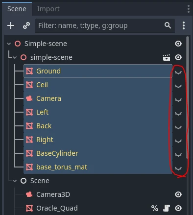
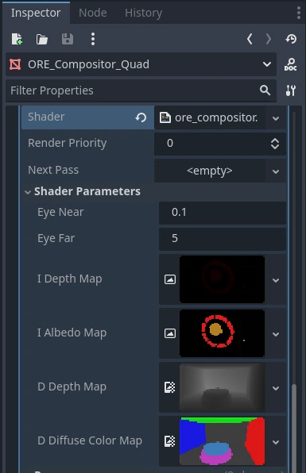
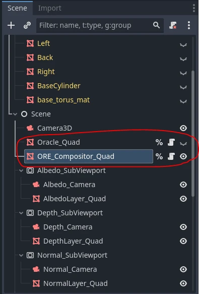

+++
author = 'Turbo Tartine'
date = '2025-08-28T08:43:37+02:00'
draft = true
title = "OpenRE devlog 4 : Fusion des mondes. Part I"
description = 'devlog 4 du projet OpenRE'
+++

[⬅️ Vers Précédent : "OpenRE devlog 3 : Harmonisation des normales"](projects/open_re_poc_devlog_3)

## I. Introduction
Grâce au travail effectué jusqu'ici, nous sommes en mesure de faire nos premiers rendus. Pour cela nous allons partir de la scène actuelle à laquelle nous allons ajouter un peu de mouvement mais surtout, de la lumière.

Comme d'habitude nous adopteront une aproche intérative. Nous commenceront par la version la plus rudimentaire possible que nous complexifieront petit à petit jusqu'à atteindre notre but. A la fin nous auront un rendu en temps réèl cohérent et comprenant :
- de la géométrie déterministe (pré-rendue dans Blender)
- de la géométrie intéractive (rendue en temps réèl par Godot)
- de la lumière déterministe (affectant aussi la géométrie intéractive)
- de la lumière intéractive (affectant aussi la géométrie déterministe)

Ou du moins c'est ce que je pensais faire à l'origine. Mais durant la rédaction de ce numéro, je me suis rendu compte que j'avais peut être un peu sous estimé le morceau. J'ai donc décider de le couper en 2. Dans cette première partie, nous ne traiterons pas la lumière déterministe, est seulement partiellement l'intéractive. On gardera ça pour le mois prochain.

## II. Préparation de la scène
usqu'ici, nous avons cherché à comparer des scènes identiques dans le but d'étaloner Godot et Blender afin qu'ils produisent des données bien harmonisées. Mais dans un usage normal, la géométrie du monde intéractif est bien entandu différente de celle du monde déterministe. Dans Godot, on va donc cacher les éléments de la scène précédement importée depuis Blender (qui sera notre scène déterministe).

 

On va ensuite ajouter de nouveaux meshes, et comme ces meshes font partie du monde intéractif, on ne se privera pas de les faire bouger.

[](images/int_geometry-anim.webp)

Enfin, nous allons desactiver l'oracle et créer un nouveau post-process `ore_compositor` qui sera chargé de fusionner les 2 scènes en temps réèl. Comme l'oracle, il prendra en entrée les maps des G-Buffers déterministe et interactif. Mais il aura également besoin de données suplémentaires relatives à la scène : les propriétés de la caméra active et plus tard des lumières.

 

On oubliera pas de desactiver le post-process quad de l'oracle et d'activer celui du compositor à la place.

 

A présent voyons un peu de quoi est fait ce post-process.

## III. Composition de la Géométrie
Dans cette première itértation du shader de composition, nous allons laisser de côté la lumière pour nous concentrer sur la géométrie. L'objectif est d'avoir un premier rendu unlit d'une scène intéractive intégré à une scène déterministe. Le tout biensure en respectant la profondeur, c'est à dire que quelque soit le monde (intéractif ou déterministe), ce qui est devant est bien rendu par dessus ce qui est derrière.

Attention, pavé en approche ! Voici le code complet de cette première version du shader :

```glsl
// USUAL GODOT POST-PROCESS STUFF
shader_type spatial;
render_mode unshaded, fog_disabled;

void vertex() {
	POSITION = vec4(VERTEX.xy, 1.0, 1.0);
}

// HELPER FUNCTIONS FROM THE ORACLE
#include "pre_process_utils.gdshaderinc"

// SCENE UNIFORMS
uniform float cam_near;
uniform float cam_far;

// INTERACTIVE G-BUFFER
uniform sampler2D i_depth_map : filter_nearest;
uniform sampler2D i_albedo_map : filter_nearest;

// DETERMINIST G-BUFFER
uniform sampler2D d_depth_map : filter_nearest;
uniform sampler2D d_diffuse_color_map : filter_nearest;

void fragment() {
	// SAMPLE G-BUFFERs
	vec3 i_depth_frag = texture(i_depth_map, SCREEN_UV).rgb;
	vec3 i_albedo_frag = texture(i_albedo_map, SCREEN_UV).rgb;
	
	vec3 d_depth_frag = texture(d_depth_map, SCREEN_UV).rgb;
	vec3 d_diffuse_color_frag = texture(d_diffuse_color_map, SCREEN_UV).rgb;
	
	// DATA HARMONIZATION
	i_depth_frag = pre_process_i_depth(i_depth_frag);
	d_depth_frag = pre_process_d_depth(d_depth_frag, cam_near, cam_far);
	
	// DATA SELECTION (according to depth)
	float depth_frag;
	vec3 albedo_frag;
	bool is_frag_interactive = d_depth_frag.r < i_depth_frag.r;
	if(is_frag_interactive) {
		depth_frag = i_depth_frag.r;
		albedo_frag = i_albedo_frag;
	}
	else {
		depth_frag = d_depth_frag.r;
		albedo_frag = d_diffuse_color_frag;
	}
	
	// FINAL FRAGMENT COLOR
	ALBEDO = albedo_frag.rgb;
}
```

Ne vous inquiétez pas, on va le disequer ensemble dans les sections suivantes.

### 1. Definition habituelle d'un post-process
On en a déjà parlé, ces premières lignes sont les même pour tous les post-process.

```glsl
// USUAL GODOT POST-PROCESS STUFF
shader_type spatial;
render_mode unshaded, fog_disabled;

void vertex() {
	POSITION = vec4(VERTEX.xy, 1.0, 1.0);
}
```

### 2. Include des helpers de l'oracle
```glsl  
// HELPER FUNCTIONS FROM THE ORACLE
#include "pre_process_utils.gdshaderinc"
```

Rappelez-vous, pour harmoniser les données, l'Oracle appliquait des pre-traitements à certaines maps. J'ai extrait et regroupées ces fonctions dans le fichier `pre_process_utils.gdshaderinc` que nous incluons ici. De cette manière si nous modifions ces pre-traitements ils resteront valides pour les 2 post-process. Voici son contenu :

```glsl
vec3 pre_process_i_depth(vec3 i_depth) {
	return i_depth;
}

vec3 pre_process_d_depth(vec3 d_depth, float near, float far) {
	float z = d_depth.r * (far - near) + near;
	float unlinearized_depth = (z * far - near * far) / (far - near);
	unlinearized_depth /= z;
	return vec3(1.0 - unlinearized_depth, 0.0, 0.0);
}

vec3 pre_process_i_normal(vec3 i_normal, mat4 inv_view_matrix) {
	i_normal = i_normal * 2.0 - 1.0;
	i_normal = (inv_view_matrix * vec4(i_normal, 0.0)).xyz;
	return i_normal;
}

vec3 pre_process_d_normal(vec3 d_normal) {
	d_normal = vec3(d_normal.x, d_normal.z, -d_normal.y);
	return d_normal;
}
```

### 3. Parmètres d'entrée
Comme évoqué précédement, le post-process va prendre en entrée des `uniforms` correspondant aux deux G-Buffers, plus quelques paramètres additionnels relatifs à la scène.

```glsl
// SCENE UNIFORMS
uniform float cam_near;
uniform float cam_far;

// INTERACTIVE G-BUFFER
uniform sampler2D i_depth_map : filter_nearest;
uniform sampler2D i_albedo_map : filter_nearest;

// DETERMINIST G-BUFFER
uniform sampler2D d_depth_map : filter_nearest;
uniform sampler2D d_diffuse_color_map : filter_nearest;
```

Pour l'instant, on a besoin :
- des paramètres near et far de la caméra active
- des texture de depth et d'albédo issues des G-Buffers intéractif et détermniste

### 4. Echantillonage des G-Buffers
Chaque map est échantillonée pour récupérer le fragment correspondant. Dans la foulée on applique les fameux pre-traitements.

```glsl
void fragment() {
	// SAMPLE G-BUFFERs
	vec3 i_depth_frag = texture(i_depth_map, SCREEN_UV).rgb;
	vec3 i_albedo_frag = texture(i_albedo_map, SCREEN_UV).rgb;
	
	vec3 d_depth_frag = texture(d_depth_map, SCREEN_UV).rgb;
	vec3 d_diffuse_color_frag = texture(d_diffuse_color_map, SCREEN_UV).rgb;
	
	// DATA HARMONIZATION
	i_depth_frag = pre_process_i_depth(i_depth_frag);
	d_depth_frag = pre_process_d_depth(d_depth_frag, cam_near, cam_far);
	
	...
}
```

### 5. Selection des fragment
Ensuite, on se base sur la valeur de la depth pour déterminer si le fragment courant appartien à la scène intéractive ou déterministe. On en profite alors pour assigner les fragments correspondant aux variable `depth_frag` et `albedo_frag` qui seront celles utilisées dans la suite du shader.

```glsl
void fragment() {
	...
	
	// DATA SELECTION (according to depth)
	float depth_frag;
	vec3 albedo_frag;
	bool is_frag_interactive = d_depth_frag.r < i_depth_frag.r;
	if(is_frag_interactive) {
		depth_frag = i_depth_frag.r;
		albedo_frag = i_albedo_frag;
	}
	else {
		depth_frag = d_depth_frag.r;
		albedo_frag = d_diffuse_color_frag;
	}
	
	...
}
```

### 6. Affichage du fragment final
```glsl
void fragment() {
	...
	
	// FINAL FRAGMENT COLOR
	ALBEDO = albedo_frag.rgb;
}
```

Bon d'accord. la "suite du shader" est pour l'instant un peu courte. On ne fait qu'afficher directement l'albédo du fragment selectionné. On ne se sert même pas de `depth_frag`. Mais ne vous inquiétez pas ça va venir. Pour l'heure je vous propose d'admirer ce magnifique chapaï !

<vidéo du rendu unlite>

Oui je sais c'est pas très impressionnant sans lumière. Mais au moins on peut constater que la sélection de fragment selon la profondeur est correcte. En effet, les parties du chapaï qui se trouvent sous podium sont bien invisible tandis que le rest est correctement rendu par dessus l'arrière plan.

Mission accomplie ! Place à la lumière maintenant.

## IV. Un premier modèle d'illumination
Avant de nous attaquer à de la "vrai" lumière, nous allons utiliser un modèle d'illumination pas du tout homologué basé uniquement sur l'atténuation de l'intensité selon de la distance. En particulier, ce modèle ignore l'orientation des surfaces. Ce n'est pas du tout photoréaliste mais cela produit une rendu très lisse et doux qui je trouve se marie très bien avec certaines DA stylisées.

[](images/days_of_porcupine.opti.webp)
*Extrait de la présentation "Art of the Porcupine" par Theresa Latzko. A gauche un vertex lighting classic. A droite le distance-only lighting*

Pour nous, ce sera l'occasion de passer par une étape intermédiaire un peu plus simple, ce qui nous permetra de bien détailler chaque points. Et on va commencer par une petite parenthèse sur ce qu'est la "inverse square law".

### 1. Inverse Square law
La inverse square law est une loie qui s'applique à différentes quantité physiques dont l'intensité lumineuse iradiant d'une source ponctuelle. Elle dit que "l'intensitée lumineuse en un point de l'espace est inversement proportionnel au carré de la distance qui sépare ce point de la source". Ou de manière plus compacte : I = I0 / d² (avec I0 l'intensité de la source et d la distance)

Une façon de se représenter cette relation c'est de penser à une sphere centrée sur la source lumineuse. Les photons iradient de la source lumineuse en ligne droite dans toutes les directions et entrent en collision avec la sphere. Ces collisions sont réparties de manière uniforme sur toute la surface de la sphere. 

Imaginez maintenant que cette sphere grossi. Le nombre de photons qui entrent en collision avec elle est toujours le même, car la quantité de lumière émise par la source ne dépend pas de la sphere. En revanche, la surface à éclairer est maintenant plus grande. La quantitée de lumière reçue au m² est donc plus faible.

[](images/Inverse_square_law.opti.webp)

La décroisance de la concentration de photons sur notre sphere est donc directement reliée à la croissance de sa surface. Et la surface d'une sphere est proportionnelle au carré de son rayon (S = 4πr²).

Bref, c'est la loi qu'on va utiliser pour modéliser notre lumière.

### 2. Implémentation
Avant toute chose, nous allons ajouter une OmniLight à la scène intéractive. Cette dernière se verra assigner un script qui la fait orbiter autour du podium et modifie periodiquement sa couleur et son intensité.

[](images/rotolight-anim.webp)

Pour faciliter sa localisation, elle sera materialisée par une petite sphere blanche. Ce n'est pas primodial pour le resultat final, mais c'est un petit artifice qui m'a pas mal aidé à débugger.

Nous pouvons maintenant reprendre le shader pour qu'il implémente le "distance-only lighting" que nous venons de décrire. Pour vous donner un apperçu global, voici les modifications apportées :

```glsl
// USUAL GODOT POST-PROCESS CODE
// HELPER FUNCTIONS FROM THE ORACLE
// SCENE UNIFORMS
...
uniform int nb_plights;
uniform vec3 plight_position[8];
uniform vec3 plight_color[8];
uniform float plight_intensity[8];

// INTERACTIVE G-BUFFER
// DETERMINIST G-BUFFER
...

void fragment() {
	// SAMPLE G-BUFFERs
	// DATA HARMONIZATION
	...
	
	vec3 diffuse_contrib = vec3(0.0);
	vec3 specular_contrib = vec3(0.0);
	
	// DATA SELECTION (according to depth)
	// WORLD POSITION FROM DEPTH
	vec3 ndc = vec3((SCREEN_UV * 2.0) - 1.0, depth_frag);
	vec4 world = INV_VIEW_MATRIX * INV_PROJECTION_MATRIX * vec4(ndc, 1.0);
	world.xyz /= world.w;
	vec3 frag_position = world.xyz;
	
	// ACCUMULATE LIGHT CONTRIBUTIONS
	for(int i = 0; i < nb_plights; i++) {
		vec3 light_vec = plight_position[i] - frag_position;
		float d2 = length(light_vec);
		d2 = pow(d2, 2.0);
		float attenuation = 1.0 / d2;

		vec3 C = plight_color[i];
		float I = plight_intensity[i];
		diffuse_contrib += C * I * albedo_frag * attenuation;
		//specular_contrib += NOT IMPLEMENTED YET
	}
	
	// FINAL FRAGMENT COLOR
	ALBEDO = diffuse_contrib + specular_contrib;
}
```

Mais comme d'habitude, on va expliquer tout ça en douceur.

#### 1.1. Paramètres des lumières
D'abord il faut que notre post-process prenne en entrée les parametres de la lumière. A savoir :
- sa position
- sa couleur
- son intensité

Pour l'instant il n'y a qu'une seule lumière, mais on compte bein en ajouter d'autres un jour alors on va préparer le terrain dès maintenant en déclarant des tableaux plutôt que des variables simples. 

```glsl
// SCENE UNIFORMS
uniform float cam_near;
uniform float cam_far;

uniform int nb_plights;
uniform vec3 plight_position[8];
uniform vec3 plight_color[8];
uniform float plight_intensity[8];
```

Une petite minute, pourquoi a-t-on besoin d'un entier et de 3 tableaux pour stoquer ça ? Ce ne serait pas plus partique d'utiliser un tableau dynamique de structures ?

Il faut savoir qu'en GLSL, les tableaux sont très limités : leur taille doit être connue à la compilation, et sous le capot ils sont souvent gérés comme une succession de variables simples. C’est plus une commodité syntaxique qu’un véritable type de données dynamique comme on en a l'habitude sur du code CPU. 

Le seul moyen d'implémenter des tableaux réèlement dynamiques est d'utiliser un SSBO (Shader Storage Buffer Objects). Mais en `GDShader` (le langage de shading de Godot) ni les SSBO ni les structures ne sont supportées. Raison pour laquelle on est bloqué avec 3 tableaux de taille fixe et un entier pour encoder leur taille effective.

#### 1.2. Calcule de la position du fragment
Ensuite, pour pouvoir calculer la distance entre la source de lumière et le fragment, il faut connaitre la position de ce dernier. Nous connaissons sa profondeur `depth_frag` et Godot nous fournis sa position à l'écran à travers la variable `SCREEN_UV`. Nous pouvons en déduire sa coordonée en espace [NDC](définir cet espace).

A partir de là, il suffit d'appliquer la serie de transformations inverse au pipeline normal pour passer du NDC au world space.

```glsl
	// WORLD POSITION FROM DEPTH
	vec3 ndc = vec3((SCREEN_UV * 2.0) - 1.0, depth_frag);
	vec4 world = INV_VIEW_MATRIX * INV_PROJECTION_MATRIX * vec4(ndc, 1.0);
	world.xyz /= world.w;
	vec3 frag_position = world.xyz;
```
Vous vous demandez peut-être à quoi sert la ligne `world.xyz /= world.w;`. Il va falloir me faire confiance sur ce coup, parce que je ne vais pas faire un cours de math sur les coordonnées homogènes. D’abord parce que ce serait très long et un peu austère. Mais en toute honnêteté, c’est surtout un sujet complexe que je ne maîtrise pas totalement. (D’ailleurs, si vous avez de bonnes ressources, n’hésitez pas à les partager en commentaire !)

Sans rentrer dans les détails, voici ce que j’en comprends : l’idée est de passer dans un espace de dimension supérieure pour profiter de propriétés mathématiques plus interessantes. En programations graphiques on est principalement interessé par :
- L'existance de la PERSPECTIVE_MATRIX
- La possibilité de modéliser la translation comme une multiplication de matrices
- La posibilité de différentier une position d'une direction

C'est pourquoi les API graphiques fonctionnent dans cet espace plutôt que dans l’espace euclidien classique. Pour passer d’une coordonnée euclidienne à une coordonnée homogène, il suffit d’ajouter une composante égale à 1 pour une position, ou 0 pour une direction. Ainsi en 3D, le vecteur (x, y, z) devient (x, y, z, 1) ou (x, y, z, 0). 

Pour revenir d’une coordonnée homogène à une coordonnée euclidienne, on divise tous les composants par le dernier. Par exemple, (x, y, z, w) devient (x/w, y/w, z/w). C'est exactement de là que vient la ligne magique : `world.xyz /= world.w;`.

#### 1.3. Calcule de la lumière
Pour obtenir la couleur final du fragment, nous allons parcourir notre tableau de lumière et accumuler les contribution lumineuses de chacune d'elle. Dans la plupart des modèles d'illumination, chaque contribution est composée d'une partie diffuse et d'une partie spéculaire.

La partie diffuse est la partie de la lumière que la matière disperce dans toutes les directions. C'est elle qui nous permet de percevoir la couleur de l'objet. La partie speculaire représente la partie qui est refléchie plus majoritairement dans une direction particulière. C'est ce qui produit des reflets brillants. Un mirroir par exemple est une matière completement spéculaire. Il renvoit la lumière dans une direction bien précise et ne la diffuse pas comme le ferait une balle en caoutchouc.

Le resultat final est la somme des contributions diffuses et spéculaires accumulées.

```glsl
void fragment() {
	...
	
	vec3 diffuse_contrib = vec3(0.0);
	vec3 specular_contrib = vec3(0.0);
	
	...
	
	// ACCUMULATE LIGHT CONTRIBUTIONS
	for(int i = 0; i < nb_plights; i++) {
		vec3 light_vec = plight_position[i] - frag_position;
		float d2 = length(light_vec);
		d2 = pow(d2, 2.0);
		float attenuation = 1.0 / d2;

		vec3 C = plight_color[i];
		float I = plight_intensity[i];
		diffuse_contrib += C * I * albedo_frag * attenuation;
		//specular_contrib += NOT IMPLEMENTED YET
	}
	
	// FINAL FRAGMENT COLOR
	ALBEDO = diffuse_contrib + specular_contrib;
}
```

Comme vous pouvez le constater, notre modèle du pauvre fait l'impasse sur la spéculaire. On pourrait bricoler quelque chose "en dur" pour faire illusion, mais nos G-Buffers actuels ne contiennent pas encore les propriétés de la matière nécessaire au calcule de la contribution spéculaire. On a bien l'albédo, mais il ne nous permet que de calculer la diffuse :

```glsl
		vec3 C = plight_color[i];
		float I = plight_intensity[i];
		diffuse_contrib += C * I * albedo_frag * attenuation;
		//specular_contrib += NOT IMPLEMENTED YET
```

Mais de la même manière que l'on se traine un tableau pour notre unique lumière, on déclare la variable `specular_contrib` pour préparer l'avenir.

Par ailleurs, vous pouvez remarquer que le facteur d'attenuation est bien calculé par application de l'inverse square law :

```glsl
		vec3 light_vec = plight_position[i] - frag_position;
		float d2 = length(light_vec);
		d2 = pow(d2, 2.0);
		float attenuation = 1.0 / d2;
```

Ce qui nous donne le resultat suivant :

< video distance only>

## IV. Conclusion
Comme on a pu le voire en image, ce modele d'illumination marche très bien dans "Days of the Porcupine", mais il faut avouer que sur notre scène il est un peu fade. Le rendu est très plat et avec des couleurs pleines comme celles-ci, on a du mal à distinguer le relief. 

Bien entandu nous améliorerons ça dans la Part II en imlémentant un nouveau modèle plus classique qui correspondra surement mieux à vos attentes. Nous ajouteront également de la lumière déterministe préalablement rendue par Blender.

Maintenant que j'y pense, j'avais dis dans le précédent devlog que nous avions besoin des normales pour implémenter la lumière. Mais étant donné que nous avons ignoré l'orientation des surfaces, on en a finalement pas eu besoin. C'est domage, ça veut dire qu'on aurait pu traiter le sujet un poil plus tôt dans la série. 

A ma décharge, je n'avais pas prévu de couper ce numéro ici. La preuve que même en écrivant depuis le futur, on pense quand même pas à tout.
