+++
author = 'Turbo Tartine'
date = '2025-08-31T12:54:28+02:00'
draft = true
title = "OpenRE devlog 5 : Fusion des mondes. Part II"
description = 'devlog 5 du projet OpenRE'
+++

[⬅️ Vers Précédent : "OpenRE devlog 5 : Fusion des mondes. Part I"](projects/open_re_poc_devlog_4)

## I. Introduction
Bienvenue dans cette deuxième partie de "fusion des mondes" ! Le mois dernier nous avions mélangé de la géométrie intéractive à de la géométrie déterministe en nous basant sur les textures de profondeur. Nous avions ensuite éclairé tout ça avec une point light interactive qui clignotait en orbitant autour de la scène. L'implémentation de l'éclairage était basé uniquement sur la distance.

Aujourd'hui nous allons :
- Enrichire le modèle d'illumination en prenant en compte l'orientation des surfaces
- Calculer la lumière déterministe dans Blender et l'intégrer a notre scène

## II. Le modèle de Lambert
Le modèle de Lambert décrit des surfaces purement diffuses, c'est à dire qui renvoient la lumière de manière égale dans toutes les directions. Cela veut dire que la quantité de lumière en un point ne dépend pas de l'observateur mais seulement de l'angle selon lequel le rayon frappe la surface.

C'est le modèle que nous nous proposons d'implémenter. D'abord parce qu'il est à peine plus compliqué que le précédent, mais surtout car comme nous l'avons déjà évoqué, le G-Buffer interactif dont nous disposons ne possède pas encore les données nécessaires au calcule de la spéculaire.


### 1. Principe
L'intensitée apparente varie donc selon l'angle d'incidence de la lumière. Une façon de se représenter le phénomene, c'est d'imaginer un faiseau lumineux parfaitement vertical éclairant une surface parfaitement horizontale. 

Le cercle dans lequel les photons percutent la surface cohincide avec la section du faiseau. Ou dit autrement :

<div style="text-align:center;">

"soient `dL` le diamètre du faiseau et `dG` le diamètre du cercle projeté, on à : `dL = dG`"

</div> 
<br/>

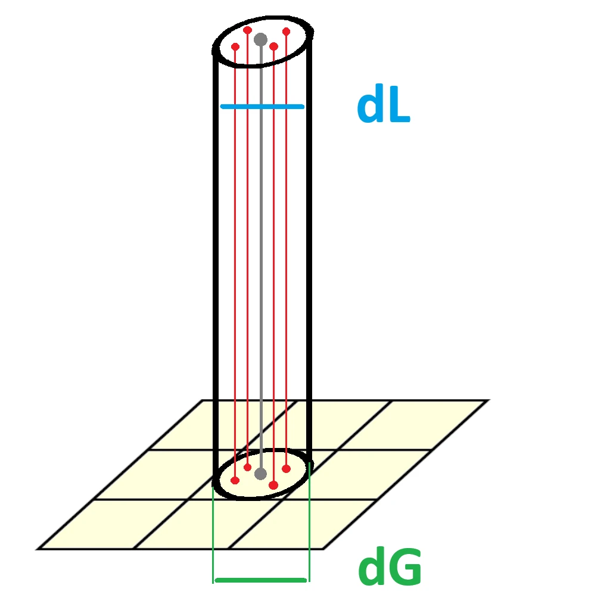 

Si maintenant le faiseau est incliné, `dG` s'étire transformant notre cercle projeté en une élipse. L'aire de cette élipse est évidament plus grande que celle du cercle alors que la quantité de photons emis, elle, reste la même. Ce qui se traduit par une baisse de la concentration lumineuse.

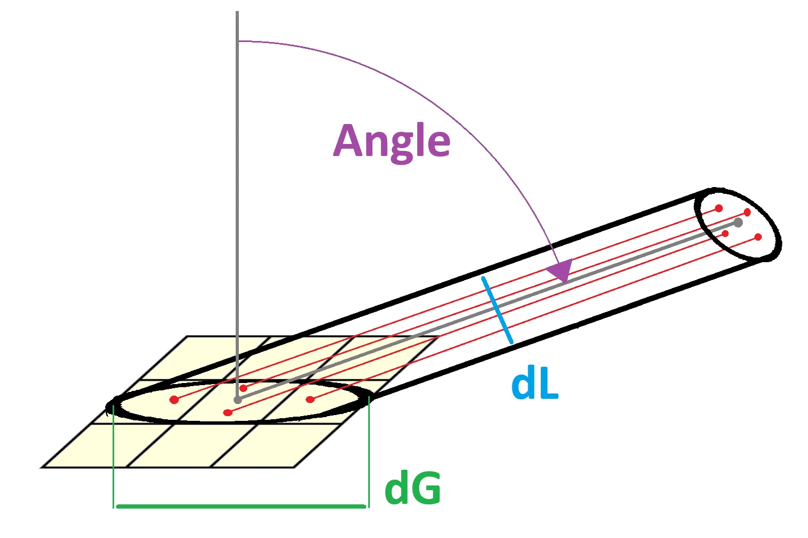

La décroissance de l'intensité lumineuse est donc proportionnel à la croissance de l'aire de l'élipse, elle même fonction de l'angle d'incidence du faiseau. En posant tout ça, on peut déduire la fameuse "loi du cosinus" de Lambert. Laquelle décrit `I`, l'intensité lumineuse perçue, comme :

<div style="text-align:center;">

`I = I0 * cos(angle)`	

(avec `I0` l'intensité de la source)

</div> 

Que l'on peut aussi écrire :

<div style="text-align:center;">

`I = I0 * (N.L)` 

(avec `N` la normale à la surface et `L` l'inverse de la direction de la lumière)

</div> 

En gros, Lambert, c'est basiquement multiplier votre lumière par `(N.L)`

### 2. Implémentation
En relisant le numéro précédent, je me suis rendu compte que les échantillons de code commencaient à être un peu long. J'avais déjà du mal à les resituer dans la globalité, alors je n'ose pas imaginer la galère pour quelqu'un qui ne les a pas écrit.

Dans la partie II on va continuer d'en rajouter et j'avais peur que ça devienne vraiment illisible. J'ai donc passé un peu de temps à développer une technologie révolutionnaire qui recontextualise l'échantillon dans le code complet sous simple pression d'un bouton (rigolez pas, je suis pas dev web, j'ai mis ma vie pour faire ça alors il fallait que j'en parle 😅). En tout cas j'éspère que ça aidera à la lecture.

Bref, voici les ajouts nécessaire à l'implémentation du modèle Lambertien. Comme toujours on va décortiquer ça pas à pas.


```glsl {#code-compact hl_lines=[6,10,15,18,22,23,28,32,36,43,44]}
// USUAL GODOT POST-PROCESS CODE
// HELPER FUNCTIONS FROM THE ORACLE
// SCENE UNIFORMS
// INTERACTIVE G-BUFFER
...
uniform sampler2D i_normal_map : filter_nearest;

// DETERMINIST G-BUFFER
...
uniform sampler2D d_normal_map : filter_nearest;

void fragment() {
	// SAMPLE G-BUFFERs
	...
	vec3 i_normal_frag = texture(i_normal_map, SCREEN_UV).rgb;
	
	...
	vec3 d_normal_frag = texture(d_normal_map, SCREEN_UV).rgb;
	
	// DATA HARMONIZATION
	...
	d_normal_frag = pre_process_d_normal(d_normal_frag);
	i_normal_frag = pre_process_i_normal(i_normal_frag, INV_VIEW_MATRIX);
	
	// DATA SELECTION (according to depth)
	...
	vec3 albedo_frag;
	vec3 normal_frag;
	bool is_frag_interactive = d_depth_frag.r < i_depth_frag.r;
	if(is_frag_interactive) {
		...
		normal_frag = i_normal_frag;
	}
	else {
		...
		normal_frag = d_normal_frag;
	}
	
	// WORLD POSITION FROM DEPTH
	// ACCUMULATE LIGHT CONTRIBUTIONS
	for(int i = 0; i < nb_plights; i++) {
		...
		float NdotL = max(dot(normal_frag, L), 0.0);
		diffuse_contrib += NdotL * C * I * albedo_frag * attenuation;
		//specular_contrib += NOT IMPLEMENTED YET
	}
	
	// FINAL FRAGMENT COLOR
	ALBEDO = diffuse_contrib + specular_contrib;
}
```

```glsl {#code-full .hidden hl_lines=[23,28,34,38,43,44,52,57,62,81,82]}
// USUAL GODOT POST-PROCESS STUFF
shader_type spatial;
render_mode unshaded, fog_disabled;

void vertex() {
	POSITION = vec4(VERTEX.xy, 1.0, 1.0);
}

// HELPER FUNCTIONS FROM THE ORACLE
#include "pre_process_utils.gdshaderinc"

// SCENE UNIFORMS
uniform float cam_near;
uniform float cam_far;
uniform int nb_plights;
uniform vec3 plight_position[8];
uniform vec3 plight_color[8];
uniform float plight_intensity[8];

// INTERACTIVE G-BUFFER
uniform sampler2D i_depth_map : filter_nearest;
uniform sampler2D i_albedo_map : filter_nearest;
uniform sampler2D i_normal_map : filter_nearest;

// DETERMINIST G-BUFFER
uniform sampler2D d_depth_map : filter_nearest;
uniform sampler2D d_diffuse_color_map : filter_nearest;
uniform sampler2D d_normal_map : filter_nearest;

void fragment() {
	// SAMPLE G-BUFFERs
	vec3 i_depth_frag = texture(i_depth_map, SCREEN_UV).rgb;
	vec3 i_albedo_frag = texture(i_albedo_map, SCREEN_UV).rgb;
	vec3 i_normal_frag = texture(i_normal_map, SCREEN_UV).rgb;
	
	vec3 d_depth_frag = texture(d_depth_map, SCREEN_UV).rgb;
	vec3 d_diffuse_color_frag = texture(d_diffuse_color_map, SCREEN_UV).rgb;
	vec3 d_normal_frag = texture(d_normal_map, SCREEN_UV).rgb;
	
	// DATA HARMONIZATION
	i_depth_frag = pre_process_i_depth(i_depth_frag);
	d_depth_frag = pre_process_d_depth(d_depth_frag, cam_near, cam_far);
	d_normal_frag = pre_process_d_normal(d_normal_frag);
	i_normal_frag = pre_process_i_normal(i_normal_frag, INV_VIEW_MATRIX);
	
	vec3 diffuse_contrib = vec3(0.0);
	vec3 specular_contrib = vec3(0.0);
	
	// DATA SELECTION (according to depth)
	float depth_frag;
	vec3 albedo_frag;
	vec3 normal_frag;
	bool is_frag_interactive = d_depth_frag.r < i_depth_frag.r;
	if(is_frag_interactive) {
		depth_frag = i_depth_frag.r;
		albedo_frag = i_albedo_frag;
		normal_frag = i_normal_frag;
	}
	else {
		depth_frag = d_depth_frag.r;
		albedo_frag = d_diffuse_color_frag;
		normal_frag = d_normal_frag;
	}
	
	// WORLD POSITION FROM DEPTH
	vec3 ndc = vec3((SCREEN_UV * 2.0) - 1.0, depth_frag);
	vec4 clip = vec4(ndc, 1.0);
	vec4 world = INV_VIEW_MATRIX * INV_PROJECTION_MATRIX * clip;
	world.xyz /= world.w;
	vec3 frag_position = world.xyz;
	
	// ACCUMULATE LIGHT CONTRIBUTIONS
	for(int i = 0; i < nb_plights; i++) {
		vec3 light_vec = plight_position[i] - frag_position;
		float d2 = length(light_vec);
		d2 = pow(d2, 2.0);
		float attenuation = 1.0 / d2;

		vec3 C = plight_color[i];
		float I = plight_intensity[i];
		float NdotL = max(dot(normal_frag, L), 0.0);
		diffuse_contrib += NdotL * C * I * albedo_frag * attenuation;
		//specular_contrib += NOT IMPLEMENTED YET
	}
	
	// FINAL FRAGMENT COLOR
	ALBEDO = diffuse_contrib + specular_contrib;
}
```


#### 1.1. Introduction des normales
Pour calculer l'angle d'incidence de la lumière, on va avoir besoin des normales (cette fois c'est pas une blague, on va vraiment les utiliser ^^).

```glsl {#code-compact hl_lines=[6,10,15,18,22,23,28,32,36,43,44]}
// USUAL GODOT POST-PROCESS CODE
// HELPER FUNCTIONS FROM THE ORACLE
// SCENE UNIFORMS
// INTERACTIVE G-BUFFER
...
uniform sampler2D i_normal_map : filter_nearest;

// DETERMINIST G-BUFFER
...
uniform sampler2D d_normal_map : filter_nearest;
```

```glsl {#code-full .hidden hl_lines=[23,28]}
// USUAL GODOT POST-PROCESS STUFF
shader_type spatial;
render_mode unshaded, fog_disabled;

void vertex() {
	POSITION = vec4(VERTEX.xy, 1.0, 1.0);
}

// HELPER FUNCTIONS FROM THE ORACLE
#include "pre_process_utils.gdshaderinc"

// SCENE UNIFORMS
uniform float cam_near;
uniform float cam_far;
uniform int nb_plights;
uniform vec3 plight_position[8];
uniform vec3 plight_color[8];
uniform float plight_intensity[8];

// INTERACTIVE G-BUFFER
uniform sampler2D i_depth_map : filter_nearest;
uniform sampler2D i_albedo_map : filter_nearest;
uniform sampler2D i_normal_map : filter_nearest;

// DETERMINIST G-BUFFER
uniform sampler2D d_depth_map : filter_nearest;
uniform sampler2D d_diffuse_color_map : filter_nearest;
uniform sampler2D d_normal_map : filter_nearest;

void fragment() {
	// SAMPLE G-BUFFERs
	vec3 i_depth_frag = texture(i_depth_map, SCREEN_UV).rgb;
	vec3 i_albedo_frag = texture(i_albedo_map, SCREEN_UV).rgb;
	vec3 i_normal_frag = texture(i_normal_map, SCREEN_UV).rgb;
	
	vec3 d_depth_frag = texture(d_depth_map, SCREEN_UV).rgb;
	vec3 d_diffuse_color_frag = texture(d_diffuse_color_map, SCREEN_UV).rgb;
	vec3 d_normal_frag = texture(d_normal_map, SCREEN_UV).rgb;
	
	// DATA HARMONIZATION
	i_depth_frag = pre_process_i_depth(i_depth_frag);
	d_depth_frag = pre_process_d_depth(d_depth_frag, cam_near, cam_far);
	d_normal_frag = pre_process_d_normal(d_normal_frag);
	i_normal_frag = pre_process_i_normal(i_normal_frag, INV_VIEW_MATRIX);
	
	vec3 diffuse_contrib = vec3(0.0);
	vec3 specular_contrib = vec3(0.0);
	
	// DATA SELECTION (according to depth)
	float depth_frag;
	vec3 albedo_frag;
	vec3 normal_frag;
	bool is_frag_interactive = d_depth_frag.r < i_depth_frag.r;
	if(is_frag_interactive) {
		depth_frag = i_depth_frag.r;
		albedo_frag = i_albedo_frag;
		normal_frag = i_normal_frag;
	}
	else {
		depth_frag = d_depth_frag.r;
		albedo_frag = d_diffuse_color_frag;
		normal_frag = d_normal_frag;
	}
	
	// WORLD POSITION FROM DEPTH
	vec3 ndc = vec3((SCREEN_UV * 2.0) - 1.0, depth_frag);
	vec4 clip = vec4(ndc, 1.0);
	vec4 world = INV_VIEW_MATRIX * INV_PROJECTION_MATRIX * clip;
	world.xyz /= world.w;
	vec3 frag_position = world.xyz;
	
	// ACCUMULATE LIGHT CONTRIBUTIONS
	for(int i = 0; i < nb_plights; i++) {
		vec3 light_vec = plight_position[i] - frag_position;
		float d2 = length(light_vec);
		d2 = pow(d2, 2.0);
		float attenuation = 1.0 / d2;

		vec3 C = plight_color[i];
		float I = plight_intensity[i];
		float NdotL = max(dot(normal_frag, L), 0.0);
		diffuse_contrib += NdotL * C * I * albedo_frag * attenuation;
		//specular_contrib += NOT IMPLEMENTED YET
	}
	
	// FINAL FRAGMENT COLOR
	ALBEDO = diffuse_contrib + specular_contrib;
}
```


On introduit donc les uniforms `i_normal_map` et `d_normal_map` qui proviennent respectivement des G-Buffers interactif et déterministe.

#### 1.2. Echantillonage des normales
Ensuite, on échantillone et on harmonise tout ça comme on l'a fait pour les autres maps


```glsl {#code-compact hl_lines=[4,7,11,12]}
void fragment() {
	// SAMPLE G-BUFFERs
	...
	vec3 i_normal_frag = texture(i_normal_map, SCREEN_UV).rgb;
	
	...
	vec3 d_normal_frag = texture(d_normal_map, SCREEN_UV).rgb;
	
	// DATA HARMONIZATION
	...
	d_normal_frag = pre_process_d_normal(d_normal_frag);
	i_normal_frag = pre_process_i_normal(i_normal_frag, INV_VIEW_MATRIX);
	
	...
}
```

```glsl {#code-full .hidden hl_lines=[34,38,43,44]}
// USUAL GODOT POST-PROCESS STUFF
shader_type spatial;
render_mode unshaded, fog_disabled;

void vertex() {
	POSITION = vec4(VERTEX.xy, 1.0, 1.0);
}

// HELPER FUNCTIONS FROM THE ORACLE
#include "pre_process_utils.gdshaderinc"

// SCENE UNIFORMS
uniform float cam_near;
uniform float cam_far;
uniform int nb_plights;
uniform vec3 plight_position[8];
uniform vec3 plight_color[8];
uniform float plight_intensity[8];

// INTERACTIVE G-BUFFER
uniform sampler2D i_depth_map : filter_nearest;
uniform sampler2D i_albedo_map : filter_nearest;
uniform sampler2D i_normal_map : filter_nearest;

// DETERMINIST G-BUFFER
uniform sampler2D d_depth_map : filter_nearest;
uniform sampler2D d_diffuse_color_map : filter_nearest;
uniform sampler2D d_normal_map : filter_nearest;

void fragment() {
	// SAMPLE G-BUFFERs
	vec3 i_depth_frag = texture(i_depth_map, SCREEN_UV).rgb;
	vec3 i_albedo_frag = texture(i_albedo_map, SCREEN_UV).rgb;
	vec3 i_normal_frag = texture(i_normal_map, SCREEN_UV).rgb;
	
	vec3 d_depth_frag = texture(d_depth_map, SCREEN_UV).rgb;
	vec3 d_diffuse_color_frag = texture(d_diffuse_color_map, SCREEN_UV).rgb;
	vec3 d_normal_frag = texture(d_normal_map, SCREEN_UV).rgb;
	
	// DATA HARMONIZATION
	i_depth_frag = pre_process_i_depth(i_depth_frag);
	d_depth_frag = pre_process_d_depth(d_depth_frag, cam_near, cam_far);
	d_normal_frag = pre_process_d_normal(d_normal_frag);
	i_normal_frag = pre_process_i_normal(i_normal_frag, INV_VIEW_MATRIX);
	
	vec3 diffuse_contrib = vec3(0.0);
	vec3 specular_contrib = vec3(0.0);
	
	// DATA SELECTION (according to depth)
	float depth_frag;
	vec3 albedo_frag;
	vec3 normal_frag;
	bool is_frag_interactive = d_depth_frag.r < i_depth_frag.r;
	if(is_frag_interactive) {
		depth_frag = i_depth_frag.r;
		albedo_frag = i_albedo_frag;
		normal_frag = i_normal_frag;
	}
	else {
		depth_frag = d_depth_frag.r;
		albedo_frag = d_diffuse_color_frag;
		normal_frag = d_normal_frag;
	}
	
	// WORLD POSITION FROM DEPTH
	vec3 ndc = vec3((SCREEN_UV * 2.0) - 1.0, depth_frag);
	vec4 clip = vec4(ndc, 1.0);
	vec4 world = INV_VIEW_MATRIX * INV_PROJECTION_MATRIX * clip;
	world.xyz /= world.w;
	vec3 frag_position = world.xyz;
	
	// ACCUMULATE LIGHT CONTRIBUTIONS
	for(int i = 0; i < nb_plights; i++) {
		vec3 light_vec = plight_position[i] - frag_position;
		float d2 = length(light_vec);
		d2 = pow(d2, 2.0);
		float attenuation = 1.0 / d2;

		vec3 C = plight_color[i];
		float I = plight_intensity[i];
		float NdotL = max(dot(normal_frag, L), 0.0);
		diffuse_contrib += NdotL * C * I * albedo_frag * attenuation;
		//specular_contrib += NOT IMPLEMENTED YET
	}
	
	// FINAL FRAGMENT COLOR
	ALBEDO = diffuse_contrib + specular_contrib;
}
```


#### 1.3. Selection de la normale
Puis on selectionne la normale du monde visible. Toujours en nous basant sur la profondeur.


```glsl {#code-compact hl_lines=[5,9,13]}
void fragment() {
	// DATA SELECTION (according to depth)
	...
	vec3 albedo_frag;
	vec3 normal_frag;
	bool is_frag_interactive = d_depth_frag.r < i_depth_frag.r;
	if(is_frag_interactive) {
		...
		normal_frag = i_normal_frag;
	}
	else {
		...
		normal_frag = d_normal_frag;
	}
	
	...
}
```

```glsl {#code-full .hidden hl_lines=[52,57,62]}
// USUAL GODOT POST-PROCESS STUFF
shader_type spatial;
render_mode unshaded, fog_disabled;

void vertex() {
	POSITION = vec4(VERTEX.xy, 1.0, 1.0);
}

// HELPER FUNCTIONS FROM THE ORACLE
#include "pre_process_utils.gdshaderinc"

// SCENE UNIFORMS
uniform float cam_near;
uniform float cam_far;
uniform int nb_plights;
uniform vec3 plight_position[8];
uniform vec3 plight_color[8];
uniform float plight_intensity[8];

// INTERACTIVE G-BUFFER
uniform sampler2D i_depth_map : filter_nearest;
uniform sampler2D i_albedo_map : filter_nearest;
uniform sampler2D i_normal_map : filter_nearest;

// DETERMINIST G-BUFFER
uniform sampler2D d_depth_map : filter_nearest;
uniform sampler2D d_diffuse_color_map : filter_nearest;
uniform sampler2D d_normal_map : filter_nearest;

void fragment() {
	// SAMPLE G-BUFFERs
	vec3 i_depth_frag = texture(i_depth_map, SCREEN_UV).rgb;
	vec3 i_albedo_frag = texture(i_albedo_map, SCREEN_UV).rgb;
	vec3 i_normal_frag = texture(i_normal_map, SCREEN_UV).rgb;
	
	vec3 d_depth_frag = texture(d_depth_map, SCREEN_UV).rgb;
	vec3 d_diffuse_color_frag = texture(d_diffuse_color_map, SCREEN_UV).rgb;
	vec3 d_normal_frag = texture(d_normal_map, SCREEN_UV).rgb;
	
	// DATA HARMONIZATION
	i_depth_frag = pre_process_i_depth(i_depth_frag);
	d_depth_frag = pre_process_d_depth(d_depth_frag, cam_near, cam_far);
	d_normal_frag = pre_process_d_normal(d_normal_frag);
	i_normal_frag = pre_process_i_normal(i_normal_frag, INV_VIEW_MATRIX);
	
	vec3 diffuse_contrib = vec3(0.0);
	vec3 specular_contrib = vec3(0.0);
	
	// DATA SELECTION (according to depth)
	float depth_frag;
	vec3 albedo_frag;
	vec3 normal_frag;
	bool is_frag_interactive = d_depth_frag.r < i_depth_frag.r;
	if(is_frag_interactive) {
		depth_frag = i_depth_frag.r;
		albedo_frag = i_albedo_frag;
		normal_frag = i_normal_frag;
	}
	else {
		depth_frag = d_depth_frag.r;
		albedo_frag = d_diffuse_color_frag;
		normal_frag = d_normal_frag;
	}
	
	// WORLD POSITION FROM DEPTH
	vec3 ndc = vec3((SCREEN_UV * 2.0) - 1.0, depth_frag);
	vec4 clip = vec4(ndc, 1.0);
	vec4 world = INV_VIEW_MATRIX * INV_PROJECTION_MATRIX * clip;
	world.xyz /= world.w;
	vec3 frag_position = world.xyz;
	
	// ACCUMULATE LIGHT CONTRIBUTIONS
	for(int i = 0; i < nb_plights; i++) {
		vec3 light_vec = plight_position[i] - frag_position;
		float d2 = length(light_vec);
		d2 = pow(d2, 2.0);
		float attenuation = 1.0 / d2;

		vec3 C = plight_color[i];
		float I = plight_intensity[i];
		float NdotL = max(dot(normal_frag, L), 0.0);
		diffuse_contrib += NdotL * C * I * albedo_frag * attenuation;
		//specular_contrib += NOT IMPLEMENTED YET
	}
	
	// FINAL FRAGMENT COLOR
	ALBEDO = diffuse_contrib + specular_contrib;
}
```


#### 1.4. Application du cosinus de Lambert
Et enfin, on applique le terme Lambertien `NdotL` à notre calcule de l'illumination.


```glsl {#code-compact hl_lines=[7,8]}
void fragment() {
	...
	
	// ACCUMULATE LIGHT CONTRIBUTIONS
	for(int i = 0; i < nb_plights; i++) {
		...
		float NdotL = max(dot(normal_frag, L), 0.0);
		diffuse_contrib += NdotL * C * I * albedo_frag * attenuation;
		//specular_contrib += NOT IMPLEMENTED YET
	}

	...
}
```

```glsl {#code-full .hidden hl_lines=[81,82]}
// USUAL GODOT POST-PROCESS STUFF
shader_type spatial;
render_mode unshaded, fog_disabled;

void vertex() {
	POSITION = vec4(VERTEX.xy, 1.0, 1.0);
}

// HELPER FUNCTIONS FROM THE ORACLE
#include "pre_process_utils.gdshaderinc"

// SCENE UNIFORMS
uniform float cam_near;
uniform float cam_far;
uniform int nb_plights;
uniform vec3 plight_position[8];
uniform vec3 plight_color[8];
uniform float plight_intensity[8];

// INTERACTIVE G-BUFFER
uniform sampler2D i_depth_map : filter_nearest;
uniform sampler2D i_albedo_map : filter_nearest;
uniform sampler2D i_normal_map : filter_nearest;

// DETERMINIST G-BUFFER
uniform sampler2D d_depth_map : filter_nearest;
uniform sampler2D d_diffuse_color_map : filter_nearest;
uniform sampler2D d_normal_map : filter_nearest;

void fragment() {
	// SAMPLE G-BUFFERs
	vec3 i_depth_frag = texture(i_depth_map, SCREEN_UV).rgb;
	vec3 i_albedo_frag = texture(i_albedo_map, SCREEN_UV).rgb;
	vec3 i_normal_frag = texture(i_normal_map, SCREEN_UV).rgb;
	
	vec3 d_depth_frag = texture(d_depth_map, SCREEN_UV).rgb;
	vec3 d_diffuse_color_frag = texture(d_diffuse_color_map, SCREEN_UV).rgb;
	vec3 d_normal_frag = texture(d_normal_map, SCREEN_UV).rgb;
	
	// DATA HARMONIZATION
	i_depth_frag = pre_process_i_depth(i_depth_frag);
	d_depth_frag = pre_process_d_depth(d_depth_frag, cam_near, cam_far);
	d_normal_frag = pre_process_d_normal(d_normal_frag);
	i_normal_frag = pre_process_i_normal(i_normal_frag, INV_VIEW_MATRIX);
	
	vec3 diffuse_contrib = vec3(0.0);
	vec3 specular_contrib = vec3(0.0);
	
	// DATA SELECTION (according to depth)
	float depth_frag;
	vec3 albedo_frag;
	vec3 normal_frag;
	bool is_frag_interactive = d_depth_frag.r < i_depth_frag.r;
	if(is_frag_interactive) {
		depth_frag = i_depth_frag.r;
		albedo_frag = i_albedo_frag;
		normal_frag = i_normal_frag;
	}
	else {
		depth_frag = d_depth_frag.r;
		albedo_frag = d_diffuse_color_frag;
		normal_frag = d_normal_frag;
	}
	
	// WORLD POSITION FROM DEPTH
	vec3 ndc = vec3((SCREEN_UV * 2.0) - 1.0, depth_frag);
	vec4 clip = vec4(ndc, 1.0);
	vec4 world = INV_VIEW_MATRIX * INV_PROJECTION_MATRIX * clip;
	world.xyz /= world.w;
	vec3 frag_position = world.xyz;
	
	// ACCUMULATE LIGHT CONTRIBUTIONS
	for(int i = 0; i < nb_plights; i++) {
		vec3 light_vec = plight_position[i] - frag_position;
		float d2 = length(light_vec);
		d2 = pow(d2, 2.0);
		float attenuation = 1.0 / d2;

		vec3 C = plight_color[i];
		float I = plight_intensity[i];
		float NdotL = max(dot(normal_frag, L), 0.0);
		diffuse_contrib += NdotL * C * I * albedo_frag * attenuation;
		//specular_contrib += NOT IMPLEMENTED YET
	}
	
	// FINAL FRAGMENT COLOR
	ALBEDO = diffuse_contrib + specular_contrib;
}
```


Si `NdotL` est négatif, cela indique que la face n'est pas exposée à la lumière (c'est à dire que les rayon la frappe "par l'arrière"). Mais sommer une valeurs négative produirait un effet "d'absorbtion" la lumière déjà accumulée. Ce n'est pas ce qu'on veut, c'est pourquoi on clamp `NdotL`.

#### 1.5. Résultat
Cette implémentation nous donne un meilleur sens du relief grâce à un éclairage plus nuancé et aux self shadows qui se déssinent sur les faces non-exposées. 

 

<video width="100%" controls muted loop playsinline autoplay>
    <source src="videos/lambert.mp4" type="video/mp4">
    Your browser does not support the video tag.  
</video>



Les ombre sont un peu sharp pour l'instant, ce qui ne rend pas très naturel. Dans la vrai vie, quand un rayon de lumière percute une surface, certains photons rebondissent et vont s'écraser ailleurs. On parle alors de lumière indirecte. 

Contrairement à la lumière directe qui voyage en ligne droite, la lumière indirecte peut donc contourner les obstacles par rebonds successifs. Ainsi, elle peut affecter n'importe quelle surface, notament les faces non-exposées. Son intensitée est moins forte car on perd de l'énergie à chaque rebond (tous les photons ne sont pas réfléchis). Mais c'est gràce à elle que dans la réalité, les ombres ne sont jamais completement noir.

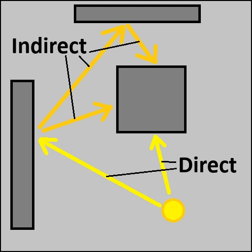 

Notez que nos lumières déterministes ne sont pas sujetes à ce problème d'ombre trop noire car elles prennent justement en compte l'éclairage indirecte. C'est un des aspects qui les rend si interessante malgré le fait qu'on ne peut pas les déplacer comme on veut. Voyons comment ça fonctionne.

## III. Lumière déterministe
Avant toute chose, pour pouvoir calculer de la lumière déterministe, on va avoir besoin... d'une lumière déterministe ! Il faut donc ajouter une point light à notre scene Blender.

[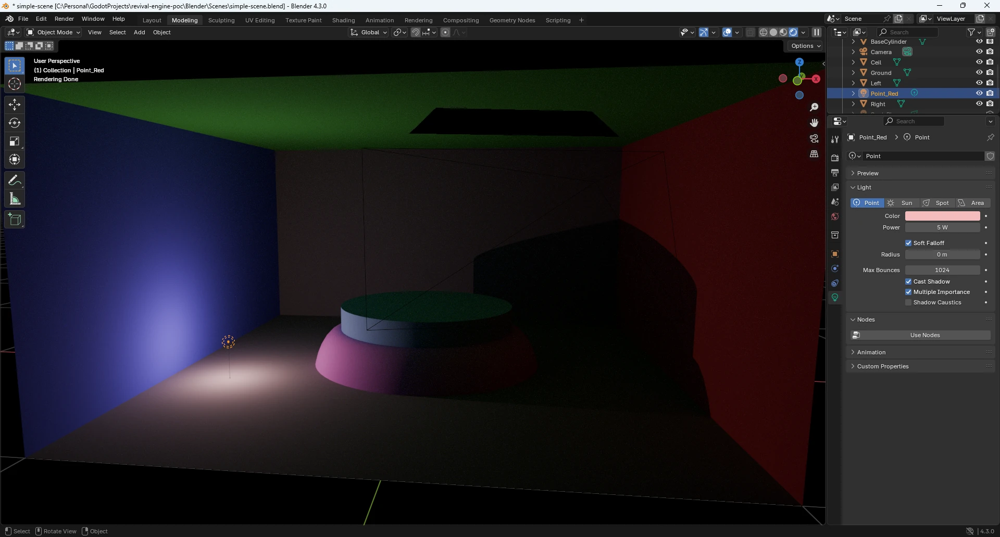](images/blender_point_light.opti.webp)

Cette point light sera automatiquement réimportée dans la scène godot par la magie de l'interopérabilité. Mais il faudra tout de même l'assigner aux uniforms correspondant de notre shader pour qu'il puisse la prendre en compte (vous vous souvenez ? les 3 tableaux de taille fix un peu overkill de la partie I ?). Sans cela elle ne pourra pas éclairer les pixels interactifs.

D'ailleurs c'est le moment de déterrer le tableau récapitulatif de l'article principal pour nous remettre au point sur les différents cas :
<style>
table th:first-of-type {
    width: 10%;
}
table th:nth-of-type(2) {
    width: 50%;
}
table th:nth-of-type(3) {
    width: 30%;
}
</style>
|                         | Pixel Déterministe                                                                                     | Pixel Interactif                                  |
|-------------------------|:------------------------------------------------------------------------------------------------------:|:-------------------------------------------------:|
| **Lumière Déterministe** | Précalculé					|	Temps Réèl	|
| **Lumière Interactive**  | Précalculé + Temps Réèl	|	Temps Réèl	|

Le shader actuel n'accumule pour l'instant que la partie temps réèl de chaque lumière. Pour compléter le tableau, il va donc falloir précalculer la partie déterministe dans Blender, et l'appliquer aux pixels déterministes. 

### 1. Generation des textures d'illumination
Comme à chaque fois qu'on touche à Blender depuis le début de cette serie, on va activer de nouvelles passes et modifier notre compositor pour générer de nouvelles maps à destination de notre G-Buffer déterministe.

Cettes fois ci, les passes cycle qui nous interessent sont au nombre de 5 :
- diffuse directe
- diffuse indirecte
- glossy directe
- glossy indirecte
- glossy color

Techniquement la diffuse color nous interesse aussi mais il se trouve qu'on l'a déjà (souvenez vous, c'est notre albédo).

De là vous connaissez la musique, :
- On active les passes dans le paneau latéral
- On ajoute les pins nécessaires au noeud File Output
- On relie les sorties de chaque passes aux pins correspondant et on appuie sur F12 pour lancer le rendu


[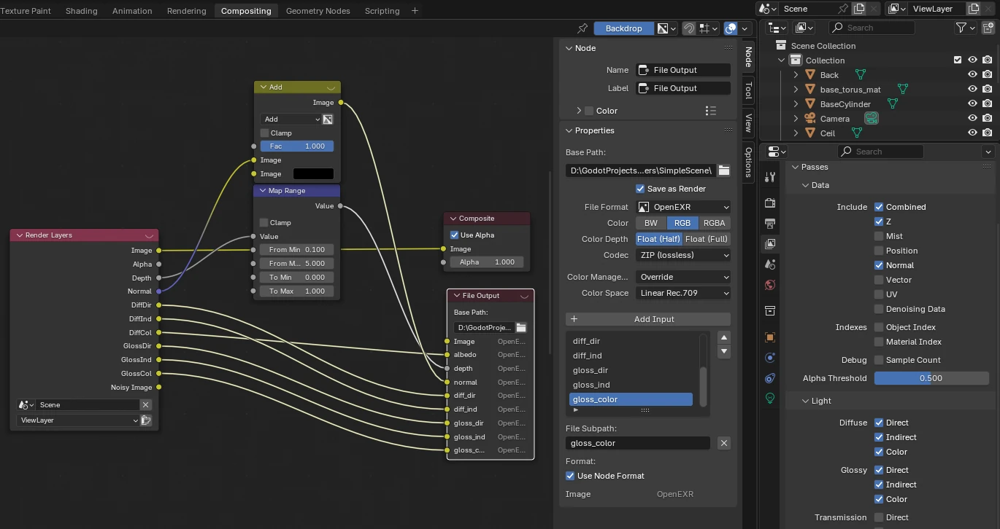](images/blender_passes.opti.webp)

Petit point vocabulaire pour bien comprendre à quoi correspondent toutes ses données :
- **diffuse :** correspond à la composantes diffuse de la lumière
- **glossy :** correspond à la composantes spéculaire de la lumière
- **direct :** contribution des rayons de première visibilité (lumière directe)
- **indirect :** contribution des rebonds successifs (lumière indirecte)

En gros, plutôt que de nous donner directement l'accumulation totale de toutes les contributions lumineuse de la scène, Blender les regroupe par paquet et nous laisse le soin de les recombiner comme on veut. Ce qui donne à l'utilisateur une plus grande liberté artistique. 

Je ne sais pas encore si on aura l'utilisté de ce découpage dans OpenRE. Dans le doute on le garde pour se laisser l'oportunité d'experimenter plus tard. Mais si on ne s'en sert pas, il faudra biensure recomposer tout ça directement dans Blender avant export. On va pas se trimbaler 5 textures quand on peut n'en manipuler qu'une seule.

### 2. Intégration au compositor
C'est maintenant une habitude, voici d'un bloc la totalité des ajout que l'on s'apprete à détailler. L'objectif ici étant de mettre notre shader en capacité de gérer la lumière déterministe que l'on vient de générer.


```glsl {#code-compact hl_lines=[7,8,9,10,11 , 16,17,18,19,20 , 30,31,32,33]}
// USUAL GODOT POST-PROCESS CODE
// HELPER FUNCTIONS FROM THE ORACLE
// SCENE UNIFORMS
// INTERACTIVE G-BUFFER
// DETERMINIST G-BUFFER
...
uniform sampler2D d_diff_dir_map : filter_nearest;
uniform sampler2D d_diff_ind_map : filter_nearest;
uniform sampler2D d_gloss_color_map : filter_nearest;
uniform sampler2D d_gloss_dir_map : filter_nearest;
uniform sampler2D d_gloss_ind_map : filter_nearest;

void fragment() {
	// SAMPLE G-BUFFERs
	...
	vec3 d_diff_dir_frag = texture(d_diff_dir_map, SCREEN_UV).rgb;
	vec3 d_diff_ind_frag = texture(d_diff_ind_map, SCREEN_UV).rgb;
	vec3 d_gloss_color_frag = texture(d_gloss_color_map, SCREEN_UV).rgb;
	vec3 d_gloss_dir_frag = texture(d_gloss_dir_map, SCREEN_UV).rgb;
	vec3 d_gloss_ind_frag = texture(d_gloss_ind_map, SCREEN_UV).rgb;
	
	// DATA HARMONIZATION
	// DATA SELECTION (according to depth)
	...
	if(is_frag_interactive) {
		...
	}
	else {
		...
		vec3 d_diff_light = d_diff_dir_frag + d_diff_ind_frag;
		vec3 d_gloss_light = d_gloss_dir_frag + d_gloss_ind_frag;
		diffuse_contrib += d_diffuse_color_frag * d_diff_light;
		specular_contrib += d_gloss_color_frag * d_gloss_light;
	}
	
	// WORLD POSITION FROM DEPTH
	// ACCUMULATE LIGHT CONTRIBUTIONS
	// FINAL FRAGMENT COLOR
	ALBEDO = diffuse_contrib + specular_contrib;
}
```

```glsl {#code-full .hidden hl_lines=[29,30,31,32,33 , 44,45,46,47,48 , 74,75,76,77]}
// USUAL GODOT POST-PROCESS STUFF
shader_type spatial;
render_mode unshaded, fog_disabled;

void vertex() {
	POSITION = vec4(VERTEX.xy, 1.0, 1.0);
}

// HELPER FUNCTIONS FROM THE ORACLE
#include "pre_process_utils.gdshaderinc"

// SCENE UNIFORMS
uniform float cam_near;
uniform float cam_far;
uniform int nb_plights;
uniform vec3 plight_position[8];
uniform vec3 plight_color[8];
uniform float plight_intensity[8];

// INTERACTIVE G-BUFFER
uniform sampler2D i_depth_map : filter_nearest;
uniform sampler2D i_albedo_map : filter_nearest;
uniform sampler2D i_normal_map : filter_nearest;

// DETERMINIST G-BUFFER
uniform sampler2D d_depth_map : filter_nearest;
uniform sampler2D d_diffuse_color_map : filter_nearest;
uniform sampler2D d_normal_map : filter_nearest;
uniform sampler2D d_diff_dir_map : filter_nearest;
uniform sampler2D d_diff_ind_map : filter_nearest;
uniform sampler2D d_gloss_color_map : filter_nearest;
uniform sampler2D d_gloss_dir_map : filter_nearest;
uniform sampler2D d_gloss_ind_map : filter_nearest;

void fragment() {
	// SAMPLE G-BUFFERs
	vec3 i_depth_frag = texture(i_depth_map, SCREEN_UV).rgb;
	vec3 i_albedo_frag = texture(i_albedo_map, SCREEN_UV).rgb;
	vec3 i_normal_frag = texture(i_normal_map, SCREEN_UV).rgb;
	
	vec3 d_depth_frag = texture(d_depth_map, SCREEN_UV).rgb;
	vec3 d_diffuse_color_frag = texture(d_diffuse_color_map, SCREEN_UV).rgb;
	vec3 d_normal_frag = texture(d_normal_map, SCREEN_UV).rgb;
	vec3 d_diff_dir_frag = texture(d_diff_dir_map, SCREEN_UV).rgb;
	vec3 d_diff_ind_frag = texture(d_diff_ind_map, SCREEN_UV).rgb;
	vec3 d_gloss_color_frag = texture(d_gloss_color_map, SCREEN_UV).rgb;
	vec3 d_gloss_dir_frag = texture(d_gloss_dir_map, SCREEN_UV).rgb;
	vec3 d_gloss_ind_frag = texture(d_gloss_ind_map, SCREEN_UV).rgb;
	
	// DATA HARMONIZATION
	i_depth_frag = pre_process_i_depth(i_depth_frag);
	d_depth_frag = pre_process_d_depth(d_depth_frag, cam_near, cam_far);
	d_normal_frag = pre_process_d_normal(d_normal_frag);
	i_normal_frag = pre_process_i_normal(i_normal_frag, INV_VIEW_MATRIX);
	
	vec3 diffuse_contrib = vec3(0.0);
	vec3 specular_contrib = vec3(0.0);
	
	// DATA SELECTION (according to depth)
	float depth_frag;
	vec3 albedo_frag;
	vec3 normal_frag;
	bool is_frag_interactive = d_depth_frag.r < i_depth_frag.r;
	if(is_frag_interactive) {
		depth_frag = i_depth_frag.r;
		albedo_frag = i_albedo_frag;
		normal_frag = i_normal_frag;
	}
	else {
		depth_frag = d_depth_frag.r;
		albedo_frag = d_diffuse_color_frag;
		normal_frag = d_normal_frag;
		
		vec3 d_diff_light = d_diff_dir_frag + d_diff_ind_frag;
		vec3 d_gloss_light = d_gloss_dir_frag + d_gloss_ind_frag;
		diffuse_contrib += d_diffuse_color_frag * d_diff_light;
		specular_contrib += d_gloss_color_frag * d_gloss_light;
	}
	
	// WORLD POSITION FROM DEPTH
	vec3 ndc = vec3((SCREEN_UV * 2.0) - 1.0, depth_frag);
	vec4 clip = vec4(ndc, 1.0);
	vec4 world = INV_VIEW_MATRIX * INV_PROJECTION_MATRIX * clip;
	world.xyz /= world.w;
	vec3 frag_position = world.xyz;
	
	// ACCUMULATE LIGHT CONTRIBUTIONS
	for(int i = 0; i < nb_plights; i++) {
		vec3 light_vec = plight_position[i] - frag_position;
		float d2 = length(light_vec);
		d2 = pow(d2, 2.0);
		float attenuation = 1.0 / d2;

		vec3 C = plight_color[i];
		float I = plight_intensity[i];
		float NdotL = max(dot(normal_frag, L), 0.0);
		diffuse_contrib += NdotL * C * I * albedo_frag * attenuation;
		//specular_contrib += NOT IMPLEMENTED YET
	}
	
	// FINAL FRAGMENT COLOR
	ALBEDO = diffuse_contrib + specular_contrib;
}
```


#### 2.1. Introduction des maps déterministe
On doit biensure lui donner les textures via des uniforms.


```glsl {#code-compact hl_lines=[3,4,5,6,7]}
// DETERMINIST G-BUFFER
...
uniform sampler2D d_diff_dir_map : filter_nearest;
uniform sampler2D d_diff_ind_map : filter_nearest;
uniform sampler2D d_gloss_color_map : filter_nearest;
uniform sampler2D d_gloss_dir_map : filter_nearest;
uniform sampler2D d_gloss_ind_map : filter_nearest;

...
```

```glsl {#code-full .hidden hl_lines=[29,30,31,32,33]}
// USUAL GODOT POST-PROCESS STUFF
shader_type spatial;
render_mode unshaded, fog_disabled;

void vertex() {
	POSITION = vec4(VERTEX.xy, 1.0, 1.0);
}

// HELPER FUNCTIONS FROM THE ORACLE
#include "pre_process_utils.gdshaderinc"

// SCENE UNIFORMS
uniform float cam_near;
uniform float cam_far;
uniform int nb_plights;
uniform vec3 plight_position[8];
uniform vec3 plight_color[8];
uniform float plight_intensity[8];

// INTERACTIVE G-BUFFER
uniform sampler2D i_depth_map : filter_nearest;
uniform sampler2D i_albedo_map : filter_nearest;
uniform sampler2D i_normal_map : filter_nearest;

// DETERMINIST G-BUFFER
uniform sampler2D d_depth_map : filter_nearest;
uniform sampler2D d_diffuse_color_map : filter_nearest;
uniform sampler2D d_normal_map : filter_nearest;
uniform sampler2D d_diff_dir_map : filter_nearest;
uniform sampler2D d_diff_ind_map : filter_nearest;
uniform sampler2D d_gloss_color_map : filter_nearest;
uniform sampler2D d_gloss_dir_map : filter_nearest;
uniform sampler2D d_gloss_ind_map : filter_nearest;

void fragment() {
	// SAMPLE G-BUFFERs
	vec3 i_depth_frag = texture(i_depth_map, SCREEN_UV).rgb;
	vec3 i_albedo_frag = texture(i_albedo_map, SCREEN_UV).rgb;
	vec3 i_normal_frag = texture(i_normal_map, SCREEN_UV).rgb;
	
	vec3 d_depth_frag = texture(d_depth_map, SCREEN_UV).rgb;
	vec3 d_diffuse_color_frag = texture(d_diffuse_color_map, SCREEN_UV).rgb;
	vec3 d_normal_frag = texture(d_normal_map, SCREEN_UV).rgb;
	vec3 d_diff_dir_frag = texture(d_diff_dir_map, SCREEN_UV).rgb;
	vec3 d_diff_ind_frag = texture(d_diff_ind_map, SCREEN_UV).rgb;
	vec3 d_gloss_color_frag = texture(d_gloss_color_map, SCREEN_UV).rgb;
	vec3 d_gloss_dir_frag = texture(d_gloss_dir_map, SCREEN_UV).rgb;
	vec3 d_gloss_ind_frag = texture(d_gloss_ind_map, SCREEN_UV).rgb;
	
	// DATA HARMONIZATION
	i_depth_frag = pre_process_i_depth(i_depth_frag);
	d_depth_frag = pre_process_d_depth(d_depth_frag, cam_near, cam_far);
	d_normal_frag = pre_process_d_normal(d_normal_frag);
	i_normal_frag = pre_process_i_normal(i_normal_frag, INV_VIEW_MATRIX);
	
	vec3 diffuse_contrib = vec3(0.0);
	vec3 specular_contrib = vec3(0.0);
	
	// DATA SELECTION (according to depth)
	float depth_frag;
	vec3 albedo_frag;
	vec3 normal_frag;
	bool is_frag_interactive = d_depth_frag.r < i_depth_frag.r;
	if(is_frag_interactive) {
		depth_frag = i_depth_frag.r;
		albedo_frag = i_albedo_frag;
		normal_frag = i_normal_frag;
	}
	else {
		depth_frag = d_depth_frag.r;
		albedo_frag = d_diffuse_color_frag;
		normal_frag = d_normal_frag;
		
		vec3 d_diff_light = d_diff_dir_frag + d_diff_ind_frag;
		vec3 d_gloss_light = d_gloss_dir_frag + d_gloss_ind_frag;
		diffuse_contrib += d_diffuse_color_frag * d_diff_light;
		specular_contrib += d_gloss_color_frag * d_gloss_light;
	}
	
	// WORLD POSITION FROM DEPTH
	vec3 ndc = vec3((SCREEN_UV * 2.0) - 1.0, depth_frag);
	vec4 clip = vec4(ndc, 1.0);
	vec4 world = INV_VIEW_MATRIX * INV_PROJECTION_MATRIX * clip;
	world.xyz /= world.w;
	vec3 frag_position = world.xyz;
	
	// ACCUMULATE LIGHT CONTRIBUTIONS
	for(int i = 0; i < nb_plights; i++) {
		vec3 light_vec = plight_position[i] - frag_position;
		float d2 = length(light_vec);
		d2 = pow(d2, 2.0);
		float attenuation = 1.0 / d2;

		vec3 C = plight_color[i];
		float I = plight_intensity[i];
		float NdotL = max(dot(normal_frag, L), 0.0);
		diffuse_contrib += NdotL * C * I * albedo_frag * attenuation;
		//specular_contrib += NOT IMPLEMENTED YET
	}
	
	// FINAL FRAGMENT COLOR
	ALBEDO = diffuse_contrib + specular_contrib;
}
```


#### 2.2. Echantillonage des maps déterministe
Ensuite, on échantillonne ces textures de la même manière que les autres. Mais cette fois ci, il n'y a pas d'harmonisation a effectuer car les données sont exclusivent au monde déterministe.


```glsl {#code-compact hl_lines=[6,7,8,9,10]}
...

void fragment() {
	// SAMPLE G-BUFFERs
	...
	vec3 d_diff_dir_frag = texture(d_diff_dir_map, SCREEN_UV).rgb;
	vec3 d_diff_ind_frag = texture(d_diff_ind_map, SCREEN_UV).rgb;
	vec3 d_gloss_color_frag = texture(d_gloss_color_map, SCREEN_UV).rgb;
	vec3 d_gloss_dir_frag = texture(d_gloss_dir_map, SCREEN_UV).rgb;
	vec3 d_gloss_ind_frag = texture(d_gloss_ind_map, SCREEN_UV).rgb;
	...
```

```glsl {#code-full .hidden hl_lines=[44,45,46,47,48]}
// USUAL GODOT POST-PROCESS STUFF
shader_type spatial;
render_mode unshaded, fog_disabled;

void vertex() {
	POSITION = vec4(VERTEX.xy, 1.0, 1.0);
}

// HELPER FUNCTIONS FROM THE ORACLE
#include "pre_process_utils.gdshaderinc"

// SCENE UNIFORMS
uniform float cam_near;
uniform float cam_far;
uniform int nb_plights;
uniform vec3 plight_position[8];
uniform vec3 plight_color[8];
uniform float plight_intensity[8];

// INTERACTIVE G-BUFFER
uniform sampler2D i_depth_map : filter_nearest;
uniform sampler2D i_albedo_map : filter_nearest;
uniform sampler2D i_normal_map : filter_nearest;

// DETERMINIST G-BUFFER
uniform sampler2D d_depth_map : filter_nearest;
uniform sampler2D d_diffuse_color_map : filter_nearest;
uniform sampler2D d_normal_map : filter_nearest;
uniform sampler2D d_diff_dir_map : filter_nearest;
uniform sampler2D d_diff_ind_map : filter_nearest;
uniform sampler2D d_gloss_color_map : filter_nearest;
uniform sampler2D d_gloss_dir_map : filter_nearest;
uniform sampler2D d_gloss_ind_map : filter_nearest;

void fragment() {
	// SAMPLE G-BUFFERs
	vec3 i_depth_frag = texture(i_depth_map, SCREEN_UV).rgb;
	vec3 i_albedo_frag = texture(i_albedo_map, SCREEN_UV).rgb;
	vec3 i_normal_frag = texture(i_normal_map, SCREEN_UV).rgb;
	
	vec3 d_depth_frag = texture(d_depth_map, SCREEN_UV).rgb;
	vec3 d_diffuse_color_frag = texture(d_diffuse_color_map, SCREEN_UV).rgb;
	vec3 d_normal_frag = texture(d_normal_map, SCREEN_UV).rgb;
	vec3 d_diff_dir_frag = texture(d_diff_dir_map, SCREEN_UV).rgb;
	vec3 d_diff_ind_frag = texture(d_diff_ind_map, SCREEN_UV).rgb;
	vec3 d_gloss_color_frag = texture(d_gloss_color_map, SCREEN_UV).rgb;
	vec3 d_gloss_dir_frag = texture(d_gloss_dir_map, SCREEN_UV).rgb;
	vec3 d_gloss_ind_frag = texture(d_gloss_ind_map, SCREEN_UV).rgb;
	
	// DATA HARMONIZATION
	i_depth_frag = pre_process_i_depth(i_depth_frag);
	d_depth_frag = pre_process_d_depth(d_depth_frag, cam_near, cam_far);
	d_normal_frag = pre_process_d_normal(d_normal_frag);
	i_normal_frag = pre_process_i_normal(i_normal_frag, INV_VIEW_MATRIX);
	
	vec3 diffuse_contrib = vec3(0.0);
	vec3 specular_contrib = vec3(0.0);
	
	// DATA SELECTION (according to depth)
	float depth_frag;
	vec3 albedo_frag;
	vec3 normal_frag;
	bool is_frag_interactive = d_depth_frag.r < i_depth_frag.r;
	if(is_frag_interactive) {
		depth_frag = i_depth_frag.r;
		albedo_frag = i_albedo_frag;
		normal_frag = i_normal_frag;
	}
	else {
		depth_frag = d_depth_frag.r;
		albedo_frag = d_diffuse_color_frag;
		normal_frag = d_normal_frag;
		
		vec3 d_diff_light = d_diff_dir_frag + d_diff_ind_frag;
		vec3 d_gloss_light = d_gloss_dir_frag + d_gloss_ind_frag;
		diffuse_contrib += d_diffuse_color_frag * d_diff_light;
		specular_contrib += d_gloss_color_frag * d_gloss_light;
	}
	
	// WORLD POSITION FROM DEPTH
	vec3 ndc = vec3((SCREEN_UV * 2.0) - 1.0, depth_frag);
	vec4 clip = vec4(ndc, 1.0);
	vec4 world = INV_VIEW_MATRIX * INV_PROJECTION_MATRIX * clip;
	world.xyz /= world.w;
	vec3 frag_position = world.xyz;
	
	// ACCUMULATE LIGHT CONTRIBUTIONS
	for(int i = 0; i < nb_plights; i++) {
		vec3 light_vec = plight_position[i] - frag_position;
		float d2 = length(light_vec);
		d2 = pow(d2, 2.0);
		float attenuation = 1.0 / d2;

		vec3 C = plight_color[i];
		float I = plight_intensity[i];
		float NdotL = max(dot(normal_frag, L), 0.0);
		diffuse_contrib += NdotL * C * I * albedo_frag * attenuation;
		//specular_contrib += NOT IMPLEMENTED YET
	}
	
	// FINAL FRAGMENT COLOR
	ALBEDO = diffuse_contrib + specular_contrib;
}
```


#### 2.3. Reconstitution de la lumière déterministe
Ici nous allons initialiser les variable `diffuse_contrib` et `specular_contrib` selon la formule indiquée dans la documention de Blender.

[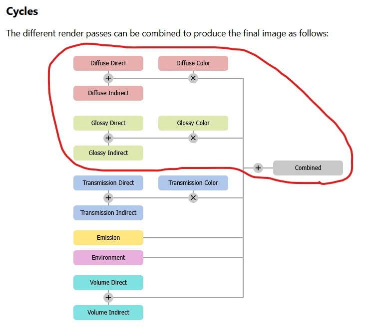](images/blender_compo_formula.opti.webp)

Comme indiqué dans le tableau, la lumière déterministe générée dans Blender ne s'applique pas aux fragments intéractifs. C'est la raison pour laquelle on initialise les variables dans le `else`.


```glsl {#code-compact hl_lines=[13,14,15,16]}
...

void fragment() {
	...
	
	// DATA SELECTION (according to depth)
	...
	if(is_frag_interactive) {
		...
	}
	else {
		...
		vec3 d_diff_light = d_diff_dir_frag + d_diff_ind_frag;
		vec3 d_gloss_light = d_gloss_dir_frag + d_gloss_ind_frag;
		diffuse_contrib += d_diffuse_color_frag * d_diff_light;
		specular_contrib += d_gloss_color_frag * d_gloss_light;
	}
}
```

```glsl {#code-full .hidden hl_lines=[74,75,76,77]}
// USUAL GODOT POST-PROCESS STUFF
shader_type spatial;
render_mode unshaded, fog_disabled;

void vertex() {
	POSITION = vec4(VERTEX.xy, 1.0, 1.0);
}

// HELPER FUNCTIONS FROM THE ORACLE
#include "pre_process_utils.gdshaderinc"

// SCENE UNIFORMS
uniform float cam_near;
uniform float cam_far;
uniform int nb_plights;
uniform vec3 plight_position[8];
uniform vec3 plight_color[8];
uniform float plight_intensity[8];

// INTERACTIVE G-BUFFER
uniform sampler2D i_depth_map : filter_nearest;
uniform sampler2D i_albedo_map : filter_nearest;
uniform sampler2D i_normal_map : filter_nearest;

// DETERMINIST G-BUFFER
uniform sampler2D d_depth_map : filter_nearest;
uniform sampler2D d_diffuse_color_map : filter_nearest;
uniform sampler2D d_normal_map : filter_nearest;
uniform sampler2D d_diff_dir_map : filter_nearest;
uniform sampler2D d_diff_ind_map : filter_nearest;
uniform sampler2D d_gloss_color_map : filter_nearest;
uniform sampler2D d_gloss_dir_map : filter_nearest;
uniform sampler2D d_gloss_ind_map : filter_nearest;

void fragment() {
	// SAMPLE G-BUFFERs
	vec3 i_depth_frag = texture(i_depth_map, SCREEN_UV).rgb;
	vec3 i_albedo_frag = texture(i_albedo_map, SCREEN_UV).rgb;
	vec3 i_normal_frag = texture(i_normal_map, SCREEN_UV).rgb;
	
	vec3 d_depth_frag = texture(d_depth_map, SCREEN_UV).rgb;
	vec3 d_diffuse_color_frag = texture(d_diffuse_color_map, SCREEN_UV).rgb;
	vec3 d_normal_frag = texture(d_normal_map, SCREEN_UV).rgb;
	vec3 d_diff_dir_frag = texture(d_diff_dir_map, SCREEN_UV).rgb;
	vec3 d_diff_ind_frag = texture(d_diff_ind_map, SCREEN_UV).rgb;
	vec3 d_gloss_color_frag = texture(d_gloss_color_map, SCREEN_UV).rgb;
	vec3 d_gloss_dir_frag = texture(d_gloss_dir_map, SCREEN_UV).rgb;
	vec3 d_gloss_ind_frag = texture(d_gloss_ind_map, SCREEN_UV).rgb;
	
	// DATA HARMONIZATION
	i_depth_frag = pre_process_i_depth(i_depth_frag);
	d_depth_frag = pre_process_d_depth(d_depth_frag, cam_near, cam_far);
	d_normal_frag = pre_process_d_normal(d_normal_frag);
	i_normal_frag = pre_process_i_normal(i_normal_frag, INV_VIEW_MATRIX);
	
	vec3 diffuse_contrib = vec3(0.0);
	vec3 specular_contrib = vec3(0.0);
	
	// DATA SELECTION (according to depth)
	float depth_frag;
	vec3 albedo_frag;
	vec3 normal_frag;
	bool is_frag_interactive = d_depth_frag.r < i_depth_frag.r;
	if(is_frag_interactive) {
		depth_frag = i_depth_frag.r;
		albedo_frag = i_albedo_frag;
		normal_frag = i_normal_frag;
	}
	else {
		depth_frag = d_depth_frag.r;
		albedo_frag = d_diffuse_color_frag;
		normal_frag = d_normal_frag;
		
		vec3 d_diff_light = d_diff_dir_frag + d_diff_ind_frag;
		vec3 d_gloss_light = d_gloss_dir_frag + d_gloss_ind_frag;
		diffuse_contrib += d_diffuse_color_frag * d_diff_light;
		specular_contrib += d_gloss_color_frag * d_gloss_light;
	}
	
	// WORLD POSITION FROM DEPTH
	vec3 ndc = vec3((SCREEN_UV * 2.0) - 1.0, depth_frag);
	vec4 clip = vec4(ndc, 1.0);
	vec4 world = INV_VIEW_MATRIX * INV_PROJECTION_MATRIX * clip;
	world.xyz /= world.w;
	vec3 frag_position = world.xyz;
	
	// ACCUMULATE LIGHT CONTRIBUTIONS
	for(int i = 0; i < nb_plights; i++) {
		vec3 light_vec = plight_position[i] - frag_position;
		float d2 = length(light_vec);
		d2 = pow(d2, 2.0);
		float attenuation = 1.0 / d2;

		vec3 C = plight_color[i];
		float I = plight_intensity[i];
		float NdotL = max(dot(normal_frag, L), 0.0);
		diffuse_contrib += NdotL * C * I * albedo_frag * attenuation;
		//specular_contrib += NOT IMPLEMENTED YET
	}
	
	// FINAL FRAGMENT COLOR
	ALBEDO = diffuse_contrib + specular_contrib;
}
```


Ainsi, la suite du shader accumule naturellement la lumière temps réèl par dessus la lumière précalculée que l'on vient de reconstituer, et on obtien le résultat suivant :

 

<video width="100%" controls muted loop playsinline autoplay>
    <source src="videos/burned_noise.mp4" type="video/mp4">
    Your browser does not support the video tag.  
</video>




### 3. Denoising
Quand on regarde tout ça de près, on peut voir que le rendu n'est pas très propre.

[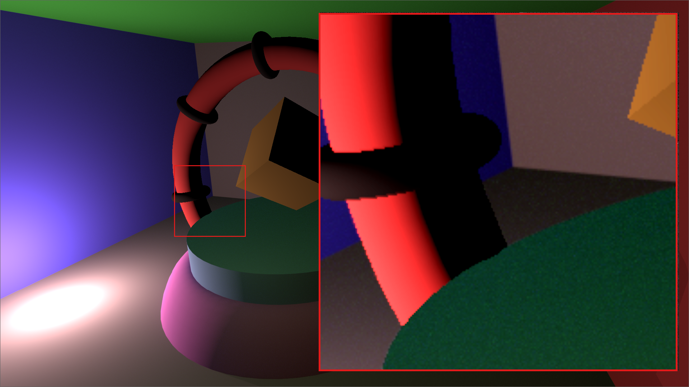](images/det_noise_zoom.opti.webp)

Si on s'interesse aux maps d'indirect générées par Blender, on comprend vite pourquoi.

[](images/noise_indirect.webp)

*"Garbage in => garbage out !"* Il n'y a pas de miracle, si vos données d'entrées sont sales, aucune chance d'avoir quelque chose de propre en sortie.

**Mais pourquoi Blender fait des rendu tout dégeux d'abord ?**

Et bien en fait c'est normal. Toutes les images générées par *path tracing* sont bruitées, et c'est comme ça que sont produites les maps d'indirect. Si on veut de la netteté, il faut les denoiser. Blender en est biensure capable. Il ne le fait simplement pas par defaut.

[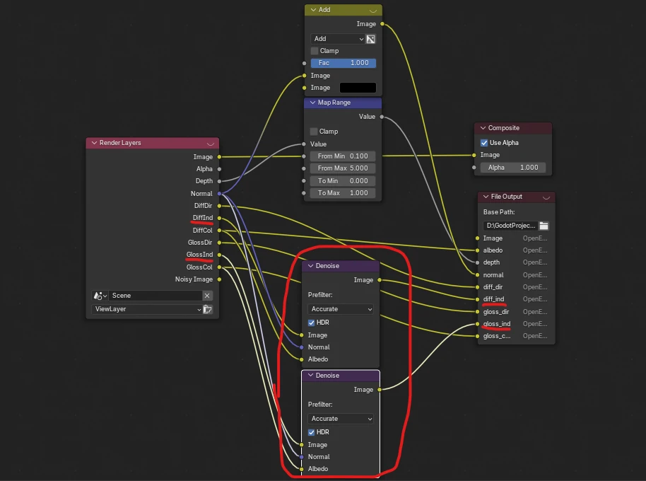](images/blender_denoise_node.opti.webp)

Il suffit d'utiliser le noeud `Denoise` dans le `Compositeur` et le tour est joué.

[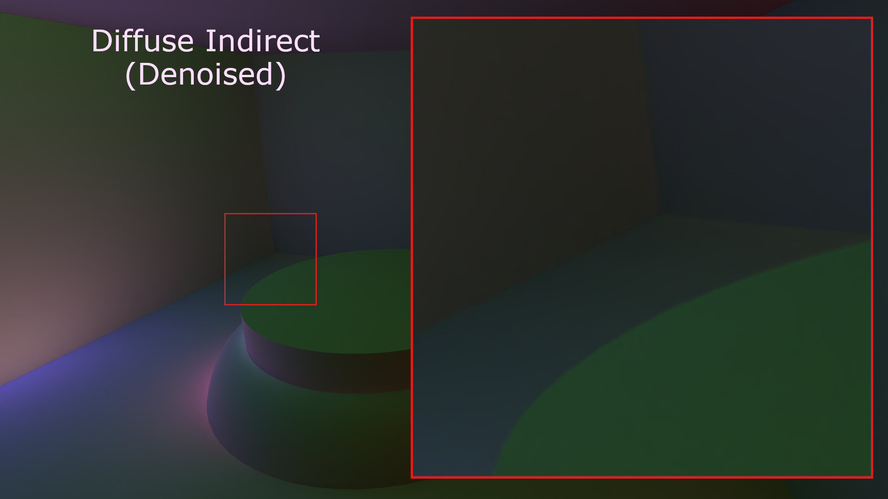](images/denoised_indirect.webp)

Evidement le denoising augment le temps de rendu. Mais c'est le prix pour avoir un rendu bien propre.

[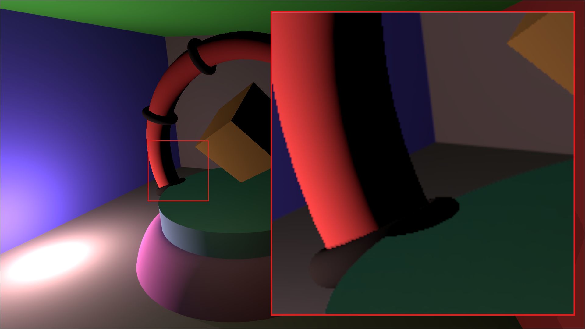](images/det_denoise_zoom.opti.webp)

### 4. Double exposition
Le resultat actuel est plutôt pas mal. Mais si vous avez l'oeil, vous aurez surement remarqué que la lumière déterministe est quelques peu sur-vitaminée.

Là raison est simple. Notre shader ne fait pas de distinction selon type de lumière lors de l'accumulation des contributions. Pour un pixel interactif c'est exactement ce qu'on veut : si un personnage s'approche d'une source déterministe, on a envie que sa lumière l'affecte.

Mais pour un pixel déterministe, c'est un probleme ! En effet, l'accumulation des lumières déterministes sur l'environnement déterministe à déjà été calculés par Blender. Elle est stoqué dans les maps d'illumination que l'on vient d'intégrer. Comme le calcul est refait sans distinction côté Godot, ces lumières sont prises en compte 2 fois. C'est pour ça que ça patate aussi fort. (d'ailleurs si j'avais lu correctement mon tableau récapitulatif, j'aurait pu l'anticiper ^^)

[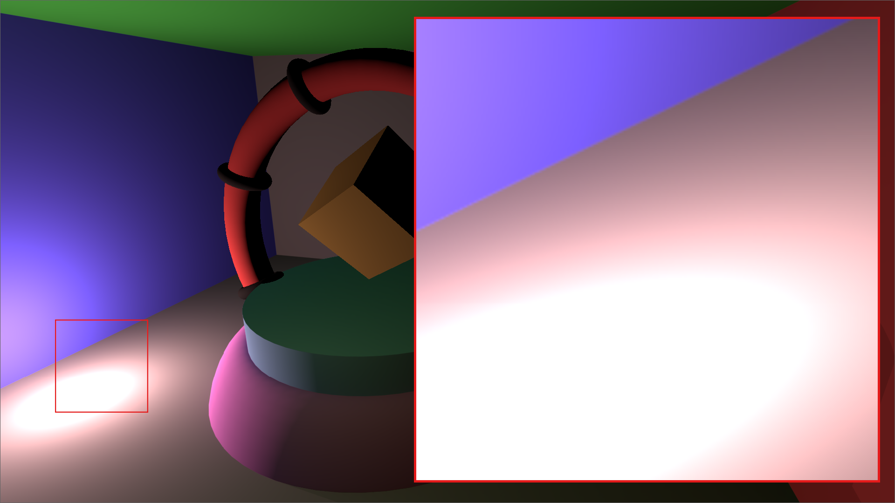](images/det_burned_zoom.opti.webp)

Le shader à donc besoin de savoir à quel monde appartiennent les lumières qu'il traite. On lui fait part de cet information à travers un nouveau uniform `plight_isInteractive`. Il s'en sert lors de l'accumulation pour filtrer le cas "lumiere déterministe sur pixel déterministe" (qui n'a pas de composante temps réèl).


```glsl {#code-compact hl_lines=[5,18,19]}
// USUAL GODOT POST-PROCESS CODE
// HELPER FUNCTIONS FROM THE ORACLE
// SCENE UNIFORMS
...
uniform bool plight_isInteractive[8];

// INTERACTIVE G-BUFFER
// DETERMINIST G-BUFFER
...

void fragment() {
	// SAMPLE G-BUFFERs
	// DATA HARMONIZATION
	// DATA SELECTION (according to depth)
	// WORLD POSITION FROM DEPTH
	// ACCUMULATE LIGHT CONTRIBUTIONS
	for(int i = 0; i < nb_plights; i++) {
		if(!is_frag_interactive && !plight_isInteractive[i])
			continue;
		...
	}
	
	// FINAL FRAGMENT COLOR
	ALBEDO = diffuse_contrib + specular_contrib;
}
```

```glsl {#code-full .hidden hl_lines=[19,90,91]}
// USUAL GODOT POST-PROCESS STUFF
shader_type spatial;
render_mode unshaded, fog_disabled;

void vertex() {
	POSITION = vec4(VERTEX.xy, 1.0, 1.0);
}

// HELPER FUNCTIONS FROM THE ORACLE
#include "pre_process_utils.gdshaderinc"

// SCENE UNIFORMS
uniform float cam_near;
uniform float cam_far;
uniform int nb_plights;
uniform vec3 plight_position[8];
uniform vec3 plight_color[8];
uniform float plight_intensity[8];
uniform bool plight_isInteractive[8];

// INTERACTIVE G-BUFFER
uniform sampler2D i_depth_map : filter_nearest;
uniform sampler2D i_albedo_map : filter_nearest;
uniform sampler2D i_normal_map : filter_nearest;

// DETERMINIST G-BUFFER
uniform sampler2D d_depth_map : filter_nearest;
uniform sampler2D d_diffuse_color_map : filter_nearest;
uniform sampler2D d_normal_map : filter_nearest;
uniform sampler2D d_diff_dir_map : filter_nearest;
uniform sampler2D d_diff_ind_map : filter_nearest;
uniform sampler2D d_gloss_color_map : filter_nearest;
uniform sampler2D d_gloss_dir_map : filter_nearest;
uniform sampler2D d_gloss_ind_map : filter_nearest;

void fragment() {
	// SAMPLE G-BUFFERs
	vec3 i_depth_frag = texture(i_depth_map, SCREEN_UV).rgb;
	vec3 i_albedo_frag = texture(i_albedo_map, SCREEN_UV).rgb;
	vec3 i_normal_frag = texture(i_normal_map, SCREEN_UV).rgb;
	
	vec3 d_depth_frag = texture(d_depth_map, SCREEN_UV).rgb;
	vec3 d_diffuse_color_frag = texture(d_diffuse_color_map, SCREEN_UV).rgb;
	vec3 d_normal_frag = texture(d_normal_map, SCREEN_UV).rgb;
	vec3 d_diff_dir_frag = texture(d_diff_dir_map, SCREEN_UV).rgb;
	vec3 d_diff_ind_frag = texture(d_diff_ind_map, SCREEN_UV).rgb;
	vec3 d_gloss_color_frag = texture(d_gloss_color_map, SCREEN_UV).rgb;
	vec3 d_gloss_dir_frag = texture(d_gloss_dir_map, SCREEN_UV).rgb;
	vec3 d_gloss_ind_frag = texture(d_gloss_ind_map, SCREEN_UV).rgb;
	
	// DATA HARMONIZATION
	i_depth_frag = pre_process_i_depth(i_depth_frag);
	d_depth_frag = pre_process_d_depth(d_depth_frag, cam_near, cam_far);
	d_normal_frag = pre_process_d_normal(d_normal_frag);
	i_normal_frag = pre_process_i_normal(i_normal_frag, INV_VIEW_MATRIX);
	
	vec3 diffuse_contrib = vec3(0.0);
	vec3 specular_contrib = vec3(0.0);
	
	// DATA SELECTION (according to depth)
	float depth_frag;
	vec3 albedo_frag;
	vec3 normal_frag;
	bool is_frag_interactive = d_depth_frag.r < i_depth_frag.r;
	if(is_frag_interactive) {
		depth_frag = i_depth_frag.r;
		albedo_frag = i_albedo_frag;
		normal_frag = i_normal_frag;
	}
	else {
		depth_frag = d_depth_frag.r;
		albedo_frag = d_diffuse_color_frag;
		normal_frag = d_normal_frag;
		
		vec3 d_diff_light = d_diff_dir_frag + d_diff_ind_frag;
		vec3 d_gloss_light = d_gloss_dir_frag + d_gloss_ind_frag;
		diffuse_contrib += d_diffuse_color_frag * d_diff_light;
		specular_contrib += d_gloss_color_frag * d_gloss_light;
	}
	
	// WORLD POSITION FROM DEPTH
	vec3 ndc = vec3((SCREEN_UV * 2.0) - 1.0, depth_frag);
	vec4 clip = vec4(ndc, 1.0);
	vec4 world = INV_VIEW_MATRIX * INV_PROJECTION_MATRIX * clip;
	world.xyz /= world.w;
	vec3 frag_position = world.xyz;
	
	// ACCUMULATE LIGHT CONTRIBUTIONS
	for(int i = 0; i < nb_plights; i++) {
		if(!is_frag_interactive && !plight_isInteractive[i])
			continue;
		
		vec3 light_vec = plight_position[i] - frag_position;
		float d2 = length(light_vec);
		d2 = pow(d2, 2.0);
		float attenuation = 1.0 / d2;

		vec3 C = plight_color[i];
		float I = plight_intensity[i];
		float NdotL = max(dot(normal_frag, L), 0.0);
		diffuse_contrib += NdotL * C * I * albedo_frag * attenuation;
		//specular_contrib += NOT IMPLEMENTED YET
	}
	
	// FINAL FRAGMENT COLOR
	ALBEDO = diffuse_contrib + specular_contrib;
}
```


Ce qui nous laisse avec ce magnifique rendu :

 

<video width="100%" controls muted loop playsinline autoplay>
    <source src="videos/final.mp4" type="video/mp4">
    Your browser does not support the video tag.  
</video>



## IV. Conclusion 
On commence à arriver sur quelque chose de convainquant. Sur la partie temps réèl, le modèle de Lambert est certes un peu léger en comparaison de ce qui se fait aujourd'hui. Mais sans spéculaire on peut malheureusement pas faire beaucup mieux. C'est pourquoi dans le prochain épisode, on s'attaquera à l'harmonisation de l'ORM en vu de l'implémentation d'un modèle PBR.

Ceci étant dit, je trouve que même en l'état, Lambert ne s'en sort pas trop mal dès lors qu'on y ajoute la lumière déterministe précalculée. On a déjà de la spéculaire, de la lumière indirect et on se paie même le luxe d'une superbe ombre portée (qui ignore la géométrie interactive oui ça va je sais...).

La deux mondes ne sont pas encore totalement indicernables, mais il faut quand même regargarder la scène de près pour voire la supercherie. Il faudra biensure confirmer cela sur un scène un peu plus réaliste mais c'est assez prometteur. 

Ainsi s'achève cette première mise en application des principe d'OpenRE. Je suis contant de pouvoir enfin vous montrer quelque résultats (après 6 numéros répartis sur 6 mois, il était temps héhé). Mais on as encore pas mal de sujets à couvrir dans ce POC avant de passer au SDK. J'espère que ça vous plais toujours. En tout cas ça me fait très plaisir de voire que plusieurs personnes suivent l'aventure. Salut à vous ! Merci d'être là ! Et à bientôt 👋