+++
author = 'Turbo Tartine'
date = '2025-11-02T09:37:24+01:00'
title = "OpenRE devlog 6 : Harmonisation de l'ORM"
description = 'devlog 6 du projet OpenRE'
draft = true
+++
[⬅️ Vers Précédent : "OpenRE devlog 5 : Fusion des mondes. Part II"](projects/open_re_poc_devlog_5)

## I. Introduction

Salut à tous !

Après les derniers épisodes consacrés à l’implémentation de l’éclairage, on va ressortir l’Oracle du placard pour faire un peu d’harmonisation.
Cette fois-ci, on va s’intéresser à l’ORM.

ORM est une convention qui définit dans quels canaux RGB sont rangées les informations suivantes :

* Red : (Ambient) **O**cclusion — à quel point la surface est exposée à la lumière ou confinée
* Green : **R**oughness — à quel point la surface est lisse ou rugueuse
* Blue : **M**etallic — est-ce que le matériau est métallique ou diélectrique (mot compliqué pour dire « pas métallique »)

Il en existe d’autres variantes, mais j’ai l’impression qu’ORM est aujourd’hui la plus répandue.

Ces données vont nous permettre d’implémenter un modèle d’illumination PBR. Vous avez certainement déjà entendu ce terme, mais prenons un instant pour nous mettre au clair sur ce que c’est.

## II. Quésaco PBR ?

PBR est l’acronyme de *Physically Based Rendering*. Il ne s’agit pas d’un modèle unique, mais plutôt d’un ensemble de modèles d’illumination. Ils ont en commun de s’inspirer de principes physiques pour garantir un certain niveau de cohérence visuelle et d’interopérabilité des matériaux.

Dans l’imaginaire collectif, PBR est souvent synonyme de réalisme : « Regardez ! c’est *Physically Based* ! Ça veut dire que c’est comme la vraie vie ! »
En réalité, on peut très bien faire du stylisé avec des modèles PBR. C’est d’ailleurs Disney qui a popularisé cette approche, avant que toute l’industrie ne s’y engouffre.

[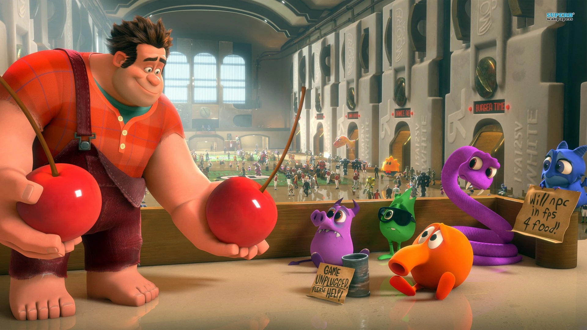](images/wreck_it_ralph.webp)
*Extrait du film d’animation de Disney : Wreck-it Ralph. Il utilise le modèle PBR de Brent Burley.*

Il faut plutôt voir le PBR comme un standard de communication entre artistes et programmeurs graphiques. Avant lui, l’humanité savait déjà faire de très bons matériaux, mais ils étaient souvent instables. Ils pouvaient se comporter différemment selon le moteur, voire même parfois selon la scène. Dans ces conditions, difficile de réutiliser les ressources d’un projet à l’autre. Pire : les artistes devaient se réadapter à chaque changement de technologie.

Les formules mathématiques ont beau être un peu plus sophistiquées, je suis convaincu que la qualité perçue du PBR vient moins d’une supériorité technique que de son côté pratique.
Car quand les artistes n’ont plus à retoucher sans cesse leurs matériaux pour compenser les bizarreries d’implémentation et les spécificités de chaque scène, ils ont plus de temps pour leur vrai métier : « faire des trucs cools ».

---

## III. Génération des textures

Pour l’ORM, on ne va pas pouvoir s’en sortir avec les passes *Cycles* standard et les *screen textures* prédéfinies de Godot, comme on l’a fait jusqu’ici. Cette fois, on va être obligés d'intervenir directement sur les matériaux, des deux côtés.

C’est problématique, car cela signifie que l’utilisateur ne pourra pas utiliser ses ressources telles quelles. Si les matériaux sont fait maison et peu nombreux, ce n’est pas bien grave car la modification est assez simple. En revanche, s’il utilise des bibliothèques existantes, ça peut vite devenir l'enfer.

Il faudra bien sûr travailler sur ce point si on veut qu’OpenRE soit réellement adoptable. Mais c’est une question d’ergonomie et d’industrialisation, pas de faisabilité. C’est donc un combat pour plus tard (qui se gagnera sûrement à coups de scripts de migration livrés avec le SDK).

---

### 1. ORM déterministe

Côté Blender, on peut créer des passes personnalisées appelées `AOV`, pour *Arbitrary Output Variable*.
Pour en ajouter une, il suffit d’ouvrir la section `Shader AOV` (sous les passes de rendu) et de cliquer sur le petit `+`.
On nomme ensuite l’entrée `aov_orm` et un pin du même nom apparaît alors dans le nœud `Render Layers`.

À partir de là, on peut traiter ce pin de sortie comme une passe classique et dérouler notre *process* habituel :

* Créer un pin `orm` dans le nœud `File Output`.
* Relier le pin `aov_orm` de `Render Layers` au pin `orm` fraîchement créé.

[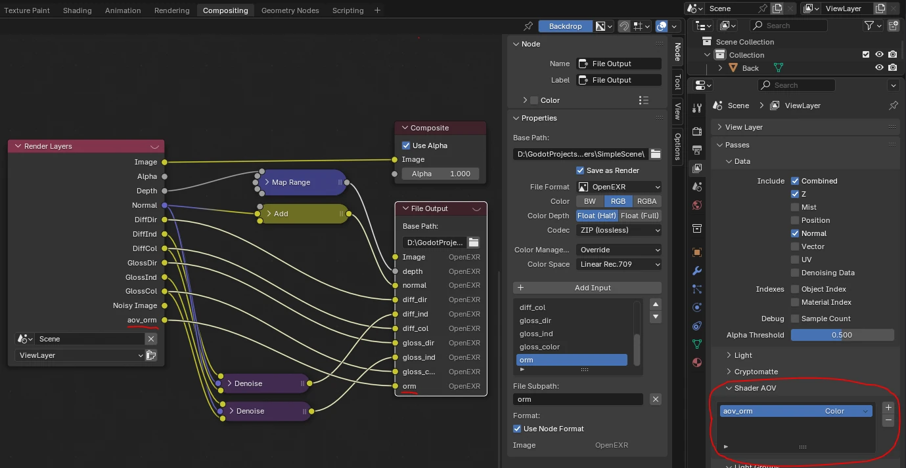](images/aov_orm_compositor_annot.opti.webp)

Ensuite, il faut définir la sortie de cette nouvelle passe. Pour cela, on édite un à un les matériaux des différents *meshes* de la scène dans le `Workspace Shading`.
Pour chacuns d'eux :

* On renseigne les valeurs des champs `Metallic` et `Roughness` du `Principled BRDF` (différentes histoire d’avoir un peu de variété pour les tests).
* On ajoute un nœud `AOV Output` nommé `aov_orm`, avec une couleur reprenant exactement ce qu'on vient de mettre dans le `Principled BRDF` (au format ORM, donc `Metallic` dans le canal *Blue*, et `Roughness` dans le canal *Green*).

Par exemple, pour le matériau de `Ceil`, ça donne ça :

[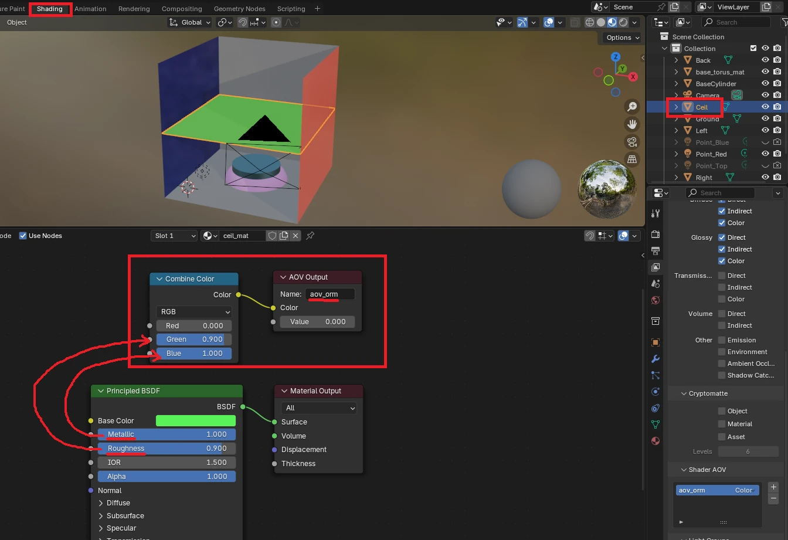](images/aov_orm_ceil_mat_anot.opti.webp)

Petit récapitulatif des valeurs choisies. Rien de bien spécifique : j’ai pris soin d’utiliser 0.00 ou 1.00 pour la plupart des `Metallic`, car en théorie un matériau est soit métallique, soit diélectrique.
Mais on peut aussi tricher avec des valeurs intermédiaires pour simuler des effets comme la poussière ou la saleté.

<style>
table th:first-of-type {
    width: 40%;
}
table th:nth-of-type(2) {
    width: 30%;
}
table th:nth-of-type(3) {
    width: 30%;
}
th, td {
  border: 3px solid grey !important;
}
</style>

|                                    | Metallic | Roughness |
| ---------------------------------- | :------: | :-------: |
| Ceil                               |   1.00   |    0.90   |
| Ground                             |   0.00   |    0.90   |
| Left                               |   0.90   |    0.05   |
| Right                              |   0.00   |    0.10   |
| Back                               |   0.00   |    0.50   |
| BaseTorus (Purple part of podium)  |   0.00   |    0.80   |
| BaseCylinder (Blue part of podium) |   1.00   |    0.50   |

On a donc de quoi remplir les canaux `Green` et `Blue` de notre texture ORM.
Reste le canal `Red`, destiné à accueillir l’*Ambient Occlusion*.
Cette donnée ne vient pas du matériau mais d’une passe *Cycles* officielle qu’il faut activer et combiner à notre AOV, comme ceci :

[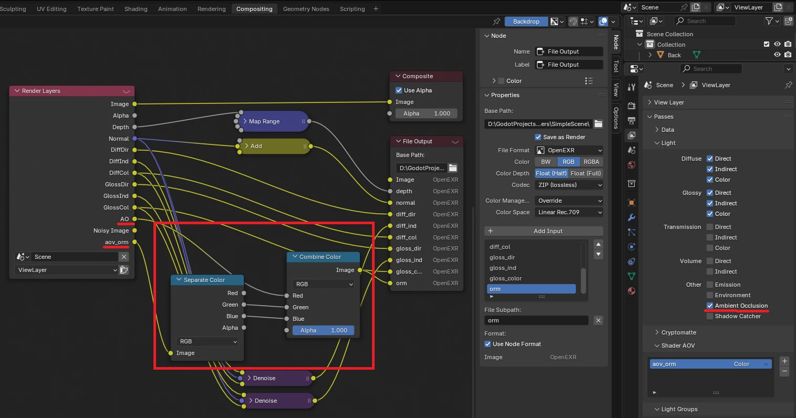](images/combine_ao_aov.opti.webp)

Et voilà !
On n’a plus qu’à appuyer sur **F12** pour lancer le rendu et obtenir une magnifique texture d’ORM déterministe :

[](images/0_orm_det.opti.webp)

---

### 2. ORM interactive

Pour l’ORM interactive, l’idée est de se servir des `camera layers` pour piloter ce qu’on envoie dans l’albedo.
Ainsi, la plupart des `layers` afficheront le matériau normal, mais si une *layer* spécifique (par exemple la 5) est active, l’ORM remplacera l’albedo dans le rendu final.

De cette manière, on peut resortir le bricollage qu'on avait utilisé pour le `Sub_Viewport` de l’albedo :

* `hint_screen_texture` affichée sur le quad
* `Debug Draw = Unshaded` sur le `ORM_SubViewport`

Sous ce `ORM_SubViewport`, la caméra et le quad seront donc sur la *layer* 5.

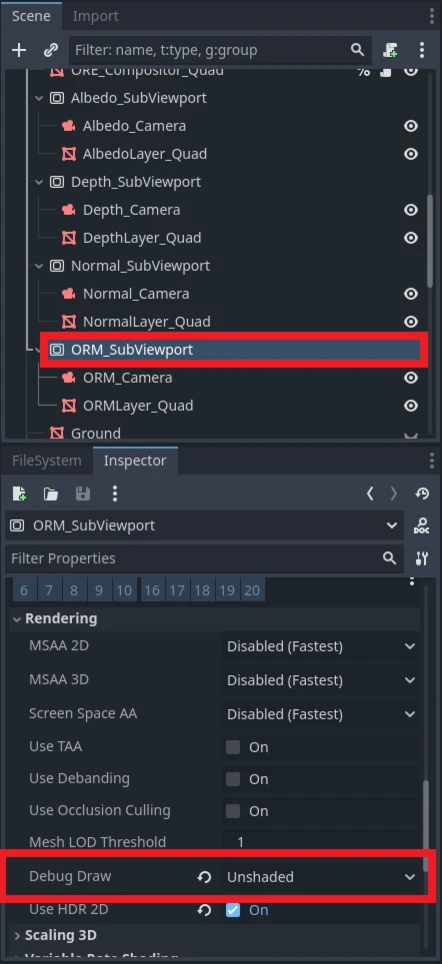

Il faut ensuite créer un matériau personnalisé que l'on va devoir assigner à tous les meshes de la scène.
J’ai choisi d’utiliser un `Visual Shader` plutôt qu’un shader classique, au cas où je n’arriverais pas à une solution de migration totalement automatique. Autant rester accessible à un maximum de profils — et je sais que le GLSL peut rebuter pas mal de monde.

Pour l’instant, on se limitera à des `Vector3Parameter` pour définir :

* Albedo
* ORM
* Normales

Pour la scène actuelle, cela suffit : nos matériaux sont uniformes.
Mais on devra rapidement supporter des textures pour composer des scènes plus intéressantes.
On enrichira le shader en temps voulu. Pour l’instant, il ressemble à ça :

[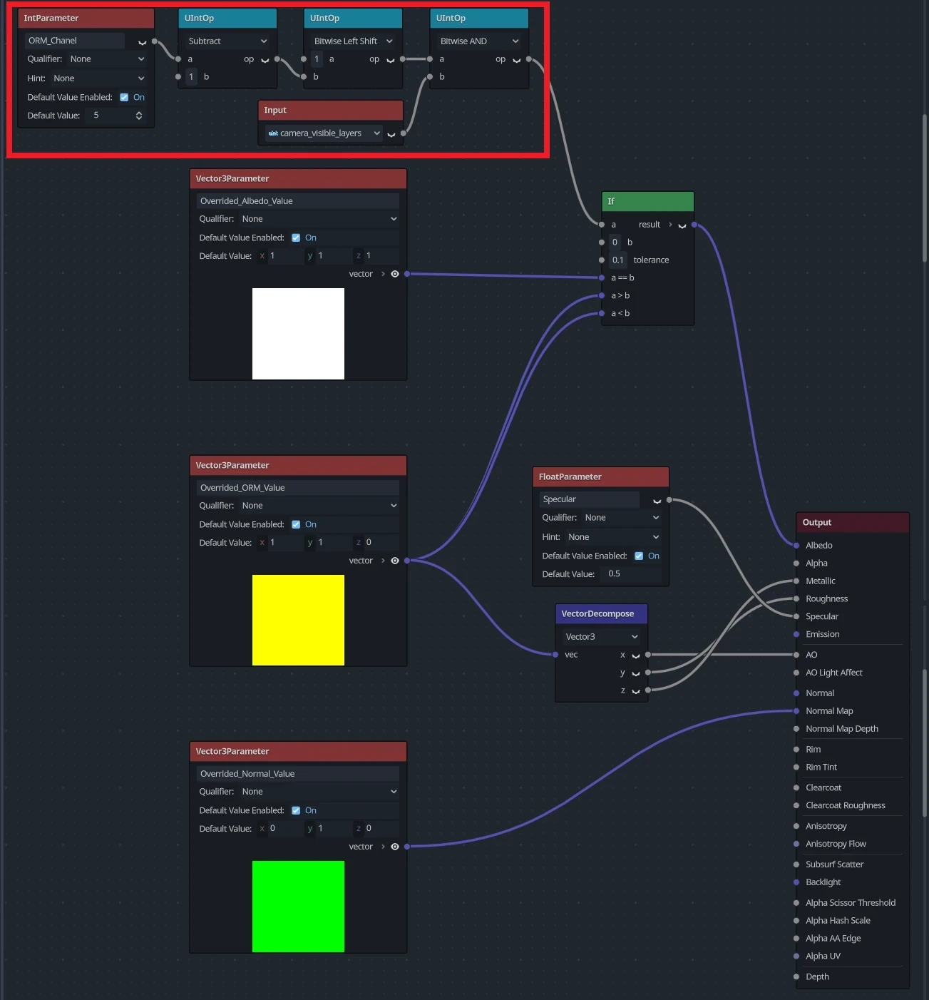](images/very_simple_orm_anot.opti.webp)

Toute la logique se trouve dans la partie encadrée en rouge : godot nous expose nativement le parametre `camera visible layers`. Quelques `bitwise operations` nous permettent de déterminer si le *layer* 5 de la caméra courante est activée. On utilise ensuite cette information pour basculer entre l’albedo et l’ORM.

Si on a bien renseigné les même valeurs d'albédo et d'ORM que dans blender, on est prêt à adapter l'Oracle pour qu'il penne en compte nos maps d’ORM et commencer les réglages.

---

## IV. Réglages

Grâce au turbo widget d'affichage/masquage de code, je peux maintenant cesser d’éluder les modifications de l’oracle. Alors les voici !


```glsl {#code-compact hl_lines=[5,8,11,12,13,14,18,19]}
...

// Data to check
...
#define ORM_TYPE 3

// Determinist & Interactive G-Buffer
const int NB_GMAPS = 4;
...

vec3 compute_orm_difference(vec3 d_frag, vec3 i_frag) {
	float dist = distance(d_frag, i_frag);
	return vec3(dist, dist, dist);
}

vec3 compute_difference(vec3 d_frag, vec3 i_frag) {
	...
	else if (data_type == ORM_TYPE)
		return compute_orm_difference(d_frag, i_frag);
	...
}

...
```

```glsl {#code-full .hidden hl_lines=[14,18,52,53,54,55,64,65]}
shader_type spatial;
render_mode unshaded, fog_disabled;

void vertex() {
	POSITION = vec4(VERTEX.xy, 1.0, 1.0);
}

const vec3 ERROR_COLOR = vec3(1.0, 0.0, 1.0);

// Data to check
#define ALBEDO_TYPE 0
#define DEPTH_TYPE 1
#define NORMAL_TYPE 2
#define ORM_TYPE 3
uniform int data_type = -1;

// Determinist & Interactive G-Buffer
const int NB_GMAPS = 4;
uniform sampler2D[NB_GMAPS] d_gbuffer : filter_nearest;
uniform sampler2D[NB_GMAPS] i_gbuffer : filter_nearest;

// Choix du mode d'affichage
#define I_D_DIFFERENCE 0
#define D_TEXTURE_ONLY 1
#define I_TEXTURE_ONLY 2
uniform int visualisation_mode = 0;

// Permutation des normales
#include "debug.gdshaderinc"
#include "pre_process_utils.gdshaderinc"
uniform int permut_idx = 0;

vec3 compute_albedo_difference(vec3 d_frag, vec3 i_frag) {
	float dist = distance(d_frag, i_frag);
	return vec3(dist, dist, dist);
}

vec3 compute_depth_difference(vec3 d_frag, vec3 i_frag) {
	float dist = distance(d_frag.r, i_frag.r);
	return vec3(dist, dist, dist);
}

vec3 compute_normal_difference(vec3 d_frag, vec3 i_frag) {
	d_frag = d_frag * 2.0 - 1.0;	// Unpack
	i_frag = i_frag * 2.0 - 1.0;	// Unpack
	d_frag = normalize(d_frag);
	i_frag = normalize(i_frag);
	float angle = acos(dot(d_frag, i_frag)) / PI;
	return vec3(angle, angle, angle);
}

vec3 compute_orm_difference(vec3 d_frag, vec3 i_frag) {
	float dist = distance(d_frag, i_frag);
	return vec3(dist, dist, dist);
}

vec3 compute_difference(vec3 d_frag, vec3 i_frag) {
	if (data_type == ALBEDO_TYPE)
		return compute_albedo_difference(d_frag, i_frag);
	else if (data_type == DEPTH_TYPE)
		return compute_depth_difference(d_frag, i_frag);
	else if (data_type == NORMAL_TYPE)
		return compute_normal_difference(d_frag, i_frag);
	else if (data_type == ORM_TYPE)
		return compute_orm_difference(d_frag, i_frag);
	return ERROR_COLOR;
}

const float n = 0.1;
const float f = 5.0;

void fragment() {
	vec3 out_color = ERROR_COLOR;

	if (data_type >= 0 && data_type < NB_GMAPS
		&& visualisation_mode >= 0 && visualisation_mode < 3) {
		// Récupération des pixels déterministe et interactif
		vec3 d_frag = texture(d_gbuffer[data_type], SCREEN_UV).rgb;
		vec3 i_frag = texture(i_gbuffer[data_type], SCREEN_UV).rgb;

		// Preprocess data
		switch (data_type) {
			case DEPTH_TYPE:
				d_frag = pre_process_d_depth(d_frag, n, f);
				i_frag = pre_process_i_depth(i_frag);
				break;
			case NORMAL_TYPE:
				d_frag = pre_process_d_normal(d_frag);
				d_frag = (d_frag + 1.0) / 2.0;	// Pack for visualization
				i_frag = pre_process_i_normal(i_frag, INV_VIEW_MATRIX);
				i_frag = (i_frag + 1.0) / 2.0; // Pack for visualization
				break;
		}

		// Selection de l'affichage
		switch (visualisation_mode) {
			case D_TEXTURE_ONLY:
				out_color = d_frag;
				break;
			case I_TEXTURE_ONLY:
				out_color = i_frag;
				break;
			case I_D_DIFFERENCE:
				out_color = compute_difference(d_frag, i_frag);
				break;
		}
	}

	ALBEDO = out_color;
}
```


En somme, on agrandit les tableaux de samplers pour accueillir le nouveau `ORM_TYPE`, puis on ajoute une fonction de calcul de différence. De là, on n’oublie pas d’assigner nos textures d'ORM à l'Oracle et on appuie sur `Play` pour obtenir notre première prophétie (ça faisait longtemps, tiens…).

[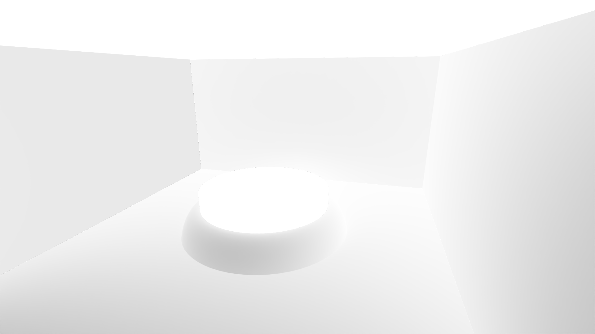](images/0_orm_diff.opti.webp)

À première vue, il y a du boulot… mais en fait, pas tant que ça.

### 1. Interférences de la *Metallic*

Quand on regarde l’ORM interactive, on remarque que le plafond et le cylindre qui fait office de podium sont complètement noirs. Ça n’a pas l’air normal, et si on se réfère au tableau de valeurs de la partie précédente, on voit vite un pattern. Les *meshes* avec une `metallic` à 1.00 sont tous noirs... (comme de par hasard).

[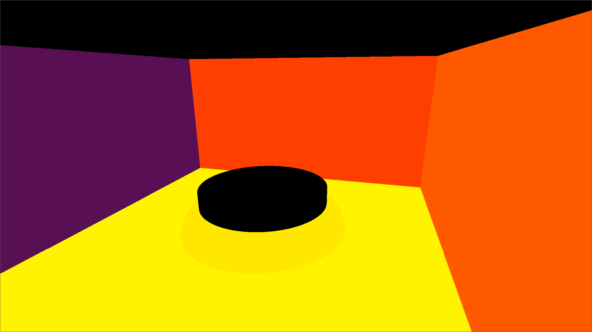](images/0_orm_int.opti.webp)

J’ai d’abord été un peu surpris, puis je me suis rappelé de notre bricolage à base de `hint_screen_texture` et de `Debug Draw = Unshaded`. Ce n’est pas vraiment l’albedo qu’on affiche, mais le rendu final privé de lumière. Et sans lumière à réfléchir, les métaux apparaissent noirs.

Le *workaround* est simple : on va juste débrancher la `metallic` de notre matériau custom. On n’en a pas besoin pour le rendu étant donné qu’on a rusé pour que l’info passe par l’albedo.

[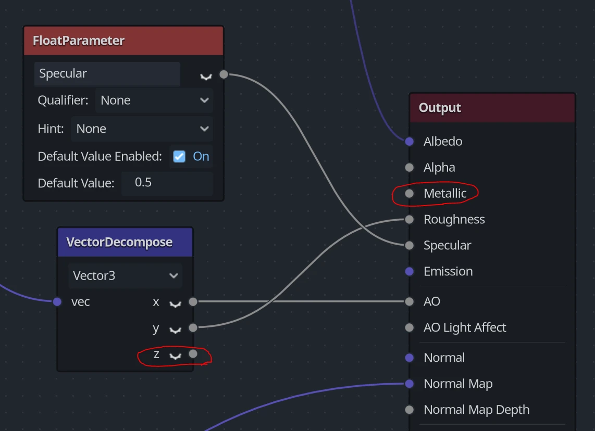](images/metallic_cut.opti.webp)

Évidemment, ça va dégrader le rendu dans l’éditeur, ce qui n’est pas optimal. Mais là, on est sur du confort d’utilisation. C’est donc un deuxième combat pour plus tard.

Après ce changement, si on re-jette un œil à l’ORM interactive, les matériaux métalliques ne sont plus noirs.

[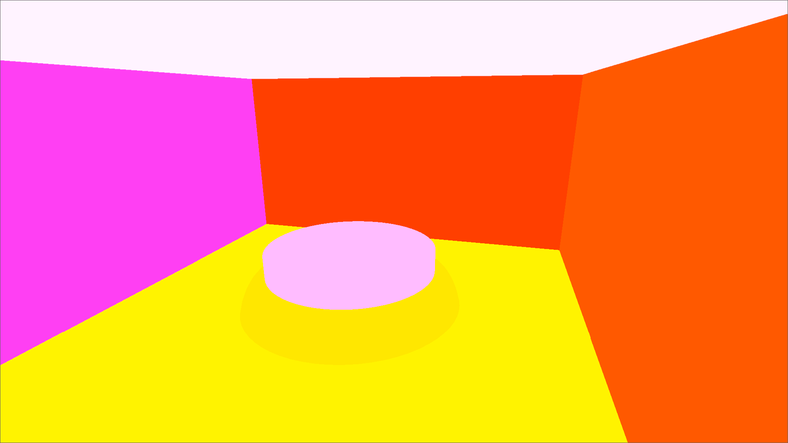](images/1_orm_int.opti.webp)

### 2. Le cas de l’Ambient Occlusion

Un petit présage plus tard, on constate bien une légère amélioration sur les zones concernées. Mais c’est quand même plutôt mauvais.

[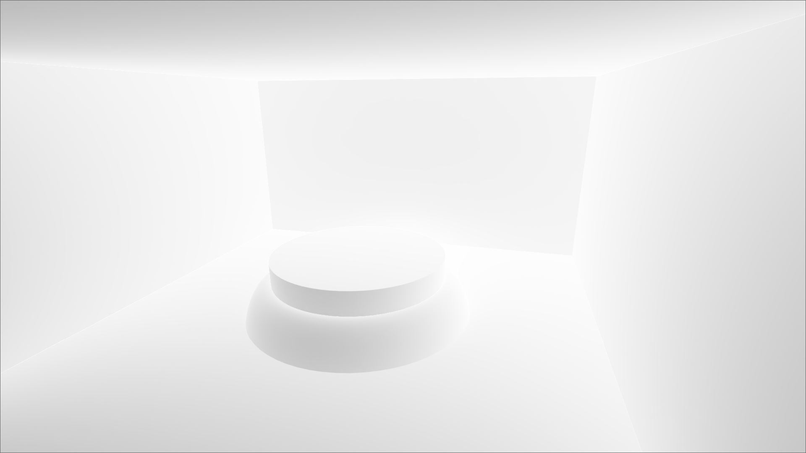](images/1_orm_diff.opti.webp)

Les différences ont l’air de se concentrer dans les angles et les zones confinées. Et quand on y réfléchit, c’est tout à fait normal étant donné qu’on n’a pas du tout géré l’ambient occlusion côté Godot :sweat_smile:.

En fait, l’ambient occlusion dans les materiaux PBR est assez secondaire. Ce n'est pas un attribut qui définit la matière elle-même. C’est un phénomène lié à la géométrie des objets, que l’on peut obtenir de différentes manières. *Baker* le « degré d’ouverture » en chaque point de la surface du mesh dans le `Red` de l'ORM n'en est qu'une parmis d'autres.

[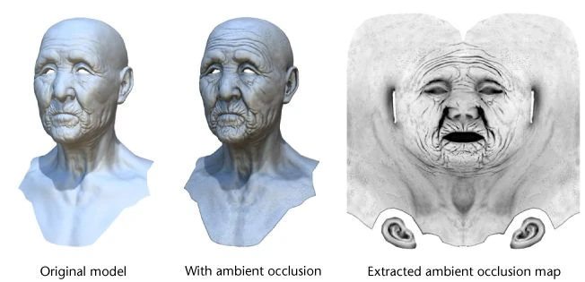](images/baked_ao.opti.webp)

Mais côté Blender, l'AO est calculé non pas localement pour chaque objets, mais de manière globale sur toute la scène. On aura donc fatalement des différences car la version locale bakée dans le materiau ne pourra jamais capturer l'occlusion induite par la proximité d'un autre objet de la scène. On va donc simplement dire à l'Oracle d'ignorer l'AO.


```glsl {#code-compact hl_lines=[11,12]}
...
void fragment() {
	...
	if (data_type >= 0 && data_type < NB_GMAPS
		&& visualisation_mode >= 0 && visualisation_mode < 3) {
		...
		// Preprocess data
		switch (data_type) {
			...
			case ORM_TYPE:
				d_frag = vec3(1.0, d_frag.yz);
				i_frag = vec3(1.0, i_frag.yz);
				break;
		}
		...
	}
	...
}
...
```

```glsl {#code-full .hidden hl_lines=[94,95]}
shader_type spatial;
render_mode unshaded, fog_disabled;

void vertex() {
	POSITION = vec4(VERTEX.xy, 1.0, 1.0);
}

const vec3 ERROR_COLOR = vec3(1.0, 0.0, 1.0);

// Data to check
#define ALBEDO_TYPE 0
#define DEPTH_TYPE 1
#define NORMAL_TYPE 2
#define ORM_TYPE 3
uniform int data_type = -1;

// Determinist & Interactive G-Buffer
const int NB_GMAPS = 4;
uniform sampler2D[NB_GMAPS] d_gbuffer : filter_nearest;
uniform sampler2D[NB_GMAPS] i_gbuffer : filter_nearest;

// Choix du mode d'affichage
#define I_D_DIFFERENCE 0
#define D_TEXTURE_ONLY 1
#define I_TEXTURE_ONLY 2
uniform int visualisation_mode = 0;

// Permutation des normales
#include "debug.gdshaderinc"
#include "pre_process_utils.gdshaderinc"
uniform int permut_idx = 0;

vec3 compute_albedo_difference(vec3 d_frag, vec3 i_frag) {
	float dist = distance(d_frag, i_frag);
	return vec3(dist, dist, dist);
}

vec3 compute_depth_difference(vec3 d_frag, vec3 i_frag) {
	float dist = distance(d_frag.r, i_frag.r);
	return vec3(dist, dist, dist);
}

vec3 compute_normal_difference(vec3 d_frag, vec3 i_frag) {
	d_frag = d_frag * 2.0 - 1.0;	// Unpack
	i_frag = i_frag * 2.0 - 1.0;	// Unpack
	d_frag = normalize(d_frag);
	i_frag = normalize(i_frag);
	float angle = acos(dot(d_frag, i_frag)) / PI;
	return vec3(angle, angle, angle);
}

vec3 compute_orm_difference(vec3 d_frag, vec3 i_frag) {
	float dist = distance(d_frag, i_frag);
	return vec3(dist, dist, dist);
}

vec3 compute_difference(vec3 d_frag, vec3 i_frag) {
	if (data_type == ALBEDO_TYPE)
		return compute_albedo_difference(d_frag, i_frag);
	else if (data_type == DEPTH_TYPE)
		return compute_depth_difference(d_frag, i_frag);
	else if (data_type == NORMAL_TYPE)
		return compute_normal_difference(d_frag, i_frag);
	else if (data_type == ORM_TYPE)
		return compute_orm_difference(d_frag, i_frag);
	return ERROR_COLOR;
}

const float n = 0.1;
const float f = 5.0;

void fragment() {
	vec3 out_color = ERROR_COLOR;

	if (data_type >= 0 && data_type < NB_GMAPS
		&& visualisation_mode >= 0 && visualisation_mode < 3) {
		// Récupération des pixels déterministe et interactif
		vec3 d_frag = texture(d_gbuffer[data_type], SCREEN_UV).rgb;
		vec3 i_frag = texture(i_gbuffer[data_type], SCREEN_UV).rgb;

		// Preprocess data
		switch (data_type) {
			case DEPTH_TYPE:
				d_frag = pre_process_d_depth(d_frag, n, f);
				i_frag = pre_process_i_depth(i_frag);
				break;
			case NORMAL_TYPE:
				d_frag = pre_process_d_normal(d_frag);
				d_frag = (d_frag + 1.0) / 2.0;	// Pack for visualization
				i_frag = pre_process_i_normal(i_frag, INV_VIEW_MATRIX);
				i_frag = (i_frag + 1.0) / 2.0; // Pack for visualization
				break;
			case ORM_TYPE:
				d_frag = vec3(1.0, d_frag.yz);
				i_frag = vec3(1.0, i_frag.yz);
				break;
		}

		// Selection de l'affichage
		switch (visualisation_mode) {
			case D_TEXTURE_ONLY:
				out_color = d_frag;
				break;
			case I_TEXTURE_ONLY:
				out_color = i_frag;
				break;
			case I_D_DIFFERENCE:
				out_color = compute_difference(d_frag, i_frag);
				break;
		}
	}

	ALBEDO = out_color;
}
```


Si ça devient un problème, on fournira à l'utilisateur des options permettant d'appliquer des multiplicateurs à l'AO déterministe et interactif dans les paramètres d'OpenRE. Mais pour l'heure on a bien travaillé, l'Oracle est contant (je vous avais dit que c'était pas si pire :wink:).

[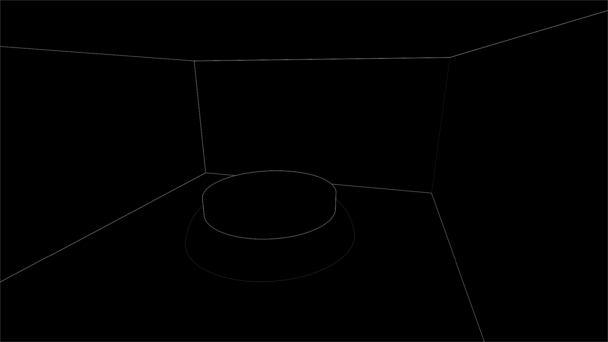](images/2_orm_diff.opti.webp)

## V. Rendu final

Ce qui nous laisse avec ce magnifique rendu :



<video width="100%" controls muted loop playsinline autoplay>
    <source src="videos/light_broken_loop.mp4" type="video/mp4">
    Your browser does not support the video tag.  
</video>



On peut voir de superbes reflets dans les surfaces lisses et… une petite minute, mais c’est cassé, chef !

## VI. Interférences de la *Metallic* (la vengeance !)

En effet, le plafond et le podium semblent ne pas recevoir la lumière (toujours les mêmes…). Si on demande à l’Oracle de comparer les maps d’albedo, on constate bien qu’il y a un problème au niveau des zones non éclairables.

[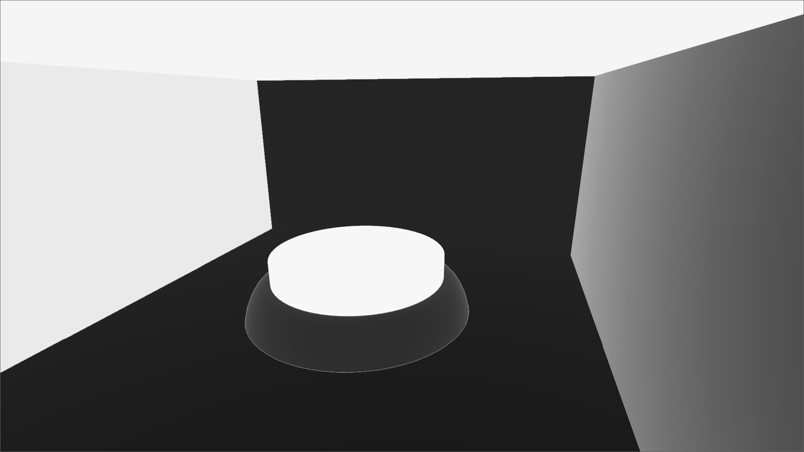](images/3_albedo_diff.opti.webp)

Pour comprendre ce qu’il se passe, il n’y a qu’à regarder les textures pour s’apercevoir que l’albedo déterministe est lui aussi devenu noir sur les surfaces métalliques. Si on regarde un peu plus attentivement, on constate également que plus la roughness est basse, plus la surface est sombre.

[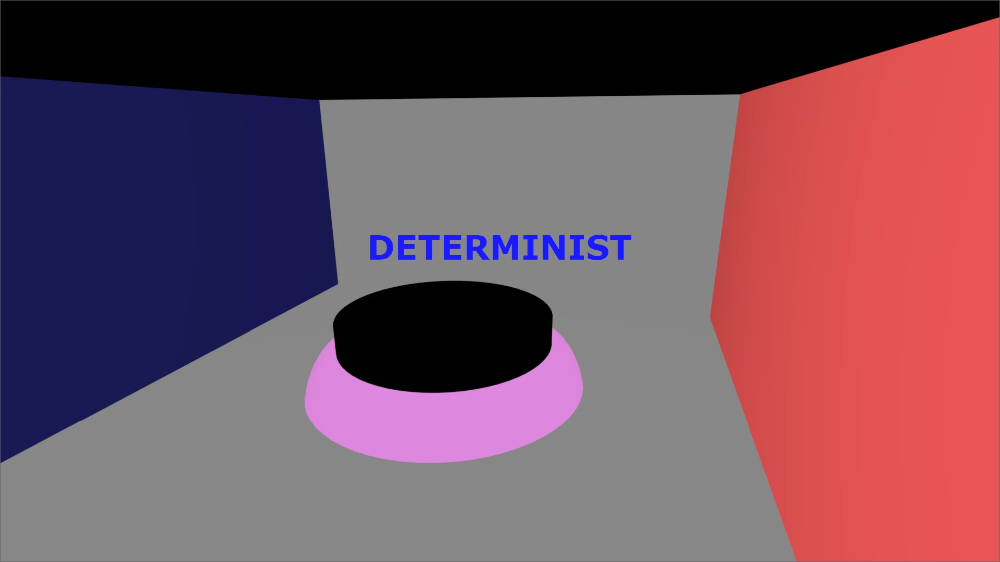](images/black_albedo_int_gif.webp)

Pourtant, côté Blender, on n’a pas fait de bricolage bizarre : on récupère bien la passe officielle `Diffuse Color`. Alors, que se passe-t-il ?

Il se passe que jusqu’ici, j’ai un peu menti en disant que l’albedo et la diffuse color, c’était la même chose. Pour m’expliquer sur ce mensonge, je dois faire une petite digression.

### 1. *metallic/roughness* VS *specular/glossiness*

Les modèles PBR se déclinent en deux grandes familles :

* le *specular/glossiness workflow* (branche historique décrite dans le papier de Disney)
* le *metallic/roughness workflow*

Sans entrer dans les détails, le workflow *metallic/roughness* est une simplification du workflow *specular/glossiness*. Il est un peu plus éloigné de la réalité physique, mais bien plus efficace à utiliser et à stocker en mémoire. C’est certainement pour cette raison qu’il s’est rapidement imposé comme le standard dans le rendu temps réel.

[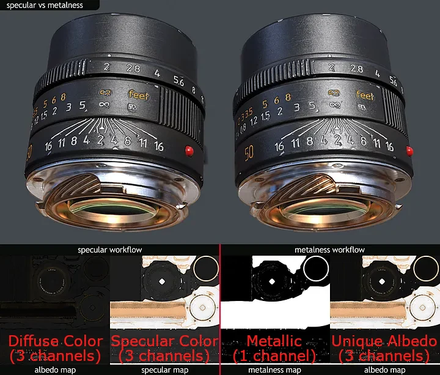](images/nominal_comp.opti.webp)
*Comparaison des deux workflows dans le cas général. L’image originale est issue de [cet article](https://marmoset.co/posts/physically-based-rendering-and-you-can-too/).*

Comme vous pouvez le voir, le résultat est indiscernable pour la plupart des matériaux. Mais le *metallic/roughness* ne gère pas nativement certains phénomènes (comme l'iridescence me semble-t-il) et il est sujet à l’apparition de petits artefacts dans les zones de transition entre matériaux métalliques et diélectriques.

[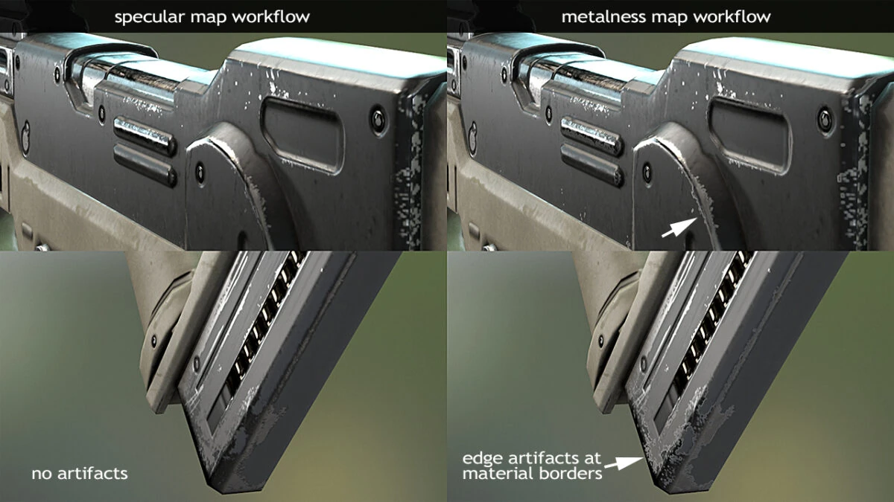](images/metalic_flows.opti.webp)
*Mise en évidence d’artefacts visuels sur les transitions métal/diélectrique. L’image originale est issue de [cet article](https://marmoset.co/posts/pbr-texture-conversion/).*

### 2. Pourquoi c'est cassé ?

Évidemment, Cycles, qui n’est pas conçu pour le temps réel, utilise la version la plus lourde et la plus fidèle : le workflow *specular/glossiness*. Et dans ce workflow, l'albedo est divisé en 2 map distinctes que Blender appel :
- la `diffuse color` : albedo de la lumière diffuse
- la `glossy color` : albedo de la lumière spéculaire

Pour respecter le principe de "conservation de l'énergie" (fondamental en PBR), la `diffuse color` et la `glossy color` sont en quelque sortes liées entre elles. C'est très mal dit, mais en gros : "pour colorier l'une, on doit prendre de la couleur à l'autre". C'est assez visible si on compare les textures :

[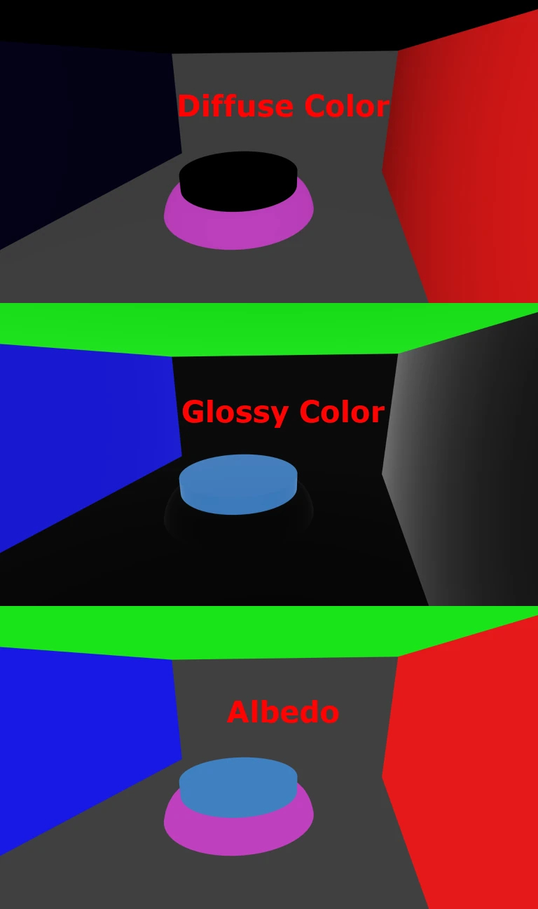](images/diff_gloss_albedo.opti.webp)

Pour revenir sur mon mensonge, la diffuse color, c'est bien l'albedo. Mais seulement dans le cas très spécifiques (et irréalistes) d'un materiaux non-métalique et totalement mat (`roughness` au max). Ce qui était le cas jusqu'ici car c'est le réglage par défaut des materiaux dans Blender.

Mais maintenant qu'on introduit un peu de variété dans les valeurs, et ben ça marche plus...

### 3. Comment on corrige ?

Tant qu’à faire, on aimerait bien garder la précision du *specular/glossiness* lorsque c’est possible. D'autant plus qu'elle est gratuite puisque pré-calculée. Mais on a quand même besoin de l'albédo unique du *metallic/roughness* pour pouvoir calculer la lumière en temps réel. 

On va donc garder les passes Cycles officielles telles quelles, et ajouter une seconde passe custom `aov_albedo` qui nous renverra la couleur des objets.

[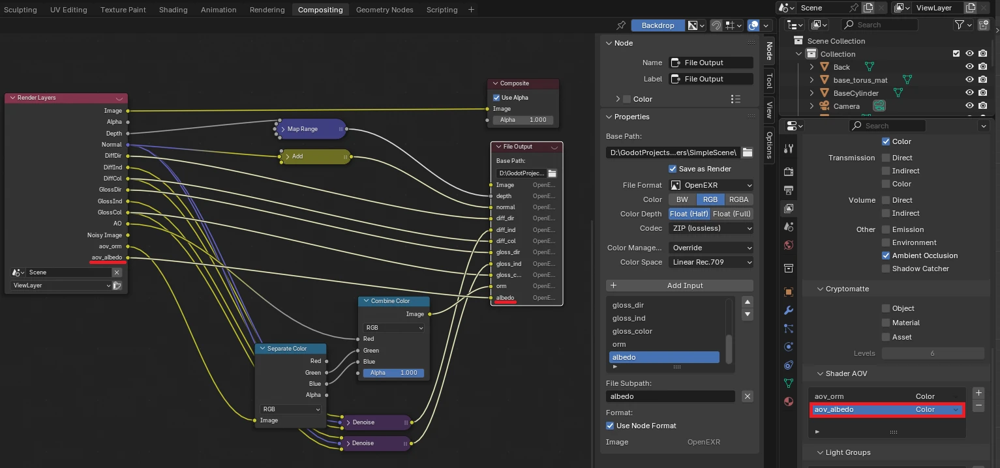](images/aov_albedo_anot.opti.webp)

Évidemment, cela va nécessiter quelques ajustements :

* se rebraquer les shaders de chaque mesh pour ajouter le `AOV output` de l’albedo
* remplacer la texture de diffuse color par le nouvel albedo dans les shaders de l’Oracle et du compositor
* adapter le code du compositor pour prendre en compte cette différenciation entre diffuse color et albédo unique


```glsl {#code-compact hl_lines=[6,14,23]}
...

// DETERMINIST G-BUFFER
uniform sampler2D d_depth_map : filter_nearest;
uniform sampler2D d_normal_map : filter_nearest;
uniform sampler2D d_albedo_map : filter_nearest;
uniform sampler2D d_diffuse_color_map : filter_nearest;
...

void fragment() {
	...
	vec3 d_depth_frag = texture(d_depth_map, SCREEN_UV).rgb;
	d_depth_frag = pre_process_d_depth(d_depth_frag, eye_near, eye_far);
	vec3 d_albedo_frag = texture(d_albedo_map, SCREEN_UV).rgb;
	vec3 d_diffuse_color_frag = texture(d_diffuse_color_map, SCREEN_UV).rgb;
	...

	if(is_frag_interactive) {
		...
	}
	else {
		depth_frag = d_depth_frag.r;
		albedo_frag = d_albedo_frag;
		...
	}

	...
}
```

```glsl {#code-full .hidden hl_lines=[28,45,68]}
shader_type spatial;
render_mode unshaded, fog_disabled;

void vertex() {
	POSITION = vec4(VERTEX.xy, 1.0, 1.0);
}

#include "pre_process_utils.gdshaderinc"

uniform vec3 eye_position;
uniform float eye_near;
uniform float eye_far;

uniform int nb_plights;
uniform vec3 plight_position[8];
uniform vec3 plight_color[8];
uniform float plight_intensity[8];
uniform bool plight_isInteractive[8];

// INTERACTIVE G-BUFFER
uniform sampler2D i_depth_map : filter_nearest;
uniform sampler2D i_normal_map : filter_nearest;
uniform sampler2D i_albedo_map : filter_nearest;

// DETERMINIST G-BUFFER
uniform sampler2D d_depth_map : filter_nearest;
uniform sampler2D d_normal_map : filter_nearest;
uniform sampler2D d_albedo_map : filter_nearest;
uniform sampler2D d_diffuse_color_map : filter_nearest;
uniform sampler2D d_diffuse_direct_map : filter_nearest;
uniform sampler2D d_diffuse_indirect_map : filter_nearest;
uniform sampler2D d_glossy_color_map : filter_nearest;
uniform sampler2D d_glossy_direct_map : filter_nearest;
uniform sampler2D d_glossy_indirect_map : filter_nearest;

void fragment() {
	vec3 i_depth_frag = texture(i_depth_map, SCREEN_UV).rgb;
	i_depth_frag = pre_process_i_depth(i_depth_frag);
	vec3 i_albedo_frag = texture(i_albedo_map, SCREEN_UV).rgb;
	vec3 i_normal_frag = texture(i_normal_map, SCREEN_UV).rgb;
	i_normal_frag = pre_process_i_normal(i_normal_frag, INV_VIEW_MATRIX);

	vec3 d_depth_frag = texture(d_depth_map, SCREEN_UV).rgb;
	d_depth_frag = pre_process_d_depth(d_depth_frag, eye_near, eye_far);
	vec3 d_albedo_frag = texture(d_albedo_map, SCREEN_UV).rgb;
	vec3 d_diffuse_color_frag = texture(d_diffuse_color_map, SCREEN_UV).rgb;
	vec3 d_normal_frag = texture(d_normal_map, SCREEN_UV).rgb;
	d_normal_frag = pre_process_d_normal(d_normal_frag);
	vec3 d_diffuse_direct_frag = texture(d_diffuse_direct_map, SCREEN_UV).rgb;
	vec3 d_diffuse_indirect_frag = texture(d_diffuse_indirect_map, SCREEN_UV).rgb;
	vec3 d_glossy_color_frag = texture(d_glossy_color_map, SCREEN_UV).rgb;
	vec3 d_glossy_direct_frag = texture(d_glossy_direct_map, SCREEN_UV).rgb;
	vec3 d_glossy_indirect_frag = texture(d_glossy_indirect_map, SCREEN_UV).rgb;

	vec3 diffuse_contribution = vec3(0.0);
	vec3 specular_contribution = vec3(0.0);
	bool is_frag_interactive = d_depth_frag.r < i_depth_frag.r;

	float depth_frag;
	vec3 albedo_frag, normal_frag;
	if(is_frag_interactive) {
		depth_frag = i_depth_frag.r;
		albedo_frag = i_albedo_frag;
		normal_frag = i_normal_frag;
	}
	else {
		depth_frag = d_depth_frag.r;
		albedo_frag = d_albedo_frag;
		normal_frag = d_normal_frag;
		diffuse_contribution += d_diffuse_color_frag * (d_diffuse_direct_frag + d_diffuse_indirect_frag);
		specular_contribution += d_glossy_color_frag * (d_glossy_direct_frag + d_glossy_indirect_frag);
	}

	// Get world fragment position from depth
	vec3 ndc = vec3((SCREEN_UV * 2.0) - 1.0, depth_frag);
	vec4 world = INV_VIEW_MATRIX * INV_PROJECTION_MATRIX * vec4(ndc, 1.0);
	world.xyz /= world.w;
	vec3 frag_position = world.xyz;

	for(int i = 0; i < nb_plights; i++) {
		if(!is_frag_interactive && !plight_isInteractive[i])
			continue;

		vec3 light_vec = plight_position[i] - frag_position;
		float d2 = length(light_vec);
		d2 = pow(d2, 2.0);
		float attenuation = 1.0 / d2;

		vec3 L = normalize(light_vec);
		vec3 C = plight_color[i];
		float I = plight_intensity[i];
		float NdotL = max(dot(normal_frag, L), 0.0);
		diffuse_contribution += C * I * albedo_frag * attenuation * NdotL;
		//specular_contribution += NOT IMPLEMENTED YET
	}

	ALBEDO = diffuse_contribution + specular_contribution;
}

```


Mais une fois qu'on a fait tout ça, notre scène se comporte à nouveau normalement vis à vis de la lumière. Et en prime, on a désormais de superbes reflets (dans lesquels on ne voit pas la géométrie interactive... oui je sais... mais c'est déjà pas mal non ? ^^)



<video width="100%" controls muted loop playsinline autoplay>
    <source src="videos/light_fixed_loop.mp4" type="video/mp4">
    Your browser does not support the video tag.  
</video>



---

## VII. Conclusion

Merci à ceux qui suivent ce devlog ! J’espère que ce n’était pas trop confus. En tout cas, j’ai eu du mal à l’écrire, celui-là. Le PBR est peut-être un sujet plus vaste que ce que je m’étais imaginé avant d’avoir à l’expliquer :sweat_smile:. Trouver la juste dose entre donner des clés de compréhension et éviter de basculer dans un article dédié m’a posé quelques difficultés.

D’ailleurs, je pense que ça pourrait faire un bon article de vulgarisation, un jour. Ça me permettra peut-être de combler certaines lacunes que je me suis découvertes en écrivant celui-ci, héhé. Parce que oui, c’est un aspect du blogging que je ne soupçonnais pas : on apprend énormément en essayant d’expliquer des choses qu’on pense connaître.

Ceci étant dit, nous avons maintenant accès à des maps d’ORM bien harmonisées. Ça veut dire qu’on va pouvoir implémenter du PBR ! Et c’est exactement ce qu’on fera dans le prochain numéro. Je vous souhaite donc un bon mois de novembre (parce que pourquoi pas ?) et je vous dis à bientôt !

---
